# Awesome TTS Architectures 

<!-- Generated by scripts/catalog.py from data/models.json and data/figures.json. Edit the JSON, then regenerate. -->

A visual catalog of text-to-speech models, from Tacotron to speech language models. Diagrams, primary sources and short notes for every entry.

**380 models and families · Reviewed 2026-09-13**

[Model list](#models) · [All diagrams](#model-figures) · [2025+ TTS-arxiv-daily collection](docs/tts-arxiv-daily.md) · [Descriptions](docs/model-descriptions.md) · [Timeline](docs/timeline.md) · [Methodology](docs/methodology.md) · [Contribute](CONTRIBUTING.md)

The [TTS-arxiv-daily collection](docs/tts-arxiv-daily.md) covers the source list's TTS systems with first paper submissions from **January 1, 2025** onward. Every included family has an image, a description, paper links and an explicit GitHub availability status. The complete screening record is available as [JSON](data/tts-arxiv-daily.json).

| Collection | Models |
| --- | ---: |
| [Rule-based and concatenative synthesis](models/concatenative.md) | 1 |
| [Autoregressive acoustic models](models/autoregressive.md) | 11 |
| [Parallel acoustic models](models/parallel.md) | 25 |
| [Normalizing flows and variational models](models/flow-vae.md) | 15 |
| [Diffusion and flow matching](models/diffusion.md) | 90 |
| [Speech-token language models](models/token-lm.md) | 191 |
| [Continuous speech language models](models/continuous-lm.md) | 32 |
| [Compact and on-device TTS](models/compact.md) | 11 |
| [Commercial TTS interfaces](models/api.md) | 4 |

## Models

T: text · S: speech or voice reference · A: other audio · I: image · V: video. [Scope and labels](docs/methodology.md#modalities-and-interaction).

Alphabetical model list · 380 entries

| Model | Group | Input → output |
| --- | --- | --- |
| [A2TTS](#a2tts) | Diffusion / flow | T, S → S |
| [Affectron](#affectron) | Token LM | T, S → S |
| [AgentSteerTTS](#agentsteertts) | Token LM | T, S → S |
| [AlignDiT](#aligndit) | Diffusion / flow | T, S, V → S |
| [AMNet](#amnet) | Parallel | T → S |
| [ARCHI-TTS](#archi-tts) | Diffusion / flow | T, S → S |
| [ATRIE](#atrie) | Token LM | T → S |
| [Audiobook-CC](#audiobook-cc) | Token LM | T, S → S |
| [AuEmoChat](#auemochat) | Token LM | T, S, V → S |
| [AuK](#auk) | Diffusion / flow | T, S → S, A |
| [Authentic-Dubber](#authentic-dubber) | Diffusion / flow | T, S, V → S |
| [AutoSIFT](#autosift) | Diffusion / flow | T, S → S |
| [AutoStyle-TTS](#autostyle-tts) | Token LM | T, S → S |
| [AVLM (expressive speech)](#avlm-expressive-speech) | Token LM | T, S, V → S |
| [Bagpiper-TTS](#bagpiper-tts) | Token LM | T → S |
| [BareWave](#barewave) | Diffusion / flow | T, S → S |
| [Bark](#bark) | Token LM | T → S, A |
| [BASE TTS](#base-tts) | Token LM | T, S → S |
| [BatonTTS (BatonVoice)](#batontts-batonvoice) | Token LM | T, S → S |
| [BELLE](#belle) | Continuous LM | T, S → S |
| [BitTTS](#bittts) | Compact | T → S |
| [Block-wise Mimi TTS](#block-wise-mimi-tts) | Token LM | T → S |
| [BnTTS](#bntts) | Token LM | T, S → S |
| [Bolbosh](#bolbosh) | Diffusion / flow | T → S |
| [Borderless Long Speech Synthesis](#borderless-long-speech-synthesis) | Continuous LM | T, S → S |
| [BreezyVoice](#breezyvoice) | Token LM | T, S → S |
| [BridgeTTS](#bridgetts) | Token LM | T, S → S |
| [BVS](#bvs) | Token LM | T, V → S, A |
| [CAM-TTS](#cam-tts) | Token LM | T, S → S |
| [CapTalk](#captalk) | Token LM | T, S → S |
| [CAST-TTS](#cast-tts) | Diffusion / flow | T, S → S |
| [CaT-TTS](#cat-tts) | Token LM | T, S → S |
| [Causal-prosody FastSpeech 2](#causal-prosody-fastspeech-2) | Parallel | T → S |
| [CDE-StyleTTS](#cde-styletts) | Diffusion / flow | T, S → S |
| [Chain-of-Details TTS](#chain-of-details-tts) | Token LM | T, S → S |
| [Chain-Talker](#chain-talker) | Token LM | T, S → S |
| [Chatterbox](#chatterbox) | Token LM | T, S → S |
| [Chatterbox-Flash](#chatterbox-flash) | Token LM | T, S → S |
| [ChatTTS](#chattts) | Token LM | T → S |
| [CLaM-TTS](#clam-tts) | Token LM | T, S → S |
| [CLEAR](#clear) | Continuous LM | T, S → S |
| [Clip-TTS](#clip-tts) | Parallel | T → S |
| [Compact neural accessibility TTS](#compact-neural-accessibility-tts) | Compact | T → S |
| [Compressed-to-fine speech LM](#compressed-to-fine-speech-lm) | Token LM | T, S → S |
| [Confucius4-TTS](#confucius4-tts) | Token LM | T, S → S |
| [Continuous-token diffusion TTS](#continuous-token-diffusion-tts) | Continuous LM | T, S → S |
| [Controllable masked-speech TTS](#controllable-masked-speech-tts) | Token LM | T, S, A → S |
| [CookVoice](#cookvoice) | Diffusion / flow | T, S → S |
| [CosyEdit2](#cosyedit2) | Token LM | T, S → S |
| [CoSyncDiT](#cosyncdit) | Diffusion / flow | T, S, V → S |
| [CosyVoice](#cosyvoice) | Token LM | T, S → S |
| [CosyVoice 2](#cosyvoice-2) | Token LM | T, S → S |
| [CosyVoice 3](#cosyvoice-3) | Token LM | T, S → S |
| [CosyWhisper (WhispSynth)](#cosywhisper-whispsynth) | Token LM | T, S → S |
| [CoVoMix2](#covomix2) | Diffusion / flow | T, S → S |
| [Cross-Lingual F5-TTS](#cross-lingual-f5-tts) | Diffusion / flow | T, S → S |
| [CrossAccent-TTS](#crossaccent-tts) | Token LM | T, S → S |
| [CSM](#csm) | Token LM | T, S → S |
| [CTC-TTS](#ctc-tts) | Token LM | T, S → S |
| [CtrlSpeech](#ctrlspeech) | Continuous LM | T, S → S |
| [CuteTTS](#cutetts) | Continuous LM | T, S → S |
| [DAIEN-TTS](#daien-tts) | Diffusion / flow | T, S, A → S |
| [DARS](#dars) | Diffusion / flow | T → S |
| [DCAR](#dcar) | Token LM | T, S → S |
| [Deep Voice](#deep-voice) | Autoregressive | T → S |
| [Deep Voice 2](#deep-voice-2) | Autoregressive | T → S |
| [Deep Voice 3](#deep-voice-3) | Autoregressive | T → S |
| [DeepASMR](#deepasmr) | Token LM | T, S → S |
| [DeepDubber-V1](#deepdubber-v1) | Diffusion / flow | T, V → S |
| [DeepDubbing](#deepdubbing) | Token LM | T, S → S |
| [DelightfulTTS](#delightfultts) | Parallel | T → S |
| [DELTA-TTS](#delta-tts) | Token LM | T, S → S |
| [DepFlow](#depflow) | Diffusion / flow | T, S → S |
| [Dia](#dia) | Token LM | T, S → S |
| [Dia2](#dia2) | Token LM | T, S → S |
| [DialoSpeech](#dialospeech) | Token LM | T, S → S |
| [DiEmo-TTS](#diemo-tts) | Parallel | T, S → S |
| [Diff-TTS](#diff-tts) | Diffusion / flow | T → S |
| [DiffCSS](#diffcss) | Token LM | T, S → S |
| [DiFlow-TTS](#diflow-tts) | Token LM | T, S → S |
| [DiFlowDubber](#diflowdubber) | Token LM | T, S, V → S |
| [DisCo-Speech](#disco-speech) | Token LM | T, S → S |
| [DisSpeech](#disspeech) | Token LM | T → S |
| [DiSTAR](#distar) | Token LM | T, S → S |
| [DiTAR](#ditar) | Continuous LM | T, S → S |
| [DiTTo-TTS](#ditto-tts) | Diffusion / flow | T, S → S |
| [DMOSpeech 2](#dmospeech-2) | Diffusion / flow | T, S → S |
| [DMP-TTS](#dmp-tts) | Diffusion / flow | T, S → S |
| [dots.tts](#dots-tts) | Continuous LM | T, S → S |
| [Dragon-FM](#dragon-fm) | Token LM | T, S → S |
| [DrawSpeech](#drawspeech) | Diffusion / flow | T, I → S |
| [DS-TTS](#ds-tts) | Diffusion / flow | T, S → S |
| [DualDub](#dualdub) | Token LM | T, V → S |
| [DualSpeechLM](#dualspeechlm) | Token LM | T, S → S |
| [E2 TTS](#e2-tts) | Diffusion / flow | T, S → S |
| [ECTSpeech](#ectspeech) | Diffusion / flow | T, S → S |
| [ELLA-V](#ella-v) | Token LM | T, S → S |
| [EME-TTS](#eme-tts) | Parallel | T → S |
| [EMM-TTS](#emm-tts) | Token LM | T, S → S |
| [EmojiVoice](#emojivoice) | Diffusion / flow | T → S |
| [EmoShift](#emoshift) | Token LM | T → S |
| [EmoSSLSphere](#emosslsphere) | Token LM | T → S |
| [EmoSteer-TTS](#emosteer-tts) | Diffusion / flow | T, S → S |
| [Emotion-timbre disentangled TTS](#emotion-timbre-disentangled-tts) | Parallel | T, S → S |
| [EmotiVoice](#emotivoice) | Parallel | T → S |
| [EmoTra-TTS](#emotra-tts) | Token LM | T, S → S |
| [EmoVoice](#emovoice) | Token LM | T → S |
| [End-to-end discrete-token TTS](#end-to-end-discrete-token-tts) | Token LM | T, S → S |
| [F5-TTS](#f5-tts) | Diffusion / flow | T, S → S |
| [F5R-TTS](#f5r-tts) | Diffusion / flow | T, S → S |
| [Face-adapted StyleTTS 2](#face-adapted-styletts-2) | Diffusion / flow | T, I → S |
| [FaceSpeak](#facespeak) | Diffusion / flow | T, I → S |
| [FacialTalker](#facialtalker) | Token LM | T, S, V → S |
| [FastPitch](#fastpitch) | Parallel | T → S |
| [FastSpeech](#fastspeech) | Parallel | T → S |
| [FastSpeech 2](#fastspeech-2) | Parallel | T → S |
| [FC-TTS](#fc-tts) | Token LM | T, S → S |
| [FELLE](#felle) | Continuous LM | T, S → S |
| [FineCombo-TTS](#finecombo-tts) | Diffusion / flow | T, S → S |
| [FireRedAudio](#fireredaudio) | Continuous LM | T, S → S, A |
| [FireRedTTS](#fireredtts) | Token LM | T, S → S |
| [FireRedTTS-1S](#fireredtts-1s) | Token LM | T, S → S |
| [FireRedTTS-2](#fireredtts-2) | Token LM | T, S → S |
| [FireRedTTS3](#fireredtts3) | Continuous LM | T, S → S |
| [Fish Audio S1 / OpenAudio S1](#openaudio-s1) | Token LM | T, S → S |
| [Fish Audio S2](#fish-audio-s2) | Token LM | T, S → S |
| [Fish Speech](#fish-speech) | Token LM | T, S → S |
| [Flamed-TTS](#flamed-tts) | Diffusion / flow | T, S → S |
| [FlashTTS](#flashtts) | Token LM | T, S → S |
| [FleSpeech](#flespeech) | Token LM | T, S, I → S |
| [FlexiVoice](#flexivoice) | Token LM | T, S → S |
| [FlexSpeech](#flexspeech) | Diffusion / flow | T, S → S |
| [Flowtron](#flowtron) | Flow / VAE | T, S → S |
| [FNH-TTS](#fnh-tts) | Flow / VAE | T, S → S |
| [Frame-stacked local Transformer TTS](#frame-stacked-local-transformer-tts) | Token LM | T, S → S |
| [FreyaTTS](#freyatts) | Diffusion / flow | T → S |
| [Gemini 2.5 TTS](#gemini-2-5-tts) | API | T → S |
| [Gemini 3.1 Flash TTS](#gemini-3-1-flash-tts) | API | T → S |
| [GibbsTTS](#gibbstts) | Token LM | T, S → S |
| [GLM-TTS](#glm-tts) | Token LM | T, S → S |
| [Glow-TTS](#glow-tts) | Flow / VAE | T → S |
| [GOAT-TTS](#goat-tts) | Token LM | T, S → S |
| [GPA](#gpa) | Token LM | T, S → S |
| [GPT-4o Mini TTS](#gpt-4o-mini-tts) | API | T → S |
| [GPT-SoVITS](#gpt-sovits) | Token LM | T, S → S |
| [Grad-TTS](#grad-tts) | Diffusion / flow | T → S |
| [GRAFT](#graft) | Token LM | T, S → S |
| [GSA-TTS](#gsa-tts) | Parallel | T, S → S |
| [GST-Tacotron](#gst-tacotron) | Autoregressive | T, S → S |
| [Habibi](#habibi) | Diffusion / flow | T, S → S |
| [HD-PPT](#hd-ppt) | Token LM | T, S → S |
| [Higgs Audio v2](#higgs-audio-v2) | Token LM | T, S → S |
| [Higgs Audio v2.5](#higgs-audio-v2-5) | Token LM | T, S → S |
| [Higgs Audio v3 TTS](#higgs-audio-v3-tts) | Token LM | T, S → S |
| [HiStyle](#histyle) | Diffusion / flow | T → S |
| [HoliDubber](#holidubber) | Continuous LM | T, V → S |
| [HoliTok (TTS)](#holitok-tts) | Continuous LM | T, S → S |
| [Hume Octave TTS](#hume-octave-tts) | API | T, S → S |
| [ImmersiveTTS](#immersivetts) | Diffusion / flow | T, S, A → S, A |
| [IndexTTS](#indextts) | Token LM | T, S → S |
| [IndexTTS 2.5](#indextts-2-5) | Token LM | T, S → S |
| [IndexTTS2](#indextts2) | Token LM | T, S → S |
| [InstructAudio](#instructaudio) | Diffusion / flow | T → S |
| [IntMeanFlow](#intmeanflow) | Diffusion / flow | T, S → S |
| [Inworld TTS-1](#inworld-tts-1) | Token LM | T → S |
| [JaiTTS](#jaitts) | Continuous LM | T, S → S |
| [JAM-Flow](#jam-flow) | Diffusion / flow | T, S, V → S |
| [JELLY](#jelly) | Token LM | T, S → S |
| [JETS](#jets) | Parallel | T → S |
| [Joint non-autoregressive STT-TTS](#joint-non-autoregressive-stt-tts) | Parallel | T → S |
| [Joycent](#joycent) | Diffusion / flow | T, S → S |
| [JoyVoice](#joyvoice) | Token LM | T, S → S |
| [KABURI-TTS](#kaburi-tts) | Diffusion / flow | T → S |
| [KittenTTS](#kitten-tts) | Compact | T → S |
| [Koel-TTS](#koel-tts) | Token LM | T, S → S |
| [Kokoro](#kokoro) | Compact | T → S |
| [Kyutai TTS (DSM)](#kyutai-tts-dsm) | Token LM | T, S → S |
| [LanStyleTTS](#lanstyletts) | Parallel | T, S → S |
| [LatinX](#latinx) | Token LM | T, S → S |
| [LE2E-TTS](#le2e-tts) | Compact | T → S |
| [LightSpeech](#lightspeech) | Parallel | T → S |
| [LLaDA-TTS](#llada-tts) | Token LM | T, S → S |
| [Llasa](#llasa) | Token LM | T, S → S |
| [Llasa+](#llasa-plus) | Token LM | T, S → S |
| [LLMVoX](#llmvox) | Token LM | T → S |
| [Lombard Matcha-TTS](#lombard-matcha-tts) | Diffusion / flow | T → S |
| [LongCat-AudioDiT](#longcat-audiodit) | Diffusion / flow | T, S → S |
| [LoRP-TTS](#lorp-tts) | Diffusion / flow | T, S → S |
| [Luna-TTS](#luna-tts) | Token LM | T, S → S |
| [M3-TTS](#m3-tts) | Diffusion / flow | T, S → S |
| [MAGIC-TTS](#magic-tts) | Token LM | T, S → S |
| [MagpieTTS-LF](#magpietts-lf) | Token LM | T, S → S |
| [MambaVoiceCloning](#mambavoicecloning) | Diffusion / flow | T, S → S |
| [MamTra](#mamtra) | Diffusion / flow | T, S → S |
| [ManchuTTS](#manchutts) | Diffusion / flow | T → S |
| [Marco-Voice](#marco-voice) | Token LM | T, S → S |
| [MARS6](#mars6) | Token LM | T, S → S |
| [Masked-style TTS](#masked-style-tts) | Token LM | T, S → S |
| [MaskGCT](#maskgct) | Token LM | T, S → S |
| [Matcha-TTS](#matcha-tts) | Diffusion / flow | T → S |
| [MAVE](#mave) | Token LM | T, S → S |
| [Mega-TTS](#mega-tts) | Token LM | T, S → S |
| [Mega-TTS 2](#mega-tts-2) | Token LM | T, S → S |
| [MegaTTS 3](#mega-tts-3) | Diffusion / flow | T, S → S |
| [Meitei Mayek TTS](#meitei-mayek-tts) | Autoregressive | T → S |
| [Mel-LLM (TTS)](#mel-llm-tts) | Continuous LM | T → S |
| [MELA-TTS](#mela-tts) | Continuous LM | T, S → S |
| [MELD](#meld) | Token LM | T, S → S |
| [Mellotron](#mellotron) | Autoregressive | T, S → S |
| [MeloTTS](#melo-tts) | Flow / VAE | T → S |
| [Metis](#metis) | Token LM | T, S → S |
| [MFCIG-CSS](#mfcig-css) | Token LM | T, S, V → S |
| [MiDashengLM-Gen](#midashenglm-gen) | Continuous LM | T → S, A |
| [MiniMax-Speech](#minimax-speech) | Token LM | T, S → S |
| [MixedG2P-T5](#mixedg2p-t5) | Token LM | T, S → S |
| [MM-MovieDubber](#mm-moviedubber) | Diffusion / flow | T, V → S |
| [MoE-TTS](#moe-tts) | Token LM | T → S |
| [MoonCast](#mooncast) | Token LM | T, S → S |
| [MOSS-TTS](#moss-tts) | Token LM | T, S → S |
| [MOSS-TTS-Nano](#moss-tts-nano) | Token LM | T, S → S |
| [MOSS-TTS-Realtime](#moss-tts-realtime) | Token LM | T, S → S |
| [MOSS-TTSD](#moss-ttsd) | Token LM | T, S → S |
| [MOSS-VoiceGenerator](#moss-voicegenerator) | Token LM | T → S |
| [MP-ELD](#mp-eld) | Continuous LM | T, S → S |
| [MPE-TTS](#mpe-tts) | Token LM | T, S → S |
| [Multistage multimodal TTS](#multistage-multimodal-tts) | Diffusion / flow | T, I → S |
| [Muyan-TTS](#muyan-tts) | Token LM | T, S → S |
| [NaturalSpeech](#naturalspeech) | Flow / VAE | T → S |
| [NaturalSpeech 2](#naturalspeech-2) | Diffusion / flow | T, S → S |
| [NaturalSpeech 3](#naturalspeech-3) | Diffusion / flow | T, S → S |
| [NeuTTS Air](#neutts-air) | Token LM | T, S → S |
| [NeuTTS Nano](#neutts-nano) | Token LM | T, S → S |
| [NeuTTS-2E](#neutts-2e) | Token LM | T → S |
| [NR-LauraTTS](#nr-lauratts) | Token LM | T, S → S |
| [NVSpeech TTS](#nvspeech-tts) | Token LM | T, S → S |
| [Nüshu-PitchVITS](#nushu-pitchvits) | Flow / VAE | T → S |
| [Ojibwe-Mi'kmaq-Maliseet TTS](#ojibwe-mi-kmaq-maliseet-tts) | Diffusion / flow | T → S |
| [OmniVoice](#omnivoice) | Token LM | T, S → S |
| [OpusLM](#opuslm) | Token LM | T, S → S |
| [Orpheus TTS](#orpheus-tts) | Token LM | T, S → S |
| [OscillaTTS](#oscillatts) | Diffusion / flow | T, S → S |
| [OuteTTS](#outetts) | Token LM | T, S → S |
| [OV-InstructTTS](#ov-instructtts) | Token LM | T → S |
| [OZSpeech](#ozspeech) | Token LM | T, S → S |
| [PALLE](#palle) | Token LM | T, S → S |
| [Parallel GPT](#parallel-gpt) | Token LM | T, S → S |
| [Parallel Tacotron](#parallel-tacotron) | Parallel | T → S |
| [Parallel Tacotron 2](#parallel-tacotron-2) | Parallel | T → S |
| [ParaStyleTTS](#parastyletts) | Parallel | T → S |
| [Parler-TTS](#parler-tts) | Token LM | T → S |
| [Parler-TTS Hinglish adaptation](#parler-tts-hinglish-adaptation) | Token LM | T → S |
| [PFluxTTS](#pfluxtts) | Diffusion / flow | T, S → S |
| [Phoenix TTS](#phoenix-tts) | Token LM | T, S → S |
| [Phoneme-tone adaptive Thai TTS](#phoneme-tone-adaptive-thai-tts) | Parallel | T, S → S |
| [PilotTTS](#pilottts) | Token LM | T, S → S |
| [Piper (VITS voices)](#piper) | Flow / VAE | T → S |
| [Pocket TTS](#pocket-tts) | Continuous LM | T, S → S |
| [PortaSpeech](#portaspeech) | Flow / VAE | T → S |
| [PROEMO](#proemo) | Parallel | T → S |
| [Progressive face-conditioned TTS](#progressive-face-conditioned-tts) | Flow / VAE | T, I → S |
| [Prompt-Unseen-Emotion](#prompt-unseen-emotion) | Token LM | T → S |
| [PromptTTS](#prompttts) | Parallel | T → S |
| [PromptTTS 2](#prompttts-2) | Diffusion / flow | T → S |
| [ProtoDisent-TTS](#protodisent-tts) | Flow / VAE | T, S → S |
| [PS-TTS](#ps-tts) | Token LM | T, S → S |
| [QTTS](#qtts) | Token LM | T, S → S |
| [Qwen-Audio-3.0-TTS](#qwen-audio-3-0-tts) | Token LM | T, S → S |
| [Qwen3-TTS](#qwen3-tts) | Token LM | T, S → S |
| [RADKA-CSS](#radka-css) | Token LM | T, S → S |
| [RALL-E](#rall-e) | Token LM | T, S → S |
| [Raon-OpenTTS](#raon-opentts) | Diffusion / flow | T, S → S |
| [RapFlow-TTS](#rapflow-tts) | Diffusion / flow | T, S → S |
| [ReGenVoice](#regenvoice) | Diffusion / flow | T, S → S |
| [ReStyle-TTS](#restyle-tts) | Diffusion / flow | T, S → S |
| [RTFree-F5](#rtfree-f5) | Diffusion / flow | T, S → S |
| [RV-TTS](#rv-tts) | Diffusion / flow | T, I → S |
| [RWKVTTS](#rwkvtts) | Token LM | T, S → S |
| [S5-TTS](#s5-tts) | Token LM | T, S → S |
| [Sarashina2.2-TTS](#sarashina2-2-tts) | Token LM | T, S → S |
| [SASLM](#saslm) | Continuous LM | T, S → S |
| [Seed-TTS](#seed-tts) | Token LM | T, S → S |
| [Self-distilled zero-shot TTS](#self-distilled-zero-shot-tts) | Compact | T, S → S |
| [SelfTTS](#selftts) | Flow / VAE | T, S → S |
| [SemaVoice](#semavoice) | Continuous LM | T, S → S |
| [SemBridge](#sembridge) | Continuous LM | T, S → S |
| [Shallow Flow Matching TTS](#shallow-flow-matching-tts) | Diffusion / flow | T, S → S |
| [SLED](#sled) | Continuous LM | T, S → S |
| [SlimSpeech](#slimspeech) | Compact | T, S → S |
| [SMLLE](#smlle) | Token LM | T, S → S |
| [SoulX-Podcast](#soulx-podcast) | Token LM | T, S → S |
| [Spark-TTS](#spark-tts) | Token LM | T, S → S |
| [SpeakStream](#speakstream) | Continuous LM | T, S → S |
| [SPEAR-TTS](#spear-tts) | Token LM | T, S → S |
| [SpeechAccentLLM](#speechaccentllm) | Token LM | T, S → S |
| [SpeechEdit](#speechedit) | Token LM | T, S → S |
| [SpeechT5](#speecht5) | Autoregressive | T, S → S |
| [SpeechX](#speechx) | Token LM | T, S → S |
| [SpeedySpeech](#speedyspeech) | Parallel | T → S |
| [Spotlight-TTS](#spotlight-tts) | Diffusion / flow | T, S → S |
| [StellarTTS](#stellartts) | Compact | T, S → S |
| [Step-Audio-EditX](#step-audio-editx) | Token LM | T, S → S |
| [Step-Audio-TTS](#step-audio-tts) | Token LM | T, S → S |
| [StepAudio 2.5 TTS](#stepaudio-2-5-tts) | Token LM | T, S → S |
| [Stochastic-alignment continuous TTS](#stochastic-alignment-continuous-tts) | Continuous LM | T, S → S |
| [StreamMel](#streammel) | Continuous LM | T, S → S |
| [StyleTTS](#styletts) | Parallel | T, S → S |
| [StyleTTS 2](#styletts-2) | Diffusion / flow | T, S → S |
| [Supertonic](#supertonic) | Compact | T, S → S |
| [Supertonic 2](#supertonic-2) | Compact | T → S |
| [Supertonic 3](#supertonic-3) | Compact | T → S |
| [SwanVoice](#swanvoice) | Diffusion / flow | T, S → S |
| [SyncSpeech](#syncspeech) | Token LM | T, S → S |
| [Tacotron](#tacotron) | Autoregressive | T → S |
| [Tacotron 2](#tacotron-2) | Autoregressive | T → S |
| [TADA](#tada) | Continuous LM | T, S → S |
| [TED-TTS](#ted-tts) | Token LM | T, S → S |
| [Tibetan-TTS](#tibetan-tts) | Token LM | T, S → S |
| [TinyWave](#tinywave) | Token LM | T, S → S |
| [TLDR (TTS)](#tldr-tts) | Token LM | T, S → S |
| [TMD-TTS (formerly FMSD-TTS)](#tmd-tts) | Diffusion / flow | T → S |
| [TontaubeV1](#tontaubev1) | Token LM | T, S → S |
| [Tortoise TTS](#tortoise-tts) | Token LM | T, S → S |
| [Transformer TTS](#transformer-tts) | Autoregressive | T → S |
| [TTS-CtrlNet](#tts-ctrlnet) | Diffusion / flow | T, S → S |
| [TTS-Transducer](#tts-transducer) | Token LM | T, S → S |
| [TTSYoruba](#ttsyoruba) | Concatenative | T → S |
| [UDDETTS](#uddetts) | Token LM | T → S |
| [UmbraTTS](#umbratts) | Diffusion / flow | T, S, A → S |
| [UniFlow-Audio](#uniflow-audio) | Diffusion / flow | T, S, A, I, V → S, A |
| [UNISON](#unison) | Diffusion / flow | T, S, A → S, A |
| [UniSonate](#unisonate) | Diffusion / flow | T → S |
| [UniSpeaker](#unispeaker) | Diffusion / flow | T, S, I → S |
| [UniTAF](#unitaf) | Token LM | T → S |
| [UniTalker](#unitalker) | Token LM | T, S, V → S |
| [UniTTS](#unitts) | Token LM | T, S → S |
| [UniVocal](#univocal) | Token LM | T, S → S |
| [UniVoice (ASR and TTS)](#univoice-asr-and-tts) | Diffusion / flow | T, S → S |
| [UniVoice (speech and singing)](#univoice-speech-and-singing) | Diffusion / flow | T, S → S |
| [UniWav (TTS)](#uniwav-tts) | Diffusion / flow | T, S → S, A |
| [USCF-conditioned TTS](#uscf-conditioned-tts) | Diffusion / flow | T, S → S |
| [V-CASS](#v-cass) | Token LM | T, V → S |
| [VALL-E](#vall-e) | Token LM | T, S → S |
| [VALL-E 2](#vall-e-2) | Token LM | T, S → S |
| [VALL-E X](#vall-e-x) | Token LM | T, S → S |
| [VALL-T](#vall-t) | Token LM | T, S → S |
| [Vclip](#vclip) | Flow / VAE | T, I → S |
| [Vevo](#vevo) | Token LM | T, S → S |
| [VibeVoice](#vibevoice) | Continuous LM | T, S → S |
| [VibeVoice-Realtime](#vibevoice-realtime) | Continuous LM | T → S |
| [VisualSpeech](#visualspeech) | Parallel | T, V → S |
| [VITS](#vits) | Flow / VAE | T → S |
| [VITS2](#vits-2) | Flow / VAE | T → S |
| [VividVoice](#vividvoice) | Diffusion / flow | T, I, V → S |
| [VocalNet-M2](#vocalnet-m2) | Token LM | T, S → S |
| [Voicebox](#voicebox) | Diffusion / flow | T, S → S |
| [VoiceChat-TTS](#voicechat-tts) | Continuous LM | T → S |
| [VoiceCraft](#voicecraft) | Token LM | T, S → S |
| [VoiceCraft-Dub](#voicecraft-dub) | Token LM | T, S, V → S |
| [VoiceDesigner](#voicedesigner) | Diffusion / flow | T, S → S |
| [VoiceSculptor](#voicesculptor) | Token LM | T, S → S |
| [VoxCPM](#voxcpm) | Continuous LM | T, S → S |
| [VoxCPM2](#voxcpm2) | Continuous LM | T, S → S |
| [Voxtral TTS](#voxtral-tts) | Token LM | T, S → S |
| [VoXtream](#voxtream) | Token LM | T, S → S |
| [VoXtream2](#voxtream2) | Token LM | T, S → S |
| [VSpeechLM](#vspeechlm) | Token LM | T, V → S |
| [Wave-Tacotron](#wave-tacotron) | Autoregressive | T → S |
| [WavTTS](#wavtts) | Diffusion / flow | T, S → S |
| [WenetSpeech-Wu TTS](#wenetspeech-wu-tts) | Token LM | T, S → S |
| [WeSCon](#wescon) | Token LM | T, S → S |
| [WhisperSpeech](#whisperspeech) | Token LM | T, S → S |
| [WordVoice](#wordvoice) | Token LM | T, S → S |
| [X-Voice](#x-voice) | Diffusion / flow | T, S → S |
| [X2Streaming-TTS](#x2streaming-tts) | Token LM | T, S → S |
| [XEmoRAG](#xemorag) | Token LM | T, S → S |
| [XTTS](#xtts) | Token LM | T, S → S |
| [YourTTS](#yourtts) | Flow / VAE | T, S → S |
| [ZipVoice](#zipvoice) | Diffusion / flow | T, S → S |
| [ZipVoice-Dialog](#zipvoice-dialog) | Diffusion / flow | T, S → S |
| [Zonos](#zonos) | Token LM | T, S → S |

## Model figures

Figures are credited to their sources. Editorial input/output diagrams are labeled. [Credits](assets/architectures/CREDITS.md).

### A2TTS

A2TTS extracts a voice embedding from a short recording and conditions a diffusion acoustic decoder on it. Reference-aware duration prediction improves timing consistency for multilingual synthesis in low-resource Indian languages.

[Paper](https://arxiv.org/abs/2507.15272) · GitHub: no author-linked repository found · [Details](models/diffusion.md#a2tts)

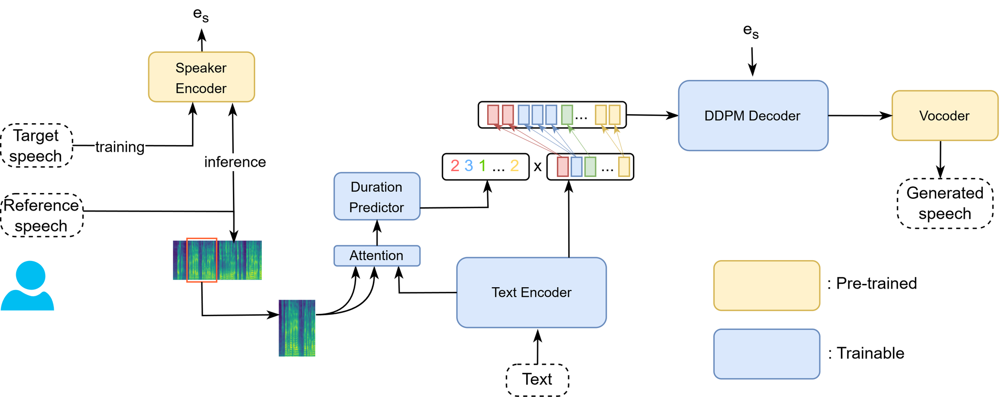

*Figure 1 · [Source](https://arxiv.org/abs/2507.15272)*

### Affectron

Affectron extends a verbal-speech backbone to place nonverbal vocalizations in emotionally and contextually appropriate positions. Augmented training examples and structural masking enable expressive utterances containing events such as laughter while preserving the spoken content.

[Paper](https://arxiv.org/abs/2603.14432) · [GitHub](https://github.com/Choddeok/Affectron) · [Project](https://choddeok.github.io/Affectron/) · [Details](models/token-lm.md#affectron)

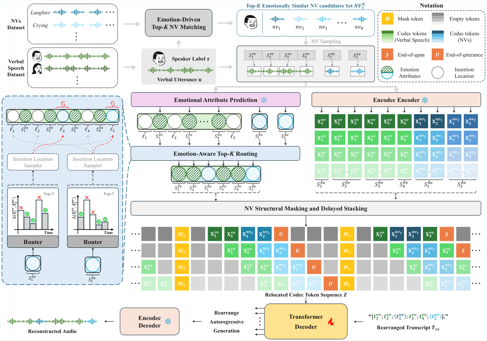

*Figure 2 · [Source](https://arxiv.org/abs/2603.14432)*

### AgentSteerTTS

AgentSteerTTS separates identity and emotional-prosodic representations, then grounds compound instructions in retrieved acoustic examples. A controller combines these conditions and uses feedback to refine expressive speech while preserving the intended speaker.

[Paper](https://arxiv.org/abs/2605.17583) · GitHub: no author-linked repository found · [Details](models/token-lm.md#agentsteertts)

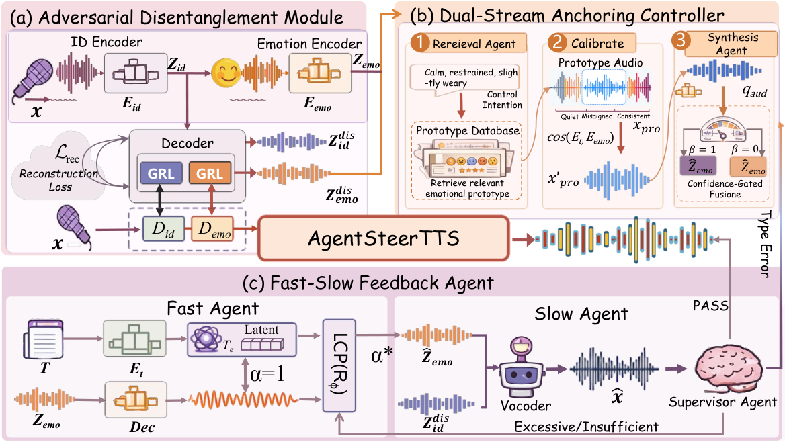

*Figure 4 · [Source](https://arxiv.org/abs/2605.17583)*

### AlignDiT

AlignDiT aligns text, visual information and acoustic conditions before diffusion-based speech generation. Modality-specific guidance balances these inputs, targeting synchronized, intelligible speech that follows the timing and expression of the supplied scene.

[Paper](https://arxiv.org/abs/2504.20629) · [GitHub](https://github.com/kaistmm/AlignDiT) · [Details](models/diffusion.md#aligndit)

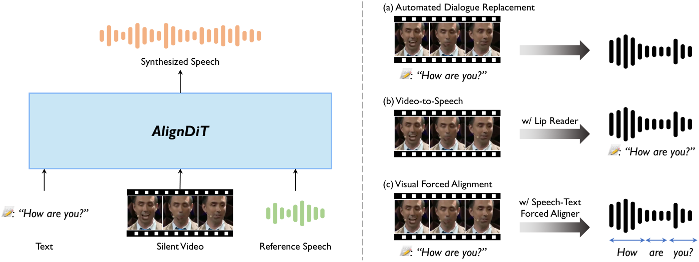

*Figure 1 · [Source](https://arxiv.org/abs/2504.20629)*

### AMNet

AMNet adds phrase-structure information and local convolutional modeling to a parallel Mandarin acoustic model. These changes help capture contextual pauses, emphasis and intonation before the accompanying vocoder reconstructs the waveform.

[Paper](https://arxiv.org/abs/2504.09225) · GitHub: no author-linked repository found · [Details](models/parallel.md#amnet)

*Paper figure · [Source](https://arxiv.org/abs/2504.09225)*

### ARCHI-TTS

ARCHI-TTS uses a dedicated semantic alignment module to coordinate text and reference acoustic features. Reusing encoder features across denoising steps reduces repeated computation while the flow model generates the target speech.

[Paper](https://arxiv.org/abs/2602.05207) · [Project](https://archimickey.github.io/architts) · GitHub: no author-linked repository found · [Details](models/diffusion.md#archi-tts)

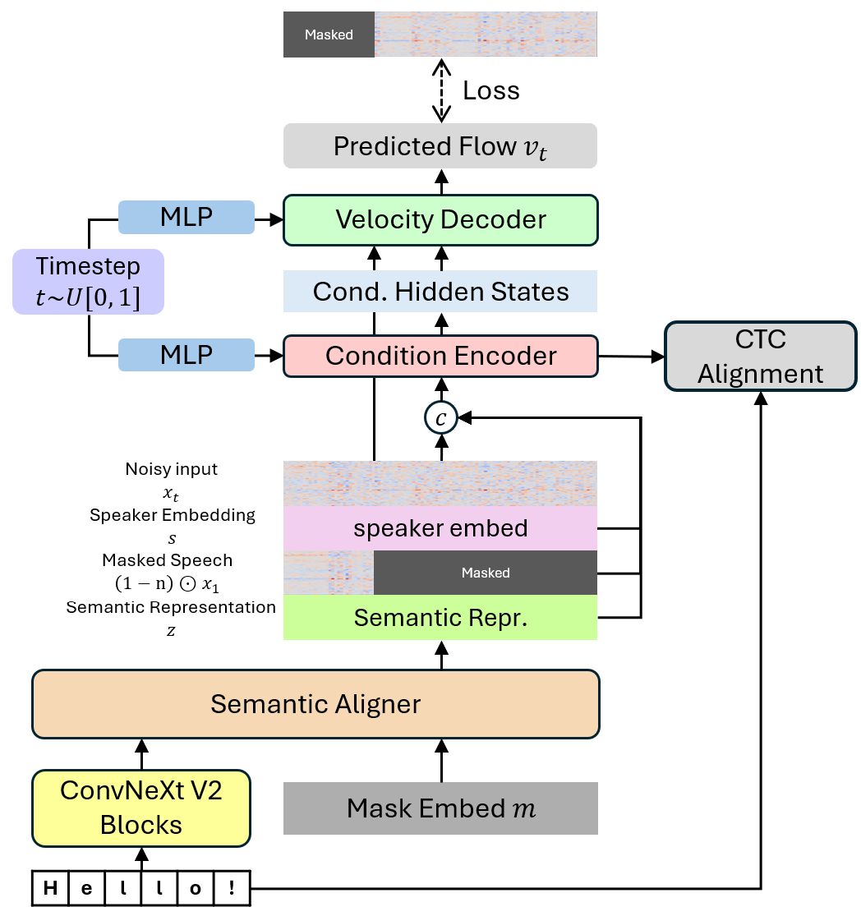

*Figure 1 · [Source](https://arxiv.org/abs/2602.05207)*

### ATRIE

ATRIE converts character descriptions into separate voice-identity and dynamic prosody conditions. A compact adapter learns from a larger language-model teacher and modulates a GPT-SoVITS-based synthesizer, supporting expressive persona-driven speech generation.

[Paper](https://arxiv.org/abs/2604.19055) · GitHub: no author-linked repository found · [Details](models/token-lm.md#atrie)

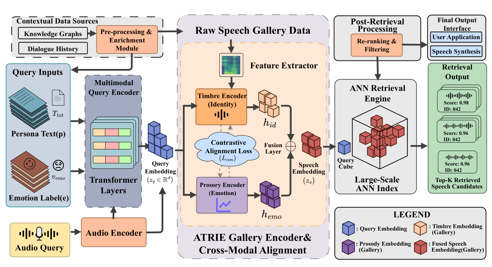

*Figure 1 · [Source](https://arxiv.org/abs/2604.19055)*

### Audiobook-CC

Audiobook-CC models context beyond individual sentences and separates style instructions from voice prompts. Distillation strengthens emotional expression, supporting multi-character narration with more consistent voices and performance across longer passages.

[Paper](https://arxiv.org/abs/2509.17516) · GitHub: no author-linked repository found · [Details](models/token-lm.md#audiobook-cc)

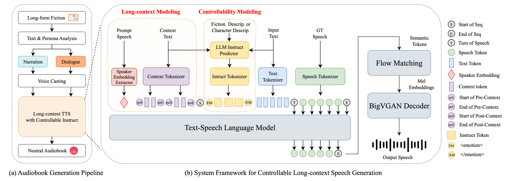

*Figure 1 · [Source](https://arxiv.org/abs/2509.17516)*

### AuEmoChat

AuEmoChat learns a discrete emotion representation from speech and compresses dialogue history while retaining emotionally relevant information. Its language model predicts emotion and speech tokens, which a context-conditioned flow decoder renders into expressive conversational audio.

[Paper](https://arxiv.org/abs/2607.15755) · [GitHub](https://github.com/AI-S2-Lab/AuEmoChat) · [Details](models/token-lm.md#auemochat)

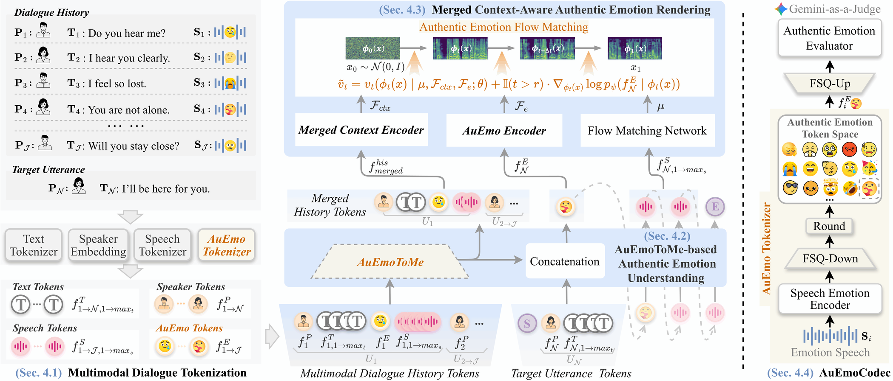

*Figure 2 · [Source](https://arxiv.org/abs/2607.15755)*

### AuK

AuK combines language-model conditioning, an audio VAE and successive multimodal and single-stream diffusion blocks. One model handles reference-based speech synthesis and instruction-guided editing; its distilled AuK-Flash variant reduces the number of generation steps.

[Paper](https://arxiv.org/abs/2609.08936) · [GitHub](https://github.com/Tencent-Hunyuan/AuK) · [Details](models/diffusion.md#auk)

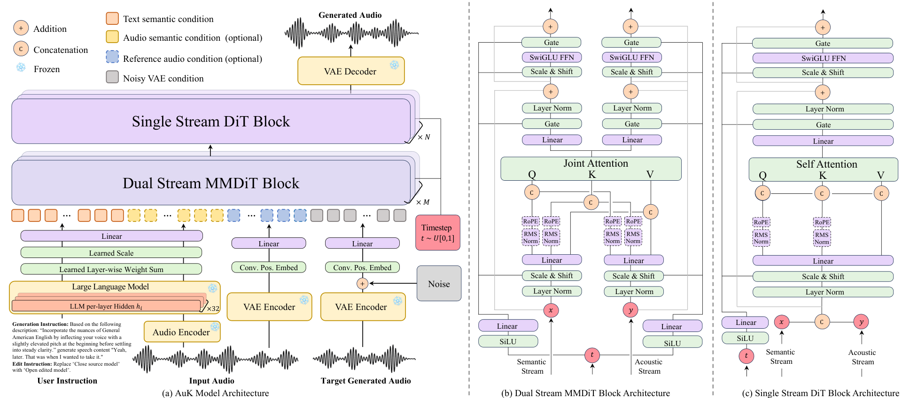

*Figure 4 · [Source](https://arxiv.org/abs/2609.08936)*

### Authentic-Dubber

Authentic-Dubber retrieves emotionally relevant audiovisual examples and progressively incorporates them into speech generation. Its director-actor formulation connects a scene's visual context and reference delivery to the target transcript for expressive movie dubbing.

[Paper](https://arxiv.org/abs/2511.14249) · [GitHub](https://github.com/AI-S2-Lab/Authentic-Dubber) · [Details](models/diffusion.md#authentic-dubber)

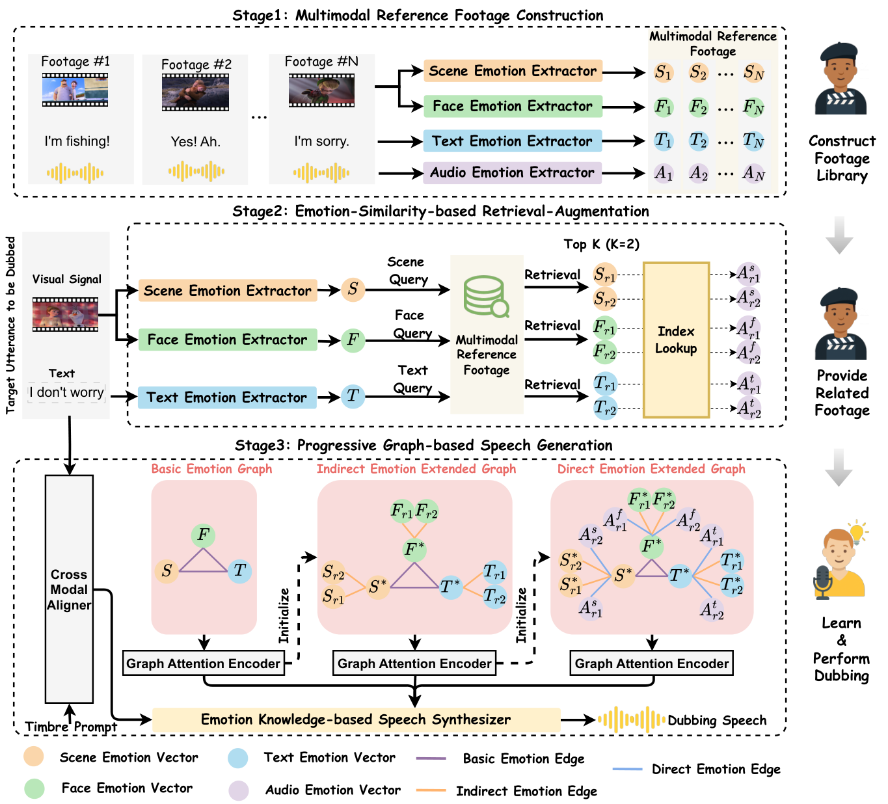

*Figure 2 · [Source](https://arxiv.org/abs/2511.14249)*

### AutoSIFT

AutoSIFT divides a reference voice's style into attribute-specific components and a residual representation. Text instructions replace selected attributes while unmentioned characteristics remain conditioned on the reference, allowing partial style editing during speech synthesis.

[Paper](https://arxiv.org/abs/2607.12706) · GitHub: no author-linked repository found · [Details](models/diffusion.md#autosift)

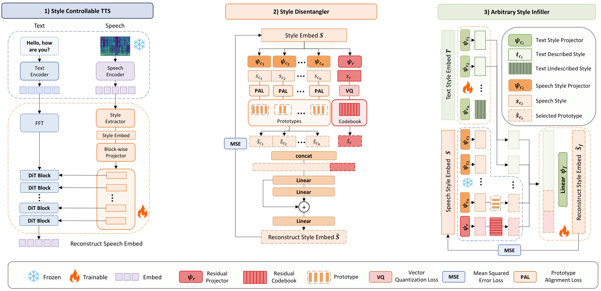

*Figure 1 · [Source](https://arxiv.org/abs/2607.12706)*

### AutoStyle-TTS

AutoStyle-TTS matches the target text against a collection of expressive speech examples using learned textual embeddings. The selected recording provides style conditioning for synthesis, automatically adapting delivery to the content.

[Paper](https://arxiv.org/abs/2504.10309) · [GitHub](https://github.com/Chengyuann/AutoStyle-TTS) · [Project](https://thuhcsi.github.io/icme2025-AutoStyle-TTS) · [Details](models/token-lm.md#autostyle-tts)

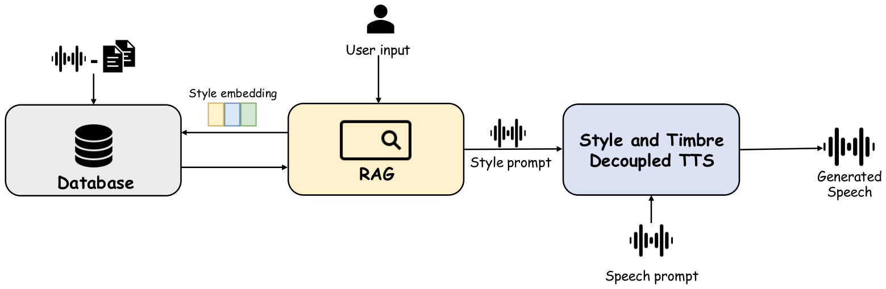

*Paper figure · [Source](https://arxiv.org/abs/2504.10309)*

### AVLM (expressive speech)

This audio-visual language model adds full-face information to an expressive speech backbone. Training on emotion and dialogue tasks connects facial cues with spoken delivery, enabling speech generation that uses visual as well as acoustic conversational context.

[Paper](https://arxiv.org/abs/2508.16188) · [GitHub](https://github.com/steventan0110/AVLM) · [Details](models/token-lm.md#avlm-expressive-speech)

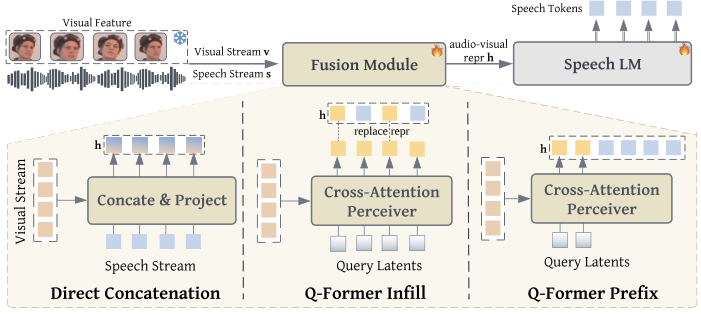

*Figure 2 · [Source](https://arxiv.org/abs/2508.16188)*

### Bagpiper-TTS

Bagpiper-TTS converts a natural-language request into a detailed speech plan containing words and delivery information. The generator follows that plan for tasks ranging from ordinary narration to multi-speaker rendering, role-play and singing.

[Paper](https://arxiv.org/abs/2606.22811) · [Project](https://bagpipertts.github.io/bagpiper_tts_demo/) · GitHub: no author-linked repository found · [Details](models/token-lm.md#bagpiper-tts)

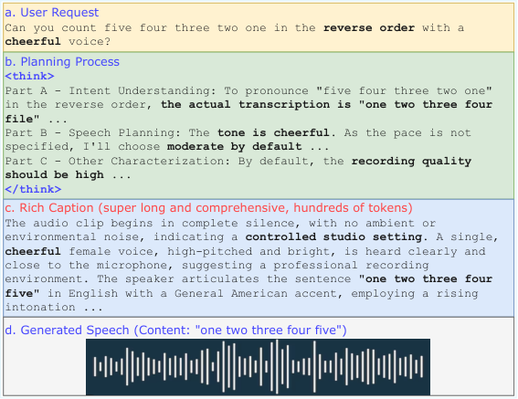

*Figure 1 · [Source](https://arxiv.org/abs/2606.22811)*

### BareWave

BareWave generates speech in waveform space using a single inference path. Representation alignment, staged noise scheduling and perceptual objectives guide training, replacing the separate acoustic-feature and waveform-reconstruction stages common in other TTS systems.

[Paper](https://arxiv.org/abs/2606.09048) · [Project](https://barewave.github.io/) · GitHub: no author-linked repository found · [Details](models/diffusion.md#barewave)

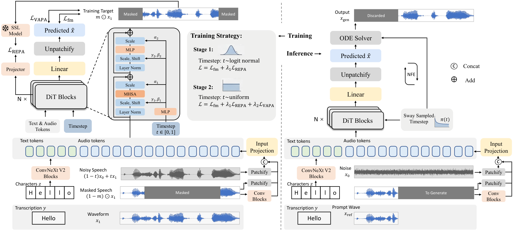

*Figure 2 · [Source](https://arxiv.org/abs/2606.09048)*

### Bark

Hierarchical autoregressive audio tokens.

[GitHub](https://github.com/suno-ai/bark) · [Details](models/token-lm.md#bark)

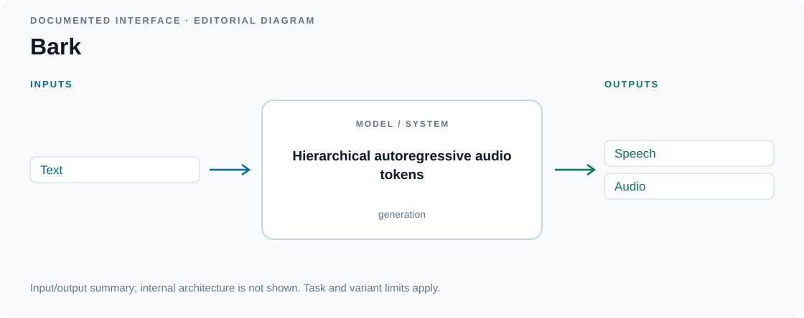

*Editorial input/output diagram · [Source](https://github.com/suno-ai/bark)*

### BASE TTS

Autoregressive speechcodes and convolutional decoder.

[Paper](https://arxiv.org/abs/2402.08093) · [Details](models/token-lm.md#base-tts)

*Figure 1 · [Source](https://arxiv.org/abs/2402.08093)*

### BatonTTS (BatonVoice)

BatonVoice interprets a user's expressive request and translates it into controls for its dedicated BatonTTS generator. Separating instruction interpretation from acoustic rendering enables more explicit feature control, including transfer to languages outside the control-training data.

[Paper](https://arxiv.org/abs/2509.26514) · GitHub: no author-linked repository found · [Details](models/token-lm.md#batontts-batonvoice)

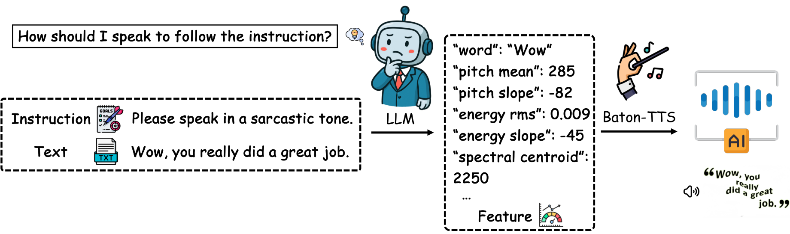

*Figure 1 · [Source](https://arxiv.org/abs/2509.26514)*

### BELLE

BELLE predicts both speech values and their uncertainty in a continuous autoregressive synthesizer. Multiple synthetic renditions of the same text provide training support for the variance estimate, enabling richer acoustic distributions without adding an iterative inference stage.

[Paper](https://arxiv.org/abs/2510.24372) · [GitHub](https://github.com/OpenTSLab/BELLE) · [Project](https://belletts.github.io/Belle/) · [Details](models/continuous-lm.md#belle)

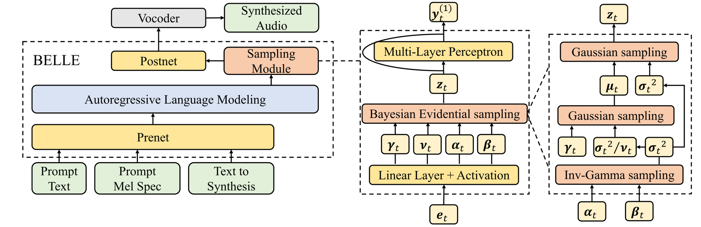

*Figure 1 · [Source](https://arxiv.org/abs/2510.24372)*

### BitTTS

BitTTS reduces storage and computation through extremely low-bit trained weights and indexed parameter sharing. It targets speech generation on constrained devices, preserving a full synthesis path while shrinking the model representation.

[Paper](https://arxiv.org/abs/2506.03515) · GitHub: no author-linked repository found · [Details](models/compact.md#bittts)

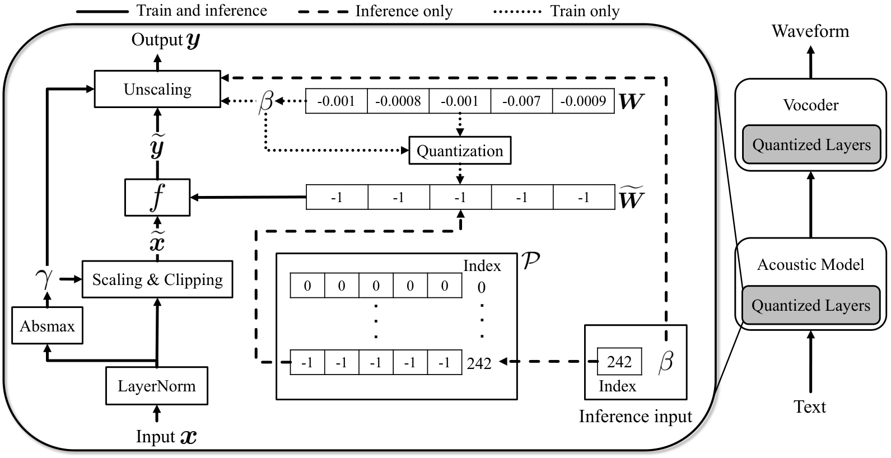

*Figure 1 · [Source](https://arxiv.org/abs/2506.03515)*

### Block-wise Mimi TTS

This streaming system replaces continuous acoustic regression with direct prediction of Mimi codec layers. A modified FastSpeech 2 backbone supplies aligned features and a depth-wise decoder fills residual codebooks, producing successive speech blocks without temporal autoregression.

[Paper](https://arxiv.org/abs/2604.12438) · GitHub: no author-linked repository found · [Details](models/token-lm.md#block-wise-mimi-tts)

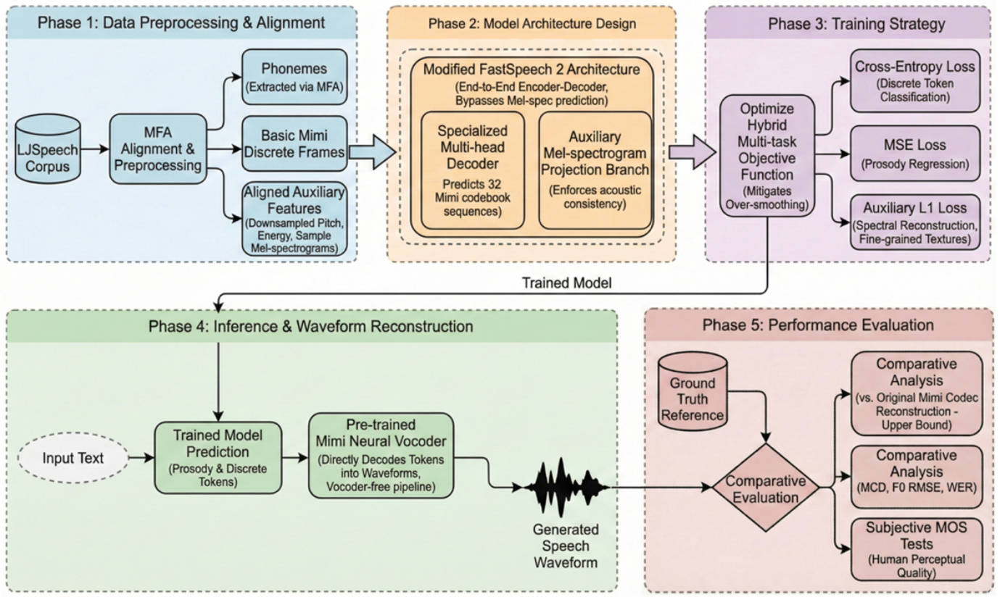

*Figure 1 (paper page 10) · [Source](https://arxiv.org/abs/2604.12438)*

### BnTTS

BnTTS extends an XTTS-based multilingual pipeline to Bangla using language-specific phonetic adaptations. A small amount of target-speaker audio supports personalization, with the model designed for limited-resource speech synthesis.

[Paper](https://arxiv.org/abs/2502.05729) · GitHub: no author-linked repository found · [Details](models/token-lm.md#bntts)

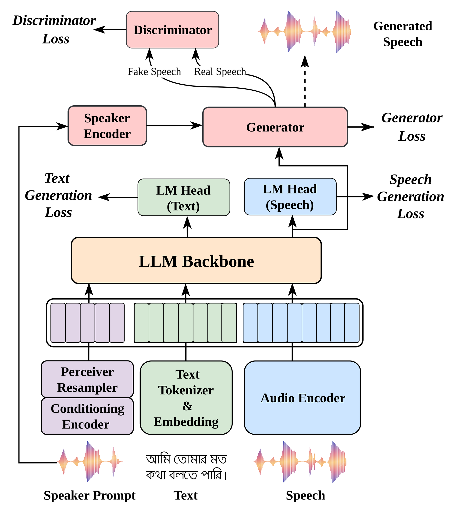

*Figure 1 · [Source](https://arxiv.org/abs/2502.05729)*

### Bolbosh

Bolbosh adapts Matcha-TTS to Kashmiri with language-aware text processing and cross-language training. Its design targets the pronunciation and script challenges of a low-resource language while retaining efficient non-autoregressive acoustic generation.

[Paper](https://arxiv.org/abs/2603.07513) · [GitHub](https://github.com/gaash-lab/Bolbosh) · [Details](models/diffusion.md#bolbosh)

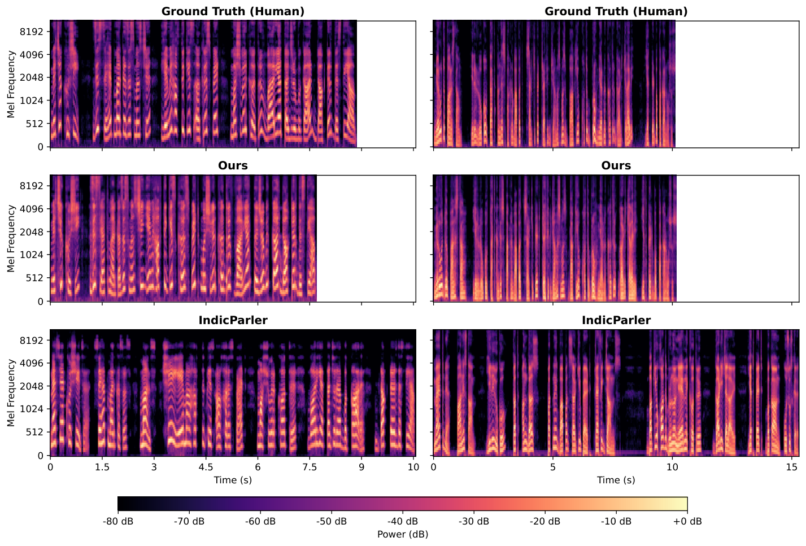

*Figure 1 · [Source](https://arxiv.org/abs/2603.07513)*

### Borderless Long Speech Synthesis

This system organizes speech instructions at global, sentence and token levels to guide extended recordings. A continuous-token backbone uses explicit planning and condition dropout to combine voice design, multi-speaker rendering and changing acoustic or emotional context.

[Paper](https://arxiv.org/abs/2603.19798) · GitHub: no author-linked repository found · [Details](models/continuous-lm.md#borderless-long-speech-synthesis)

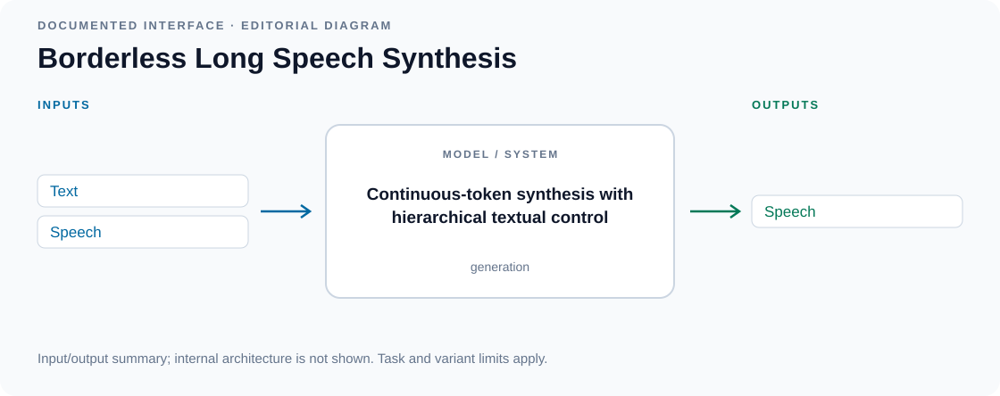

*Editorial input/output diagram · [Source](https://arxiv.org/abs/2603.19798)*

### BreezyVoice

BreezyVoice combines supervised speech tokens, a language model and flow-based acoustics with a pronunciation frontend. Its Taiwanese Mandarin adaptation provides explicit phonetic control for characters with multiple readings while retaining reference-based voice synthesis.

[Paper](https://arxiv.org/abs/2501.17790) · [GitHub](https://github.com/mtkresearch/BreezyVoice) · [Details](models/token-lm.md#breezyvoice)

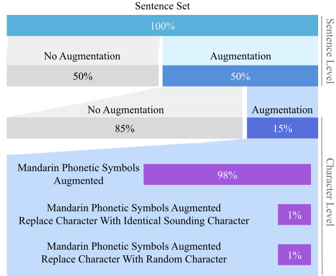

*Figure 1 · [Source](https://arxiv.org/abs/2501.17790)*

### BridgeTTS

BridgeTTS uses the BridgeCode dual representation to shorten the sequence predicted by its autoregressive language model. Bridging modules reconstruct more detailed continuous acoustic features from those sparse tokens, balancing generation speed with voice fidelity.

[Paper](https://arxiv.org/abs/2510.11646) · GitHub: no author-linked repository found · [Details](models/token-lm.md#bridgetts)

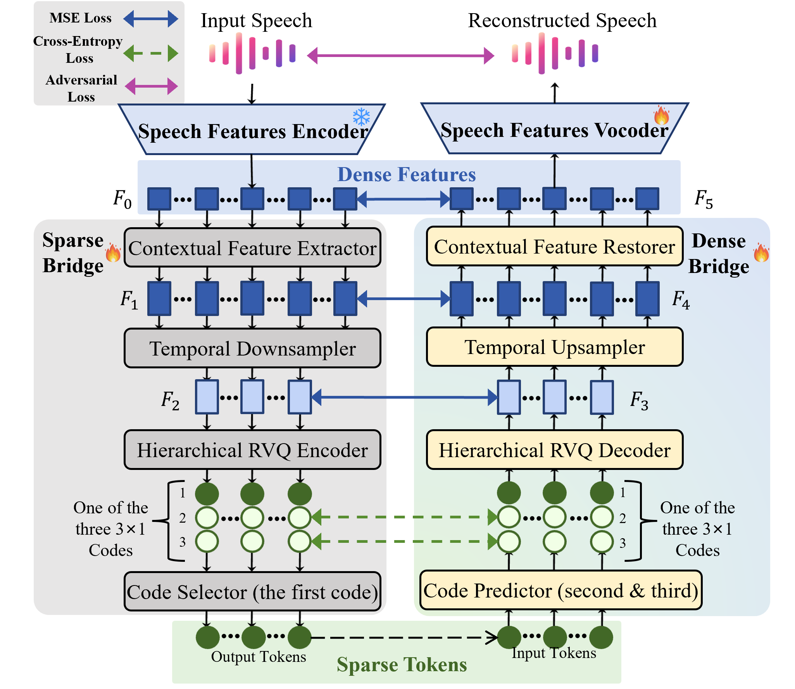

*Figure 2 · [Source](https://arxiv.org/abs/2510.11646)*

### BVS

Beyond Video-to-SFX predicts audio semantic tokens from visual information and phonetic cues, then refines them into acoustic tokens. The two-stage generator produces intelligible speech whose timing and environmental sound fit the supplied video.

[Paper](https://arxiv.org/abs/2509.15492) · GitHub: no author-linked repository found · [Details](models/token-lm.md#bvs)

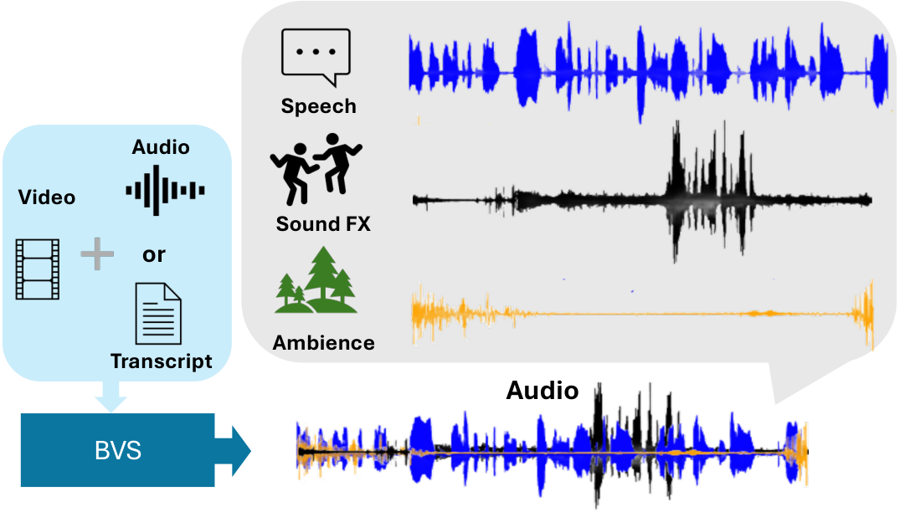

*Figure 1 · [Source](https://arxiv.org/abs/2509.15492)*

### CAM-TTS

CAM-TTS retains global narrative information and retrieves local details through an updatable memory block. Prefix attention combines those memories with preceding context, guiding sentence-level synthesis across longer paragraphs.

[Paper](https://arxiv.org/abs/2508.14713) · GitHub: no author-linked repository found · [Details](models/token-lm.md#cam-tts)

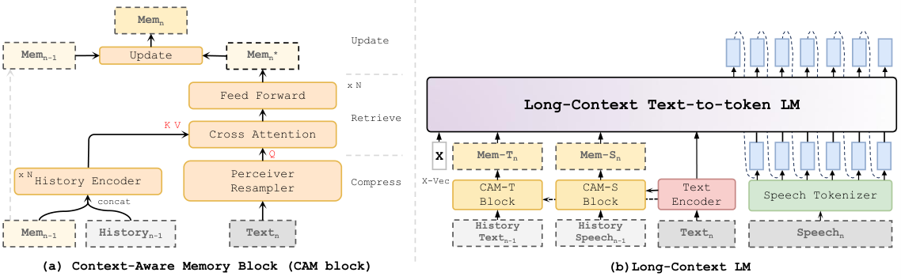

*Figure 2 · [Source](https://arxiv.org/abs/2508.14713)*

### CapTalk

CapTalk designs voices from descriptions for individual utterances and multi-speaker dialogue. Hierarchical conditioning separates stable speaker identity from changing turn-level delivery, while explicit planning tokens control dynamic expressive attributes.

[Paper](https://arxiv.org/abs/2604.08363) · GitHub: no author-linked repository found · [Details](models/token-lm.md#captalk)

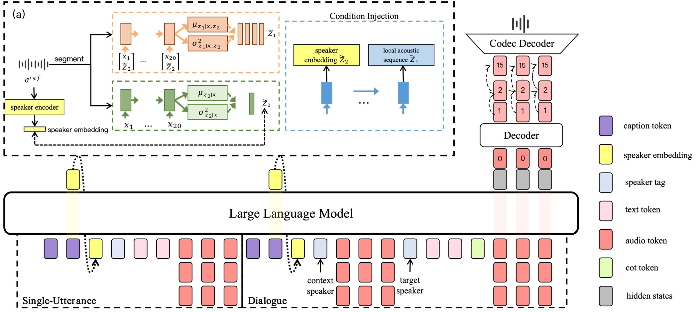

*Figure 1 · [Source](https://arxiv.org/abs/2604.08363)*

### CAST-TTS

CAST-TTS maps a voice description or a reference recording into a common timbre-conditioning interface. Cross-attention delivers that information to the synthesizer, enabling voice design and reference-based cloning within the same generation framework.

[Paper](https://arxiv.org/abs/2603.16280) · [GitHub](https://github.com/HiRookie9/CAST-TTS) · [Project](https://HiRookie9.github.io/CAST-TTS-Page) · [Details](models/diffusion.md#cast-tts)

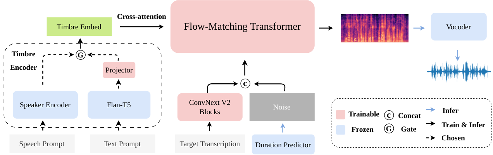

*Figure 1 · [Source](https://arxiv.org/abs/2603.16280)*

### CaT-TTS

CaT-TTS separates textual understanding from acoustic generation in a two-Transformer architecture. During decoding, a masked parallel inference procedure guides speech-token predictions to reduce local errors in zero-shot voice synthesis.

[Paper](https://arxiv.org/abs/2509.22062) · GitHub: no author-linked repository found · [Details](models/token-lm.md#cat-tts)

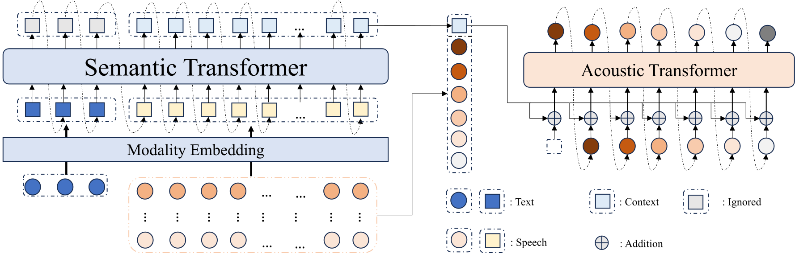

*Figure 2 · [Source](https://arxiv.org/abs/2509.22062)*

### Causal-prosody FastSpeech 2

This FastSpeech 2 extension explicitly models emotion alongside duration, pitch and energy. Counterfactual training separates emotional changes from linguistic content, allowing users to modify prosody while preserving the intended words.

[Paper](https://arxiv.org/abs/2603.11683) · GitHub: no author-linked repository found · [Details](models/parallel.md#causal-prosody-fastspeech-2)

*Figure 1 (paper page 3) · [Source](https://arxiv.org/abs/2603.11683)*

### CDE-StyleTTS

CDE-StyleTTS lets acoustic states evolve continuously along a phoneme sequence whose timing comes from durations. Sampling this trajectory supplies the acoustic decoder with timing-sensitive representations, providing a way to transfer changing expressive style instead of merely repeating phoneme embeddings.

[Paper](https://arxiv.org/abs/2609.11725) · [GitHub](https://github.com/Mattias421/CDE_StyleTTS) · [Details](models/diffusion.md#cde-styletts)

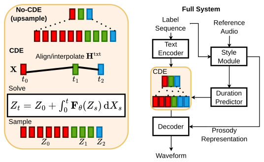

*Paper figure · [Source](https://arxiv.org/abs/2609.11725)*

### Chain-of-Details TTS

Chain-of-Details TTS progressively predicts speech at increasing temporal resolutions using a shared decoder. The coarsest stage provides an implicit phonetic plan, while subsequent stages recover timing detail without a separate phoneme-duration predictor.

[Paper](https://arxiv.org/abs/2604.19330) · GitHub: no author-linked repository found · [Details](models/token-lm.md#chain-of-details-tts)

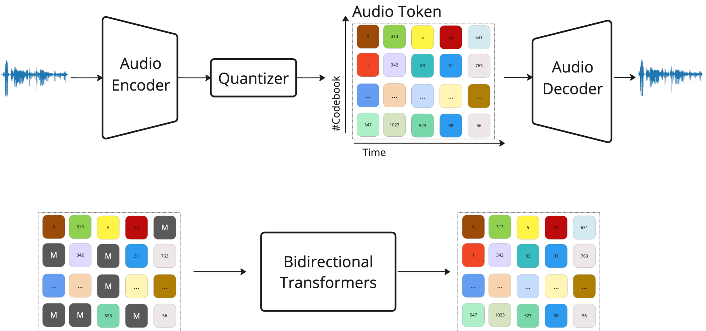

*Paper figure · [Source](https://arxiv.org/abs/2604.19330)*

### Chain-Talker

Chain-Talker first derives an emotional description from dialogue history, then predicts semantic speech codes. A final rendering stage combines these plans to synthesize expressive responses whose delivery fits the conversational context.

[Paper](https://arxiv.org/abs/2505.12597) · [GitHub](https://github.com/AI-S2-Lab/Chain-Talker) · [Details](models/token-lm.md#chain-talker)

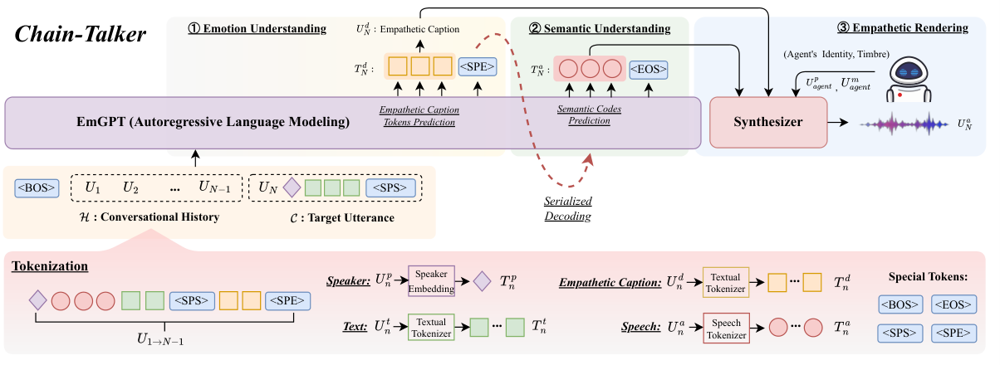

*Figure 2 · [Source](https://arxiv.org/abs/2505.12597)*

### Chatterbox

Chatterbox synthesizes speech from text and a voice reference, with controls for expressive delivery. Its multilingual models focus on cross-language voice consistency, while Turbo and Nano use a smaller backbone and a single-step acoustic decoder. These variants serve different narration, conversational playback and local-device requirements; their capabilities are not interchangeable.

[GitHub](https://github.com/resemble-ai/chatterbox) · [Details](models/token-lm.md#chatterbox)

*Editorial input/output diagram · [Source](https://github.com/resemble-ai/chatterbox)*

### Chatterbox-Flash

Chatterbox-Flash generates speech-token blocks in parallel while keeping block-by-block streaming. Calibration against common-token priors and confidence-based stopping improve its discrete diffusion decoding after adaptation from a pretrained autoregressive synthesizer.

[Paper](https://arxiv.org/abs/2605.30748) · [GitHub](https://github.com/resemble-ai/chatterbox-flash) · [Details](models/token-lm.md#chatterbox-flash)

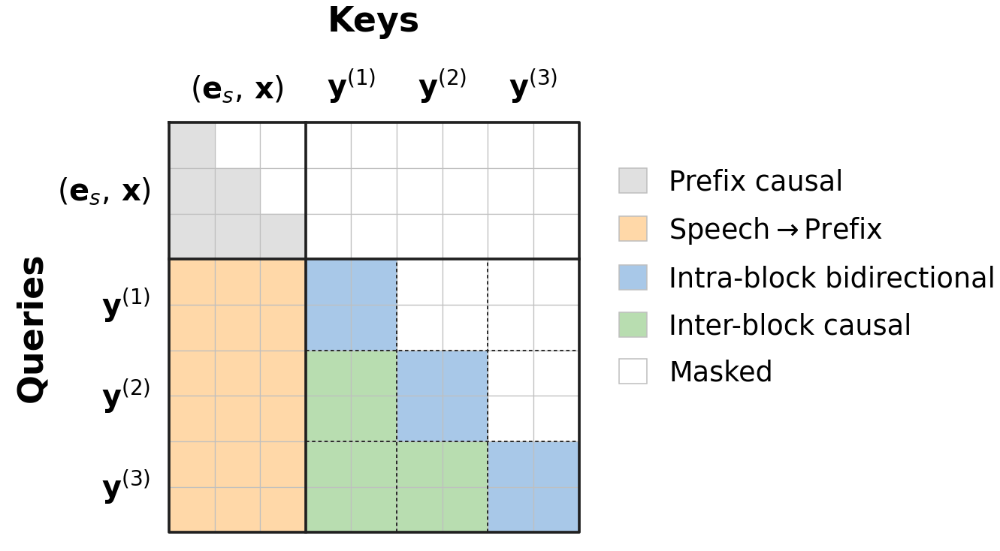

*Figure 3 · [Source](https://arxiv.org/abs/2605.30748)*

### ChatTTS

Autoregressive speech-token generation.

[GitHub](https://github.com/2noise/ChatTTS) · [Details](models/token-lm.md#chattts)

*Editorial input/output diagram · [Source](https://github.com/2noise/ChatTTS)*

### CLaM-TTS

Probabilistic residual quantization and multi-token LM.

[Paper](https://arxiv.org/abs/2404.02781) · [Details](models/token-lm.md#clam-tts)

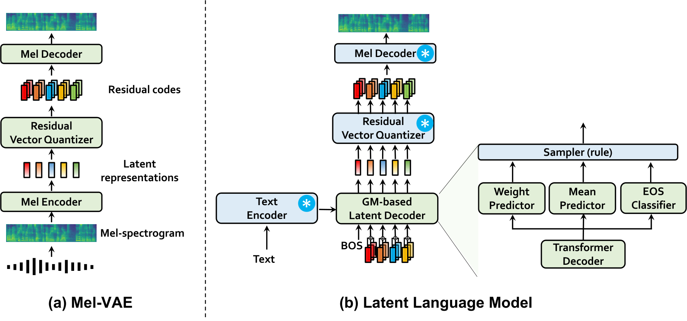

*Figure 1 · [Source](https://arxiv.org/abs/2404.02781)*

### CLEAR

CLEAR models speech directly in a continuous latent space, avoiding discrete codec-token prediction. Its zero-shot generator combines reference-voice conditioning with incremental audio production, targeting a balance between naturalness and response latency.

[Paper](https://arxiv.org/abs/2508.19098) · GitHub: no author-linked repository found · [Details](models/continuous-lm.md#clear)

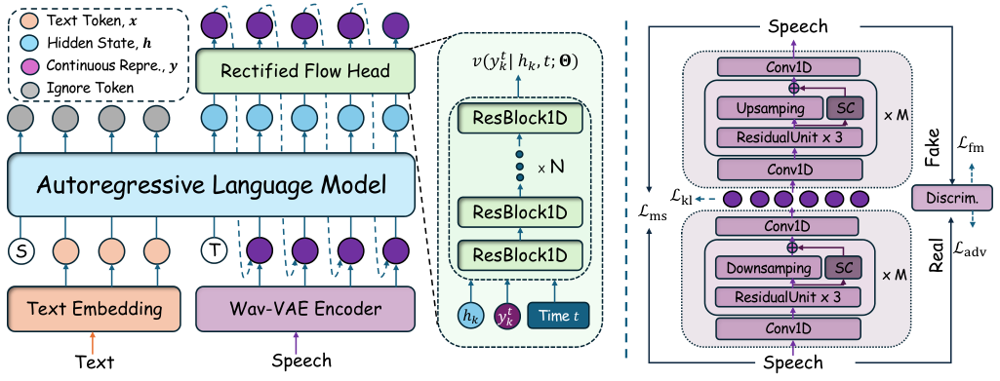

*Figure 1 · [Source](https://arxiv.org/abs/2508.19098)*

### Clip-TTS

Clip-TTS trains its textual representation against corresponding mel-spectrogram information through a contrastive objective. The acoustic Transformer uses the resulting context-aware features to improve prosodic interpretation during speech generation.

[Paper](https://arxiv.org/abs/2502.18889) · GitHub: no author-linked repository found · [Details](models/parallel.md#clip-tts)

*Figure 3 · [Source](https://arxiv.org/abs/2502.18889)*

### Compact neural accessibility TTS

This compact synthesis system combines a shared-parameter text frontend with an efficient recurrent waveform generator. It targets responsive accessibility voices on low-power devices, where small storage requirements and immediate playback matter alongside naturalness.

[Paper](https://arxiv.org/abs/2501.17332) · GitHub: no author-linked repository found · [Details](models/compact.md#compact-neural-accessibility-tts)

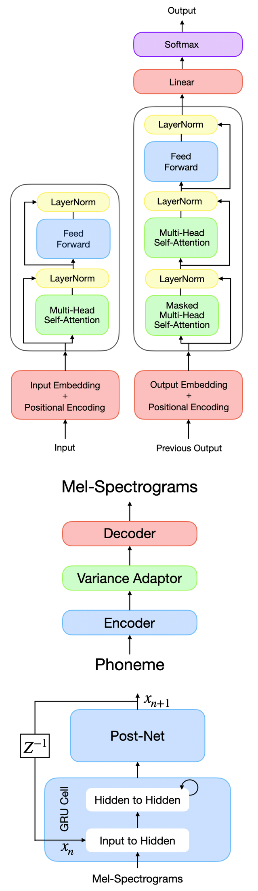

*Figure 1 · [Source](https://arxiv.org/abs/2501.17332)*

### Compressed-to-fine speech LM

This speech-language-model design keeps recent acoustic tokens and voice prompts at full detail while compressing distant context. The asymmetric representation reduces redundant long-sequence processing without discarding the local cues needed for pronunciation and vocal consistency.

[Paper](https://arxiv.org/abs/2505.24496) · GitHub: no author-linked repository found · [Details](models/token-lm.md#compressed-to-fine-speech-lm)

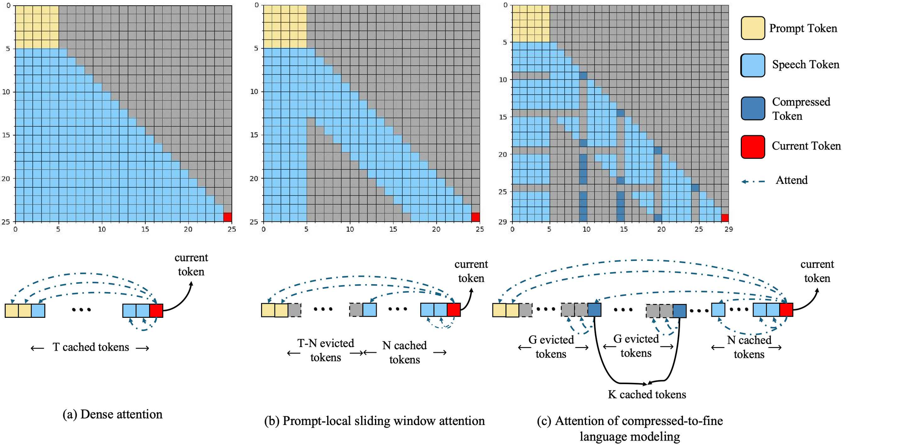

*Figure 1 · [Source](https://arxiv.org/abs/2505.24496)*

### Confucius4-TTS

Confucius4-TTS extracts voice characteristics from self-supervised speech features without requiring a transcript of the reference recording. A language model predicts semantic tokens and a flow decoder generates mel-spectrograms, enabling voice cloning within and across fourteen languages.

[Paper](https://arxiv.org/abs/2608.11650) · [GitHub](https://github.com/netease-youdao/Confucius4-TTS) · [Details](models/token-lm.md#confucius4-tts)

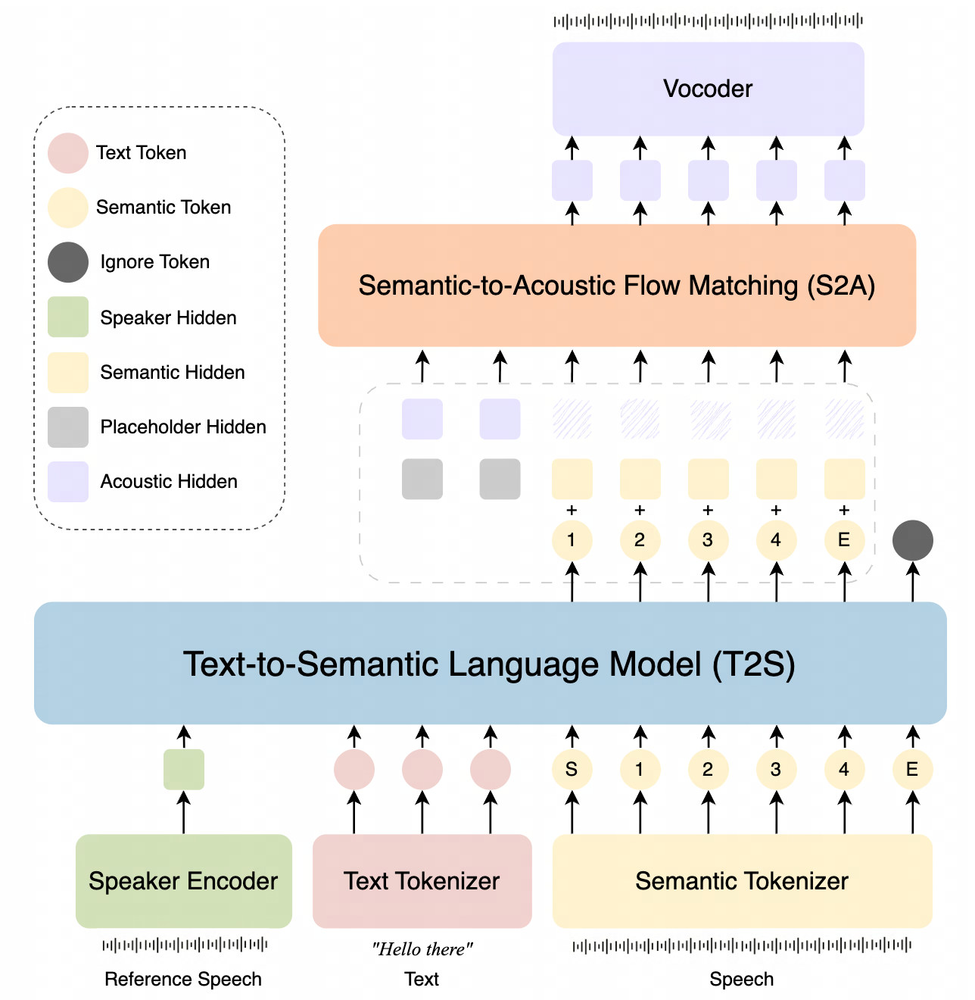

*Figure 1 · [Source](https://arxiv.org/abs/2608.11650)*

### Continuous-token diffusion TTS

This model combines a language head that predicts boundaries with a diffusion head that generates continuous acoustic frames. Masked and staged training stabilize speaker-reference conditioning, providing a text-to-speech path within a multimodal language-model architecture.

[Paper](https://arxiv.org/abs/2510.12995) · GitHub: no author-linked repository found · [Details](models/continuous-lm.md#continuous-token-diffusion-tts)

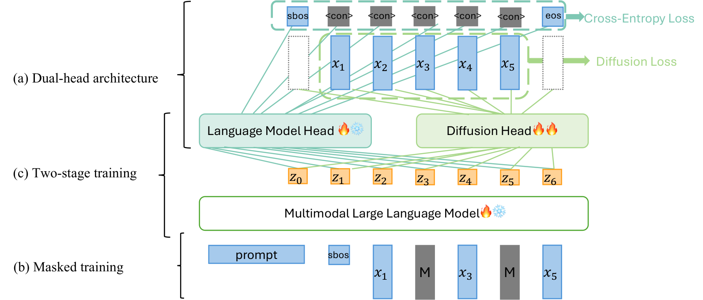

*Figure 2 · [Source](https://arxiv.org/abs/2510.12995)*

### Controllable masked-speech TTS

This synthesizer separates reference voice information from acoustic background conditions. An explicit task control selects whether background sound is retained or removed, allowing personalized speech generation under different environmental requirements.

[Paper](https://arxiv.org/abs/2502.07345) · GitHub: no author-linked repository found · [Details](models/token-lm.md#controllable-masked-speech-tts)

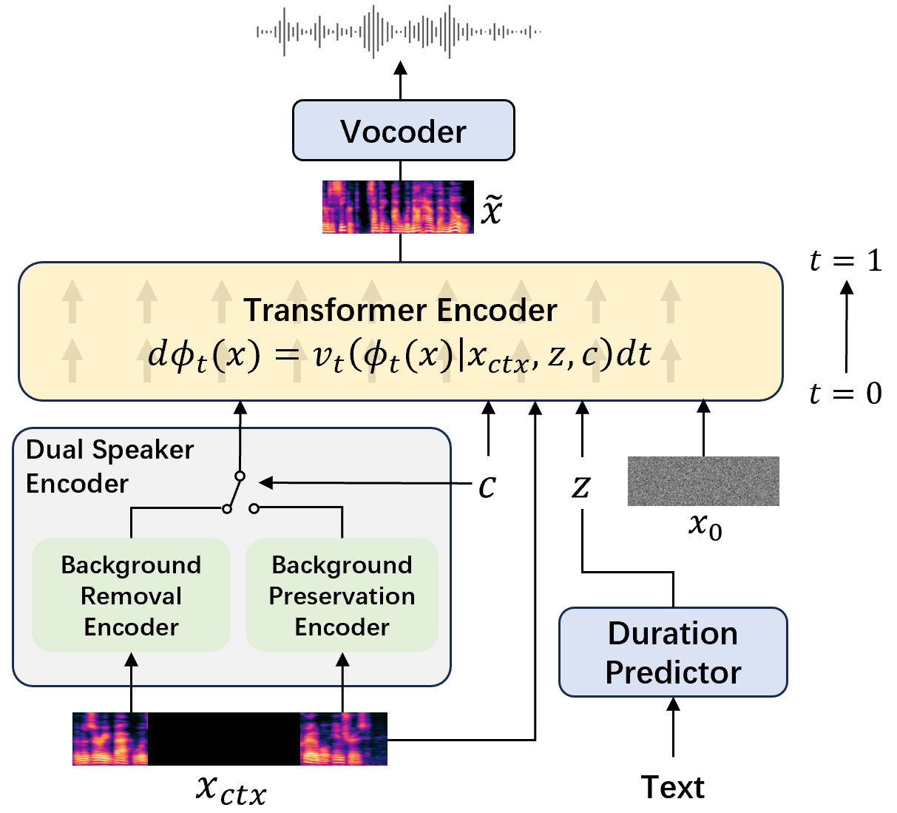

*Paper figure · [Source](https://arxiv.org/abs/2502.07345)*

### CookVoice

CookVoice aligns textual content, style and prosodic controls to acoustic frames before speech generation. The same compact model supports spoken and sung voices, reference imitation and editing, allowing individual voice attributes to be controlled within a shared synthesis pipeline.

[Paper](https://arxiv.org/abs/2608.11590) · [Project](https://haoweilou.github.io/CookVoice/) · GitHub: no author-linked repository found · [Details](models/diffusion.md#cookvoice)

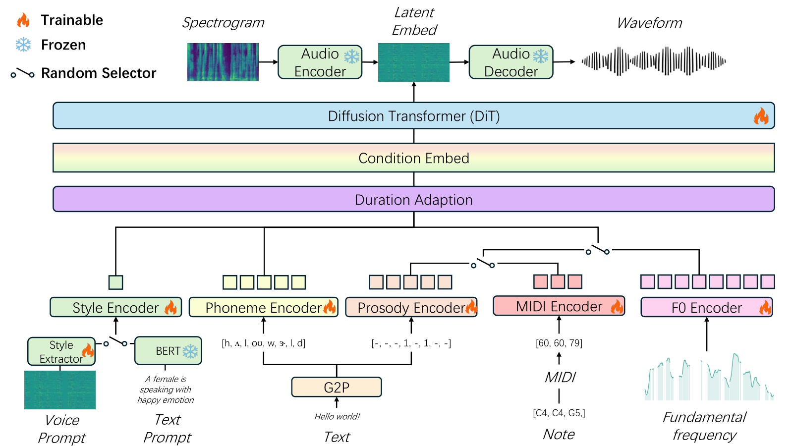

*Figure 1 · [Source](https://arxiv.org/abs/2608.11590)*

### CosyEdit2

CosyEdit2 adapts a text-speech language model and acoustic decoder for consistent speech editing, then refines them with editing-specific rewards. The paper also evaluates the resulting improvement in zero-shot text-to-speech, connecting local editing consistency with reference-based synthesis.

[Paper](https://arxiv.org/abs/2605.25930) · [Project](https://cjy1018.github.io/CosyEdit2) · GitHub: no author-linked repository found · [Details](models/token-lm.md#cosyedit2)

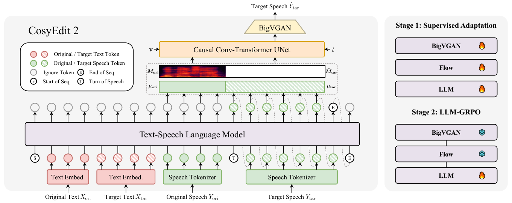

*Figure 1 · [Source](https://arxiv.org/abs/2605.25930)*

### CoSyncDiT

CoSyncDiT guides flow-based speech synthesis through acoustic-style adaptation, visual calibration and timed context alignment. These stages connect the supplied transcript and scene information to expressive, synchronized movie dubbing.

[Paper](https://arxiv.org/abs/2604.12292) · [GitHub](https://github.com/GalaxyCong/CoSyncDiT) · [Details](models/diffusion.md#cosyncdit)

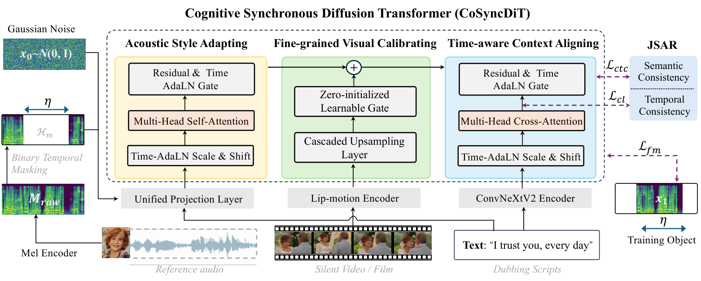

*Figure 2 · [Source](https://arxiv.org/abs/2604.12292)*

### CosyVoice

Supervised semantic tokens and flow decoder.

[Paper](https://arxiv.org/abs/2407.05407) · [Details](models/token-lm.md#cosyvoice)

*Figure 1 · [Source](https://arxiv.org/abs/2407.05407)*

### CosyVoice 2

Text/speech LM and chunk-aware flow matching.

[Paper](https://arxiv.org/abs/2412.10117) · [Details](models/token-lm.md#cosyvoice-2)

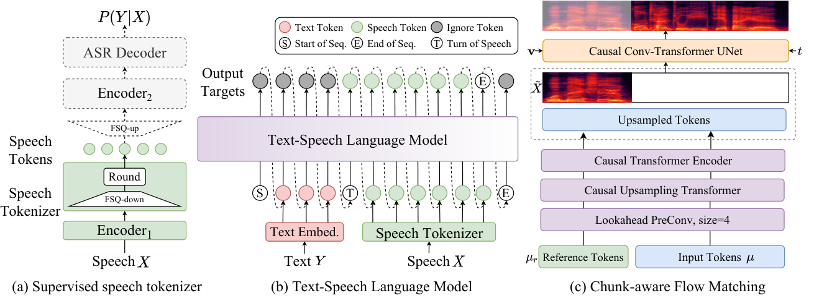

*Figure 1 · [Source](https://arxiv.org/abs/2412.10117)*

### CosyVoice 3

CosyVoice 3 extends streaming, reference-conditioned synthesis with a tokenizer trained on several speech-understanding tasks and a reward model for post-training. It targets reliable pronunciation, speaker identity and prosody across languages, dialects and less controlled text. The research scaling experiments and the downloadable Fun-CosyVoice3 checkpoint represent different model configurations.

[Paper](https://arxiv.org/abs/2505.17589) · [GitHub](https://github.com/QwenAudio/CosyVoice) · [Project](https://funaudiollm.github.io/cosyvoice3) · [Details](models/token-lm.md#cosyvoice-3)

*Figure 2 · [Source](https://arxiv.org/abs/2505.17589)*

### CosyWhisper (WhispSynth)

The WhispSynth generation pipeline combines a CosyVoice synthesizer with pitch-free digital signal processing to produce whispered speech. It supports multilingual whisper generation while avoiding the voiced pitch patterns of ordinary speech synthesis.

[Paper](https://arxiv.org/abs/2603.14853) · [GitHub](https://github.com/tan90xx/cosywhisper) · [Details](models/token-lm.md#cosywhisper-whispsynth)

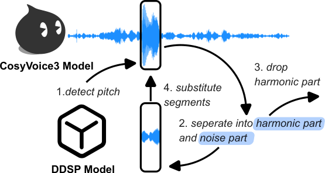

*Figure 2 · [Source](https://arxiv.org/abs/2603.14853)*

### CoVoMix2

CoVoMix2 generates scripted dialogue directly with a flow-matching model, using reference voices without their transcripts. Speaker-disentangled text, sentence alignment and prompt masking support controlled timing and overlapping turns.

[Paper](https://arxiv.org/abs/2506.00885) · [GitHub](https://github.com/vivian556123/covomix2-dataprep) · [Details](models/diffusion.md#covomix2)

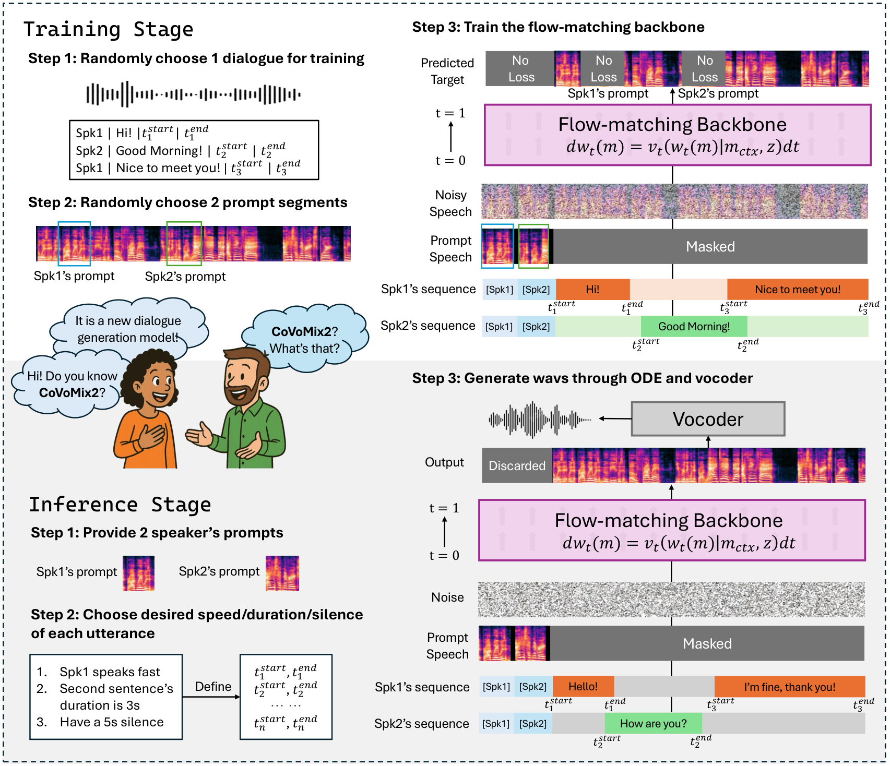

*Figure 1 · [Source](https://arxiv.org/abs/2506.00885)*

### Cross-Lingual F5-TTS

Cross-Lingual F5-TTS changes reference preparation and training so the generated text need not be paired with a reference transcript. Word-aligned acoustic prompts support cross-language voice cloning while reusing the flow-matching synthesis backbone.

[Paper](https://arxiv.org/abs/2509.14579) · [Project](https://qingyuliu0521.github.io/Cross_lingual-F5-TTS/) · GitHub: no author-linked repository found · [Details](models/diffusion.md#cross-lingual-f5-tts)

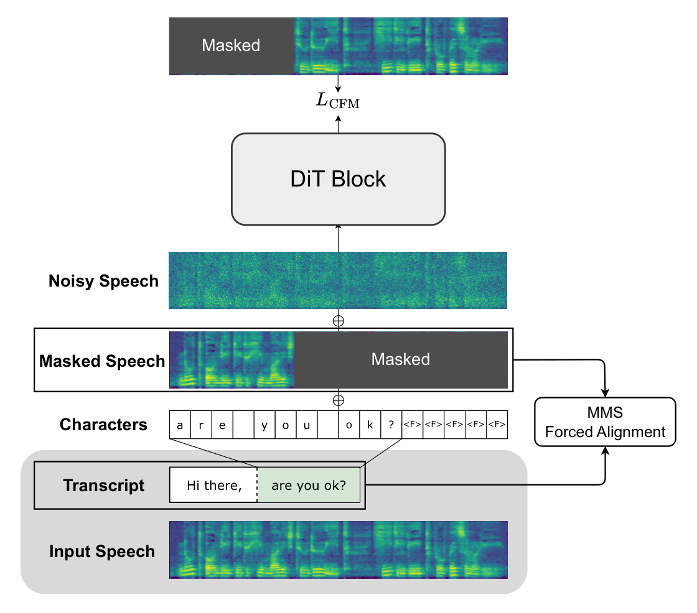

*Figure 1 · [Source](https://arxiv.org/abs/2509.14579)*

### CrossAccent-TTS

CrossAccent-TTS separates speaker identity from accent-related information in a speech synthesis model. Weighted language embeddings control the accent subspace, allowing gradual accent changes and cross-language synthesis while retaining the reference speaker's timbre.

[Paper](https://arxiv.org/abs/2606.25403) · GitHub: no author-linked repository found · [Details](models/token-lm.md#crossaccent-tts)

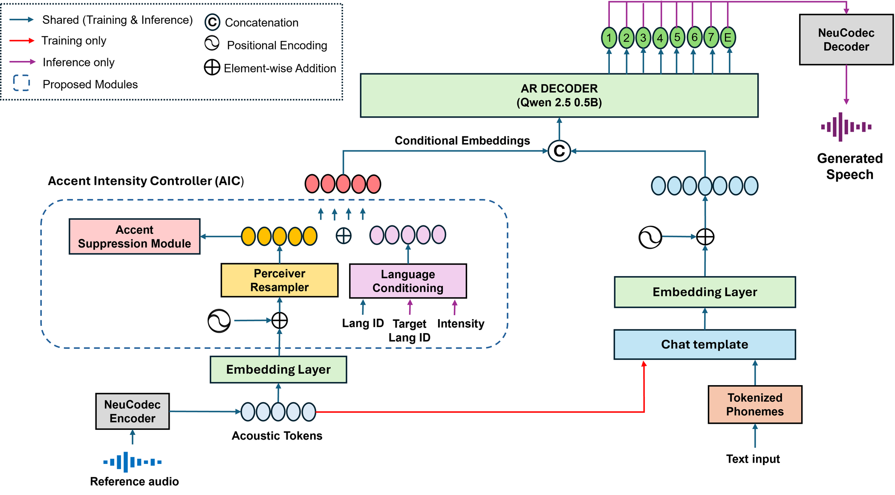

*Figure 1 · [Source](https://arxiv.org/abs/2606.25403)*

### CSM

CSM uses the text and audio of preceding speaker turns to shape the delivery of the next utterance. A Llama backbone predicts speech representations, and a smaller decoder completes Mimi audio codes. It is a contextual speech renderer: an application supplies the words to say, including any responses written by a separate language model.

[GitHub](https://github.com/sesameailabs/csm) · [Details](models/token-lm.md#csm)

*Editorial input/output diagram · [Source](https://github.com/sesameailabs/csm)*

### CTC-TTS

CTC-TTS uses automatically derived alignment and two-word interleaving to train an incremental speech language model. Its length-concatenated and feature-stacked variants make different trade-offs between speech quality and generation latency.

[Paper](https://arxiv.org/abs/2602.19574) · [GitHub](https://github.com/thu-spmi/CTC-TTS) · [Details](models/token-lm.md#ctc-tts)

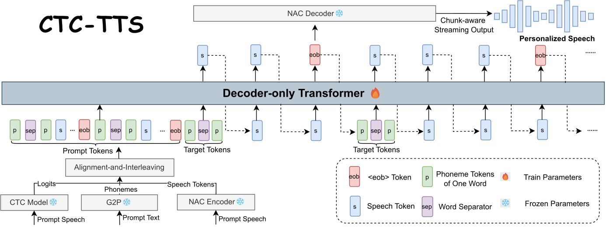

*Figure 2 · [Source](https://arxiv.org/abs/2602.19574)*

### CtrlSpeech

CtrlSpeech adds local pitch, loudness and duration conditioning to a patch-autoregressive diffusion synthesizer. A separate global speaker condition preserves the reference voice while users modify the delivery of individual words or phonemes.

[Paper](https://arxiv.org/abs/2608.08362) · [GitHub](https://github.com/zszheng147/ctrlspeech) · [Details](models/continuous-lm.md#ctrlspeech)

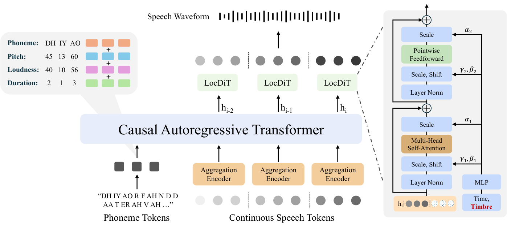

*Figure 2 · [Source](https://arxiv.org/abs/2608.08362)*

### CuteTTS

CuteTTS combines a causal audio VAE, an autoregressive patch model and an explicitly speaker-conditioned flow head. Generating patches rather than individual frames reduces sequential work; a distilled variant targets faster streaming while preserving reference-voice synthesis.

[Paper](https://arxiv.org/abs/2608.08638) · [GitHub](https://github.com/OPPO-Mente-Lab/CuteTTS) · [Details](models/continuous-lm.md#cutetts)

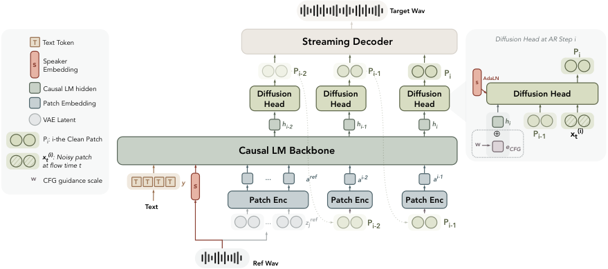

*Figure 1 · [Source](https://arxiv.org/abs/2608.08638)*

### DAIEN-TTS

DAIEN-TTS separates a reference recording into speech and environmental components, then conditions acoustic generation on them independently. Its extended formulation additionally models reverberation and uses separate guidance controls for speech, noise and room acoustics, enabling voice cloning into a chosen environment.

[Paper 1](https://arxiv.org/abs/2608.03011) · [Project 1](https://yxlu-0102.github.io/DAIEN-TTS/journal) · [Paper 2](https://arxiv.org/abs/2509.14684) · [GitHub](https://github.com/yxlu-0102/DAIEN-TTS) · [Project 2](https://yxlu-0102.github.io/DAIEN-TTS) · [Details](models/diffusion.md#daien-tts)

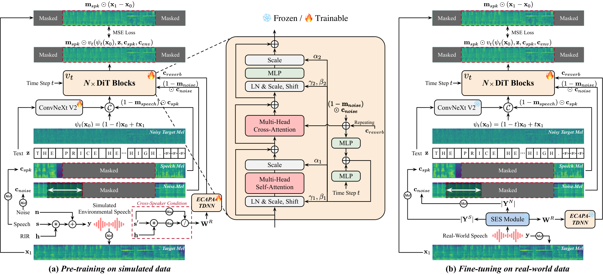

*Paper figure · [Source](https://arxiv.org/abs/2608.03011)*

### DARS

DARS separately models pathological timing and acoustic style to synthesize dysarthric speech. A multistage rhythm predictor and conditioned flow model generate targeted examples for improving recognition under limited real-world speech data.

[Paper](https://arxiv.org/abs/2603.01369) · GitHub: no author-linked repository found · [Details](models/diffusion.md#dars)

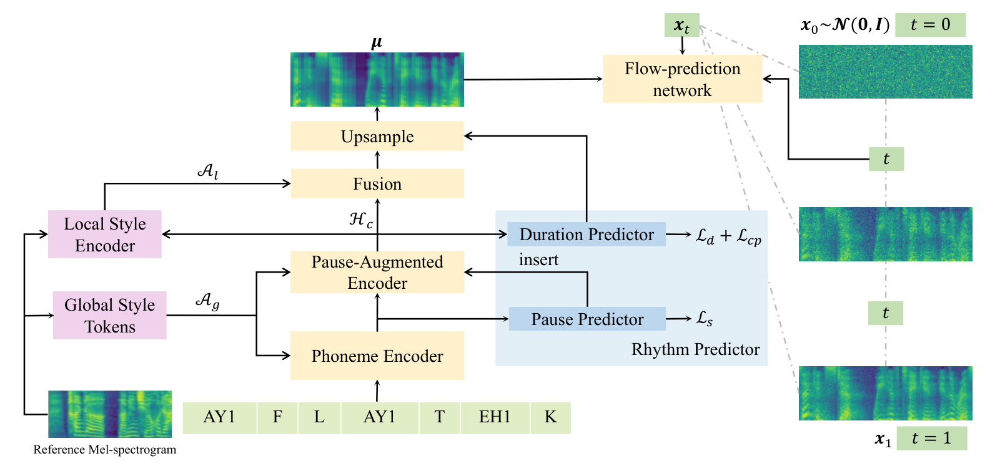

*Figure 1 · [Source](https://arxiv.org/abs/2603.01369)*

### DCAR

DCAR changes the number of acoustic tokens predicted at each autoregressive step. Adapting the chunk size to the generation state shortens sequential processing while maintaining content alignment and reference-conditioned speech quality.

[Paper](https://arxiv.org/abs/2506.22023) · GitHub: no author-linked repository found · [Details](models/token-lm.md#dcar)

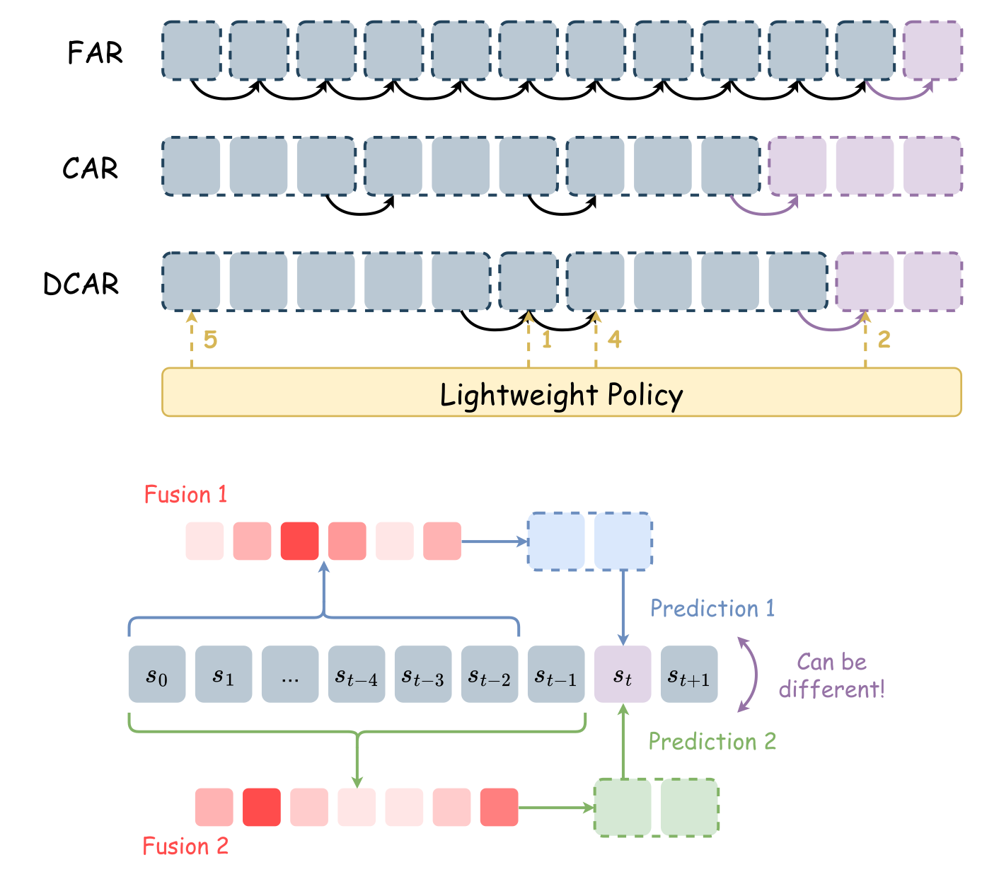

*Figure 1 · [Source](https://arxiv.org/abs/2506.22023)*

### Deep Voice

Neural TTS pipeline with autoregressive WaveNet synthesis.

[Paper](https://arxiv.org/abs/1702.07825) · [Details](models/autoregressive.md#deep-voice)

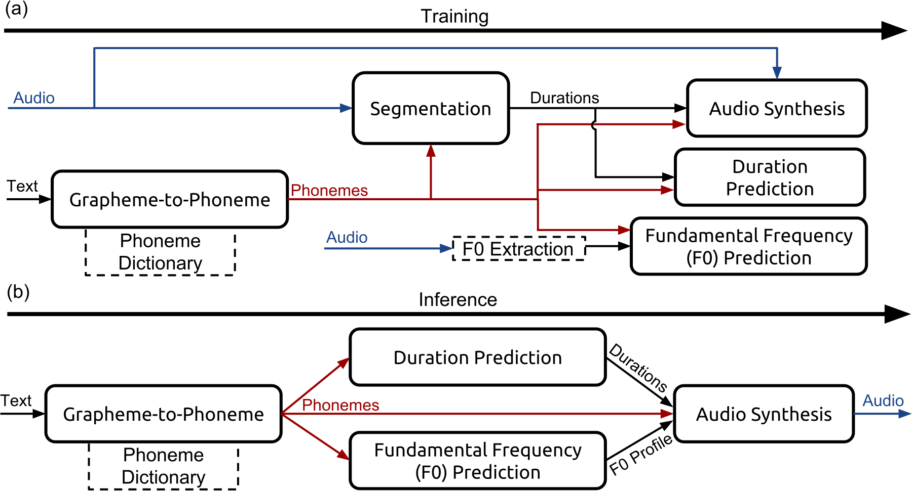

*Figure 1 · [Source](https://arxiv.org/abs/1702.07825)*

### Deep Voice 2

Speaker-conditioned neural pipeline and WaveNet synthesis.

[Paper](https://arxiv.org/abs/1705.08947) · [Details](models/autoregressive.md#deep-voice-2)

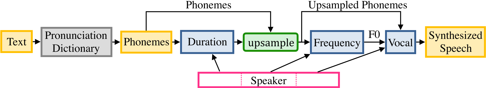

*Figure 1 · [Source](https://arxiv.org/abs/1705.08947)*

### Deep Voice 3

Convolutional attention encoder-decoder and converter.

[Paper](https://arxiv.org/abs/1710.07654) · [Details](models/autoregressive.md#deep-voice-3)

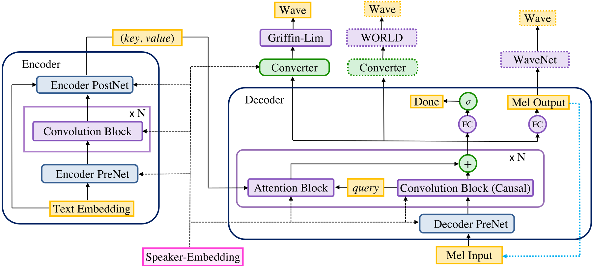

*Figure 1 · [Source](https://arxiv.org/abs/1710.07654)*

### DeepASMR

DeepASMR separates ASMR delivery from the reference speaker's identity using discrete speech representations. A language model predicts content and style, while a flow-based acoustic decoder transfers the requested performance into the target voice.

[Paper](https://arxiv.org/abs/2601.15596) · GitHub: no author-linked repository found · [Details](models/token-lm.md#deepasmr)

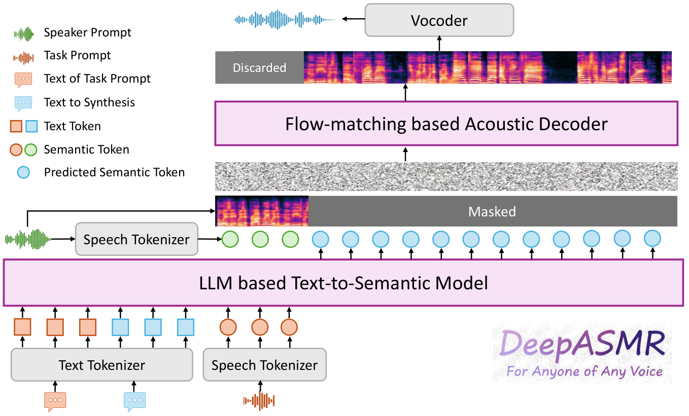

*Paper figure · [Source](https://arxiv.org/abs/2601.15596)*

### DeepDubber-V1

DeepDubber-V1 interprets visual scenes and dubbing requirements before generating the target speech. Its multimodal conditions distinguish narration, monologue and dialogue, guiding both expressive delivery and synchronization.

[Paper](https://arxiv.org/abs/2503.23660) · [GitHub](https://github.com/woka-0a/DeepDubber-V1) · [Details](models/diffusion.md#deepdubber-v1)

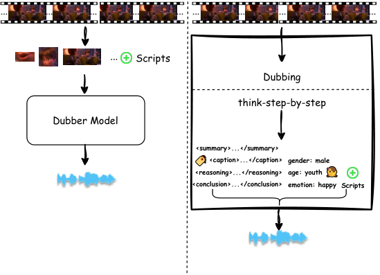

*Figure 1 · [Source](https://arxiv.org/abs/2503.23660)*

### DeepDubbing

DeepDubbing assigns voices to characters and conditions speech rendering on the surrounding script. Its voice-design and instruction-synthesis stages support multi-participant audiobook production while maintaining character identity and context-sensitive expression.

[Paper](https://arxiv.org/abs/2509.15845) · [GitHub](https://github.com/TME-Lyra-Lab/DeepDubbing) · [Details](models/token-lm.md#deepdubbing)

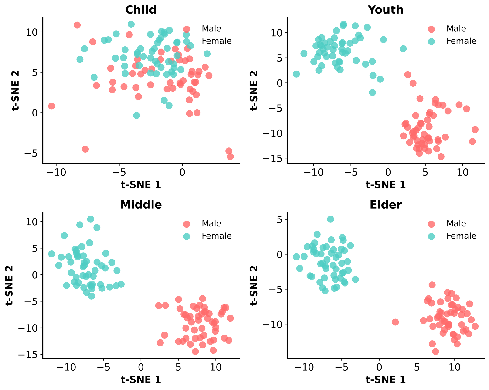

*Figure 1 · [Source](https://arxiv.org/abs/2509.15845)*

### DelightfulTTS

Conformer acoustic model with explicit and implicit prosody.

[Paper](https://arxiv.org/abs/2110.12612) · [Details](models/parallel.md#delightfultts)

*Figure 1 · [Source](https://arxiv.org/abs/2110.12612)*

### DELTA-TTS

DELTA-TTS converts a pretrained speech language model to parallel discrete diffusion using lightweight adaptation. Local convolution and confidence-based decoding help retain acoustic structure while the model fills speech-token positions in an order determined by prediction confidence.

[Paper](https://arxiv.org/abs/2607.04140) · GitHub: no author-linked repository found · [Details](models/token-lm.md#delta-tts)

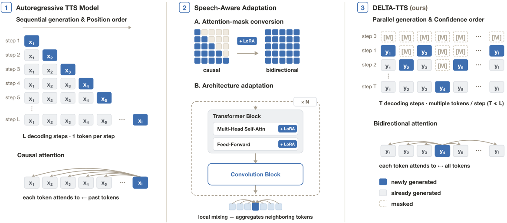

*Figure 1 · [Source](https://arxiv.org/abs/2607.04140)*

### DepFlow

DepFlow separates a depression-related acoustic representation from speaker identity and spoken content. The representation conditions a flow-matching synthesizer, enabling controlled synthetic speech for investigating acoustic cues and data augmentation.

[Paper](https://arxiv.org/abs/2601.00303) · GitHub: no author-linked repository found · [Details](models/diffusion.md#depflow)

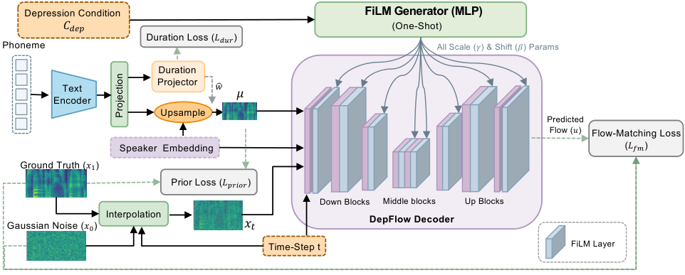

*Figure 1 · [Source](https://arxiv.org/abs/2601.00303)*

### Dia

Dia turns a speaker-tagged transcript into conversational audio, including supported nonverbal events such as laughter and coughing. Reference audio and its transcript can establish speaker identity and delivery. Its English checkpoint is useful for scripted exchanges and dialogue narration, with the conversation content supplied by the user rather than generated by the model.

[GitHub](https://github.com/nari-labs/dia) · [Details](models/token-lm.md#dia)

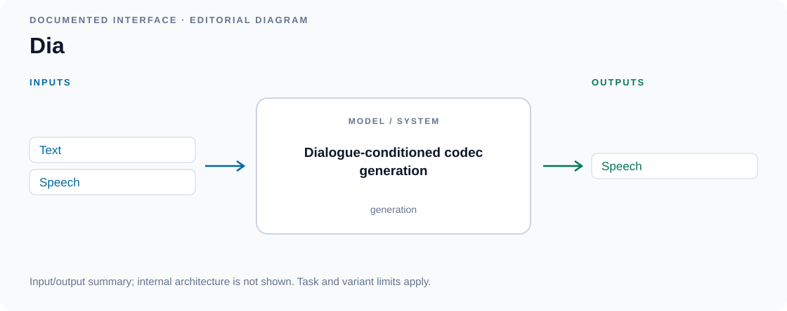

*Editorial input/output diagram · [Source](https://github.com/nari-labs/dia)*

### Dia2

Dia2 begins synthesizing before the complete script is available, allowing an application to feed words incrementally. Audio prefixes provide speaker and conversational context, while a streaming codec path reconstructs the output. The released 1B and 2B checkpoints focus on English dialogue; prefix conditioning helps keep voices consistent between generations.

[GitHub](https://github.com/nari-labs/dia2) · [Details](models/token-lm.md#dia2)

*Editorial input/output diagram · [Source](https://github.com/nari-labs/dia2)*

### DialoSpeech

DialoSpeech models two speakers on separate tracks and uses chunked flow matching for acoustic rendering. The design supports expressive scripted dialogue, including interactions whose timing is difficult to reproduce by joining independent utterances.

[Paper](https://arxiv.org/abs/2510.08373) · [Project](https://tiamojames.github.io/DialoSpeech) · GitHub: no author-linked repository found · [Details](models/token-lm.md#dialospeech)

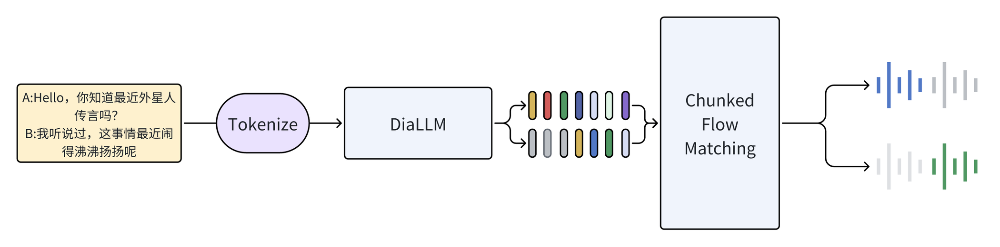

*Figure 2 · [Source](https://arxiv.org/abs/2510.08373)*

### DiEmo-TTS

DiEmo-TTS distills emotion information from speech while suppressing unrelated speaker characteristics. Cluster-based sampling and representation perturbation improve cross-speaker emotion transfer, including situations where extensive emotion labels are unavailable.

[Paper](https://arxiv.org/abs/2505.19687) · [GitHub](https://github.com/Choddeok/DiEmo-TTS) · [Details](models/parallel.md#diemo-tts)

*Figure 1 · [Source](https://arxiv.org/abs/2505.19687)*

### Diff-TTS

Text-conditioned denoising diffusion acoustic model.

[Paper](https://arxiv.org/abs/2104.01409) · [Details](models/diffusion.md#diff-tts)

*Figure 3 · [Source](https://arxiv.org/abs/2104.01409)*

### DiffCSS

DiffCSS samples prosody representations from multimodal conversational context using a diffusion model. A prosody-conditioned speech language model renders those samples, allowing several expressive deliveries that remain consistent with the same dialogue.

[Paper](https://arxiv.org/abs/2502.19924) · GitHub: no author-linked repository found · [Details](models/token-lm.md#diffcss)

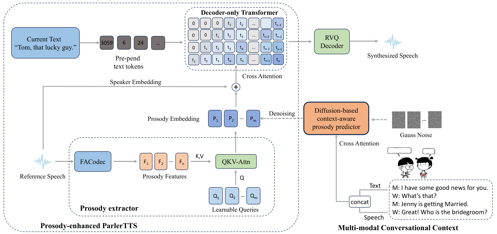

*Paper figure · [Source](https://arxiv.org/abs/2502.19924)*

### DiFlow-TTS

DiFlow-TTS maps phonemes into linguistic content and generates separate prosody and acoustic token streams through discrete flow matching. Factorizing these responsibilities supports compact zero-shot synthesis with fewer sequential generation steps.

[Paper](https://arxiv.org/abs/2509.09631) · [GitHub](https://github.com/Fsoft-AIC/DiFlowTTS) · [Details](models/token-lm.md#diflow-tts)

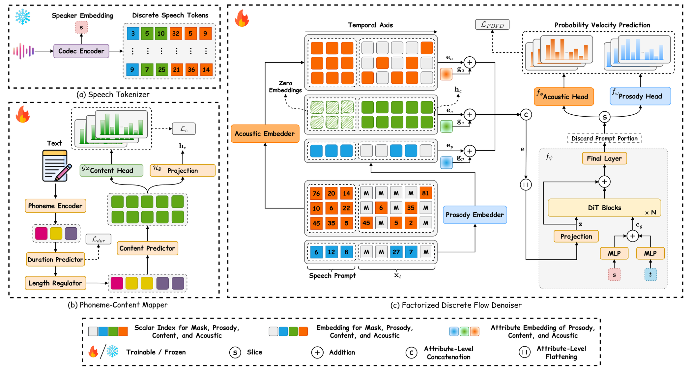

*Figure 2 · [Source](https://arxiv.org/abs/2509.09631)*

### DiFlowDubber

DiFlowDubber first learns linguistic content and separate prosodic-acoustic tokens through a discrete-flow TTS model. A subsequent video-dubbing stage aligns those representations to visual timing, connecting voice generation with synchronized lip movements.

[Paper](https://arxiv.org/abs/2603.14267) · [GitHub](https://github.com/Fsoft-AIC/DiFlowDubber) · [Project](https://nngocson2002.github.io/projects/diflowdubber) · [Details](models/token-lm.md#diflowdubber)

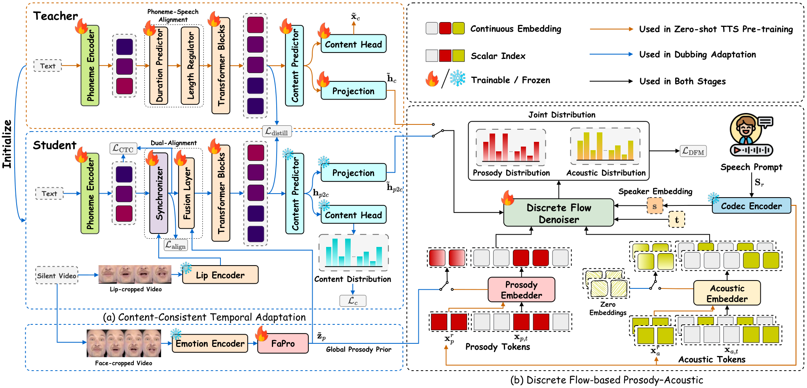

*Figure 2 · [Source](https://arxiv.org/abs/2603.14267)*

### DisCo-Speech

DisCo-Speech learns a codec that separates content, delivery and speaker identity. A language model predicts combined content-prosody tokens while the decoder receives a separate timbre representation, enabling reference cloning with independently controllable vocal attributes.

[Paper](https://arxiv.org/abs/2512.13251) · [GitHub](https://github.com/disco-speech/DisCo-Speech-main) · [Project](https://disco-speech.github.io/DisCo-demo/) · [Details](models/token-lm.md#disco-speech)

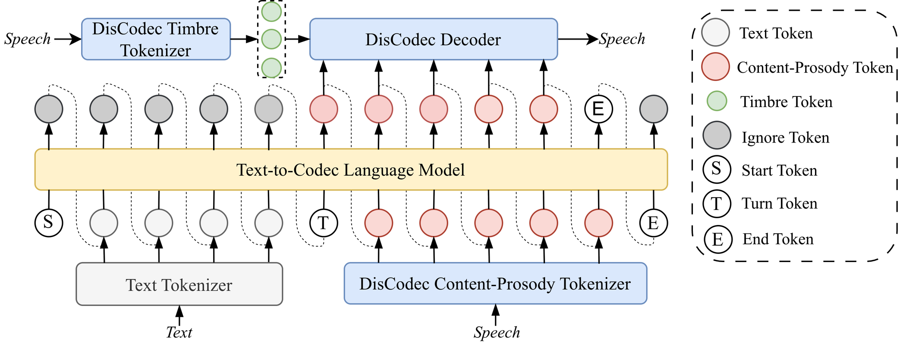

*Figure 1 · [Source](https://arxiv.org/abs/2512.13251)*

### DisSpeech

DisSpeech maps Mandarin text and marked stuttering events to semantic speech tokens without temporal autoregression. Pitch and energy modeling guide acoustic reconstruction, enabling controlled repetitions and other disfluencies for speech synthesis and recognition-data augmentation.

[Paper](https://arxiv.org/abs/2606.21457) · GitHub: no author-linked repository found · [Details](models/token-lm.md#disspeech)

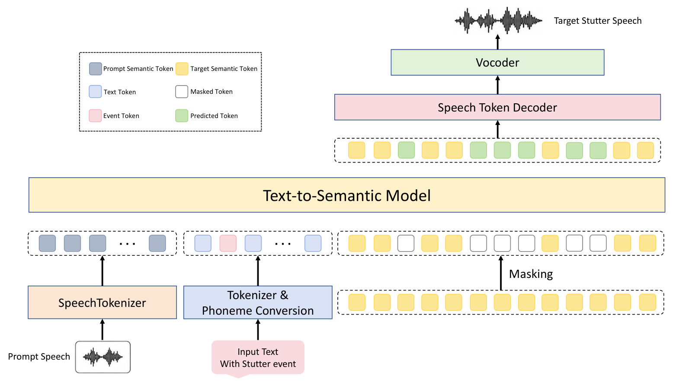

*Figure 2 · [Source](https://arxiv.org/abs/2606.21457)*

### DiSTAR

DiSTAR first drafts blocks of residual-quantized speech tokens with a language model. A masked diffusion decoder then fills acoustic detail within each block, combining temporal planning and parallel refinement entirely in discrete codec space.

[Paper](https://arxiv.org/abs/2510.12210) · GitHub: no author-linked repository found · [Details](models/token-lm.md#distar)

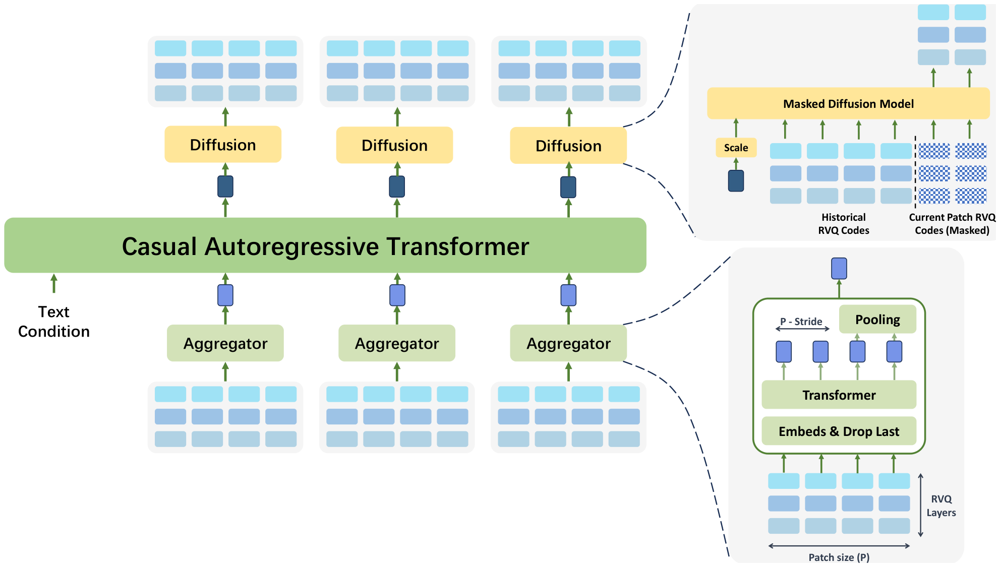

*Figure 1 · [Source](https://arxiv.org/abs/2510.12210)*

### DiTAR

DiTAR predicts a sequence of compressed acoustic patches using a language model, then generates each patch's detail through diffusion. Separating global temporal planning from local reconstruction supports zero-shot speech synthesis with controllable sampling diversity.

[Paper](https://arxiv.org/abs/2502.03930) · [Project](https://spicyresearch.github.io/ditar/) · GitHub: no author-linked repository found · [Details](models/continuous-lm.md#ditar)

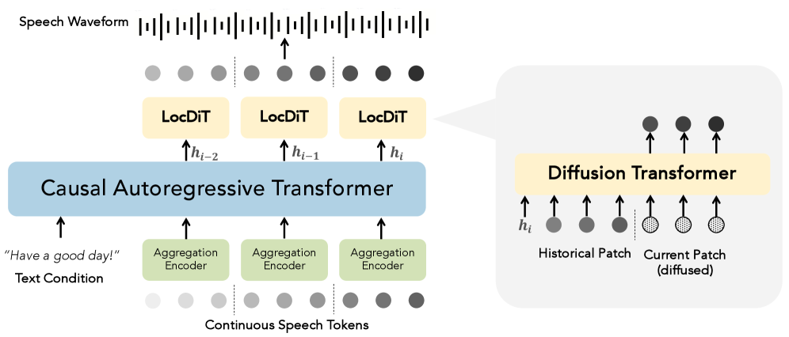

*Figure 1 · [Source](https://arxiv.org/abs/2502.03930)*

### DiTTo-TTS

Latent diffusion Transformer with speech-length prediction.

[Paper](https://arxiv.org/abs/2406.11427) · [Details](models/diffusion.md#ditto-tts)

*Figure 1 · [Source](https://arxiv.org/abs/2406.11427)*

### DMOSpeech 2

DMOSpeech 2 adds reinforcement learning to duration prediction in an already metric-optimized synthesizer. Rewards derived from speaker similarity and transcription accuracy guide timing choices, linking prosodic planning with reference-voice and content objectives.

[Paper](https://arxiv.org/abs/2507.14988) · [GitHub](https://github.com/yl4579/DMOSpeech2) · [Project](https://dmospeech2.github.io/) · [Details](models/diffusion.md#dmospeech-2)

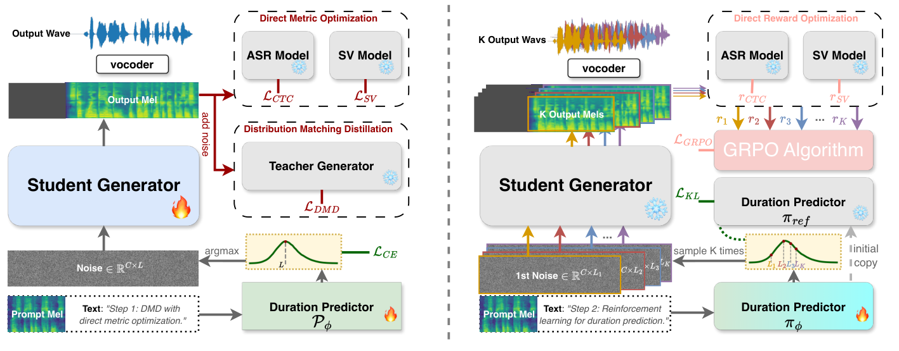

*Figure 1 · [Source](https://arxiv.org/abs/2507.14988)*

### DMP-TTS

DMP-TTS maps style descriptions and reference recordings into a shared conditioning space. Chained guidance controls content, timbre and style separately, allowing detailed synthesis adjustments within a latent diffusion Transformer.

[Paper](https://arxiv.org/abs/2512.09504) · GitHub: no author-linked repository found · [Details](models/diffusion.md#dmp-tts)

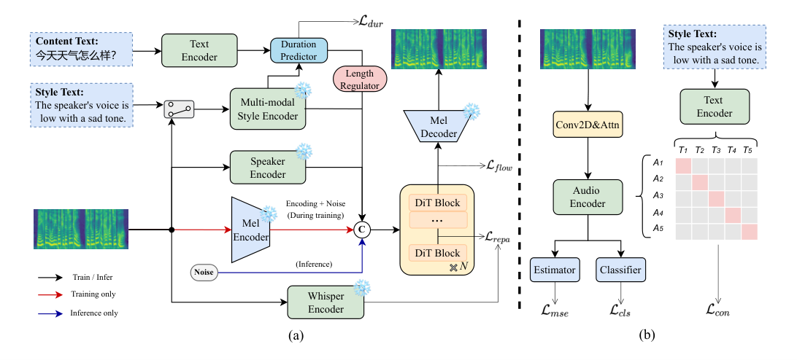

*Figure 1 · [Source](https://arxiv.org/abs/2512.09504)*

### dots.tts

dots.tts predicts continuous acoustic representations from multilingual text and voice references. Its flow-matching output head supports both audio streaming and streaming text input; guidance-aware distillation reduces the work needed to generate each audio packet.

[Paper](https://arxiv.org/abs/2606.07080) · [GitHub](https://github.com/studio-dots-ai/dots.tts) · [Project](https://studio-dots-ai.github.io/dots.tts-demo/) · [Details](models/continuous-lm.md#dots-tts)

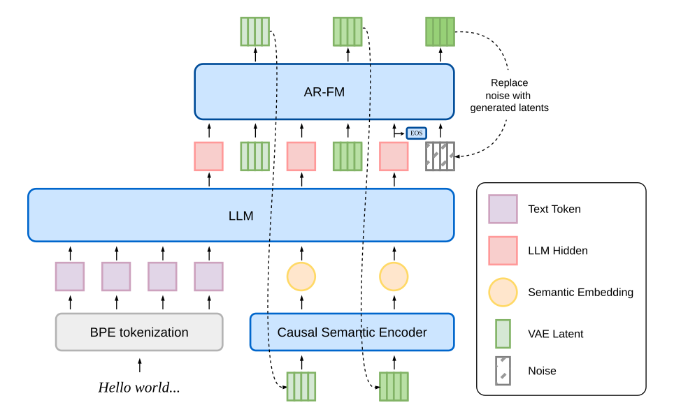

*Figure 1 · [Source](https://arxiv.org/abs/2606.07080)*

### Dragon-FM

Dragon-FM predicts successive speech chunks autoregressively while refining the tokens inside each chunk with bidirectional flow matching. Compact acoustic codes and cross-chunk caching reduce generation overhead and support longer content such as podcasts.

[Paper](https://arxiv.org/abs/2507.22746) · [Project](https://cognitivespeech.github.io/dragon-fm) · GitHub: no author-linked repository found · [Details](models/token-lm.md#dragon-fm)

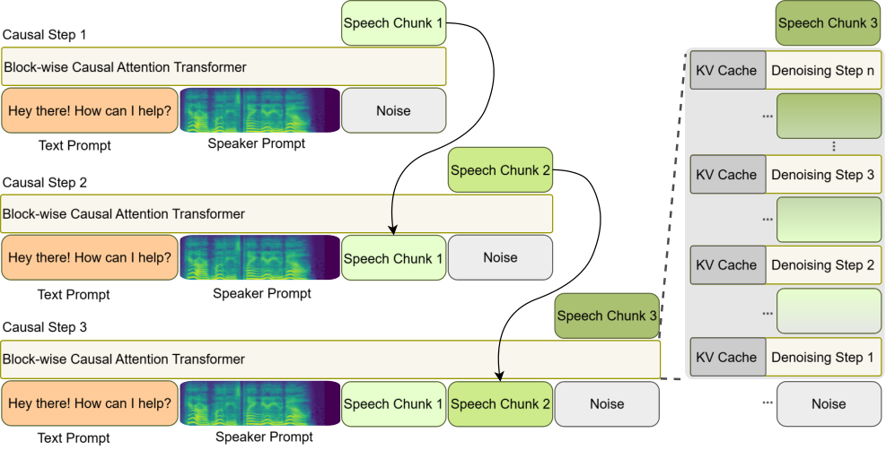

*Figure 1 · [Source](https://arxiv.org/abs/2507.22746)*

### DrawSpeech

DrawSpeech turns user-drawn prosodic curves into detailed pitch and energy conditions for synthesis. A diffusion model fills in the acoustic detail, enabling localized expressive control beyond an overall style description.

[Paper](https://arxiv.org/abs/2501.04256) · [GitHub](https://github.com/HappyColor/DrawSpeech_PyTorch) · [Details](models/diffusion.md#drawspeech)

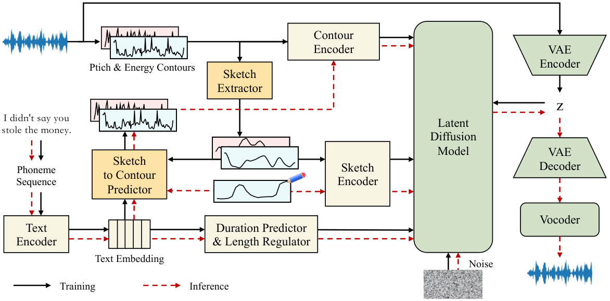

*Paper figure · [Source](https://arxiv.org/abs/2501.04256)*

### DS-TTS

DS-TTS extracts complementary voice characteristics through two style encoders. Dynamic modulation conditions the acoustic generator on these representations, supporting unseen speakers and adapting synthesis across different sentence lengths.

[Paper](https://arxiv.org/abs/2506.01020) · GitHub: no author-linked repository found · [Details](models/diffusion.md#ds-tts)

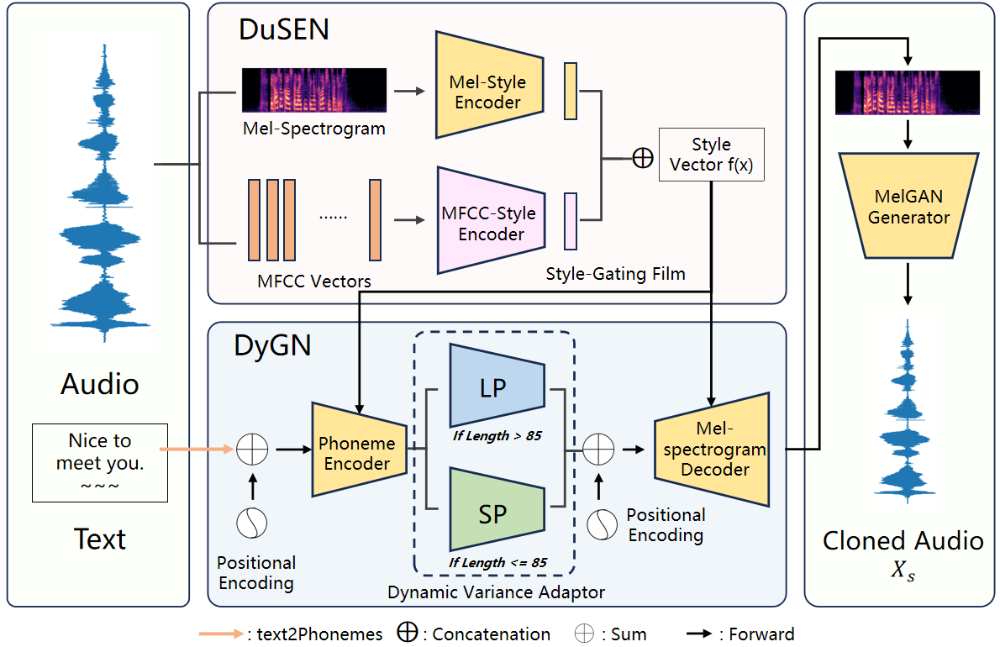

*Paper figure · [Source](https://arxiv.org/abs/2506.01020)*

### DualDub

DualDub generates spoken dialogue and background sound together from video and textual conditions. A cross-modal aligner coordinates the two decoding heads, targeting temporally synchronized soundtracks rather than speech rendered in isolation.

[Paper](https://arxiv.org/abs/2507.10109) · GitHub: no author-linked repository found · [Details](models/token-lm.md#dualdub)

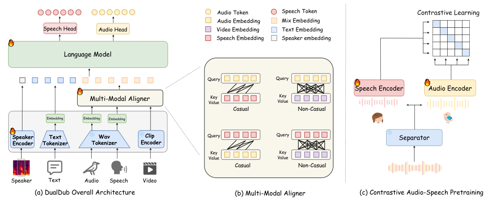

*Figure 2 · [Source](https://arxiv.org/abs/2507.10109)*

### DualSpeechLM

DualSpeechLM uses understanding-oriented speech tokens as input and acoustic codec tokens for generation. Semantic supervision and staged conditioning coordinate the two representations, supporting speech synthesis within a unified understanding-and-generation architecture.

[Paper](https://arxiv.org/abs/2508.08961) · GitHub: no author-linked repository found · [Details](models/token-lm.md#dualspeechlm)

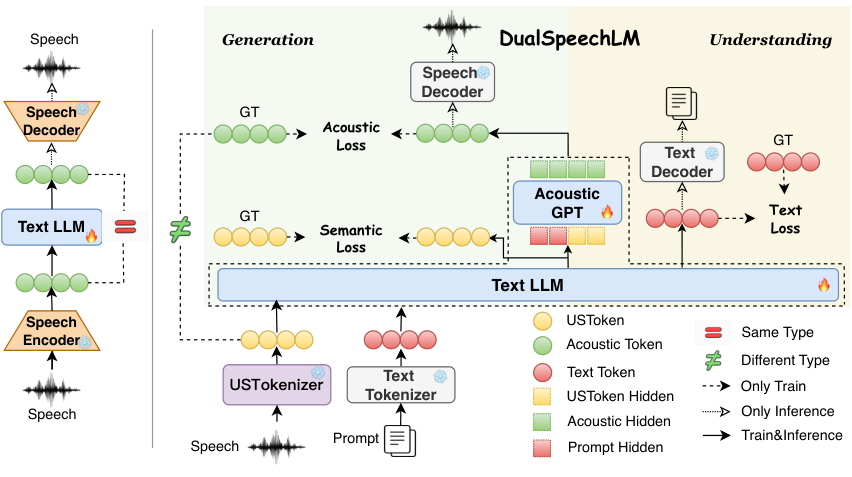

*Figure 3 · [Source](https://arxiv.org/abs/2508.08961)*

### E2 TTS

Flow matching with filler-token text conditioning.

[Paper](https://arxiv.org/abs/2406.18009) · [Details](models/diffusion.md#e2-tts)

*Figure 1 · [Source](https://arxiv.org/abs/2406.18009)*

### ECTSpeech

ECTSpeech gradually tightens consistency constraints on a pretrained diffusion synthesizer. The resulting generator maps a noise state to speech in one step, reducing repeated denoising while retaining the conditioning of the original TTS model.

[Paper](https://arxiv.org/abs/2510.05984) · GitHub: no author-linked repository found · [Details](models/diffusion.md#ectspeech)

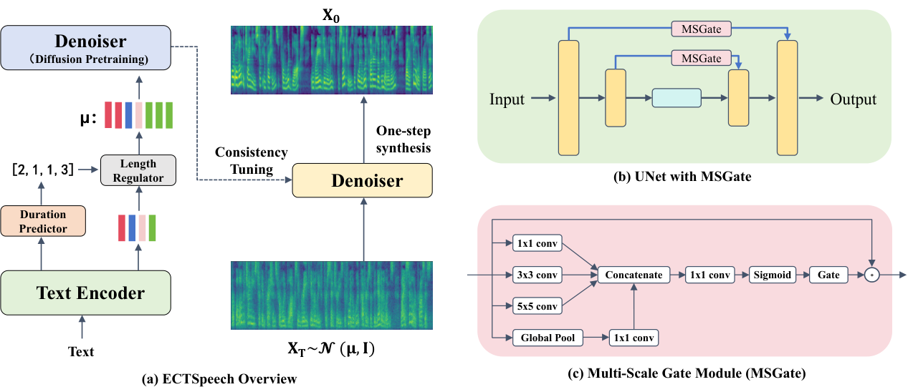

*Figure 2 · [Source](https://arxiv.org/abs/2510.05984)*

### ELLA-V

Alignment-guided token reordering.

[Paper](https://arxiv.org/abs/2401.07333) · [Details](models/token-lm.md#ella-v)

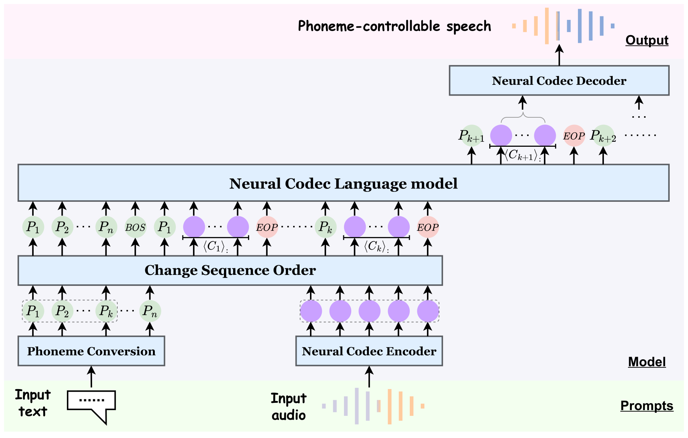

*Figure 1 · [Source](https://arxiv.org/abs/2401.07333)*

### EME-TTS

EME-TTS jointly models emotional delivery and local emphasis instead of treating them as independent effects. Automatically derived emphasis labels and variance-related features help users stress selected material while retaining a recognizable target emotion.

[Paper](https://arxiv.org/abs/2507.12015) · GitHub: no author-linked repository found · [Details](models/parallel.md#eme-tts)

*Figure 1 · [Source](https://arxiv.org/abs/2507.12015)*

### EMM-TTS

EMM-TTS separates emotional content modeling from speaker-specific acoustic generation. Speaker-consistency objectives and adaptive normalization help transfer emotion across languages while retaining the reference speaker's timbre.

[Paper](https://arxiv.org/abs/2510.11124) · GitHub: no author-linked repository found · [Details](models/token-lm.md#emm-tts)

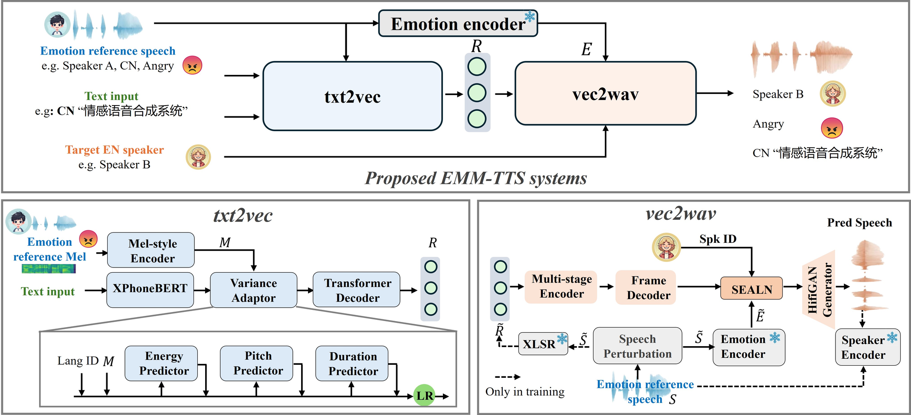

*Figure 2 · [Source](https://arxiv.org/abs/2510.11124)*

### EmojiVoice

EmojiVoice adds interpretable emoji prompts to the text encoder and flow predictor of Matcha-TTS. Changing prompts across phrases varies expression during longer robot utterances, providing a lightweight control interface for expressive synthesis.

[Paper](https://arxiv.org/abs/2506.15085) · [GitHub](https://github.com/rosielab/emojivoice) · [Details](models/diffusion.md#emojivoice)

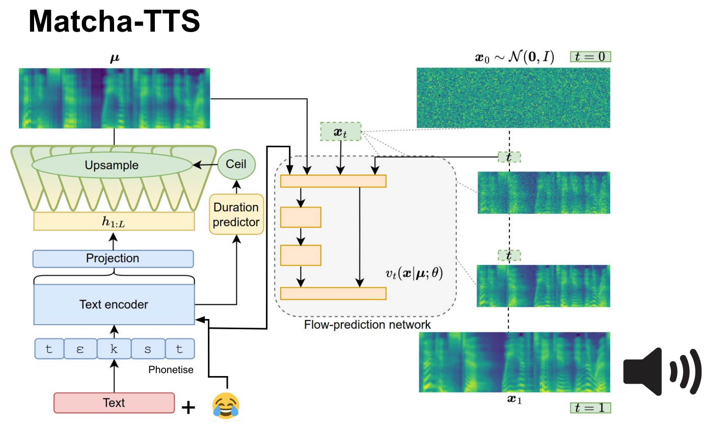

*Paper figure · [Source](https://arxiv.org/abs/2506.15085)*

### EmoShift

EmoShift adds a lightweight layer that learns emotion-dependent changes to a TTS model's hidden representation. The controls adjust expressive delivery and emotion intensity while leaving most of the underlying synthesis backbone intact.

[Paper](https://arxiv.org/abs/2601.22873) · GitHub: no author-linked repository found · [Details](models/token-lm.md#emoshift)

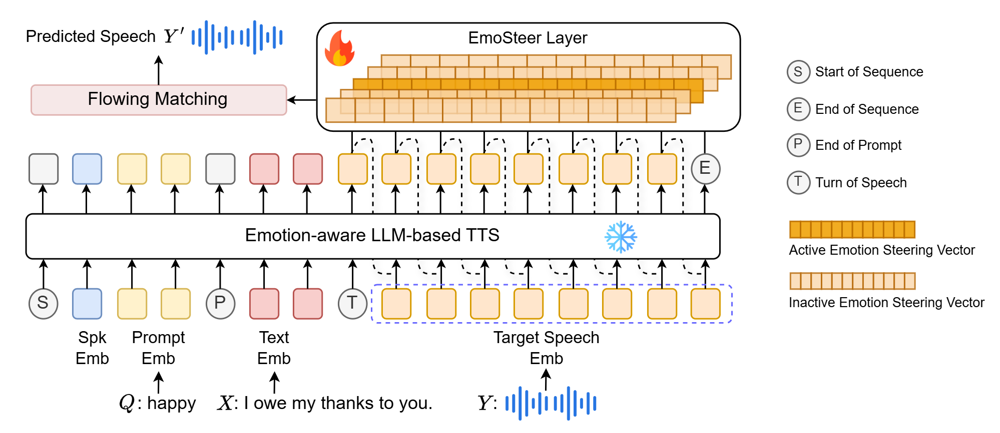

*Figure 2 · [Source](https://arxiv.org/abs/2601.22873)*

### EmoSSLSphere

EmoSSLSphere combines an emotion representation constrained to a sphere with discrete units derived from self-supervised speech features. The model synthesizes emotional speech across languages while organizing expressive controls independently of the textual content.

[Paper](https://arxiv.org/abs/2508.11273) · GitHub: no author-linked repository found · [Details](models/token-lm.md#emosslsphere)

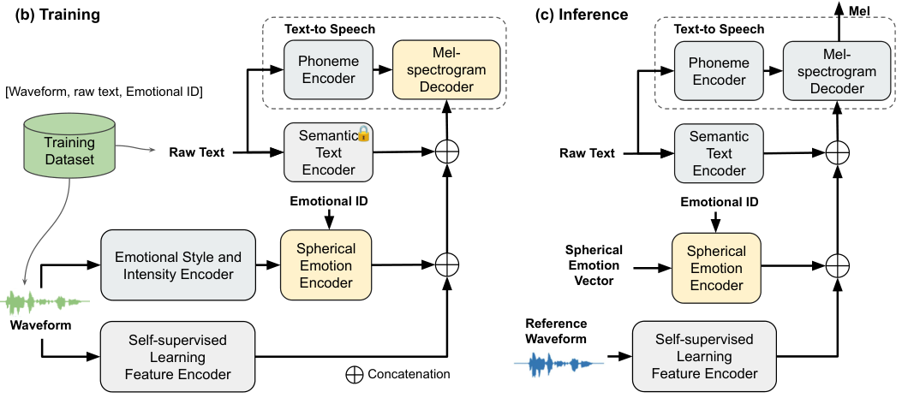

*Figure 2 · [Source](https://arxiv.org/abs/2508.11273)*

### EmoSteer-TTS

EmoSteer-TTS extracts emotion-related directions from a pretrained synthesizer's internal activations. Applying those directions during inference changes, mixes or removes emotional expression without retraining; the paper evaluates the method across several different TTS backbones.

[Paper](https://arxiv.org/abs/2508.03543) · GitHub: no author-linked repository found · [Details](models/diffusion.md#emosteer-tts)

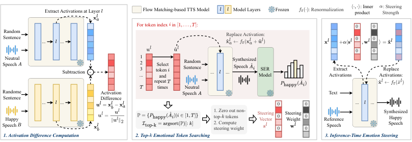

*Figure 3 · [Source](https://arxiv.org/abs/2508.03543)*

### Emotion-timbre disentangled TTS

This emotional synthesizer learns separate reference encoders for timbre and emotion. A mutual-information objective reduces their overlap, while phoneme-level emotion prediction carries changing expression into the generated acoustic sequence.

[Paper](https://arxiv.org/abs/2510.01722) · [GitHub](https://github.com/BaleYang/emotion-timbre-disentangled-tts-code) · [Project](https://baleyang.github.io/emotion-timbre-disentangled-tts/) · [Details](models/parallel.md#emotion-timbre-disentangled-tts)

*Figure 1 · [Source](https://arxiv.org/abs/2510.01722)*

### EmotiVoice

PromptTTS-derived style and content conditioning.

[GitHub](https://github.com/netease-youdao/EmotiVoice) · [Details](models/parallel.md#emotivoice)

*Editorial input/output diagram · [Source](https://github.com/netease-youdao/EmotiVoice)*

### EmoTra-TTS

EmoTra-TTS introduces frame-level valence, arousal and dominance controls into both prosodic planning and acoustic decoding. Synthetic transition examples teach the model to move between emotions within an utterance while keeping its wording and speaker identity consistent.

[Paper](https://arxiv.org/abs/2608.23791) · [GitHub](https://github.com/Liu-Tianchi/EmoTra-TTS) · [Project](https://liu-tianchi.github.io/EmoTra_DemoPage/) · [Details](models/token-lm.md#emotra-tts)

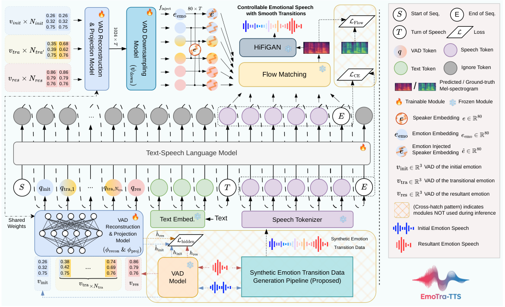

*Figure 2 · [Source](https://arxiv.org/abs/2608.23791)*

### EmoVoice

EmoVoice interprets free-form textual descriptions of emotional delivery. Its phoneme-boost variant predicts phonetic and acoustic information together to improve content consistency while retaining expressive style control.

[Paper](https://arxiv.org/abs/2504.12867) · [GitHub](https://github.com/yanghaha0908/EmoVoice) · [Details](models/token-lm.md#emovoice)

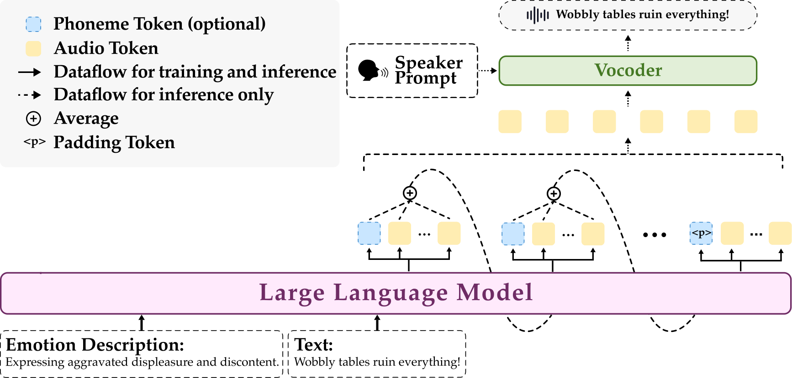

*Figure 1 · [Source](https://arxiv.org/abs/2504.12867)*

### End-to-end discrete-token TTS

This system trains the discrete speech representation together with the language and acoustic models that consume it. Reconstruction and recognition feedback also update token prediction, reducing mismatches between separately trained components in reference-conditioned speech synthesis.

[Paper](https://arxiv.org/abs/2606.09234) · GitHub: no author-linked repository found · [Details](models/token-lm.md#end-to-end-discrete-token-tts)

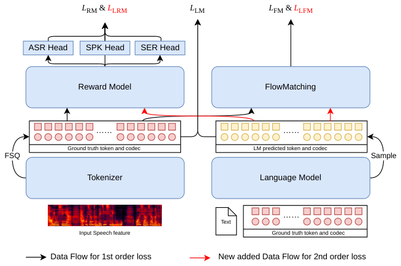

*Figure 1 · [Source](https://arxiv.org/abs/2606.09234)*

### F5-TTS

F5-TTS learns text-guided speech infilling with flow matching, refining character representations before a Transformer predicts the speech trajectory. A reference clip supplies voice context, and Sway Sampling controls how inference steps are distributed. The 2025 v1 Base release refines training and inference within the same general architecture for zero-shot speech synthesis.

[Paper](https://arxiv.org/abs/2410.06885) · [GitHub](https://github.com/SWivid/F5-TTS) · [Details](models/diffusion.md#f5-tts)

*Figure 1 · [Source](https://arxiv.org/abs/2410.06885)*

### F5R-TTS

F5R-TTS adapts a flow-based synthesizer to reinforcement learning through a probabilistic formulation of generation. Transcription accuracy and speaker-similarity rewards refine the model's ability to preserve both target content and the reference voice.

[Paper](https://arxiv.org/abs/2504.02407) · [GitHub](https://github.com/FrontierLabs/F5R-TTS) · [Details](models/diffusion.md#f5r-tts)

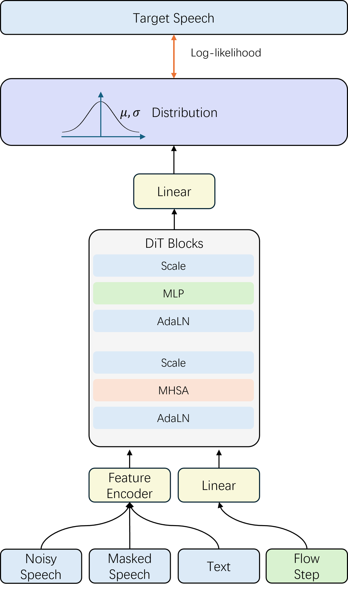

*Figure 2 · [Source](https://arxiv.org/abs/2504.02407)*

### Face-adapted StyleTTS 2

This model maps facial features into the style space of StyleTTS 2 through a lightweight learned adapter. It synthesizes text in a plausible face-conditioned voice without an audio reference; the paper evaluates transfer to unseen identities and another synthesis language.

[Paper](https://arxiv.org/abs/2607.26742) · GitHub: no author-linked repository found · [Details](models/diffusion.md#face-adapted-styletts-2)

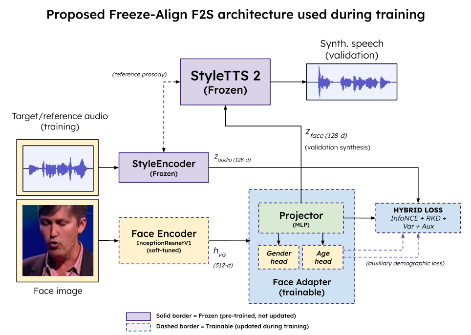

*Figure 1 · [Source](https://arxiv.org/abs/2607.26742)*

### FaceSpeak

FaceSpeak extracts speaker-related and expressive information from real or stylized portraits. These visual conditions guide text-to-speech generation, allowing the requested words to be rendered in a plausible voice and emotion associated with the image.

[Paper](https://arxiv.org/abs/2501.03181) · GitHub: no author-linked repository found · [Details](models/diffusion.md#facespeak)

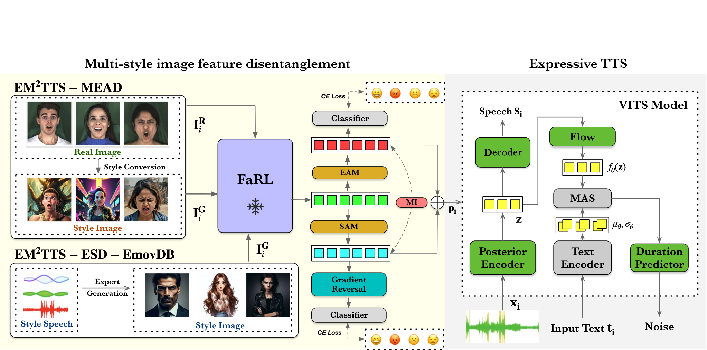

*Figure 3 · [Source](https://arxiv.org/abs/2501.03181)*

### FacialTalker

FacialTalker quantizes facial action information and combines it with text and speech history in a conversational synthesizer. Joint preference training over visual and speech tokens helps the generated delivery reflect the interlocutor's facial expression and dialogue context.

[Paper](https://arxiv.org/abs/2607.24430) · [GitHub](https://github.com/walker-hyf/FacialTalker) · [Details](models/token-lm.md#facialtalker)

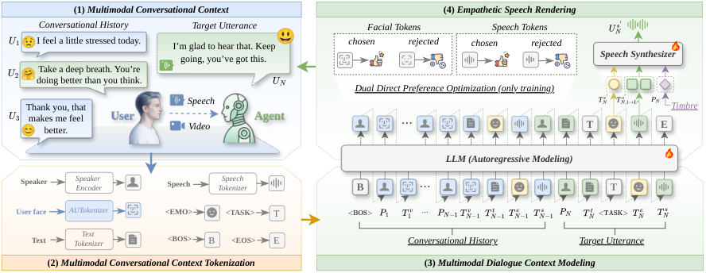

*Figure 2 · [Source](https://arxiv.org/abs/2607.24430)*

### FastPitch

Parallel Transformer with explicit pitch prediction.

[Paper](https://arxiv.org/abs/2006.06873) · [Details](models/parallel.md#fastpitch)

*Figure 1 · [Source](https://arxiv.org/abs/2006.06873)*

### FastSpeech

Feed-forward Transformer and duration-based length regulator.

[Paper](https://arxiv.org/abs/1905.09263) · [Details](models/parallel.md#fastspeech)

*Figure 1, PDF p. 4 · [Source](https://arxiv.org/abs/1905.09263)*

### FastSpeech 2

Parallel Transformer with duration, pitch and energy prediction.

[Paper](https://arxiv.org/abs/2006.04558) · [Details](models/parallel.md#fastspeech-2)

*Figure 1, PDF p. 3 · [Source](https://arxiv.org/abs/2006.04558)*

### FC-TTS

FC-TTS conditions generation on two recordings, one supplying delivery style and the other speaker identity. Specialized representation processing and auxiliary training objectives aim to prevent either condition from leaking unwanted attributes into the synthesized voice.

[Paper](https://arxiv.org/abs/2605.24618) · GitHub: no author-linked repository found · [Details](models/token-lm.md#fc-tts)

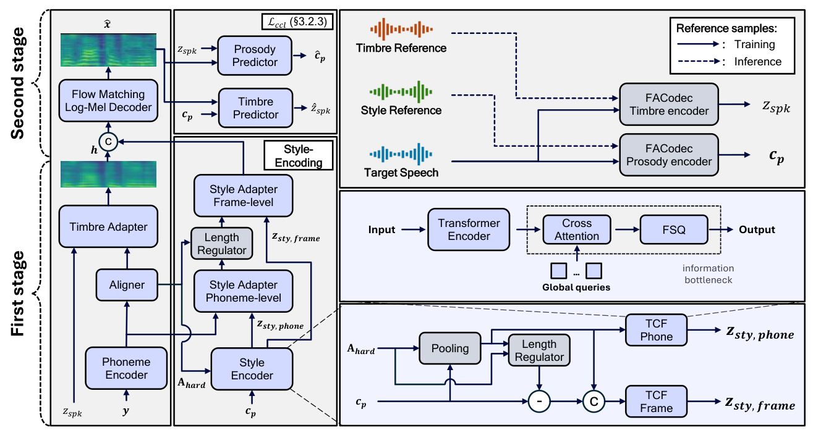

*Figure 1 · [Source](https://arxiv.org/abs/2605.24618)*

### FELLE

FELLE generates continuous acoustic frames sequentially, using the preceding frame to shape the next flow-matching prior. A coarse-to-fine acoustic head refines each prediction, supporting reference-conditioned speech without discrete speech-token classification.

[Paper](https://arxiv.org/abs/2502.11128) · GitHub: no author-linked repository found · [Details](models/continuous-lm.md#felle)

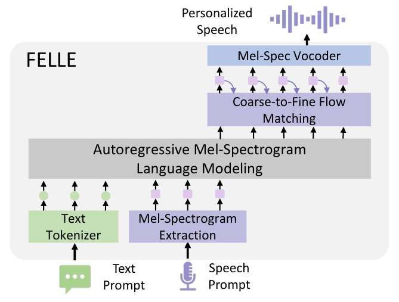

*Figure 1 · [Source](https://arxiv.org/abs/2502.11128)*

### FineCombo-TTS

FineCombo-TTS interprets style descriptions relative to a supplied speech reference. A flow-based variance predictor models how acoustic attributes should change, enabling precise relative edits without requiring an explicit independent embedding for every voice attribute.

[Paper](https://arxiv.org/abs/2606.19209) · [Project](https://thuhcsi.github.io/interspeech2026-FineCombo-TTS) · GitHub: no author-linked repository found · [Details](models/diffusion.md#finecombo-tts)

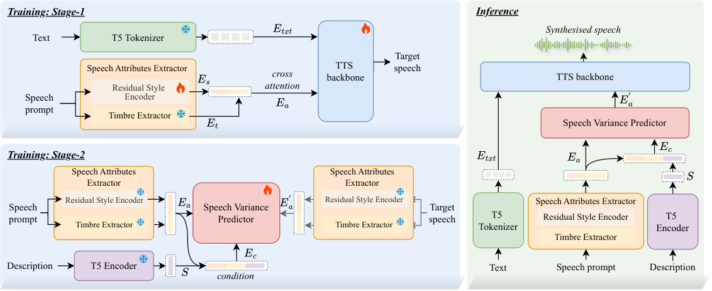

*Figure 2 · [Source](https://arxiv.org/abs/2606.19209)*

### FireRedAudio

FireRedAudio uses different acoustic encoders for understanding audio and conditioning speech generation. Its shared language model drives a flow-matching decoder over continuous RedAE latents, supporting voice cloning, instruction-controlled synthesis and speech editing within the broader audio model.

[Paper](https://arxiv.org/abs/2608.24168) · [GitHub](https://github.com/FireRedTeam/FireRedAudio) · [Details](models/continuous-lm.md#fireredaudio)

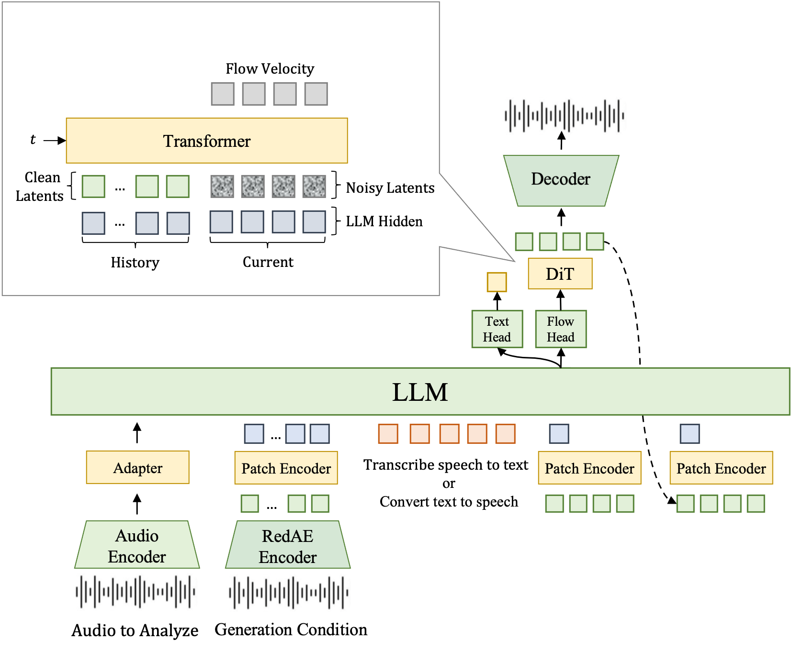

*Figure 1 · [Source](https://arxiv.org/abs/2608.24168)*

### FireRedTTS

Text-to-semantic LM and speech decoder.

[Paper](https://arxiv.org/abs/2409.03283) · [Details](models/token-lm.md#fireredtts)

*Figure 3 · [Source](https://arxiv.org/abs/2409.03283)*

### FireRedTTS-1S

FireRedTTS-1S extends the FireRed synthesis line with incremental acoustic decoding. Its chunked flow-matching and frame-autoregressive multi-stream decoder options provide different trade-offs between initial latency and sustained generation speed.

[Paper](https://arxiv.org/abs/2503.20499) · GitHub: no author-linked repository found · [Details](models/token-lm.md#fireredtts-1s)

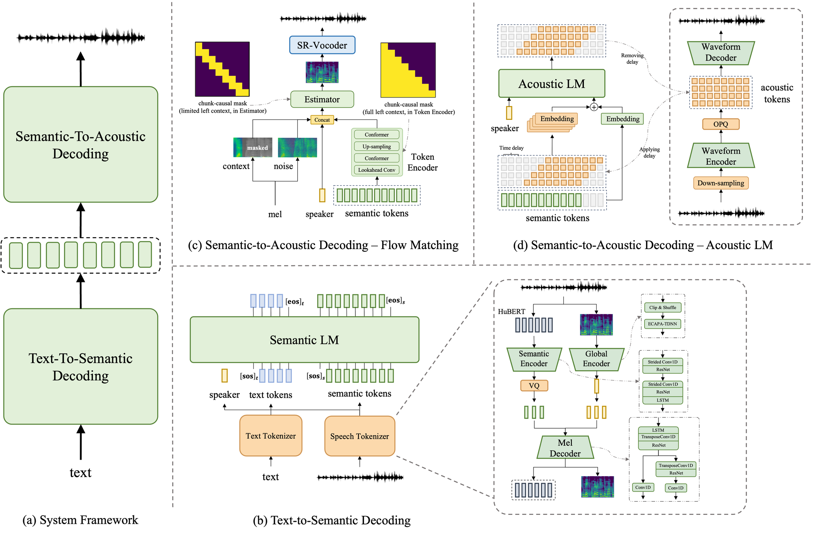

*Figure 1 · [Source](https://arxiv.org/abs/2503.20499)*

### FireRedTTS-2

FireRedTTS-2 models chronological sequences of speaker-labeled text and speech using a large Transformer plus a smaller codebook decoder. A low-rate streaming tokenizer reduces the number of audio steps. It targets long conversations and podcasts where speaker changes, turn-specific delivery and continuity across utterances matter.

[Paper](https://arxiv.org/abs/2509.02020) · [GitHub](https://github.com/FireRedTeam/FireRedTTS2) · [Details](models/token-lm.md#fireredtts-2)

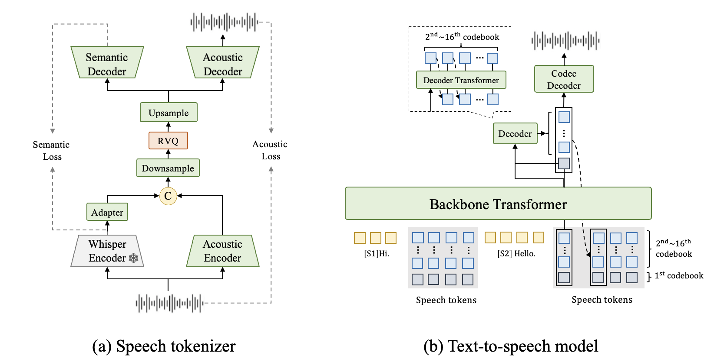

*Figure 1 · [Source](https://arxiv.org/abs/2509.02020)*

### FireRedTTS3

FireRedTTS3 uses a semantically supervised audio autoencoder to make continuous speech representations easier to predict. The Base variant provides multilingual reference cloning; the Instruct variant adds natural-language voice design and editing of spoken content or acoustic attributes.

[Paper](https://arxiv.org/abs/2608.17492) · [GitHub](https://github.com/FireRedTeam/FireRedTTS3) · [Details](models/continuous-lm.md#fireredtts3)

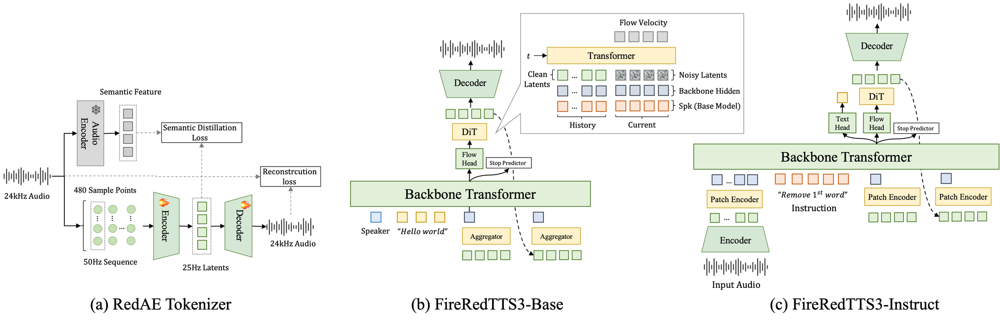

*Figure 1 · [Source](https://arxiv.org/abs/2608.17492)*

### Fish Audio S1 / OpenAudio S1

The S1 family combines multilingual voice conditioning with explicit markers for emotion, tone and nonverbal sounds. Its full model and distilled S1-mini offer different deployment sizes, with reinforcement learning used to refine generation. It is suited to expressive narration and character dialogue, although access and capabilities depend on the selected release.

[Model card](https://huggingface.co/fishaudio/s1-mini) · [Details](models/token-lm.md#openaudio-s1)

*Editorial input/output diagram · [Source](https://huggingface.co/fishaudio/s1-mini)*

### Fish Audio S2

Fish Audio S2 extends the Fish speech-model line with natural-language delivery instructions and multi-speaker, multi-turn synthesis. Its training pipeline uses speech descriptions, quality assessment and reward modeling to improve controllability. The released inference stack supports streaming, making the model relevant to both scripted audio production and incremental spoken responses.

[Paper](https://arxiv.org/abs/2603.08823) · [GitHub](https://github.com/fishaudio/fish-speech) · [Details](models/token-lm.md#fish-audio-s2)

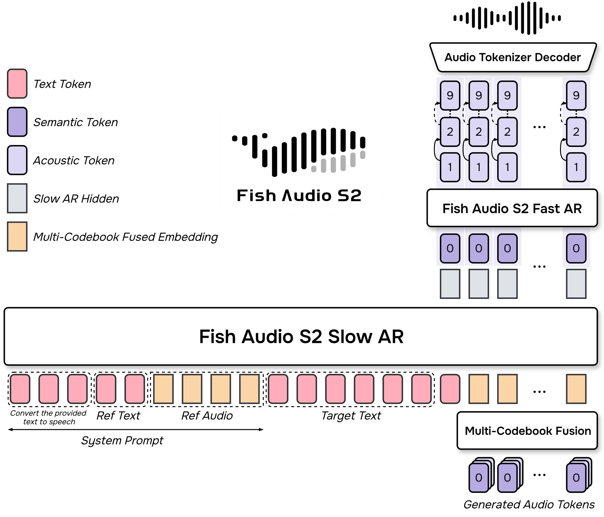

*Figure 2 · [Source](https://arxiv.org/abs/2603.08823)*

### Fish Speech

Dual-autoregressive slow/fast transformers.

[Paper](https://arxiv.org/abs/2411.01156) · [GitHub](https://github.com/fishaudio/fish-speech) · [Details](models/token-lm.md#fish-speech)

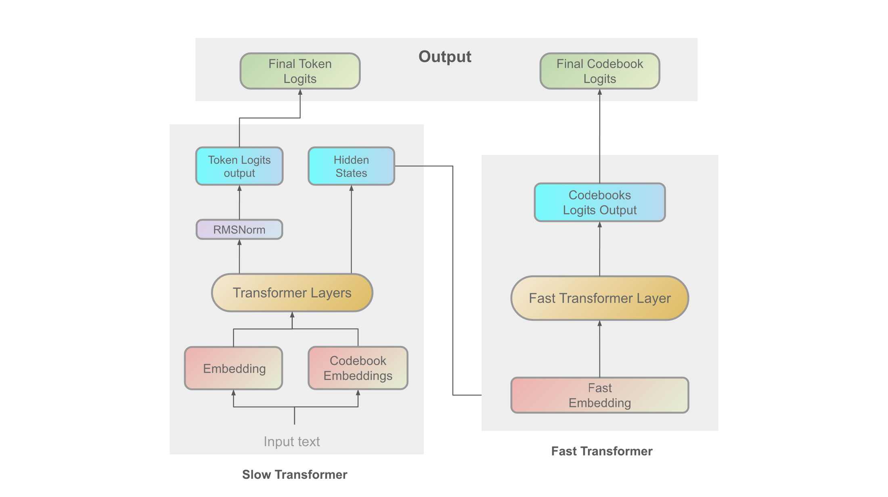

*Figure 2 · [Source](https://arxiv.org/abs/2411.01156)*

### Flamed-TTS

Flamed-TTS combines representations of different speech attributes in an attention-free generator. Its reformulated flow-matching process targets efficient zero-shot synthesis with flexible pacing and reduced sequential computation.

[Paper](https://arxiv.org/abs/2510.02848) · [Project](https://flamed-tts.github.io) · GitHub: no author-linked repository found · [Details](models/diffusion.md#flamed-tts)

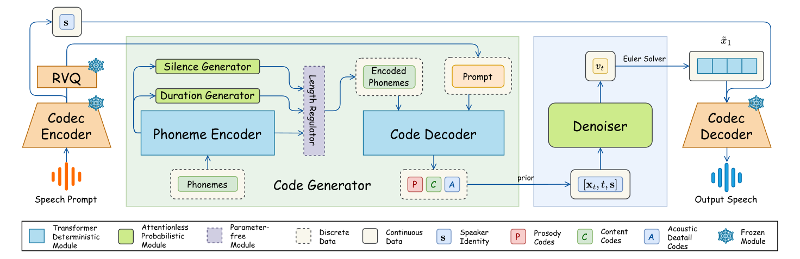

*Figure 1 · [Source](https://arxiv.org/abs/2510.02848)*

### FlashTTS

FlashTTS processes incoming text and speech context on staggered tracks so synthesis can begin before sentence completion. Multi-token prediction accelerates the language model, while a distilled acoustic decoder reduces waveform-generation delay.

[Paper](https://arxiv.org/abs/2606.09141) · [GitHub](https://github.com/ASLP-lab/FlashTTS) · [Project](https://aslp-lab.github.io/flashtts_demo) · [Details](models/token-lm.md#flashtts)

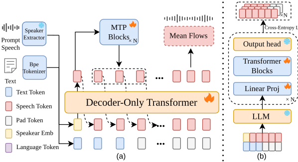

*Figure 1 · [Source](https://arxiv.org/abs/2606.09141)*

### FleSpeech

FleSpeech unifies text, voice recordings and visual prompts into a common conditioning representation. Its multistage generator uses those controls to manipulate voice and delivery attributes flexibly rather than requiring one fixed prompt modality.

[Paper](https://arxiv.org/abs/2501.04644) · [Project](https://kkksuper.github.io/FleSpeech/) · GitHub: no author-linked repository found · [Details](models/token-lm.md#flespeech)

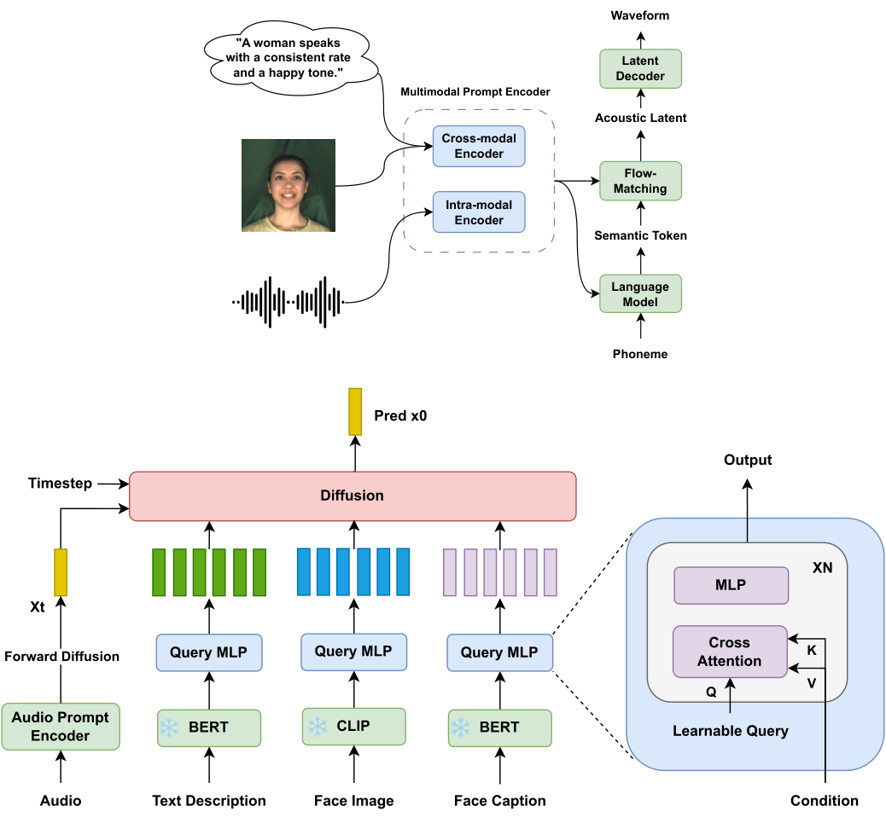

*Figure 2 · [Source](https://arxiv.org/abs/2501.04644)*

### FlexiVoice

FlexiVoice accepts an optional style instruction and an optional reference voice alongside the target text. Progressive preference training teaches the model to follow both conditions while reducing unwanted coupling between wording, speaker identity and delivery.

[Paper](https://arxiv.org/abs/2601.04656) · [Project](https://flexi-voice.github.io) · GitHub: no author-linked repository found · [Details](models/token-lm.md#flexivoice)

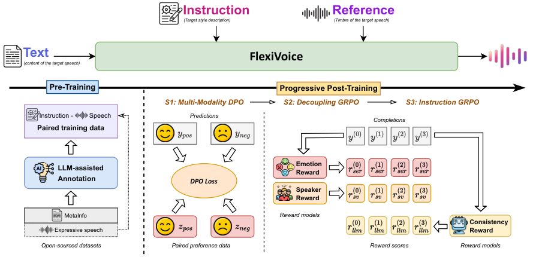

*Figure 1 · [Source](https://arxiv.org/abs/2601.04656)*

### FlexSpeech

FlexSpeech separates timing control from the acoustic synthesis component to balance stable pronunciation and natural expression. A small set of style examples can adapt the duration module without retraining the full generator, supporting efficient delivery customization.

[Paper](https://arxiv.org/abs/2505.05159) · [Project](https://flexspeech.github.io/DEMO/) · GitHub: no author-linked repository found · [Details](models/diffusion.md#flexspeech)

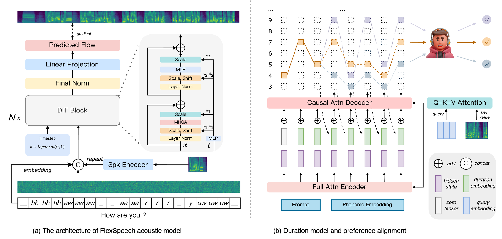

*Figure 1 · [Source](https://arxiv.org/abs/2505.05159)*

### Flowtron

Autoregressive normalizing flows over mel spectrograms.

[Paper](https://arxiv.org/abs/2005.05957) · [Details](models/flow-vae.md#flowtron)

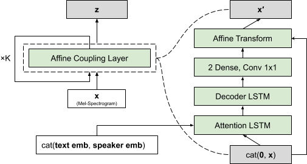

*Figure 1 · [Source](https://arxiv.org/abs/2005.05957)*

### FNH-TTS

FNH-TTS routes linguistic and speaker information through several duration experts to model varied timing patterns. It combines this predictor with changes to waveform generation, aiming for robust end-to-end speech synthesis across voices and prosodic conditions.

[Paper](https://arxiv.org/abs/2508.12001) · GitHub: no author-linked repository found · [Details](models/flow-vae.md#fnh-tts)

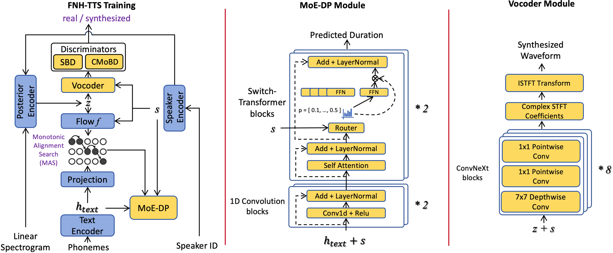

*Figure 1 · [Source](https://arxiv.org/abs/2508.12001)*

### Frame-stacked local Transformer TTS

This architecture lets a global language model predict several speech frames at a time and delegates their codec entries to a smaller local Transformer. The paper compares sequential local decoding with iterative masked prediction, showing how frame stacking changes the trade-off between synthesis throughput and acoustic fidelity.

[Paper](https://arxiv.org/abs/2509.19592) · GitHub: no author-linked repository found · [Details](models/token-lm.md#frame-stacked-local-transformer-tts)

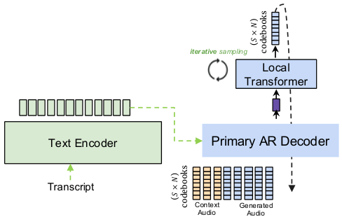

*Figure 1 · [Source](https://arxiv.org/abs/2509.19592)*

### FreyaTTS

FreyaTTS is a Turkish-focused non-autoregressive synthesizer that maps character sequences to continuous audio latents. A frozen waveform autoencoder reconstructs the speech, while duration prediction and voice-focused post-training support efficient conversational playback without phoneme or discrete speech tokenization.

[Paper](https://arxiv.org/abs/2607.09530) · GitHub: no author-linked repository found · [Details](models/diffusion.md#freyatts)

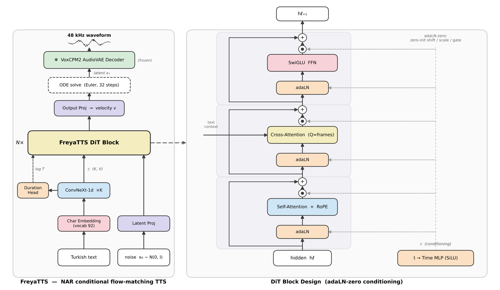

*Figure 1 · [Source](https://arxiv.org/abs/2607.09530)*

### Gemini 2.5 TTS

Gemini 2.5 TTS converts supplied text into speech with prompt-based control of accent, pace, style and emotion. The Flash and Pro interfaces support single-speaker narration and two-speaker scripts with separately assigned voices. These are dedicated speech-generation endpoints; their internal acoustic architecture is not fully disclosed in the public documentation.

[Docs 1](https://ai.google.dev/gemini-api/docs/models/gemini-2.5-flash-preview-tts) · [Docs 2](https://ai.google.dev/gemini-api/docs/models/gemini-2.5-pro-preview-tts) · [Docs 3](https://ai.google.dev/gemini-api/docs/speech-generation) · [Details](models/api.md#gemini-2-5-tts)

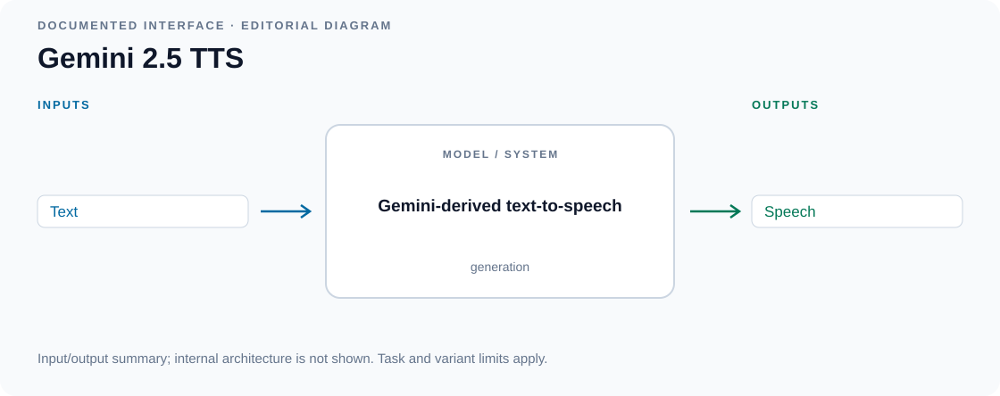

*Editorial input/output diagram · [Source](https://ai.google.dev/gemini-api/docs/models/gemini-2.5-flash-preview-tts)*

### Gemini 3.1 Flash TTS

Gemini 3.1 Flash TTS adds expressive audio tags to prompt-steered speech generation, giving authors more local control over narration and delivery. It targets natural, responsive multilingual synthesis through a managed API. The public preview documentation describes the interface and controls, without enough architectural detail to reconstruct the underlying speech generator.

[Docs 1](https://ai.google.dev/gemini-api/docs/models/gemini-3.1-flash-tts-preview) · [Docs 2](https://ai.google.dev/gemini-api/docs/speech-generation) · [Details](models/api.md#gemini-3-1-flash-tts)

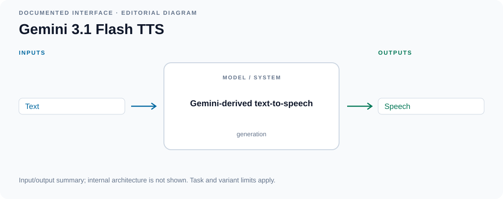

*Editorial input/output diagram · [Source](https://ai.google.dev/gemini-api/docs/models/gemini-3.1-flash-tts-preview)*

### GibbsTTS

GibbsTTS generates discrete speech tokens through a continuous-time jump process. Metric-aware transition scheduling and a finite-step correction improve how token states evolve, supporting zero-shot voice synthesis with discrete flow matching.

[Paper](https://arxiv.org/abs/2605.09386) · [GitHub](https://github.com/ydqmkkx/GibbsTTS) · [Project](https://ydqmkkx.github.io/GibbsTTSProject) · [Details](models/token-lm.md#gibbstts)

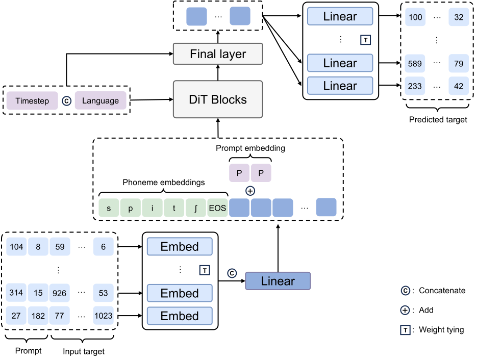

*Figure 1 · [Source](https://arxiv.org/abs/2605.09386)*

### GLM-TTS

GLM-TTS first predicts speech tokens autoregressively, then converts them into audio with a diffusion decoder. Pitch-aware tokenization and multi-reward reinforcement learning target pronunciation, speaker similarity and expression. Hybrid phoneme/text input and LoRA voice adaptation provide controls for applications that need repeatable pronunciation and customized voices.

[Paper](https://arxiv.org/abs/2512.14291) · [GitHub](https://github.com/zai-org/GLM-TTS) · [Details](models/token-lm.md#glm-tts)

*Figure 1 · [Source](https://arxiv.org/abs/2512.14291)*

### Glow-TTS

Normalizing-flow acoustic model and monotonic alignment search.

[Paper](https://arxiv.org/abs/2005.11129) · [Details](models/flow-vae.md#glow-tts)

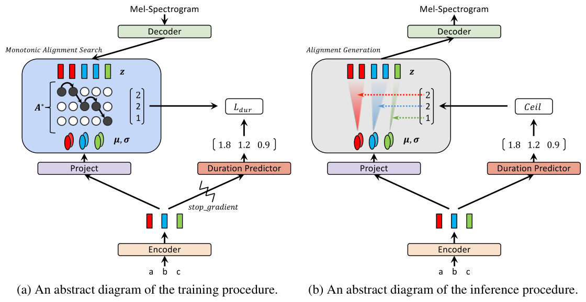

*Figure 1, PDF p. 3 · [Source](https://arxiv.org/abs/2005.11129)*

### GOAT-TTS

GOAT-TTS encodes continuous voice information in one branch and predicts speech tokens in another. Partial language-model adaptation preserves textual knowledge, while multi-token prediction supports streaming synthesis with reference-based paralinguistic conditioning.

[Paper](https://arxiv.org/abs/2504.12339) · GitHub: no author-linked repository found · [Details](models/token-lm.md#goat-tts)

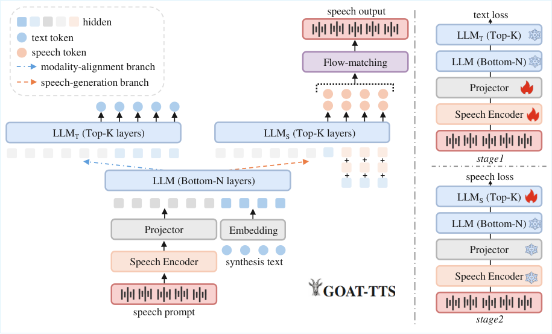

*Figure 1 · [Source](https://arxiv.org/abs/2504.12339)*

### GPA

General-Purpose Audio uses one autoregressive backbone to predict discrete speech tokens across synthesis, recognition and conversion tasks. Its TTS path combines target text with voice context, with shared multitask training and scalable inference.

[Paper](https://arxiv.org/abs/2601.10770) · [GitHub](https://github.com/AutoArk/GPA) · [Details](models/token-lm.md#gpa)

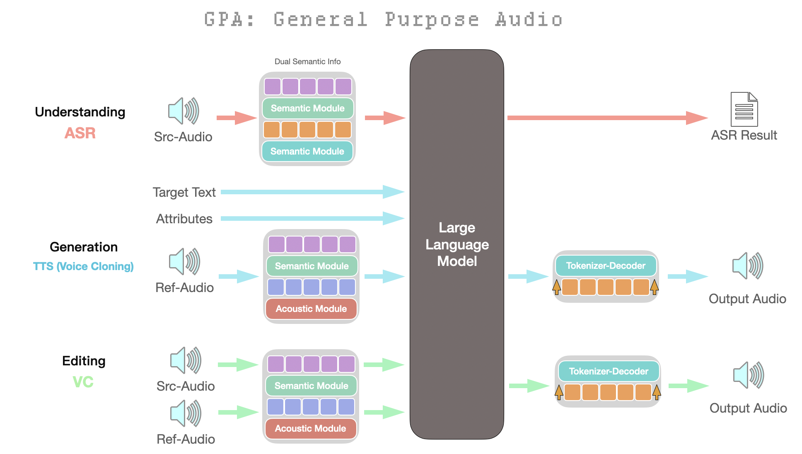

*Figure 1 · [Source](https://arxiv.org/abs/2601.10770)*

### GPT-4o Mini TTS

GPT-4o Mini TTS combines the text to be spoken with instructions that steer accent, speed, tone and emotional delivery. The Speech API can stream audio before the full result is complete and supports several output formats. It provides a managed synthesis component for narration and voice applications; public documentation does not disclose the complete acoustic architecture.

[Docs 1](https://developers.openai.com/api/docs/models/gpt-4o-mini-tts) · [Docs 2](https://developers.openai.com/api/docs/guides/text-to-speech) · [Details](models/api.md#gpt-4o-mini-tts)

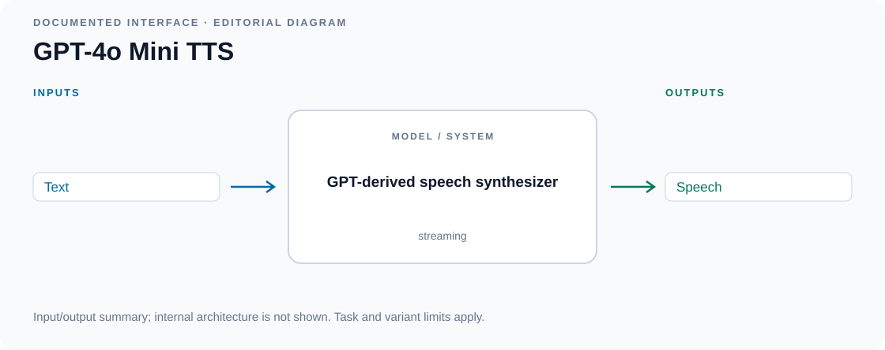

*Editorial input/output diagram · [Source](https://developers.openai.com/api/docs/models/gpt-4o-mini-tts)*

### GPT-SoVITS

GPT-SoVITS couples text-to-semantic token prediction with a reference-conditioned speech decoder. Its 2025 V3, V4 and V2 Pro releases extend a workflow that supports both zero-shot synthesis and voice adaptation from a small training set. The surrounding WebUI helps prepare data, while recognition and source-separation utilities remain separate components.

[GitHub](https://github.com/RVC-Boss/GPT-SoVITS) · [Docs](https://github.com/RVC-Boss/GPT-SoVITS/blob/main/docs/en/Changelog_EN.md) · [Details](models/token-lm.md#gpt-sovits)

*Editorial input/output diagram · [Source](https://github.com/RVC-Boss/GPT-SoVITS)*

### Grad-TTS

Score-based diffusion decoder and monotonic alignment search.

[Paper](https://arxiv.org/abs/2105.06337) · [Details](models/diffusion.md#grad-tts)

*Figure 2 · [Source](https://arxiv.org/abs/2105.06337)*

### GRAFT

GRAFT attaches codec tokens from a spoken word example to that word's location in the text prompt. Separate target-speaker conditioning allows the pronunciation hint to come from another voice while the synthesized sentence retains the desired speaker.

[Paper](https://arxiv.org/abs/2607.02633) · GitHub: no author-linked repository found · [Details](models/token-lm.md#graft)

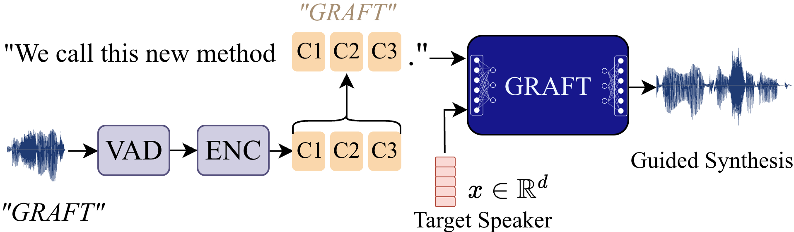

*Paper figure · [Source](https://arxiv.org/abs/2607.02633)*

### GSA-TTS

GSA-TTS extracts local style information at successive levels and combines it through attention into a global reference condition. This richer style representation guides the acoustic model when synthesizing an unseen speaker's voice.

[Paper](https://arxiv.org/abs/2505.19384) · GitHub: no author-linked repository found · [Details](models/parallel.md#gsa-tts)

*Figure 1 · [Source](https://arxiv.org/abs/2505.19384)*

### GST-Tacotron

Tacotron with a reference encoder and global style tokens.

[Paper](https://arxiv.org/abs/1803.09017) · [Details](models/autoregressive.md#gst-tacotron)

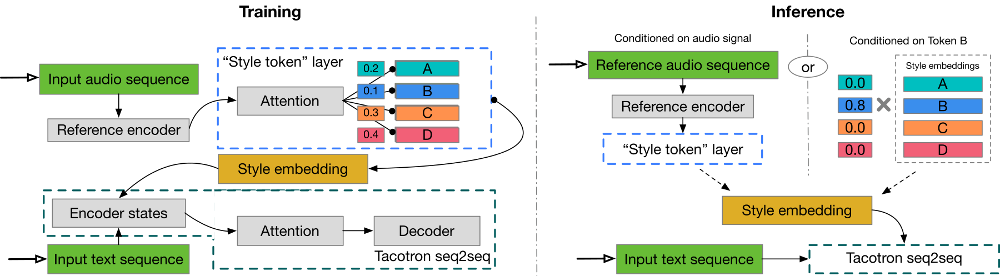

*Figure 1 · [Source](https://arxiv.org/abs/1803.09017)*

### Habibi

Habibi trains an Arabic synthesizer progressively from standard language to regional dialects using curated public speech. It targets zero-shot voice cloning across dialects and reading without mandatory diacritic marks.

[Paper](https://arxiv.org/abs/2601.13802) · [GitHub](https://github.com/SWivid/Habibi-TTS) · [Project](https://SWivid.github.io/Habibi/) · [Details](models/diffusion.md#habibi)

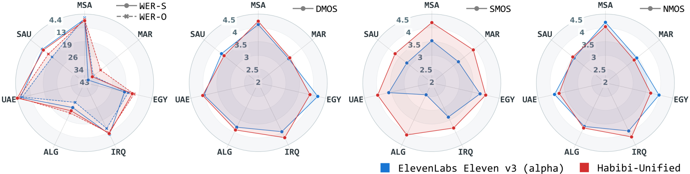

*Figure 1 · [Source](https://arxiv.org/abs/2601.13802)*

### HD-PPT

HD-PPT learns speech codes that distinguish spoken content from instruction-related preferences. A language model predicts semantic information, expressive style and acoustic detail in sequence, improving the mapping from natural-language requests to controllable speech.

[Paper](https://arxiv.org/abs/2509.19001) · GitHub: no author-linked repository found · [Details](models/token-lm.md#hd-ppt)

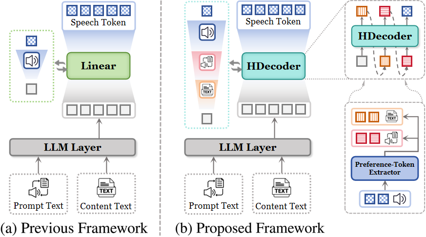

*Figure 1 · [Source](https://arxiv.org/abs/2509.19001)*

### Higgs Audio v2

Higgs Audio v2 combines interleaved text/audio modeling with a unified speech tokenizer and DualFFN layers for acoustic prediction. Reference clips and scene context influence voices, while text context shapes prosody across narration and multi-speaker scripts. The generation checkpoint covers synthesis; the separate understanding branch in the family diagram is not another output mode of this checkpoint.

[Model card](https://huggingface.co/bosonai/higgs-audio-v2-generation-3B-base) · [Details](models/token-lm.md#higgs-audio-v2)

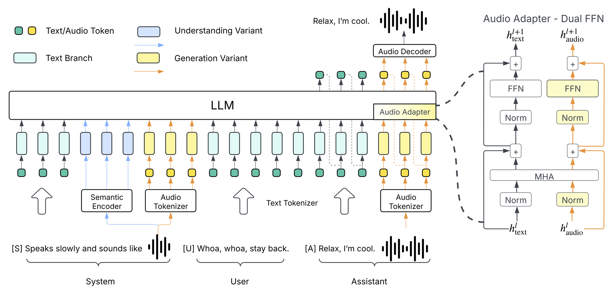

*Official architecture diagram · [Source](https://huggingface.co/bosonai/higgs-audio-v2-generation-3B-base)*

### Higgs Audio v2.5

Higgs Audio v2.5, now documented as Higgs TTS 2.5, reduces the autoregressive audio Transformer to 1B parameters. GRPO-based alignment and a curated voice dataset refine pronunciation, cloning and expressive control tags. It targets production narration and conversational speech with lower computational requirements than the preceding 3B generation model.

[Announcement](https://www.boson.ai/blog/higgs-audio-v2.5) · [Details](models/token-lm.md#higgs-audio-v2-5)

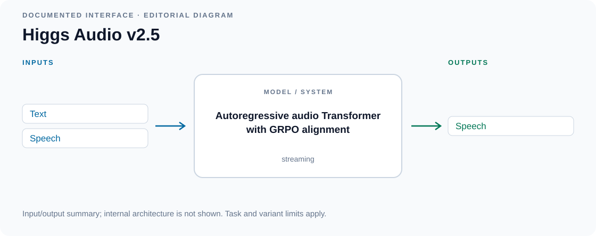

*Editorial input/output diagram · [Source](https://www.boson.ai/blog/higgs-audio-v2.5)*

### Higgs Audio v3 TTS

Higgs TTS 3 uses an autoregressive decoder over interleaved text and eight speech codebooks, with a delay pattern and fused input/output projections. Reference audio establishes a voice, while inline tokens control emotion, style, pauses and sound effects. The 4B release targets multilingual conversational speech and expressive response rendering.

[Model card](https://huggingface.co/bosonai/higgs-tts-3-4b) · [Details](models/token-lm.md#higgs-audio-v3-tts)

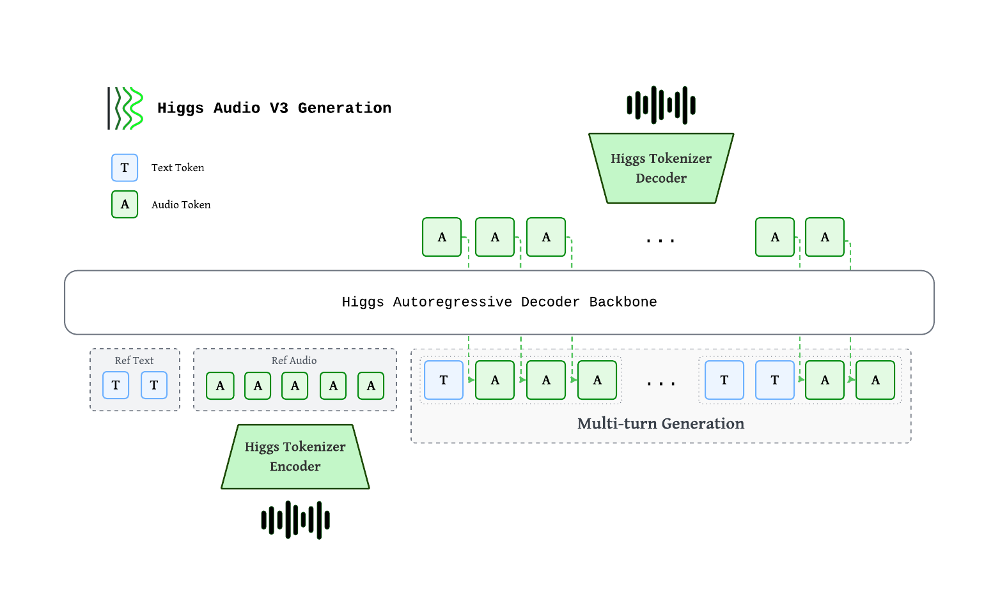

*Official architecture diagram · [Source](https://huggingface.co/bosonai/higgs-tts-3-4b)*

### HiStyle

HiStyle predicts a voice's timbre first and finer delivery attributes afterward from textual descriptions. Contrastive text-audio alignment organizes these style representations before they condition a speech synthesizer.

[Paper](https://arxiv.org/abs/2509.25842) · GitHub: no author-linked repository found · [Details](models/diffusion.md#histyle)

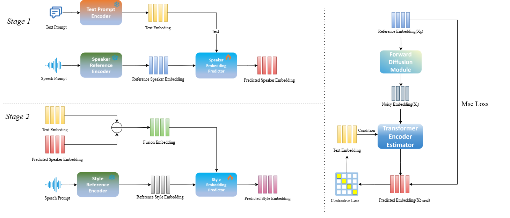

*Figure 2 · [Source](https://arxiv.org/abs/2509.25842)*

### HoliDubber

HoliDubber conditions audio generation on video and a text prompt describing speech and sound effects. A causal model plans successive latent patches and a local diffusion Transformer generates their detail, supporting synchronized dubbing within complex acoustic scenes.

[Paper](https://arxiv.org/abs/2606.09098) · [Project](https://holidubber.github.io) · GitHub: no author-linked repository found · [Details](models/continuous-lm.md#holidubber)

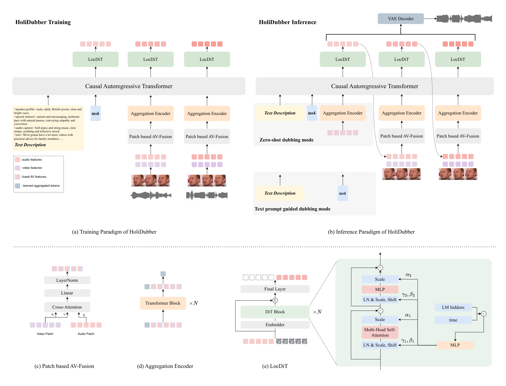

*Figure 2 · [Source](https://arxiv.org/abs/2606.09098)*

### HoliTok (TTS)

HoliTok combines linguistic and acoustic information in a continuous representation designed for both understanding and generation. Its downstream autoregressive model and diffusion decoder demonstrate a text-to-speech path using the same latents employed for recognition.

[Paper](https://arxiv.org/abs/2605.29948) · [GitHub](https://github.com/bovod-sjtu/HoliTok) · [Details](models/continuous-lm.md#holitok-tts)

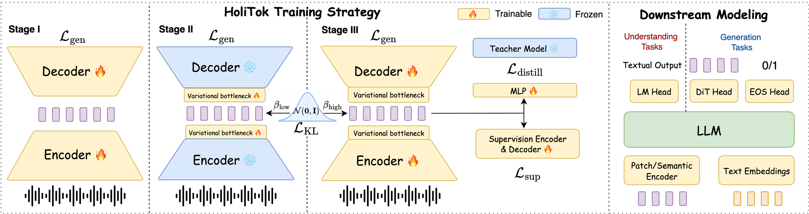

*Figure 1 · [Source](https://arxiv.org/abs/2605.29948)*

### Hume Octave TTS

Octave uses text context and acting instructions to adjust pronunciation, emphasis, tempo and emotional delivery. Its API supports voice creation from descriptions, voice cloning and continuation across longer passages. Octave 1 and the Octave 2 preview have different feature coverage; the public interface is documented more fully than the internal speech-model architecture.

[Docs](https://dev.hume.ai/docs/text-to-speech-tts/overview) · [Details](models/api.md#hume-octave-tts)

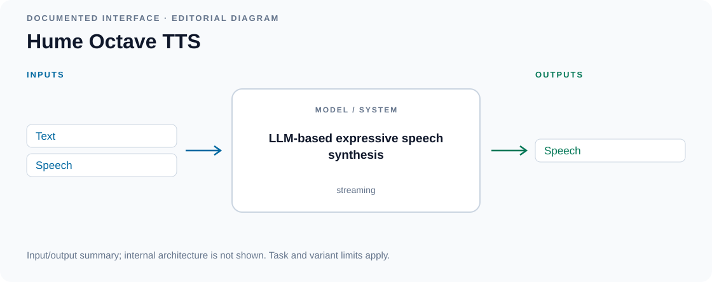

*Editorial input/output diagram · [Source](https://dev.hume.ai/docs/text-to-speech-tts/overview)*

### ImmersiveTTS

ImmersiveTTS jointly models spoken content and its surrounding acoustic scene in a multimodal diffusion Transformer. Speech and general-audio representations provide complementary training signals, helping generated wording remain intelligible within the requested environmental context.

[Paper](https://arxiv.org/abs/2605.30965) · [GitHub](https://github.com/immersivetts/ImmersiveTTS) · [Project](https://jjunak-yun.github.io/ImmersiveTTS) · [Details](models/diffusion.md#immersivetts)

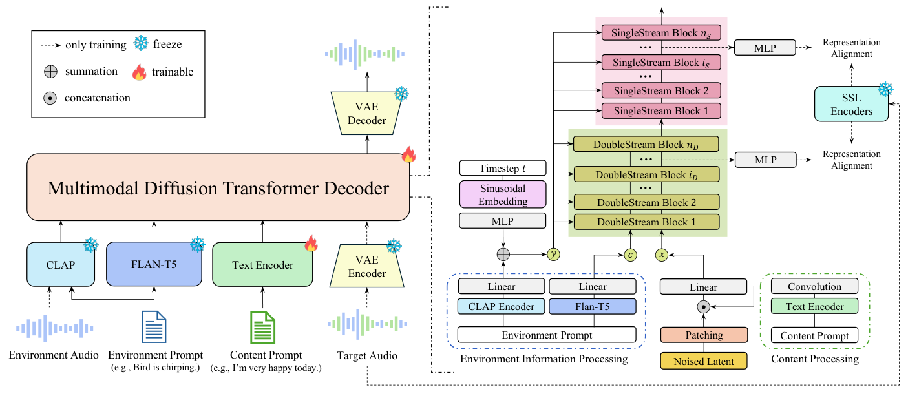

*Figure 1 · [Source](https://arxiv.org/abs/2605.30965)*

### IndexTTS

IndexTTS adapts the XTTS/Tortoise approach with a Conformer reference encoder and a BigVGAN2 speech decoder. Hybrid character/pinyin input gives explicit control over difficult Chinese pronunciations. Its central use case is zero-shot voice cloning with predictable text rendering, including content that benefits from pronunciation correction.

[Paper](https://arxiv.org/abs/2502.05512) · [GitHub](https://github.com/index-tts/index-tts) · [Project](https://index-tts.github.io) · [Details](models/token-lm.md#indextts)

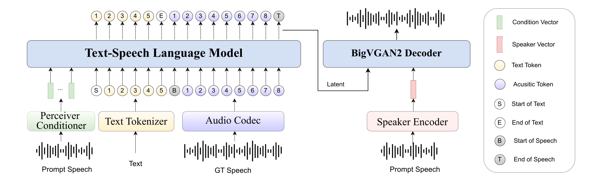

*Figure 1 · [Source](https://arxiv.org/abs/2502.05512)*

### IndexTTS 2.5

IndexTTS 2.5 shortens semantic sequences with a lower-rate codec and replaces the acoustic module's backbone with a Zipformer design. Multilingual training strategies and reinforcement learning extend pronunciation and emotion transfer across languages. It retains reference-based voice conditioning while reducing the cost of semantic and acoustic generation.

[Paper](https://arxiv.org/abs/2601.03888) · [GitHub](https://github.com/index-tts/index-tts) · [Details](models/token-lm.md#indextts-2-5)

*Figure 1 · [Source](https://arxiv.org/abs/2601.03888)*

### IndexTTS2

IndexTTS2 separates speaker identity from emotional style so that different references can control timbre and delivery. Its autoregressive formulation also supports explicit output-token budgeting for duration control, alongside unconstrained generation. These mechanisms are intended for expressive speech and timing-sensitive work such as dubbing; availability of controls should be checked in the chosen implementation.

[Paper](https://arxiv.org/abs/2506.21619) · [GitHub](https://github.com/index-tts/index-tts) · [Details](models/token-lm.md#indextts2)

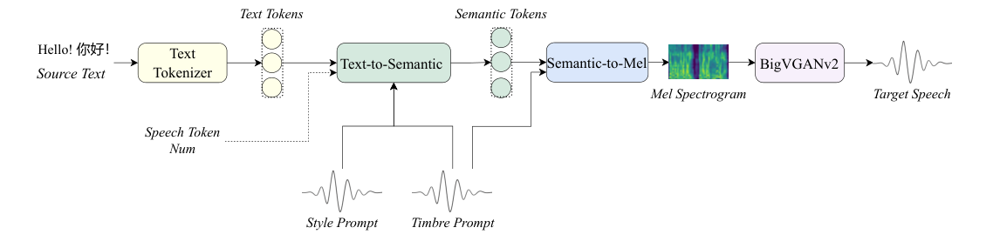

*Figure 1 · [Source](https://arxiv.org/abs/2506.21619)*

### InstructAudio

InstructAudio combines natural-language instructions with phonemes or lyrics in a common generation format. Joint and single-stream diffusion layers synthesize speech or music while controlling attributes such as voice, emotion, accent or musical character.

[Paper](https://arxiv.org/abs/2511.18487) · [Project](https://qiangchunyu.github.io/InstructAudio/) · GitHub: no author-linked repository found · [Details](models/diffusion.md#instructaudio)

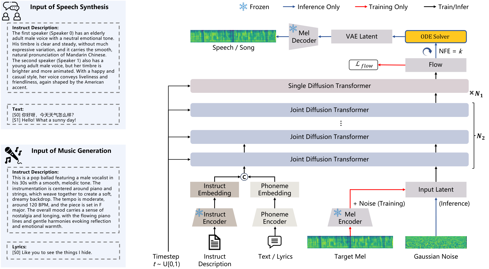

*Figure 2 · [Source](https://arxiv.org/abs/2511.18487)*

### IntMeanFlow

IntMeanFlow distills a flow-based speech generator to predict integrated acoustic updates over larger intervals. A search for effective sampling steps further reduces decoding work, enabling reference-conditioned synthesis with fewer iterative refinements.

[Paper](https://arxiv.org/abs/2510.07979) · [Project](https://vvwangvv.github.io/intmeanflow) · GitHub: no author-linked repository found · [Details](models/diffusion.md#intmeanflow)

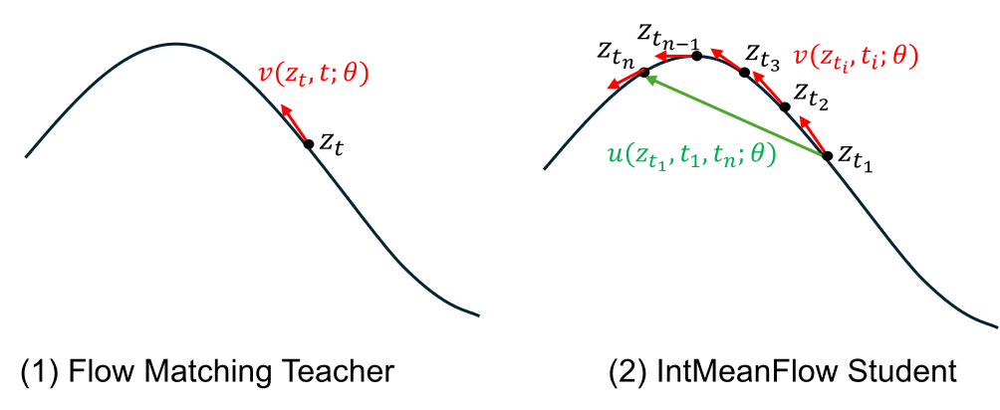

*Figure 1 · [Source](https://arxiv.org/abs/2510.07979)*

### Inworld TTS-1

Inworld TTS-1 and TTS-1-Max are multilingual autoregressive synthesizers designed for low-latency speech output. Textual audio markup controls emotions and nonverbal vocalizations, with model variants offering different capacity and inference-cost trade-offs.

[Paper](https://arxiv.org/abs/2507.21138) · [GitHub](https://github.com/inworld-ai/tts) · [Details](models/token-lm.md#inworld-tts-1)

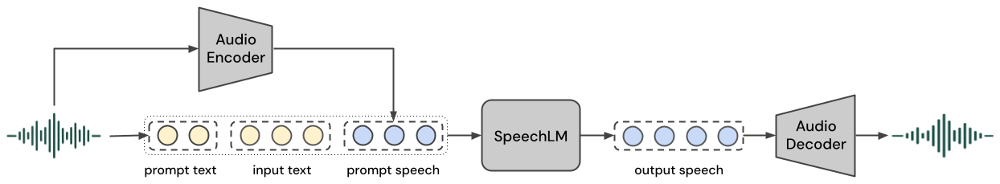

*Figure 1 · [Source](https://arxiv.org/abs/2507.21138)*

### JaiTTS

JaiTTS continually trains a VoxCPM-derived synthesizer on Thai-centered speech data. Its semantic planning, residual acoustic modeling and local diffusion decoding retain reference-based voice cloning while targeting fluent Thai pronunciation and delivery.

[Paper](https://arxiv.org/abs/2604.27607) · [GitHub](https://github.com/JTS-AI-Team/JaiTTS) · [Details](models/continuous-lm.md#jaitts)

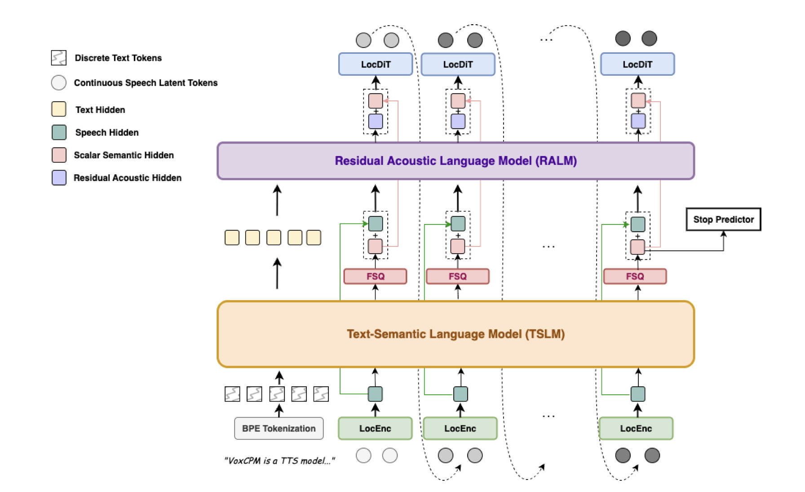

*Figure 1 · [Source](https://arxiv.org/abs/2604.27607)*

### JAM-Flow

JAM-Flow couples audio and motion diffusion modules within a shared model. Text, voice references and optional motion conditions support synchronized speech and facial movement, with an infilling objective allowing several conditioning combinations.

[Paper](https://arxiv.org/abs/2506.23552) · GitHub: no author-linked repository found · [Details](models/diffusion.md#jam-flow)

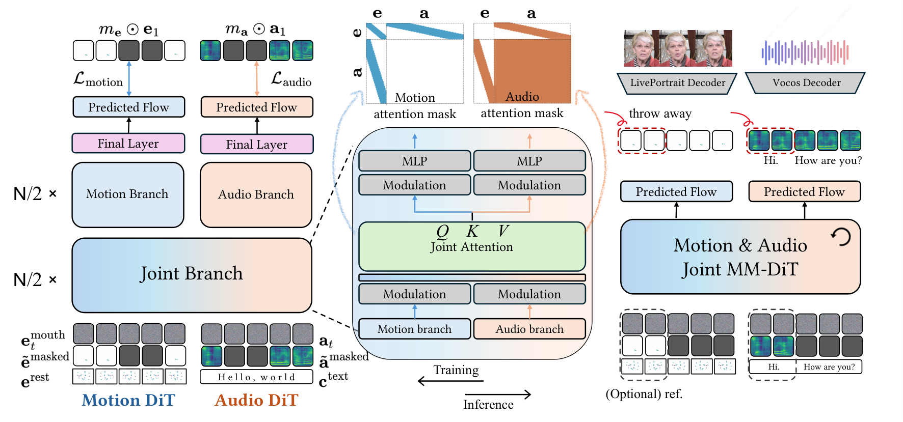

*Figure 3 · [Source](https://arxiv.org/abs/2506.23552)*

### JELLY

JELLY combines an emotion-aware Q-Former with several partially adapted language-model modules. Joint emotion recognition and contextual reasoning guide a speech synthesizer toward responses whose delivery matches the conversation.

[Paper](https://arxiv.org/abs/2501.04904) · [GitHub](https://github.com/jh-cha-prml/JELLY) · [Project](https://jh-cha-prml.github.io/JELLY) · [Details](models/token-lm.md#jelly)

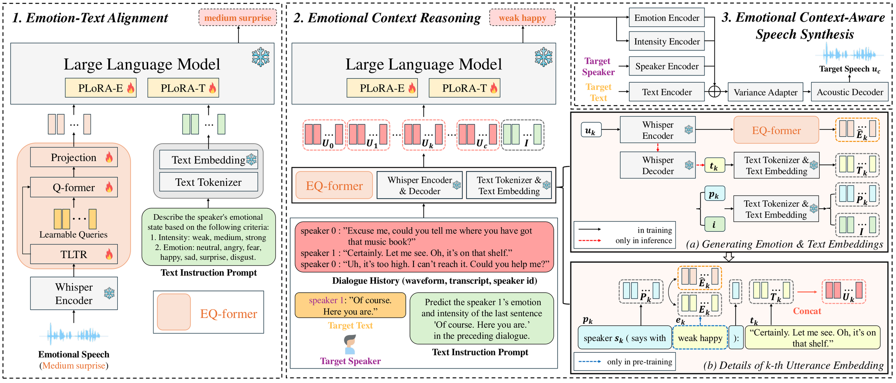

*Paper figure · [Source](https://arxiv.org/abs/2501.04904)*

### JETS

Joint FastSpeech 2 and HiFi-GAN with learned alignment.

[Paper](https://arxiv.org/abs/2203.16852) · [Details](models/parallel.md#jets)

*Figure 1, PDF p. 2 · [Source](https://arxiv.org/abs/2203.16852)*

### Joint non-autoregressive STT-TTS

This model handles text and speech within one non-autoregressive architecture. Its TTS path predicts acoustic output from text, and feeding partial predictions back into the model improves generation through iterative refinement while also supporting recognition training.

[Paper](https://arxiv.org/abs/2501.09104) · GitHub: no author-linked repository found · [Details](models/parallel.md#joint-non-autoregressive-stt-tts)

*Paper figure · [Source](https://arxiv.org/abs/2501.09104)*

### Joycent

Joycent separates accent information from speaker identity using an adversarially trained accent encoder. It injects accent and speaker features at different text-encoder layers, supporting accent-conditioned synthesis without requiring a separate accented phoneme prediction stage.

[Paper](https://arxiv.org/abs/2606.16417) · [GitHub](https://github.com/oshindow/Joycent-code) · [Project](https://oshindow.github.io/joycent/) · [Details](models/diffusion.md#joycent)

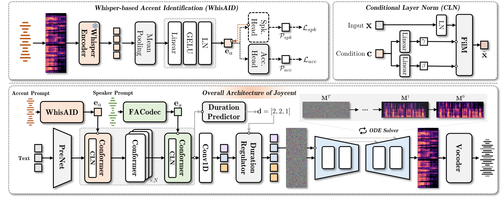

*Figure 1 · [Source](https://arxiv.org/abs/2606.16417)*

### JoyVoice

JoyVoice conditions long-form speech on speaker-labeled text and shared conversational context. Autoregressive hidden states feed an acoustic diffusion decoder, allowing multiple speakers, changing expression and more flexible turn boundaries within one synthesis system.

[Paper](https://arxiv.org/abs/2512.19090) · [Project](https://jea-speech.github.io/JoyVoice) · GitHub: no author-linked repository found · [Details](models/token-lm.md#joyvoice)

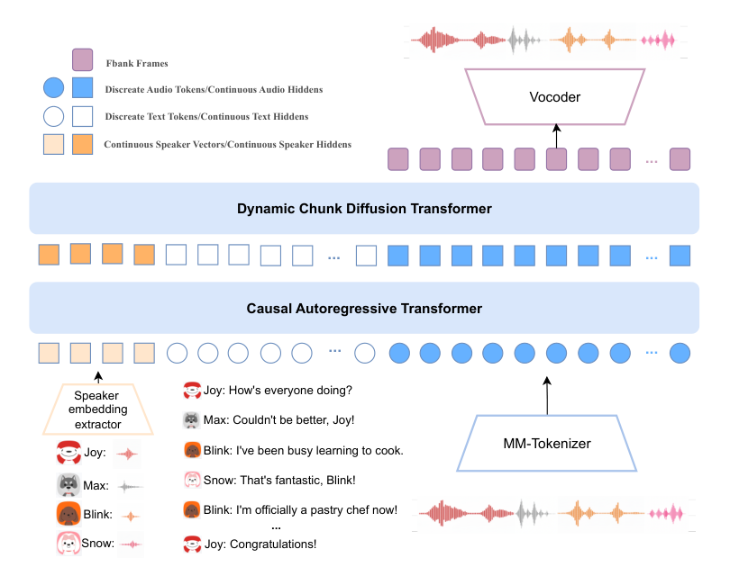

*Figure 2 · [Source](https://arxiv.org/abs/2512.19090)*

### KABURI-TTS

KABURI-TTS renders each participant on a separate audio channel from time-aligned phonemes and speaker activity. Supplying the timing layout explicitly lets the system synthesize overlapping speech, backchannels and interruptions for two-speaker conversations.

[Paper](https://arxiv.org/abs/2609.07200) · GitHub: no author-linked repository found · [Details](models/diffusion.md#kaburi-tts)

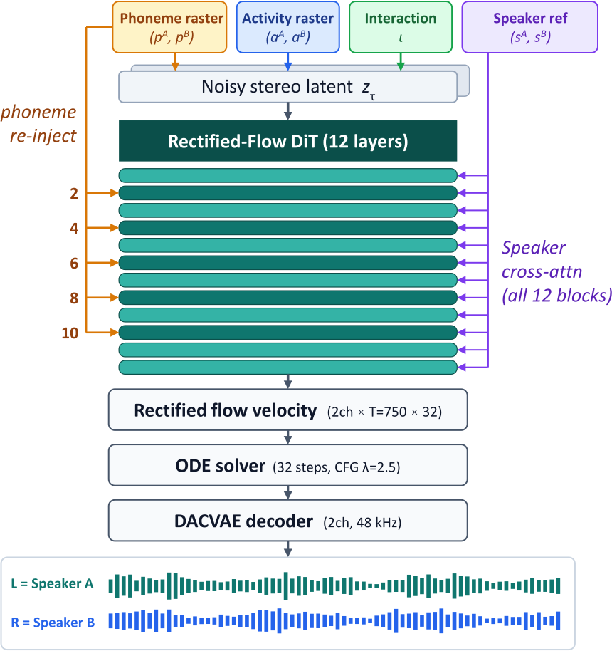

*Figure 1 · [Source](https://arxiv.org/abs/2609.07200)*

### KittenTTS

KittenTTS provides small ONNX speech models with built-in voices and adjustable playback speed. The Mini, Micro and Nano releases offer different size and inference tradeoffs for CPU-oriented applications. The official README documents usage more fully than internal acoustic design, so the catalog presents it as a compact synthesis family without asserting an undisclosed architecture.

[GitHub](https://github.com/KittenML/KittenTTS) · [Details](models/compact.md#kitten-tts)

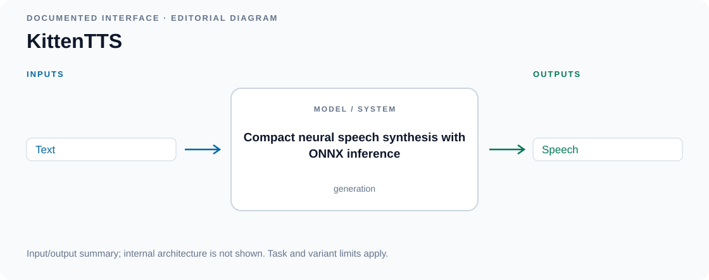

*Editorial input/output diagram · [Source](https://github.com/KittenML/KittenTTS)*

### Koel-TTS

Koel-TTS explores several ways to condition a Transformer synthesizer on text and reference audio. Automatic speech-recognition and speaker-verification feedback, together with classifier-free guidance, improve adherence to the requested words and voice.

[Paper](https://arxiv.org/abs/2502.05236) · [Project](https://koeltts.github.io/) · GitHub: no author-linked repository found · [Details](models/token-lm.md#koel-tts)

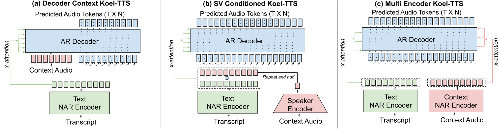

*Figure 1 · [Source](https://arxiv.org/abs/2502.05236)*

### Kokoro

Kokoro's 2025 v1.0 release uses a compact StyleTTS 2-derived decoder with an iSTFTNet waveform generator. The released model relies on preset voice representations and omits style diffusion and a reference encoder. It is suited to lightweight narration and application speech where a small synthesis model and ready-made voices are useful.

[Model card](https://huggingface.co/hexgrad/Kokoro-82M) · [Details](models/compact.md#kokoro)

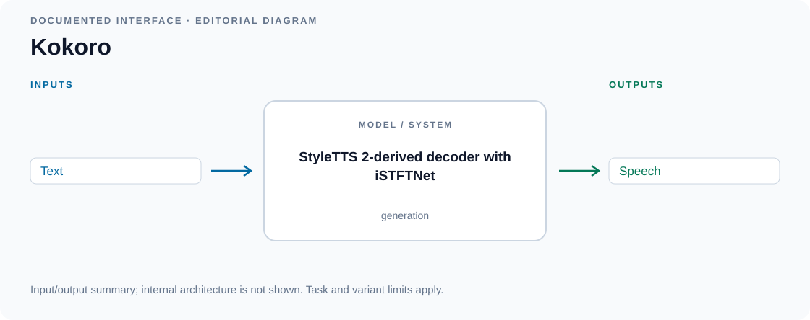

*Editorial input/output diagram · [Source](https://huggingface.co/hexgrad/Kokoro-82M)*

### Kyutai TTS (DSM)

Kyutai TTS treats text and speech as aligned streams separated by a controlled delay. A decoder-only language model can therefore emit audio as text arrives, instead of waiting for a complete utterance. This formulation supports incremental synthesis for voice interfaces and long streams, with speaker conditioning supplied through the TTS implementation.

[Paper](https://arxiv.org/abs/2509.08753) · [GitHub](https://github.com/kyutai-labs/delayed-streams-modeling) · [Details](models/token-lm.md#kyutai-tts-dsm)

*Figure 1 · [Source](https://arxiv.org/abs/2509.08753)*

### LanStyleTTS

LanStyleTTS standardizes phonetic inputs and introduces local style conditioning across languages. The framework can augment several parallel acoustic backbones, allowing one multilingual model to vary delivery at phoneme level.

[Paper](https://arxiv.org/abs/2504.08274) · GitHub: no author-linked repository found · [Details](models/parallel.md#lanstyletts)

*Paper figure · [Source](https://arxiv.org/abs/2504.08274)*

### LatinX

LatinX uses staged text-to-audio training, voice-cloning adaptation and automatic preference alignment. The resulting multilingual Transformer renders text in the source speaker's voice, supporting the synthesis stage of cross-language speech translation.

[Paper](https://arxiv.org/abs/2509.05863) · [Project](https://seu-usuario.github.io/latinx-demo) · GitHub: no author-linked repository found · [Details](models/token-lm.md#latinx)

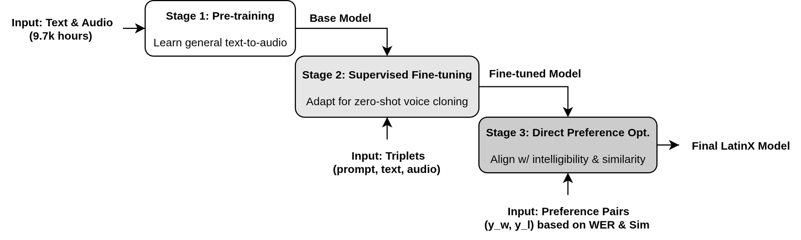

*Figure 1 · [Source](https://arxiv.org/abs/2509.05863)*

### LE2E-TTS

LE2E-TTS trains a compact text-to-waveform pipeline end to end rather than separately optimizing acoustic and waveform stages. It targets local devices where model size, response time and compute cost constrain deployment.

[Paper](https://arxiv.org/abs/2505.07701) · GitHub: no author-linked repository found · [Details](models/compact.md#le2e-tts)

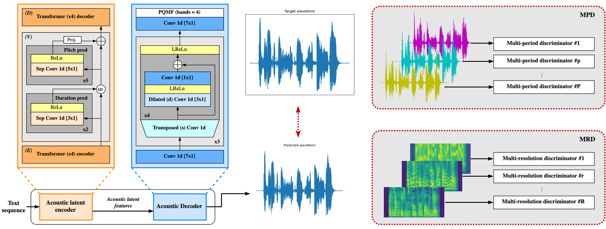

*Figure 1 · [Source](https://arxiv.org/abs/2505.07701)*

### LightSpeech

FastSpeech-derived architecture found by neural architecture search.

[Paper](https://arxiv.org/abs/2102.04040) · [Details](models/parallel.md#lightspeech)

*Editorial input/output diagram · [Source](https://arxiv.org/abs/2102.04040)*

### LLaDA-TTS

LLaDA-TTS adapts a speech language model to fill masked token sequences in parallel. Its bidirectional generation also supports inserting, replacing or deleting spoken words, combining reference-based TTS and speech editing through the same model.

[Paper](https://arxiv.org/abs/2603.26364) · GitHub: no author-linked repository found · [Details](models/token-lm.md#llada-tts)

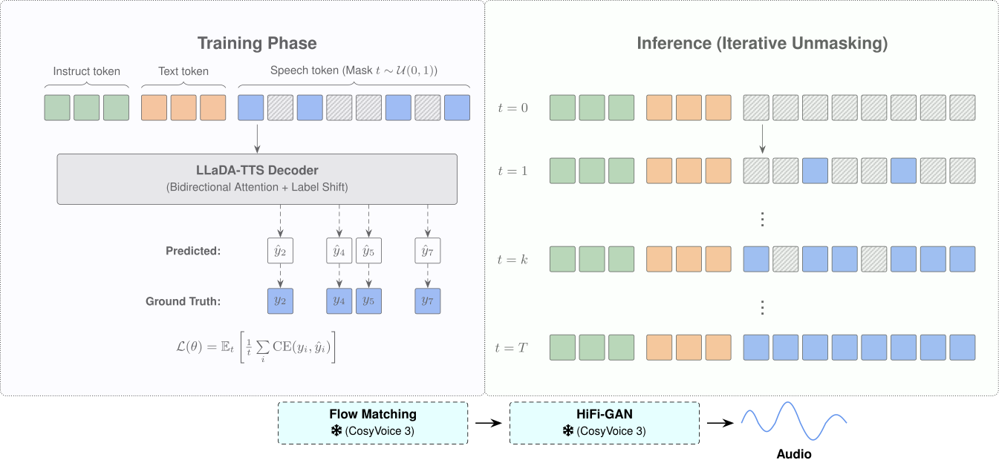

*Figure 1 · [Source](https://arxiv.org/abs/2603.26364)*

### Llasa

Llasa maps text and an optional speech prompt to a single stream of codec tokens using a Llama-style Transformer. The simple representation makes standard language-model scaling and sampling techniques applicable to synthesis. Its research also explores speech-model verifiers that select samples for content accuracy, voice consistency or emotional expression.

[Paper](https://arxiv.org/abs/2502.04128) · [GitHub](https://github.com/zhenye234/LLaSA_training) · [Project](https://llasatts.github.io/llasatts/) · [Details](models/token-lm.md#llasa)

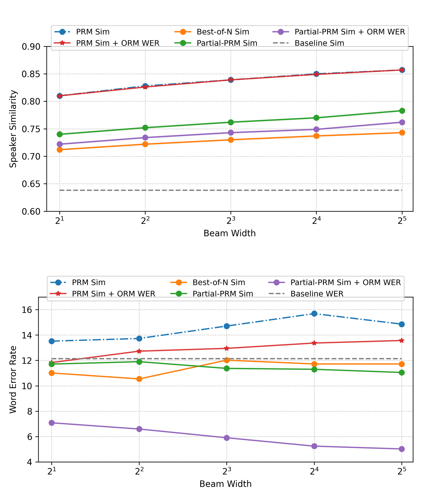

*Figure 2 · [Source](https://arxiv.org/abs/2502.04128)*

### Llasa+

Llasa+ adds multi-token prediction modules to a frozen Llasa backbone and checks their proposals with that backbone. A causal codec decoder turns accepted tokens into streaming audio. The resulting design addresses autoregressive latency while retaining the original speech model, making it relevant to systems that need incremental playback without retraining an entire backbone.

[Paper](https://arxiv.org/abs/2508.06262) · [GitHub](https://github.com/ASLP-lab/LLaSA_Plus) · [Details](models/token-lm.md#llasa-plus)

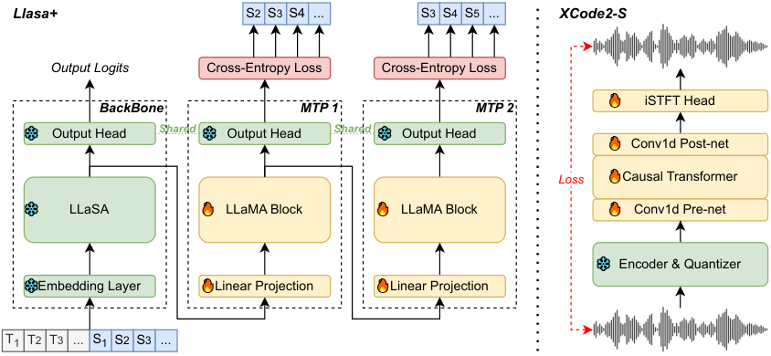

*Figure 1 · [Source](https://arxiv.org/abs/2508.06262)*

### LLMVoX

LLMVoX connects to an upstream language model through a streaming queue interface. Its small speech generator renders incoming text incrementally, allowing long conversations without tightly coupling the synthesizer to one particular language-model backbone.

[Paper](https://arxiv.org/abs/2503.04724) · [GitHub](https://github.com/mbzuai-oryx/LLMVoX) · [Project](https://mbzuai-oryx.github.io/LLMVoX) · [Details](models/token-lm.md#llmvox)

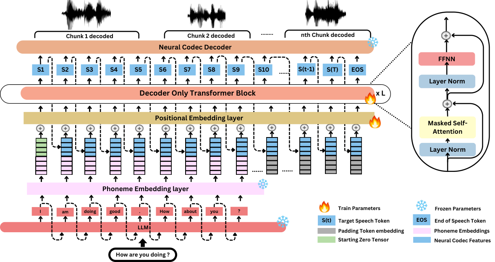

*Figure 2 · [Source](https://arxiv.org/abs/2503.04724)*

### Lombard Matcha-TTS

This Matcha-TTS extension learns vocal effort and articulation from automatically derived labels. It provides continuous controls over speech clarity and loudness-related effort, together with word-level emphasis, to synthesize the clearer delivery used in noisy listening conditions.

[Paper](https://arxiv.org/abs/2606.23176) · GitHub: no author-linked repository found · [Details](models/diffusion.md#lombard-matcha-tts)

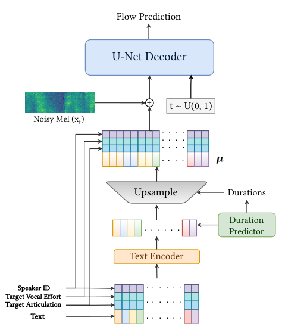

*Figure 1 · [Source](https://arxiv.org/abs/2606.23176)*

### LongCat-AudioDiT

LongCat-AudioDiT maps text and reference speech into continuous waveform latents using a diffusion model. A jointly considered waveform autoencoder and adapted inference guidance address the interaction between acoustic reconstruction and zero-shot synthesis quality.

[Paper](https://arxiv.org/abs/2603.29339) · [GitHub](https://github.com/meituan-longcat/LongCat-AudioDiT) · [Details](models/diffusion.md#longcat-audiodit)

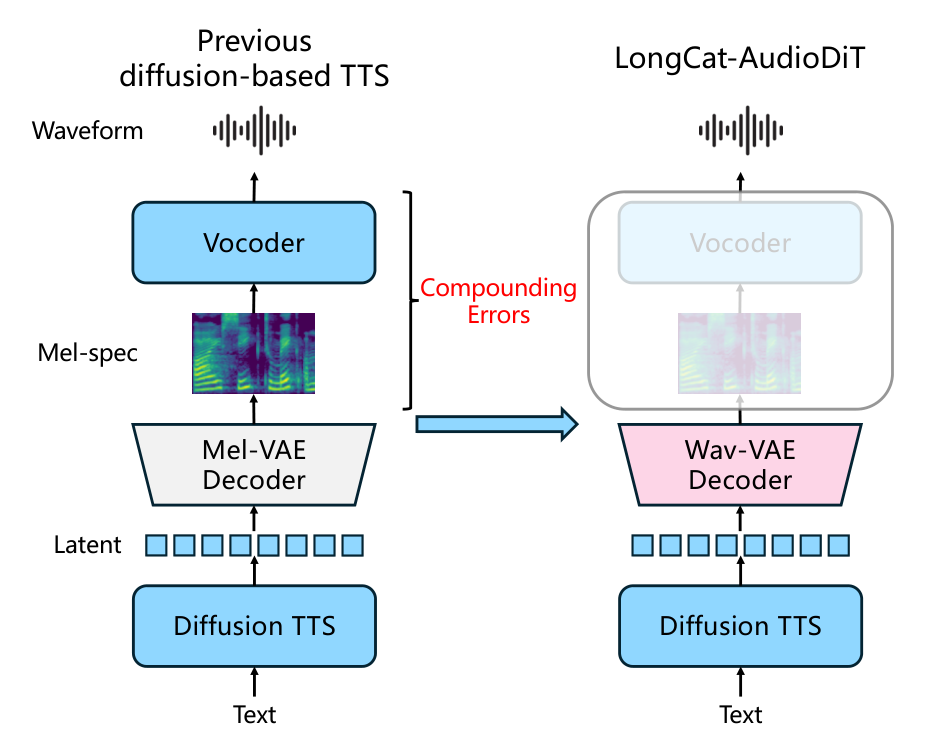

*Figure 1 · [Source](https://arxiv.org/abs/2603.29339)*

### LoRP-TTS

LoRP-TTS adapts a pretrained zero-shot synthesizer using small low-rank parameter updates. It focuses on preserving a target speaker from limited, potentially noisy or spontaneous recordings whose acoustic conditions differ from the original training data.

[Paper](https://arxiv.org/abs/2502.07562) · GitHub: no author-linked repository found · [Details](models/diffusion.md#lorp-tts)

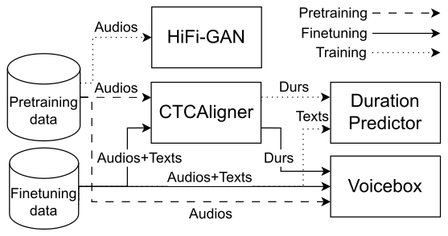

*Figure 3 · [Source](https://arxiv.org/abs/2502.07562)*

### Luna-TTS

Luna-TTS adapts an autoregressive text backbone into a speech diffusion language model. Its parallel and Realtime variants share a tokenizer and training lineage; Realtime predicts successive codec blocks while denoising each block in parallel for incremental audio delivery.

[Paper](https://arxiv.org/abs/2608.11593) · [Project](https://vuilabs-ai.github.io/luna-tts) · GitHub: no author-linked repository found · [Details](models/token-lm.md#luna-tts)

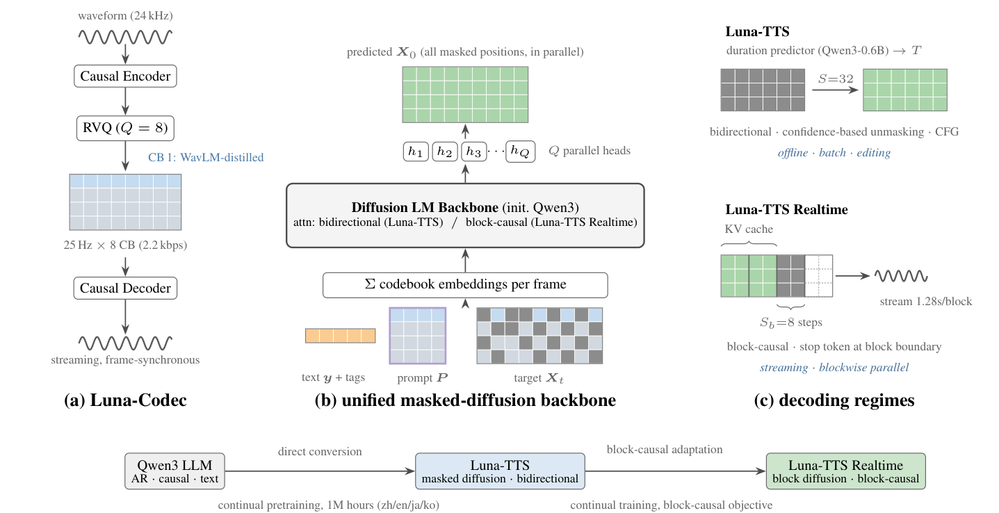

*Figure 1 (paper page 4) · [Source](https://arxiv.org/abs/2608.11593)*

### M3-TTS

M3-TTS uses joint text-audio diffusion layers to learn alignment without first stretching text into a guessed acoustic timeline. Additional single-stream layers refine acoustic details, producing reference-conditioned speech through a compressed mel representation.

[Paper](https://arxiv.org/abs/2512.04720) · GitHub: no author-linked repository found · [Details](models/diffusion.md#m3-tts)

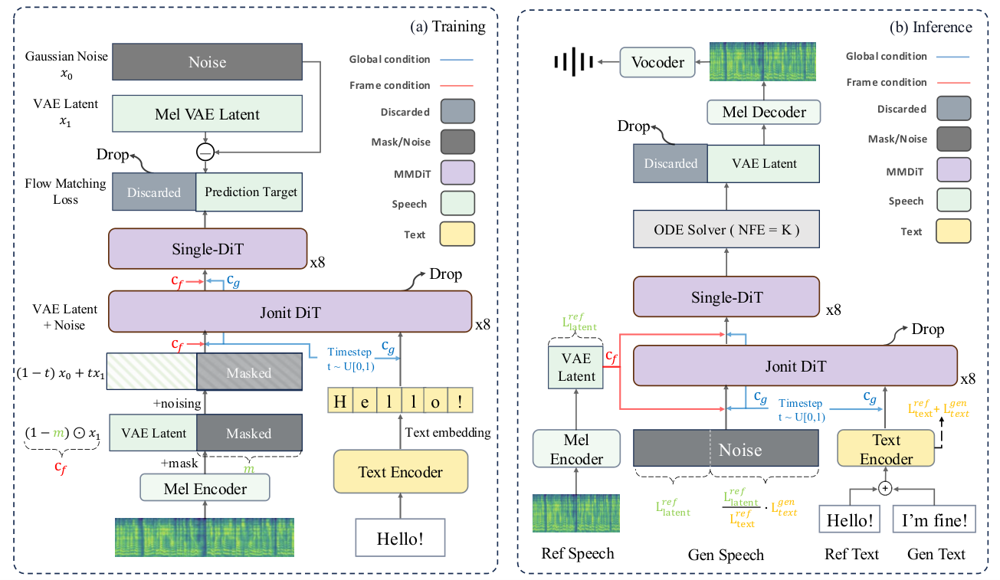

*Figure 1 · [Source](https://arxiv.org/abs/2512.04720)*

### MAGIC-TTS

MAGIC-TTS exposes timing controls for selected speech tokens and pauses. Training includes incomplete control signals so the model can follow local edits where provided and infer natural timing elsewhere, supporting precise pacing without requiring every segment to be specified.

[Paper](https://arxiv.org/abs/2604.21164) · [GitHub](https://github.com/yongaifadian1/MAGIC-TTS) · [Details](models/token-lm.md#magic-tts)

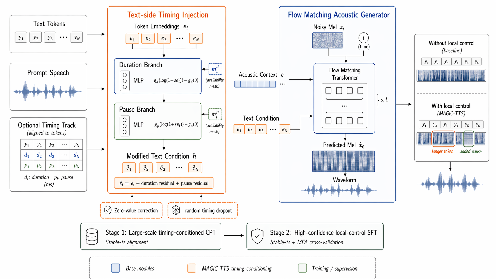

*Figure 1 · [Source](https://arxiv.org/abs/2604.21164)*

### MagpieTTS-LF

MagpieTTS-LF extends MagpieTTS at inference time by retaining acoustic and textual context across sentence boundaries. Soft alignment priors and history-aware encoding support coherent longer narration without retraining the synthesizer on long recordings.

[Paper](https://arxiv.org/abs/2606.18485) · GitHub: no author-linked repository found · [Details](models/token-lm.md#magpietts-lf)

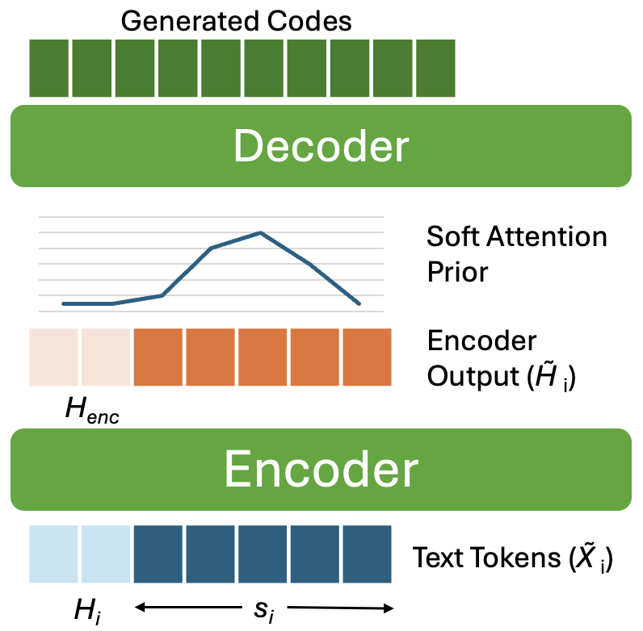

*Figure 1 · [Source](https://arxiv.org/abs/2606.18485)*

### MambaVoiceCloning

MambaVoiceCloning uses state-space modules to encode phonemes, learn their timing and condition expressive synthesis. A training-only alignment teacher supplies timing supervision, while the generation path targets efficient long sequences and limited-lookahead speech streaming.

[Paper](https://arxiv.org/abs/2604.00292) · [GitHub](https://github.com/sahilkumar15/MVC) · [Details](models/diffusion.md#mambavoicecloning)

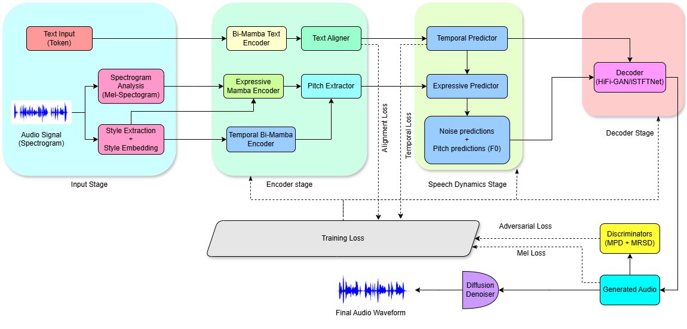

*Figure 1 · [Source](https://arxiv.org/abs/2604.00292)*

### MamTra

MamTra mixes state-space and attention layers to retain global context while reducing the cost of long sequences. Knowledge transfer from a pretrained Transformer initializes the hybrid synthesizer, combining efficient local processing with expressive acoustic modeling.

[Paper](https://arxiv.org/abs/2603.12342) · [GitHub](https://github.com/kaistmm/mamtra_inference) · [Project](https://mamtratts.github.io) · [Details](models/diffusion.md#mamtra)

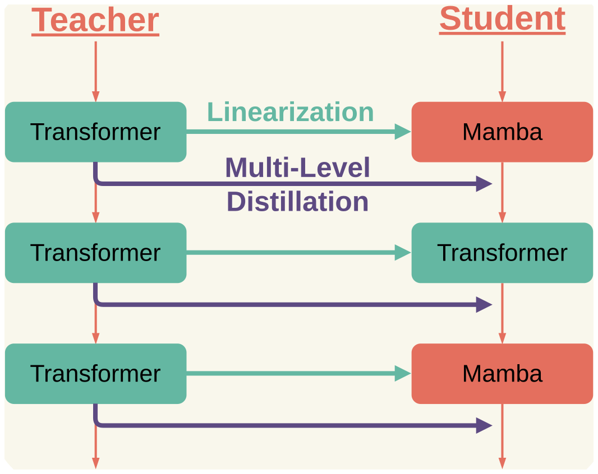

*Figure 1 · [Source](https://arxiv.org/abs/2603.12342)*

### ManchuTTS

ManchuTTS builds multilevel text representations suited to Manchu and feeds them into a convolutional diffusion Transformer. Its non-autoregressive generator and augmented training data target speech synthesis where naturally recorded material is scarce.

[Paper](https://arxiv.org/abs/2512.22491) · GitHub: no author-linked repository found · [Details](models/diffusion.md#manchutts)

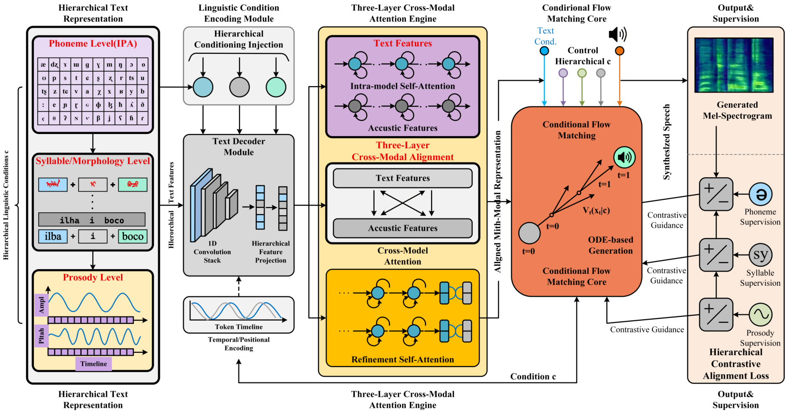

*Paper figure · [Source](https://arxiv.org/abs/2512.22491)*

### Marco-Voice

Marco-Voice learns separate speaker and emotion representations using contrastive training. Rotating the emotional representation provides smooth expressive control while preserving the reference voice across different delivery styles.

[Paper](https://arxiv.org/abs/2508.02038) · [GitHub](https://github.com/AIDC-AI/Marco-Voice) · [Details](models/token-lm.md#marco-voice)

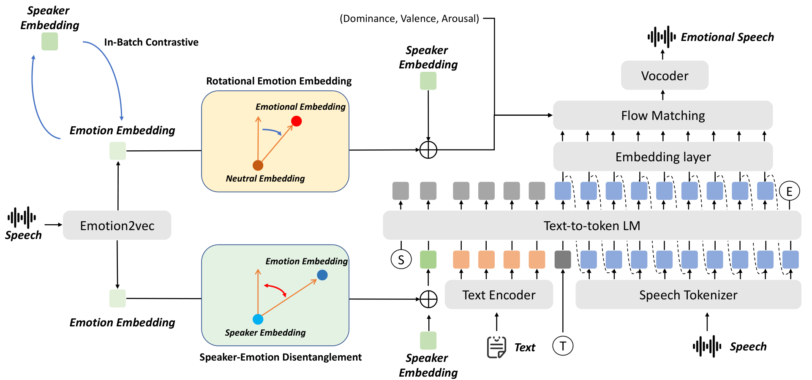

*Figure 1 · [Source](https://arxiv.org/abs/2508.02038)*

### MARS6

MARS6 encodes text and a speaker representation before generating hierarchical acoustic codes. Its compact encoder-decoder design targets expressive speech and reference-voice cloning with reduced inference cost.

[Paper](https://arxiv.org/abs/2501.05787) · [GitHub](https://github.com/Camb-ai/mars6-turbo) · [Project](https://camb-ai.github.io/mars6-turbo/) · [Details](models/token-lm.md#mars6)

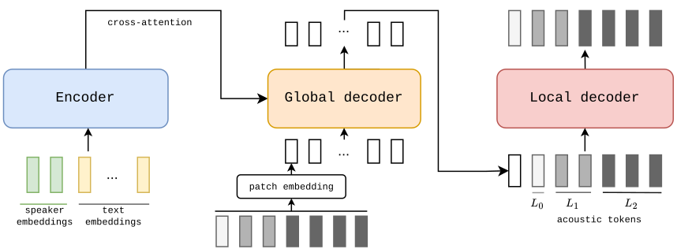

*Paper figure · [Source](https://arxiv.org/abs/2501.05787)*

### Masked-style TTS

This controllable system first predicts a masked-autoencoder-derived speech style representation from text and controls. A second model generates codec tokens, allowing speaker characteristics and expressive attributes to be specified separately during synthesis.

[Paper](https://arxiv.org/abs/2506.02997) · GitHub: no author-linked repository found · [Details](models/token-lm.md#masked-style-tts)

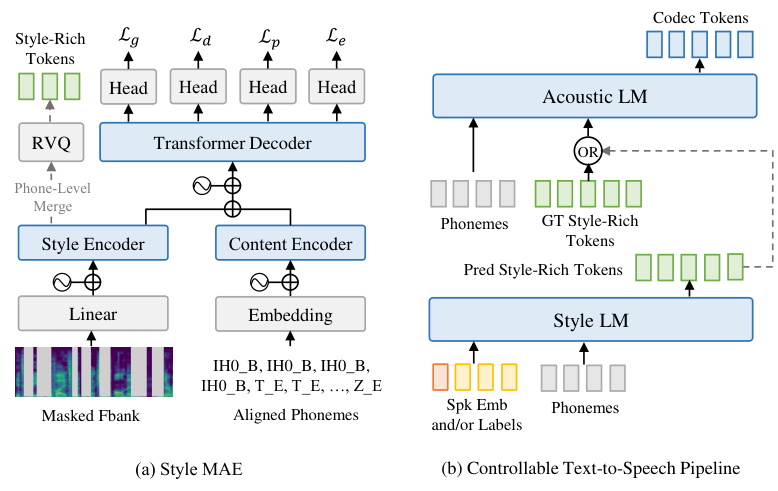

*Paper figure · [Source](https://arxiv.org/abs/2506.02997)*

### MaskGCT

Masked generative codec transformers.

[Paper](https://arxiv.org/abs/2409.00750) · [Details](models/token-lm.md#maskgct)

*Figure 1 · [Source](https://arxiv.org/abs/2409.00750)*

### Matcha-TTS

Conditional flow matching with an encoder-decoder acoustic model.

[Paper](https://arxiv.org/abs/2309.03199) · [Details](models/diffusion.md#matcha-tts)

*Figure 1 · [Source](https://arxiv.org/abs/2309.03199)*

### MAVE

MAVE combines a state-space backbone with cross-attention to generate speech conditioned on text and acoustic context. It supports zero-shot voice synthesis and editing while reducing the attention-memory requirements of a comparable Transformer-based codec model.

[Paper](https://arxiv.org/abs/2510.04738) · GitHub: no author-linked repository found · [Details](models/token-lm.md#mave)

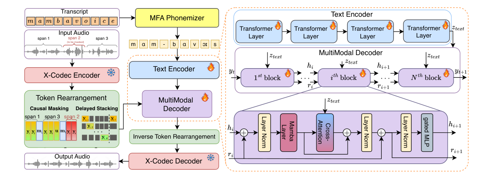

*Figure 1 · [Source](https://arxiv.org/abs/2510.04738)*

### Mega-TTS

Disentangled speech factors and prosody LM.

[Paper](https://arxiv.org/abs/2306.03509) · [Details](models/token-lm.md#mega-tts)

*Figure 1 · [Source](https://arxiv.org/abs/2306.03509)*

### Mega-TTS 2

Prosody language model and multi-sentence prompting.

[Paper](https://arxiv.org/abs/2307.07218) · [Details](models/token-lm.md#mega-tts-2)

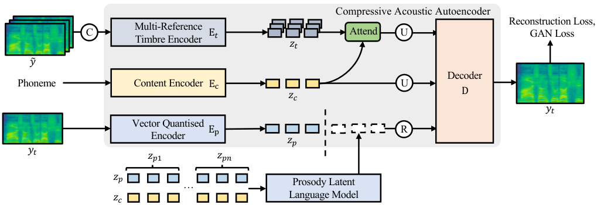

*Figure 1 · [Source](https://arxiv.org/abs/2307.07218)*

### MegaTTS 3

MegaTTS 3 guides a latent diffusion Transformer with sparse text-speech alignment boundaries, leaving the model room to learn finer timing. Classifier-free guidance controls accent strength, while piecewise rectified flow reduces sampling work. The design targets robust zero-shot voice synthesis with more flexible alignment than a fully fixed duration sequence.

[Paper](https://arxiv.org/abs/2502.18924) · [GitHub](https://github.com/bytedance/MegaTTS3) · [Details](models/diffusion.md#mega-tts-3)

*Figure 1 · [Source](https://arxiv.org/abs/2502.18924)*

### Meitei Mayek TTS

This Manipuri speech synthesizer maps Meitei Mayek writing to an ARPAbet-based phoneme representation before acoustic generation with Tacotron 2. A HiFi-GAN vocoder reconstructs the waveform. The paper develops a single-speaker system for a language with limited training resources and tonal pronunciation requirements.

[Paper](https://arxiv.org/abs/2508.06870) · GitHub: no author-linked repository found · [Details](models/autoregressive.md#meitei-mayek-tts)

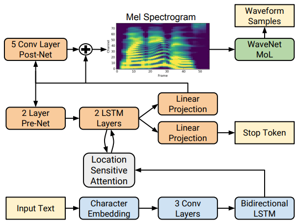

*Paper figure · [Source](https://arxiv.org/abs/2508.06870)*

### Mel-LLM (TTS)

The synthesis experiment in Mel-LLM extends a language model to predict mel-based acoustic information directly. Its next-token VAE decoder demonstrates a text-to-speech path within an otherwise understanding-focused model; the paper presents this as a proof of concept with quality limitations.

[Paper](https://arxiv.org/abs/2606.10231) · GitHub: no author-linked repository found · [Details](models/continuous-lm.md#mel-llm-tts)

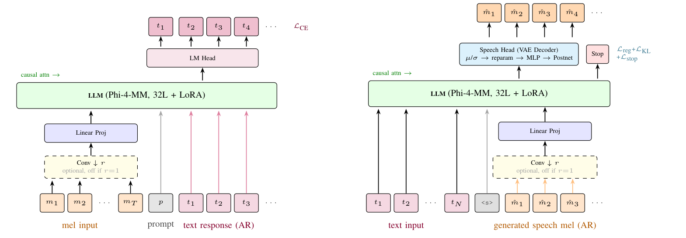

*Fig. 1 (paper page 2) · [Source](https://arxiv.org/abs/2606.10231)*

### MELA-TTS

MELA-TTS predicts continuous mel-spectrogram frames from text and speaker conditions. A training-time alignment module connects the decoder to recognition-derived semantic features, helping the joint Transformer-diffusion model retain linguistic structure without discrete speech tokenization.

[Paper](https://arxiv.org/abs/2509.14784) · GitHub: no author-linked repository found · [Details](models/continuous-lm.md#mela-tts)

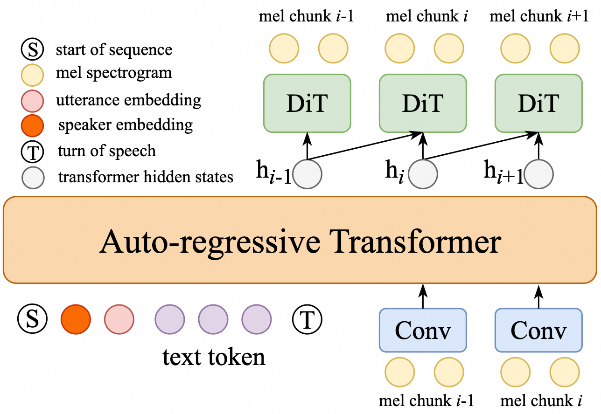

*Figure 1 · [Source](https://arxiv.org/abs/2509.14784)*

### MELD

MELD learns discrete latent variables from mel-spectrograms jointly with its speech language model. This shared optimization supports zero-shot synthesis and recognition while addressing omissions and excessive silence associated with less coordinated acoustic representations.

[Paper](https://arxiv.org/abs/2605.29859) · GitHub: no author-linked repository found · [Details](models/token-lm.md#meld)

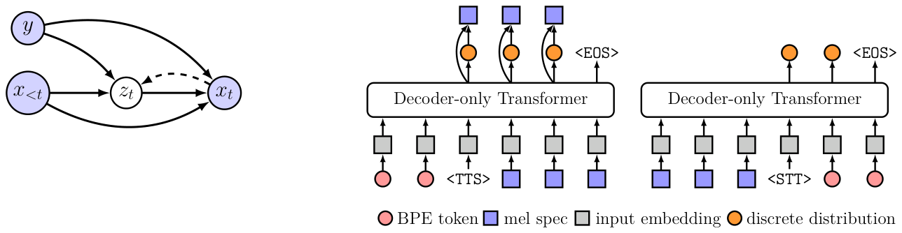

*Figures 1–2 (paper page 2; panels assembled) · [Source](https://arxiv.org/abs/2605.29859)*

### Mellotron

Tacotron 2 with global style tokens, pitch and rhythm conditioning.

[Paper](https://arxiv.org/abs/1910.11997) · [Details](models/autoregressive.md#mellotron)

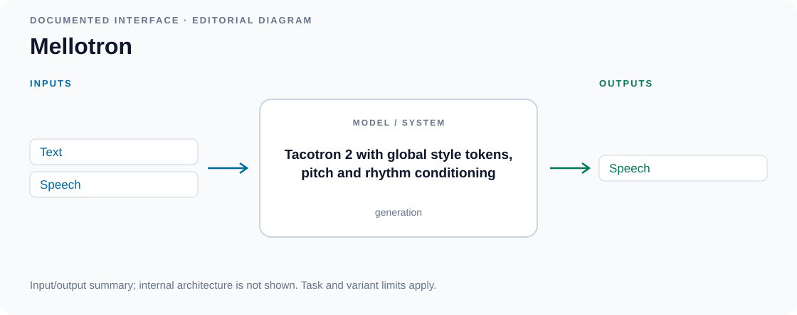

*Editorial input/output diagram · [Source](https://arxiv.org/abs/1910.11997)*

### MeloTTS

VITS-family multilingual speech synthesis.

[GitHub](https://github.com/myshell-ai/MeloTTS) · [Details](models/flow-vae.md#melo-tts)

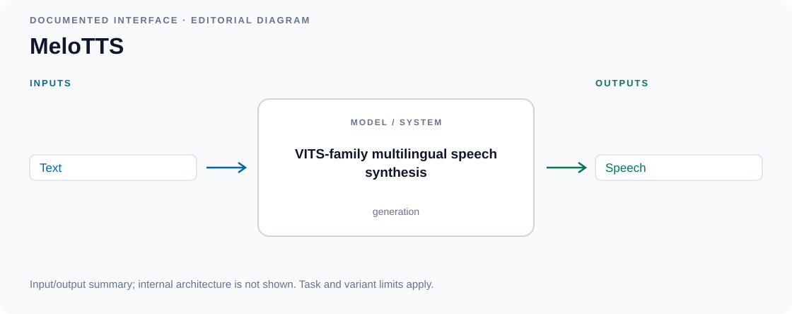

*Editorial input/output diagram · [Source](https://github.com/myshell-ai/MeloTTS)*

### Metis

Metis pretrains on unlabeled speech before adapting to task-specific conditions such as text. Self-supervised semantic tokens and acoustic codes support a shared foundation for reference-based TTS, conversion and other speech-generation tasks.

[Paper](https://arxiv.org/abs/2502.03128) · [GitHub](https://github.com/open-mmlab/Amphion) · [Project](https://metis-demo.github.io/) · [Details](models/token-lm.md#metis)

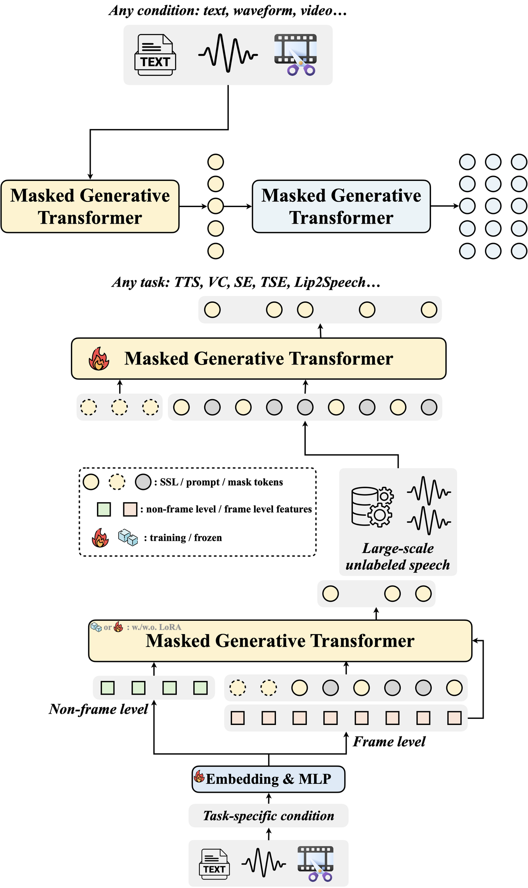

*Paper figure · [Source](https://arxiv.org/abs/2502.03128)*

### MFCIG-CSS

MFCIG-CSS represents dialogue history through separate graphs of meaning and vocal expression. Fine-grained multimodal interactions condition the speech synthesizer, helping each scripted response fit the surrounding conversation.

[Paper](https://arxiv.org/abs/2509.06074) · [GitHub](https://github.com/AI-S2-Lab/MFCIG-CSS) · [Details](models/token-lm.md#mfcig-css)

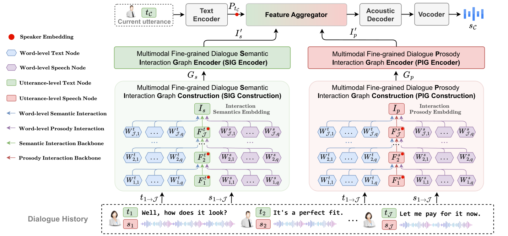

*Figure 1 · [Source](https://arxiv.org/abs/2509.06074)*

### MiDashengLM-Gen

MiDashengLM-Gen trains a language model together with a conditional flow-matching output head to generate variable-length audio. Its text conditioning supports scenes containing intelligible speech alongside music or other sounds, with generation performed over continuous audio representations.

[Paper](https://arxiv.org/abs/2608.11804) · [GitHub](https://github.com/xiaomi-research/midashenglm-gen) · [Project](https://xingws.github.io/midashenglm-gen-demo/) · [Details](models/continuous-lm.md#midashenglm-gen)

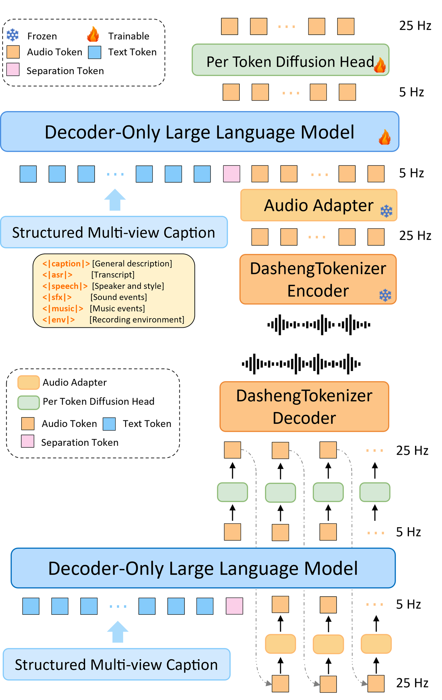

*Paper figure · [Source](https://arxiv.org/abs/2608.11804)*

### MiniMax-Speech

MiniMax-Speech extracts speaker characteristics directly from reference audio without requiring its transcript, then generates speech with an autoregressive Transformer and Flow-VAE. The research emphasizes multilingual zero-shot cloning and expressive delivery. Additional adaptation mechanisms support emotion control, description-based voice creation and more specialized voice cloning without replacing the base model.

[Paper](https://arxiv.org/abs/2505.07916) · GitHub: no author-linked repository found · [Details](models/token-lm.md#minimax-speech)

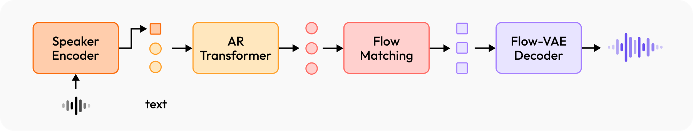

*Figure 1 · [Source](https://arxiv.org/abs/2505.07916)*

### MixedG2P-T5

MixedG2P-T5 learns acoustic units from speech and uses a language-model synthesis path for text containing mixed scripts. It reduces dependence on manually designed grapheme-to-phoneme rules while retaining accent and intonation information in the speech representation.

[Paper](https://arxiv.org/abs/2509.01391) · GitHub: no author-linked repository found · [Details](models/token-lm.md#mixedg2p-t5)

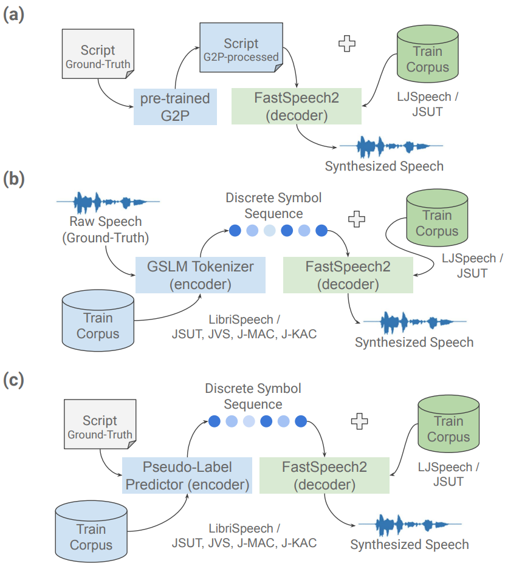

*Figure 3 · [Source](https://arxiv.org/abs/2509.01391)*

### MM-MovieDubber

MM-MovieDubber interprets scene information to distinguish dialogue, narration and monologue delivery. A speech generator then uses the resulting multimodal conditions with the target content to render expressive movie dubbing.

[Paper](https://arxiv.org/abs/2505.16279) · GitHub: no author-linked repository found · [Details](models/diffusion.md#mm-moviedubber)

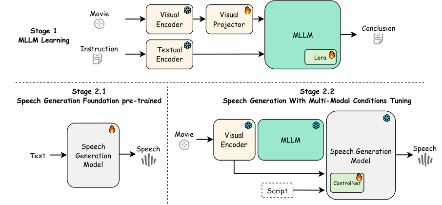

*Figure 2 · [Source](https://arxiv.org/abs/2505.16279)*

### MoE-TTS

MoE-TTS augments a frozen text language model with speech-specific expert parameters. Retaining the original language knowledge helps the synthesizer interpret unfamiliar style descriptions while learning the acoustic generation task.

[Paper](https://arxiv.org/abs/2508.11326) · GitHub: no author-linked repository found · [Details](models/token-lm.md#moe-tts)

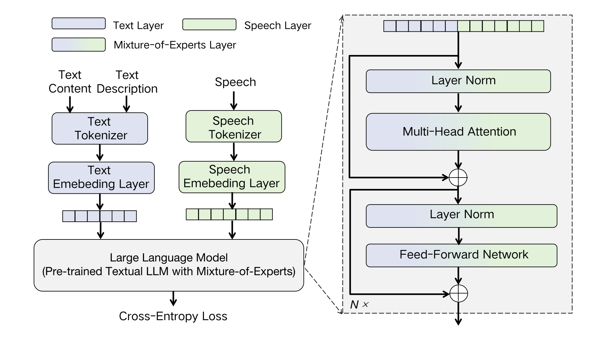

*Figure 1 · [Source](https://arxiv.org/abs/2508.11326)*

### MoonCast

MoonCast combines podcast script preparation with a synthesizer trained for longer, spontaneous-sounding delivery. Voice references allow unseen speakers to render the resulting conversation, while discourse-level context supports more natural transitions than isolated sentence synthesis.

[Paper](https://arxiv.org/abs/2503.14345) · [GitHub](https://github.com/jzq2000/MoonCast) · [Project](https://mooncastdemo.github.io) · [Details](models/token-lm.md#mooncast)

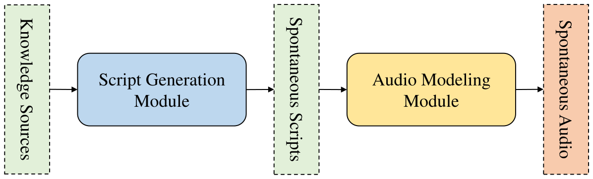

*Figure 1 · [Source](https://arxiv.org/abs/2503.14345)*

### MOSS-TTS

MOSS-TTS offers two generators over a shared discrete audio representation: a delay-pattern model and a model with a frame-local Transformer. They balance long-context control against efficient codebook prediction and speaker preservation. The family supports reference-conditioned synthesis, pronunciation and duration controls, with later checkpoints extending language handling and explicit pauses.

[Paper](https://arxiv.org/abs/2603.18090) · [GitHub](https://github.com/OpenMOSS/MOSS-TTS) · [Details](models/token-lm.md#moss-tts)

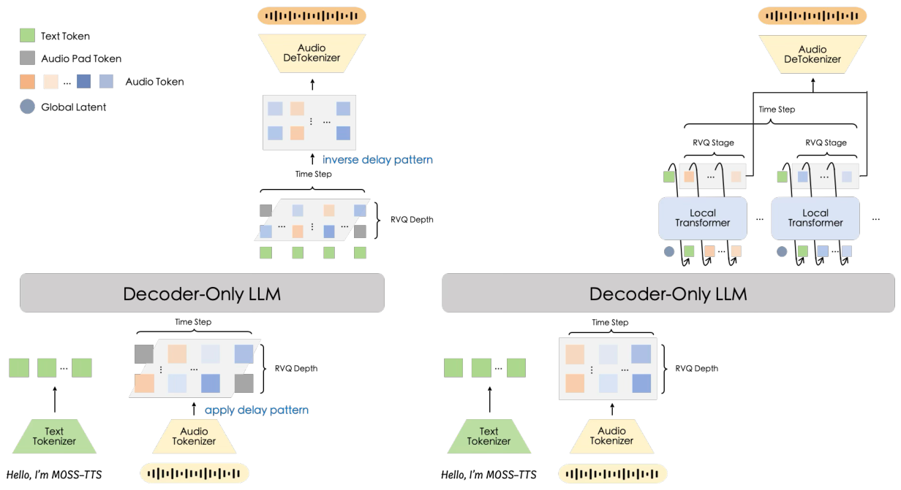

*Figure 2, PDF p. 8 · [Source](https://arxiv.org/abs/2603.18090)*

### MOSS-TTS-Nano

MOSS-TTS-Nano packages multilingual voice cloning into a roughly 100M-parameter speech generator with a compact audio tokenizer. Streaming output and an ONNX inference path make it relevant to CPU-based readers and local applications. Its published performance depends on the runtime and hardware, and the tokenizer is a separate part of the deployment footprint.

[GitHub 1](https://github.com/OpenMOSS/MOSS-TTS) · [GitHub 2](https://github.com/OpenMOSS/MOSS-TTS-Nano) · [Details](models/token-lm.md#moss-tts-nano)

*Official architecture diagram · [Source](https://github.com/OpenMOSS/MOSS-TTS)*

### MOSS-TTS-Realtime

MOSS-TTS-Realtime uses a Qwen3-derived backbone for linguistic context and a smaller local Transformer to predict audio codebooks. Text and speech tokens are handled at different levels so the system can accept text and emit audio incrementally. It targets low-latency spoken responses while preserving context across the generated utterance.

[GitHub](https://github.com/OpenMOSS/MOSS-TTS) · [Docs](https://github.com/OpenMOSS/MOSS-TTS/blob/main/moss_tts_realtime/README.md) · [Details](models/token-lm.md#moss-tts-realtime)

*Editorial input/output diagram · [Source](https://github.com/OpenMOSS/MOSS-TTS)*

### MOSS-TTSD

MOSS-TTSD turns a dialogue script with explicit speaker tags into a continuous multi-party recording. Long-context modeling helps maintain speaker identity, turn assignment and acoustic continuity, while short references can define voices. It is designed for podcasts, commentary and other scripted conversations; the source paper evaluates dialogue-specific consistency as well as intelligibility.

[Paper](https://arxiv.org/abs/2603.19739) · [GitHub](https://github.com/OpenMOSS/MOSS-TTSD) · [Details](models/token-lm.md#moss-ttsd)

*Figure 2, PDF p. 4 · [Source](https://arxiv.org/abs/2603.19739)*

### MOSS-VoiceGenerator

MOSS-VoiceGenerator creates a speaking voice from a natural-language description rather than requiring an example speaker recording. Training on expressive cinematic speech exposes it to varied delivery and acoustic conditions. The model is intended for character design, storytelling and role-based narration where the desired voice must be specified in words.

[Paper](https://arxiv.org/abs/2603.28086) · [GitHub](https://github.com/OpenMOSS/MOSS-TTS) · [Details](models/token-lm.md#moss-voicegenerator)

*Figure 1 · [Source](https://arxiv.org/abs/2603.28086)*

### MP-ELD

MP-ELD predicts low-rate continuous speech tokens through several information paths with separate local encoders. A flow decoder combines their predictions, while the accompanying Locodec representation is designed to limit accumulated errors during long speech generation.

[Paper](https://arxiv.org/abs/2607.29363) · GitHub: no author-linked repository found · [Details](models/continuous-lm.md#mp-eld)

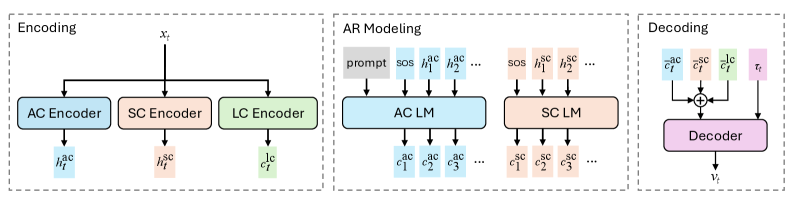

*Figure 2 · [Source](https://arxiv.org/abs/2607.29363)*

### MPE-TTS

MPE-TTS combines reference speech and textual prompts to specify an unseen speaker and the desired emotion. A prosody predictor and emotion-consistency objective carry those controls into the synthesized acoustic performance.

[Paper](https://arxiv.org/abs/2505.18453) · GitHub: no author-linked repository found · [Details](models/token-lm.md#mpe-tts)

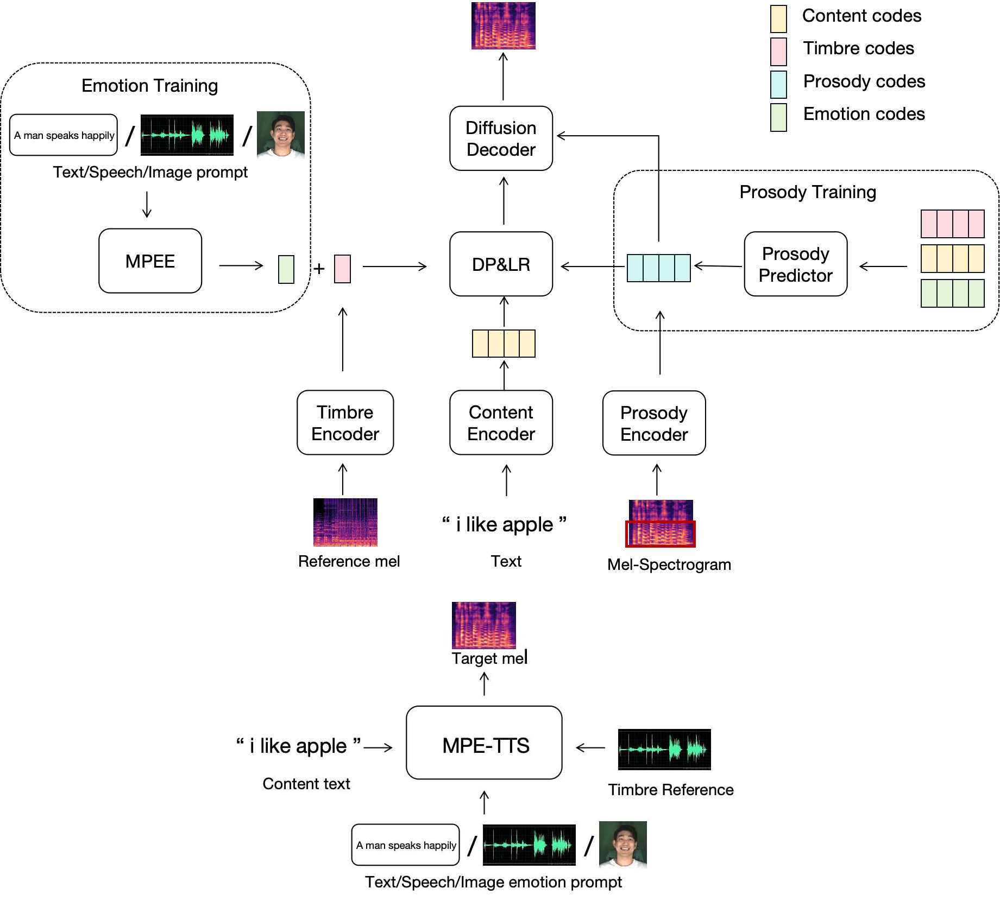

*Figure 1 · [Source](https://arxiv.org/abs/2505.18453)*

### Multistage multimodal TTS

This framework learns face and text conditioning in separate stages before using them for voice synthesis. Visual knowledge distillation and training across text-face and text-speech pairs reduce reliance on fully matched multimodal recordings.

[Paper](https://arxiv.org/abs/2506.20945) · GitHub: no author-linked repository found · [Details](models/diffusion.md#multistage-multimodal-tts)

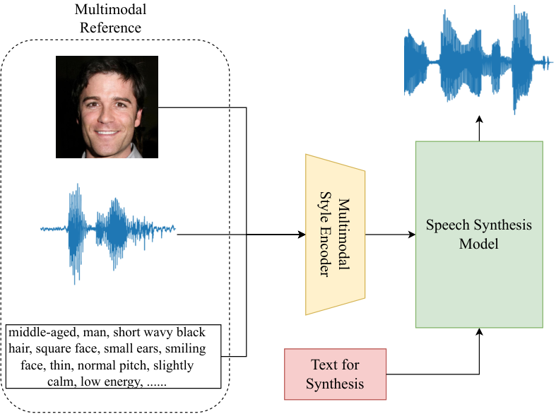

*Paper figure · [Source](https://arxiv.org/abs/2506.20945)*

### Muyan-TTS

Muyan-TTS trains a speech language model on a large podcast collection for expressive reference-based synthesis. The release documents data preparation, training and optimized inference, with an emphasis on reproducible podcast-style voice generation.

[Paper](https://arxiv.org/abs/2504.19146) · [GitHub](https://github.com/MYZY-AI/Muyan-TTS) · [Details](models/token-lm.md#muyan-tts)

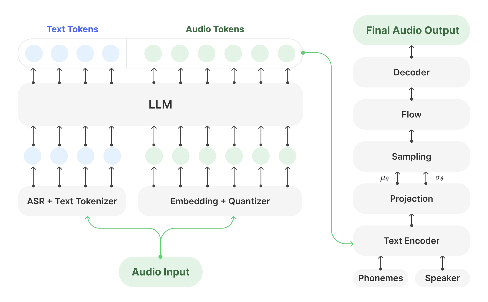

*Figure 1 · [Source](https://arxiv.org/abs/2504.19146)*

### NaturalSpeech

Text-to-waveform VAE with enhanced prior and duration modeling.

[Paper](https://arxiv.org/abs/2205.04421) · [Details](models/flow-vae.md#naturalspeech)

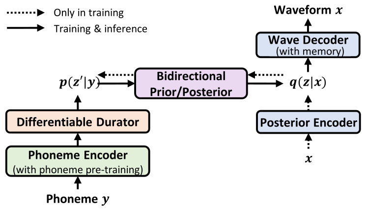

*Figure 1 · [Source](https://arxiv.org/abs/2205.04421)*

### NaturalSpeech 2

Latent diffusion over neural-codec representations.

[Paper](https://arxiv.org/abs/2304.09116) · [Details](models/diffusion.md#naturalspeech-2)

*Figure 1 · [Source](https://arxiv.org/abs/2304.09116)*

### NaturalSpeech 3

Factorized speech codec and attribute-wise diffusion.

[Paper](https://arxiv.org/abs/2403.03100) · [Details](models/diffusion.md#naturalspeech-3)

*Figure 3 · [Source](https://arxiv.org/abs/2403.03100)*

### NeuTTS Air

NeuTTS Air pairs a phoneme-conditioned language model with NeuCodec to synthesize a reference voice locally. Quantized GGUF backbones support incremental generation through the documented streaming backend. It targets embedded and desktop voice applications, with the codec's compute and memory requirements considered alongside those of the language-model backbone.

[GitHub](https://github.com/neuphonic/neutts) · [Details](models/token-lm.md#neutts-air)

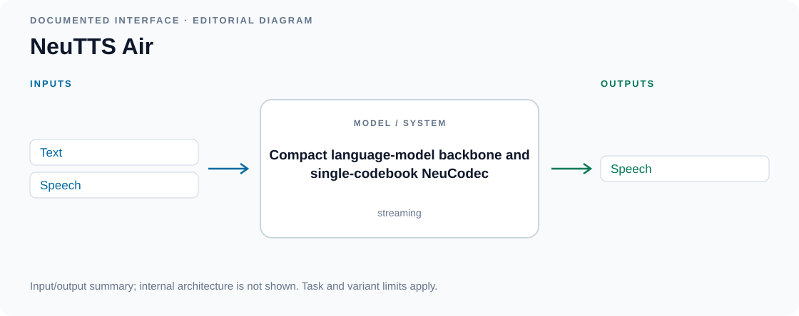

*Editorial input/output diagram · [Source](https://github.com/neuphonic/neutts)*

### NeuTTS Nano

NeuTTS Nano reduces the speech-model backbone while retaining phoneme conditioning, reference-based cloning and NeuCodec reconstruction. Its English, German, French and Spanish models share a design but use separate language-specific checkpoints. Quantized variants support compact local deployments, and streaming depends on the selected inference backend.

[GitHub](https://github.com/neuphonic/neutts) · [Details](models/token-lm.md#neutts-nano)

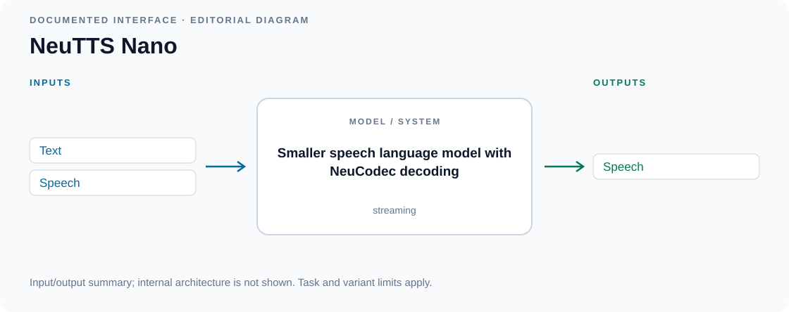

*Editorial input/output diagram · [Source](https://github.com/neuphonic/neutts)*

### NeuTTS-2E

NeuTTS-2E accepts text directly and adds explicit emotional delivery to the NeuTTS language-model-and-codec pipeline. The released configuration supplies four fixed speaker presets instead of arbitrary reference-based cloning. It is intended for compact expressive speech applications, with streaming available through the documented GGUF inference path.

[GitHub](https://github.com/neuphonic/neutts) · [Details](models/token-lm.md#neutts-2e)

*Editorial input/output diagram · [Source](https://github.com/neuphonic/neutts)*

### NR-LauraTTS

NR-LauraTTS cleans the discrete representation of a noisy voice prompt before passing it to LauraTTS. Token prediction and embedding refinement reduce background contamination, supporting reference cloning when the available recording is acoustically imperfect.

[Paper](https://arxiv.org/abs/2505.13830) · [GitHub](https://github.com/yxlu-0102/NR-LauraTTS) · [Project](https://yxlu-0102.github.io/NR-LauraTTS) · [Details](models/token-lm.md#nr-lauratts)

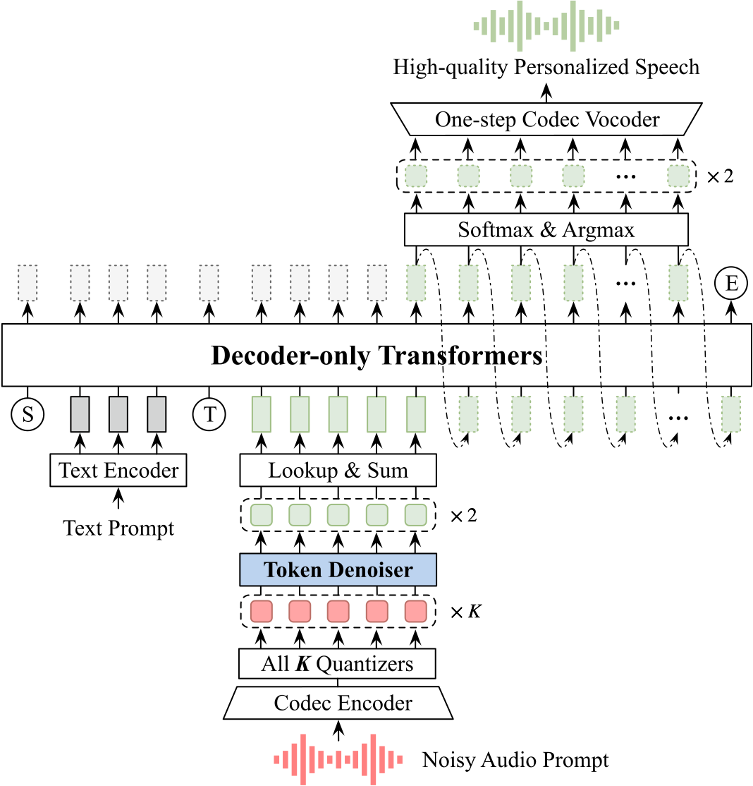

*Figure 1 · [Source](https://arxiv.org/abs/2505.13830)*

### NVSpeech TTS

The NVSpeech pipeline includes a TTS model that renders text with explicitly marked nonverbal events. Word-level annotations connect ordinary speech with vocalizations such as laughter, providing a shared representation for recognition and controllable audio generation.

[Paper](https://arxiv.org/abs/2508.04195) · [Project](https://nvspeech170k.github.io/) · GitHub: no author-linked repository found · [Details](models/token-lm.md#nvspeech-tts)

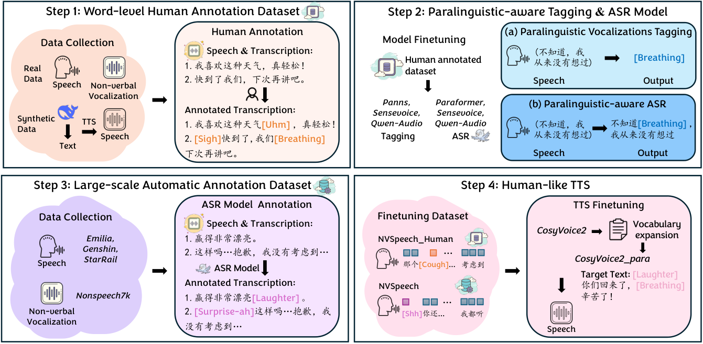

*Figure 2 · [Source](https://arxiv.org/abs/2508.04195)*

### Nüshu-PitchVITS

Nüshu-PitchVITS uses pitch annotations from Nüshu's writing system to guide acoustic generation under very limited data. A frame-level pitch predictor conditions the VITS waveform path, allowing syllable recordings and linguistic tone knowledge to support sentence synthesis.

[Paper](https://arxiv.org/abs/2606.09295) · GitHub: no author-linked repository found · [Details](models/flow-vae.md#nushu-pitchvits)

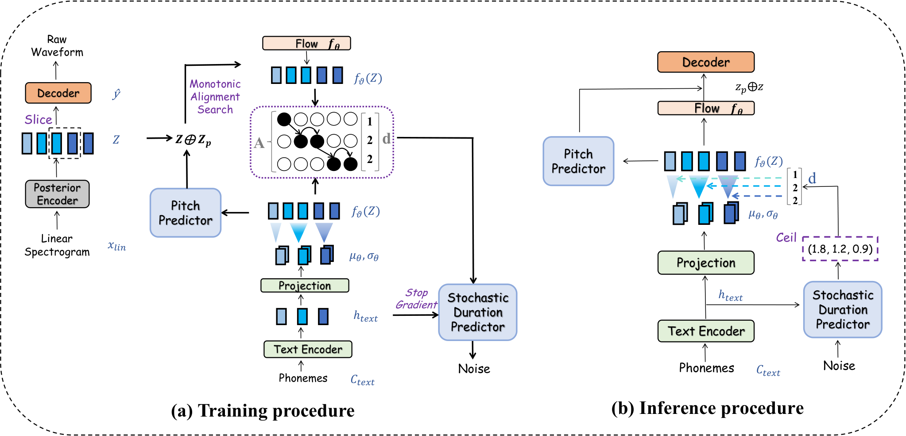

*Figure 3 · [Source](https://arxiv.org/abs/2606.09295)*

### Ojibwe-Mi'kmaq-Maliseet TTS

This model family shares speech-synthesis training across three related Indigenous languages. The paper compares attention-based and attention-free flow architectures, demonstrating how joint linguistic coverage can help languages with limited recordings.

[Paper](https://arxiv.org/abs/2502.02703) · [GitHub](https://github.com/ShenranTomWang/TTS) · [Details](models/diffusion.md#ojibwe-mi-kmaq-maliseet-tts)

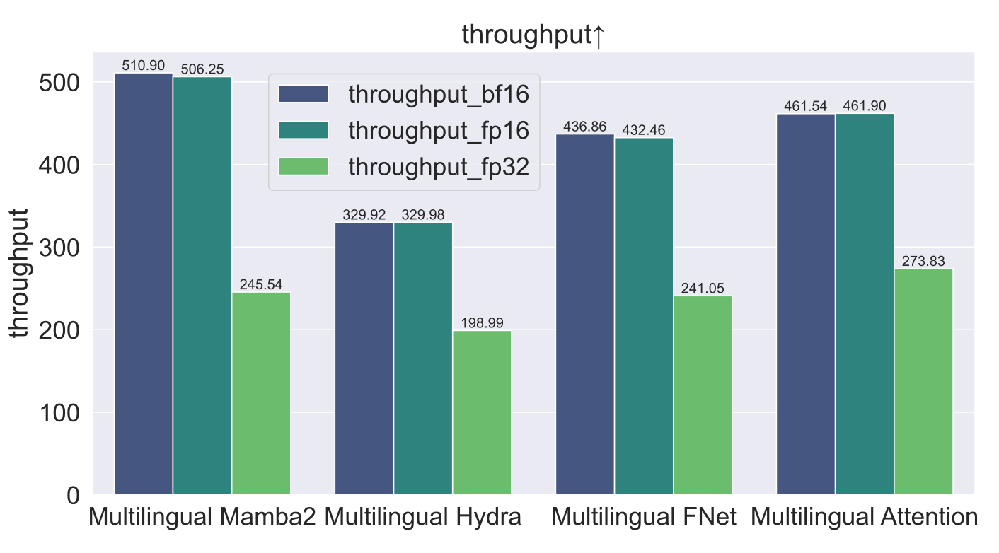

*Figure 1 · [Source](https://arxiv.org/abs/2502.02703)*

### OmniVoice

OmniVoice predicts multiple acoustic codebooks directly from text using a masked, non-autoregressive diffusion language model. Random masking across codebooks and initialization from a pretrained language model support multilingual generation without a separate text-to-semantic stage. It focuses on broad-language zero-shot synthesis and voice conditioning, rather than visual or general-purpose omni interaction.

[Paper](https://arxiv.org/abs/2604.00688) · [GitHub](https://github.com/k2-fsa/OmniVoice) · [Details](models/token-lm.md#omnivoice)

*Figure 1 · [Source](https://arxiv.org/abs/2604.00688)*

### OpusLM

OpusLM extends text language models through speech-text pretraining on public data. Its interleaved representation supports speech recognition, text-conditioned synthesis and textual continuation within a transparent family of shared backbones.

[Paper](https://arxiv.org/abs/2506.17611) · GitHub: no author-linked repository found · [Details](models/token-lm.md#opuslm)

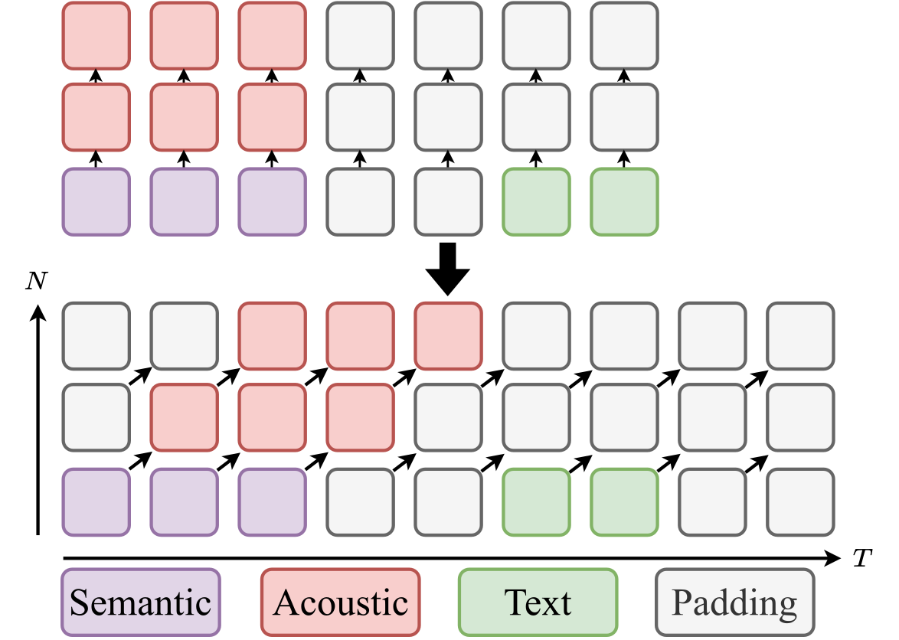

*Figure 1 · [Source](https://arxiv.org/abs/2506.17611)*

### Orpheus TTS

Orpheus TTS repurposes a Llama-family language model to generate speech codec tokens from text. Emotion tags and speaker conditioning guide expressive delivery, while the project supplies inference and adaptation workflows. English releases and multilingual previews have different coverage, so a checkpoint's documented capabilities matter when selecting it for narration or a voice application.

[GitHub](https://github.com/canopyai/Orpheus-TTS) · [Details](models/token-lm.md#orpheus-tts)

*Editorial input/output diagram · [Source](https://github.com/canopyai/Orpheus-TTS)*

### OscillaTTS

OscillaTTS changes the periodic nonlinearities used in a style-diffusion synthesis backbone. Adjustable oscillatory modulation is designed to capture rapid pitch and amplitude changes while a linear bypass stabilizes the acoustic signal, targeting sharper expressive prosody.

[Paper](https://arxiv.org/abs/2606.25424) · GitHub: no author-linked repository found · [Details](models/diffusion.md#oscillatts)

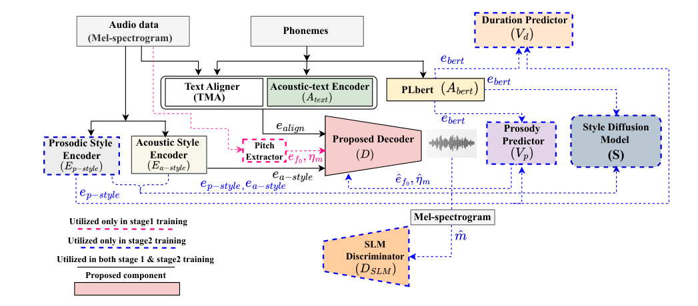

*Figure 1 · [Source](https://arxiv.org/abs/2606.25424)*

### OuteTTS

OuteTTS represents speech in a form that can be generated by a decoder-only language model and reconstructed by an audio decoder. A speaker reference guides vocal identity, style and accent. Its 1.0 line supports standard LLM serving backends, but generation settings and repetition handling need to follow the matching model implementation.

[GitHub](https://github.com/edwko/OuteTTS) · [Details](models/token-lm.md#outetts)

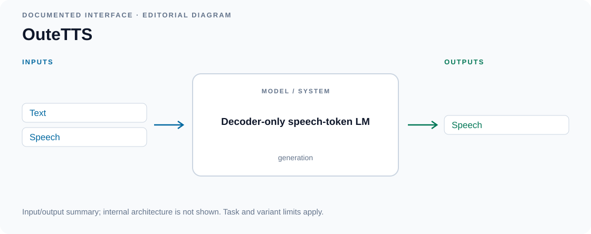

*Editorial input/output diagram · [Source](https://github.com/edwko/OuteTTS)*

### OV-InstructTTS

OV-InstructTTS interprets voice and delivery descriptions beyond a fixed inventory of style labels. Its reasoning-based conditioning connects broader textual requests with expressive speech generation, supported by a dedicated instruction-speech dataset.

[Paper](https://arxiv.org/abs/2601.01459) · [GitHub](https://github.com/y-ren16/OV-InstructTTS) · [Details](models/token-lm.md#ov-instructtts)

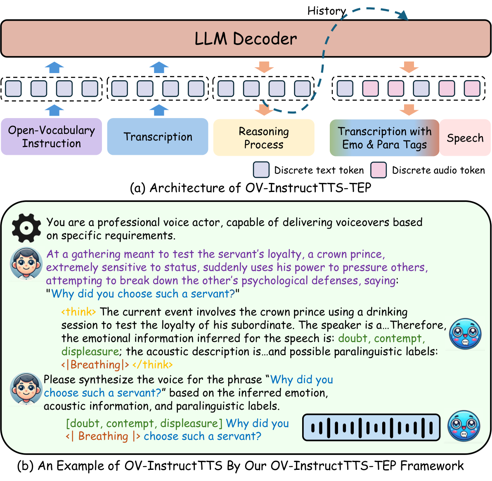

*Figure 2 · [Source](https://arxiv.org/abs/2601.01459)*

### OZSpeech

OZSpeech generates disentangled speech components with a flow model conditioned on a learned prior. The design targets single-step zero-shot synthesis while separately modeling content, prosody and speaker-related information from the voice prompt.

[Paper](https://arxiv.org/abs/2505.12800) · [GitHub](https://github.com/ozspeech/OZSpeech) · [Project](https://ozspeech.github.io/OZSpeech_Web/) · [Details](models/token-lm.md#ozspeech)

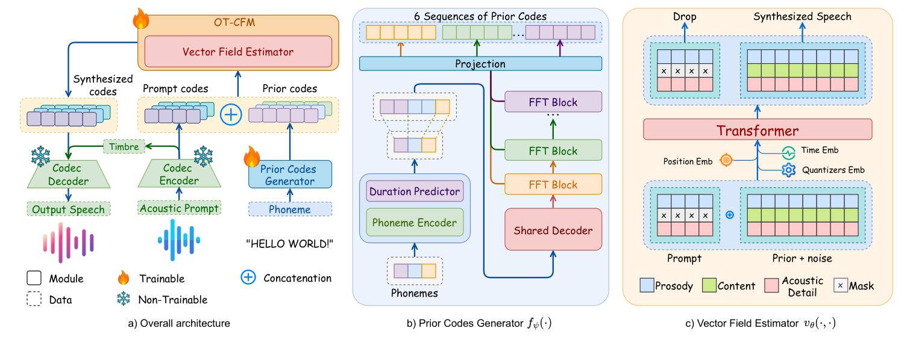

*Figure 1 · [Source](https://arxiv.org/abs/2505.12800)*

### PALLE

PALLE generates variable-length speech spans at fixed decoding steps, combining temporal planning with parallel token prediction. A second non-autoregressive stage refines the initial sequence, supporting efficient zero-shot synthesis.

[Paper](https://arxiv.org/abs/2504.10352) · GitHub: no author-linked repository found · [Details](models/token-lm.md#palle)

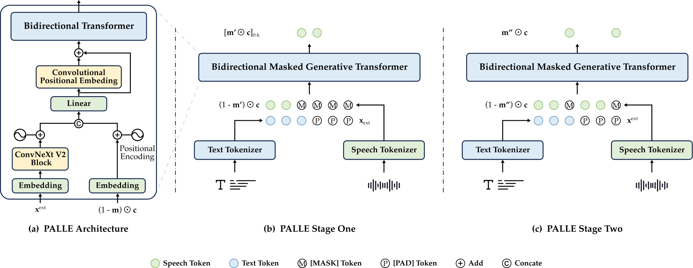

*Figure 3 · [Source](https://arxiv.org/abs/2504.10352)*

### Parallel GPT

Parallel GPT divides speech generation between a general autoregressive predictor and a non-autoregressive detail model. The parallel refinement stage conditions on the initial tokens, balancing independence and interaction between semantic and acoustic information.

[Paper](https://arxiv.org/abs/2508.04141) · GitHub: no author-linked repository found · [Details](models/token-lm.md#parallel-gpt)

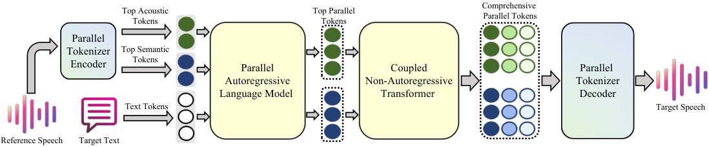

*Paper figure · [Source](https://arxiv.org/abs/2508.04141)*

### Parallel Tacotron

Parallel acoustic model with a variational residual encoder.

[Paper](https://arxiv.org/abs/2010.11439) · [Details](models/parallel.md#parallel-tacotron)

*Figure 1 · [Source](https://arxiv.org/abs/2010.11439)*

### Parallel Tacotron 2

Parallel synthesis with differentiable duration modeling.

[Paper](https://arxiv.org/abs/2103.14574) · [Details](models/parallel.md#parallel-tacotron-2)

*Figure 1 · [Source](https://arxiv.org/abs/2103.14574)*

### ParaStyleTTS

ParaStyleTTS converts textual style prompts into separate controls for prosody and broader paralinguistic characteristics. The lightweight adaptation design targets expressive speech from descriptions while making the roles of the two conditioning levels explicit.

[Paper](https://arxiv.org/abs/2510.18308) · [GitHub](https://github.com/haoweilou/ParaStyleTTS) · [Project](https://parastyletts.github.io/ParaStyleTTS_Demo/) · [Details](models/parallel.md#parastyletts)

*Figure 1 · [Source](https://arxiv.org/abs/2510.18308)*

### Parler-TTS

Description-conditioned codec language model.

[GitHub](https://github.com/huggingface/parler-tts) · [Paper](https://arxiv.org/abs/2402.01912) · [Details](models/token-lm.md#parler-tts)

*Figure 1 · [Source](https://arxiv.org/abs/2402.01912)*

### Parler-TTS Hinglish adaptation

This Parler-TTS extension introduces language-specific phonetic alignment and emotion embeddings for Hindi and Indian English. Its conditioning targets code-switched utterances whose accent and emotional delivery change coherently across language boundaries.

[Paper](https://arxiv.org/abs/2506.16310) · [GitHub](https://github.com/En1gma02/Parler-TTS-Hinglish-Accent-Emotions) · [Details](models/token-lm.md#parler-tts-hinglish-adaptation)

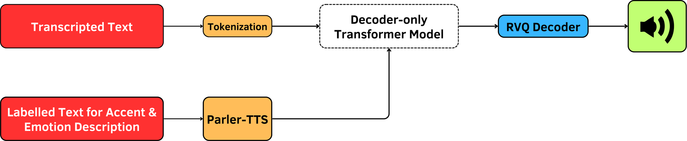

*Figure 2 · [Source](https://arxiv.org/abs/2506.16310)*

### PFluxTTS

PFluxTTS combines two acoustic-generation paths by fusing their predicted vector fields at inference. Sequential reference embeddings support transcript-free cross-language voice cloning, and a super-resolution vocoder reconstructs high-rate output audio.

[Paper](https://arxiv.org/abs/2602.04160) · [Project](https://braskai.github.io/pfluxtts/) · GitHub: no author-linked repository found · [Details](models/diffusion.md#pfluxtts)

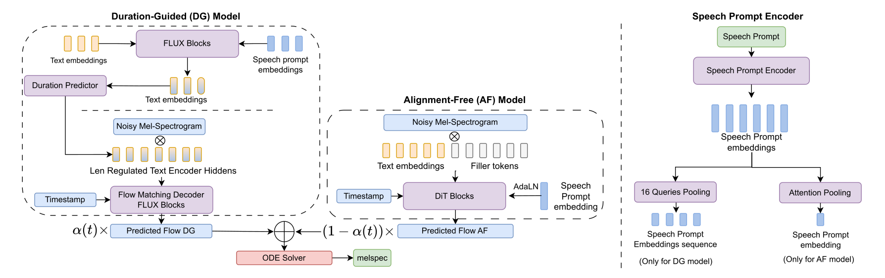

*Figure 1 · [Source](https://arxiv.org/abs/2602.04160)*

### Phoenix TTS

Phoenix TTS aligns its speech tokenizer with the downstream flow-matching acoustic decoder during training. An autoregressive language model predicts the resulting discrete representation, supporting text-to-speech and voice conversion without separating token design from acoustic reconstruction.

[Paper](https://arxiv.org/abs/2608.11737) · GitHub: no author-linked repository found · [Details](models/token-lm.md#phoenix-tts)

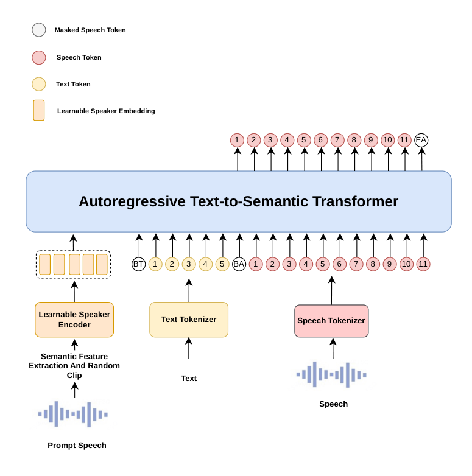

*Figure 2 · [Source](https://arxiv.org/abs/2608.11737)*

### Phoneme-tone adaptive Thai TTS

This Thai speech synthesizer encodes phonemes and tones with a language-specific BERT model, then predicts duration, pitch and energy for a GAN-trained waveform decoder. A reference-derived style vector supports voice cloning. Multilingual pretraining of acoustic feature extractors and Thai adaptation address limited language-specific data.

[Paper](https://arxiv.org/abs/2504.07858) · GitHub: no author-linked repository found · [Details](models/parallel.md#phoneme-tone-adaptive-thai-tts)

*Figure 2 · [Source](https://arxiv.org/abs/2504.07858)*

### PilotTTS

PilotTTS uses paired recordings and Q-Former conditioning to separate a speaker's identity from delivery style. The model supports reference cloning, emotional and nonverbal expression, and Chinese dialect synthesis within a shared autoregressive pipeline.

[Paper](https://arxiv.org/abs/2605.27258) · [GitHub](https://github.com/AMAPVOICE/PilotTTS) · [Details](models/token-lm.md#pilottts)

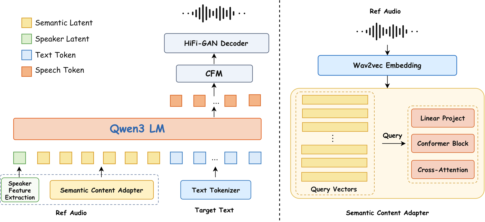

*Figure 3 · [Source](https://arxiv.org/abs/2605.27258)*

### Piper (VITS voices)

VITS voice models exported for local inference.

[GitHub](https://github.com/OHF-Voice/piper1-gpl) · [Docs](https://github.com/rhasspy/piper/blob/master/TRAINING.md) · [Details](models/flow-vae.md#piper)

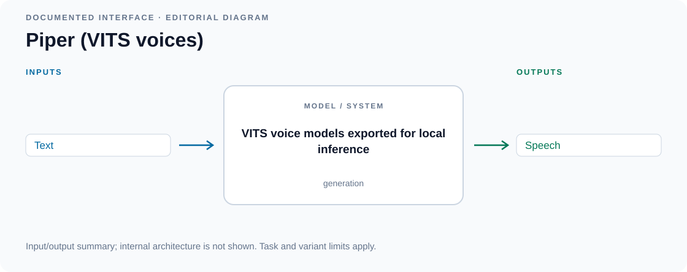

*Editorial input/output diagram · [Source](https://github.com/OHF-Voice/piper1-gpl)*

### Pocket TTS

Pocket TTS uses continuous autoregressive speech modeling with a flow-based output mechanism, avoiding long sequences of discrete acoustic codebooks. It combines a small language-model backbone with streaming audio reconstruction and reusable voice conditioning. The project targets CPU-based speech synthesis; language-specific models and runtime choices affect its speed and voice behavior.

[GitHub](https://github.com/kyutai-labs/pocket-tts) · [Paper](https://arxiv.org/abs/2509.06926) · [Details](models/continuous-lm.md#pocket-tts)

*Figure 1 · [Source](https://arxiv.org/abs/2509.06926)*

### PortaSpeech

Variational acoustic model and flow-based post-net.

[Paper](https://arxiv.org/abs/2109.15166) · [Details](models/flow-vae.md#portaspeech)

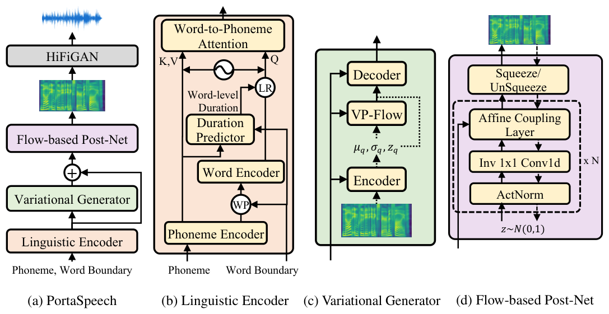

*Figure 1, PDF p. 4 · [Source](https://arxiv.org/abs/2109.15166)*

### PROEMO

PROEMO combines emotional prompts with an explicit intensity control in a multi-speaker synthesizer. The conditioning adjusts delivery strength and prosodic variation, allowing the same spoken text to be rendered with different emotional performances.

[Paper](https://arxiv.org/abs/2501.06276) · GitHub: no author-linked repository found · [Details](models/parallel.md#proemo)

*Figure 1 · [Source](https://arxiv.org/abs/2501.06276)*

### Progressive face-conditioned TTS

This face-conditioned synthesizer combines local facial regions into progressively broader visual representations. Joint visual and acoustic attribute learning and multiple photographs of each training speaker align the face representation with voice characteristics, conditioning speech generation on text and a face image.

[Paper](https://arxiv.org/abs/2509.07376) · GitHub: no author-linked repository found · [Details](models/flow-vae.md#progressive-face-conditioned-tts)

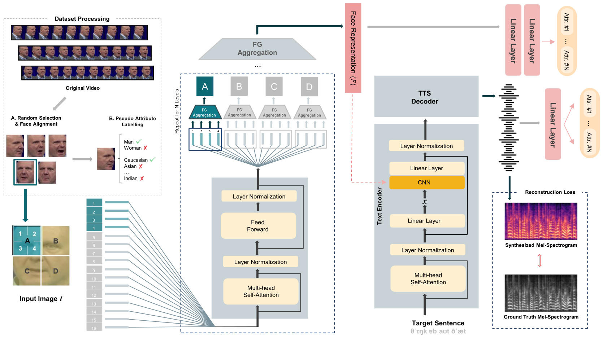

*Figure 1 · [Source](https://arxiv.org/abs/2509.07376)*

### Prompt-Unseen-Emotion

Prompt-Unseen-Emotion learns the relationship between emotion descriptions and speech using a language-model synthesis backbone. Weighted combinations of known emotions and contextual language knowledge allow expressive delivery outside the original categorical training labels.

[Paper](https://arxiv.org/abs/2506.02742) · GitHub: no author-linked repository found · [Details](models/token-lm.md#prompt-unseen-emotion)

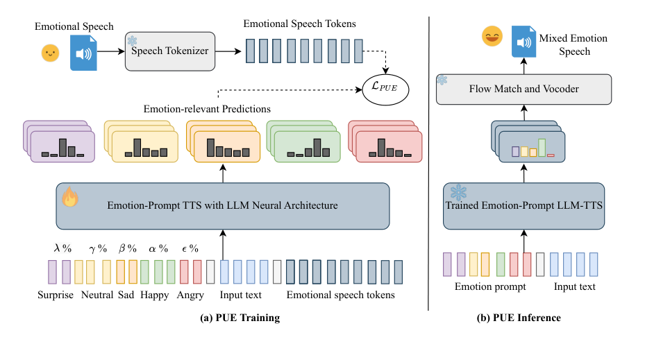

*Paper figure · [Source](https://arxiv.org/abs/2506.02742)*

### PromptTTS

Style and content text encoders with a speech decoder.

[Paper](https://arxiv.org/abs/2211.12171) · [Details](models/parallel.md#prompttts)

*Figure 1 · [Source](https://arxiv.org/abs/2211.12171)*

### PromptTTS 2

Prompt-conditioned TTS with a diffusion variation network.

[Paper](https://arxiv.org/abs/2309.02285) · [Details](models/diffusion.md#prompttts-2)

*Figure 1 · [Source](https://arxiv.org/abs/2309.02285)*

### ProtoDisent-TTS

ProtoDisent-TTS learns a codebook of healthy and dysarthric articulation patterns separately from speaker identity. Adversarial constraints reduce pathological information in the speaker representation, enabling controlled synthesis of articulation characteristics in a target voice.

[Paper](https://arxiv.org/abs/2602.08696) · [Project](https://mors20.github.io/ProtoDisent-TTS) · GitHub: no author-linked repository found · [Details](models/flow-vae.md#protodisent-tts)

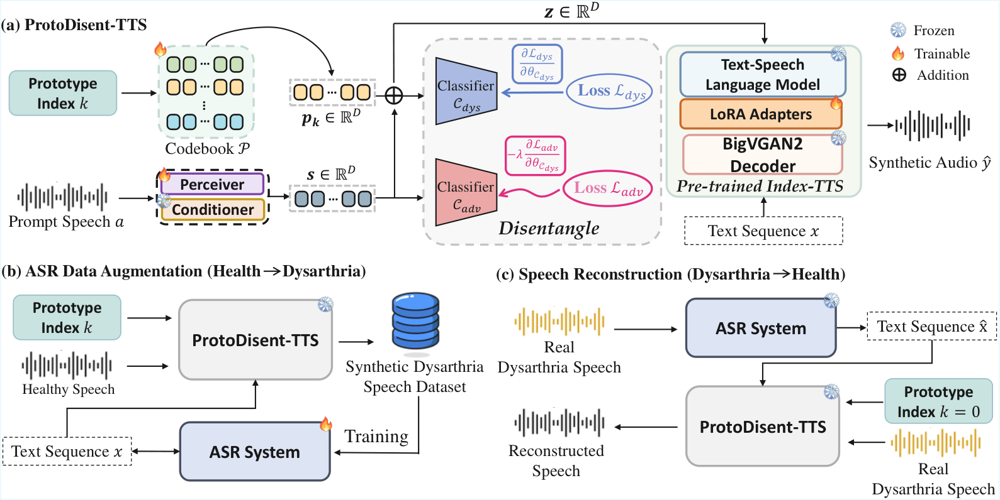

*Figure 1 · [Source](https://arxiv.org/abs/2602.08696)*

### PS-TTS

PS-TTS uses vowel-based alignment to coordinate the timing and phonetic structure of dubbed speech. Its PS-Comet variant also considers semantic preservation when choosing translated text, connecting translation choices with a TTS rendering stage.

[Paper](https://arxiv.org/abs/2604.09111) · GitHub: no author-linked repository found · [Details](models/token-lm.md#ps-tts)

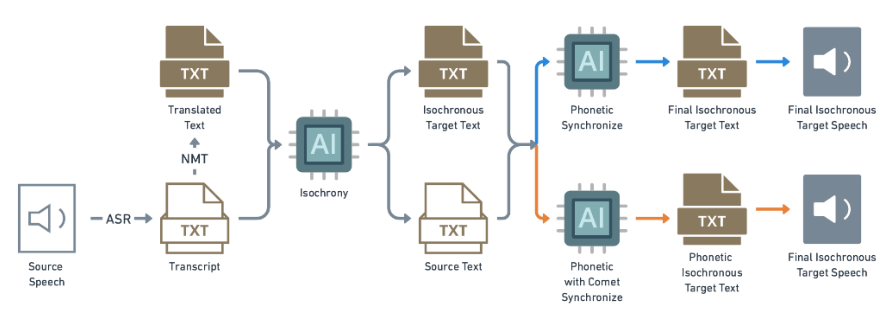

*Fig. 1 (paper page 3) · [Source](https://arxiv.org/abs/2604.09111)*

### QTTS

QTTS predicts residual speech codes produced by its QDAC tokenizer. Hierarchical parallel and delayed multihead variants organize codebook dependencies differently, offering alternative balances between acoustic detail and sequential decoding cost.

[Paper](https://arxiv.org/abs/2507.12197) · GitHub: no author-linked repository found · [Details](models/token-lm.md#qtts)

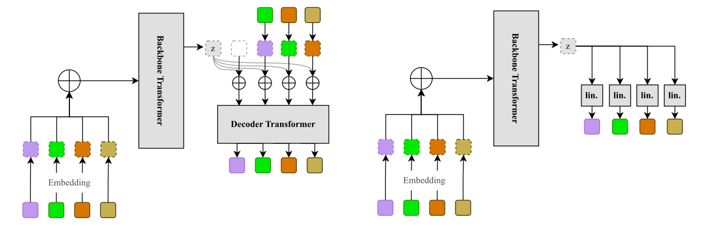

*Figure 2 · [Source](https://arxiv.org/abs/2507.12197)*

### Qwen-Audio-3.0-TTS

Qwen-Audio-3.0-TTS combines compact semantic speech tokens with progressively trained language and acoustic models. Natural-language instructions and inline tags control delivery, while multilingual reference conditioning supports voice cloning and longer speech generation under varied recording conditions.

[Paper](https://arxiv.org/abs/2607.23938) · [Project](https://qwenaudio.github.io/FunAudioLLM.github.io/qwen-audio-3.0-tts/) · GitHub: no author-linked repository found · [Details](models/token-lm.md#qwen-audio-3-0-tts)

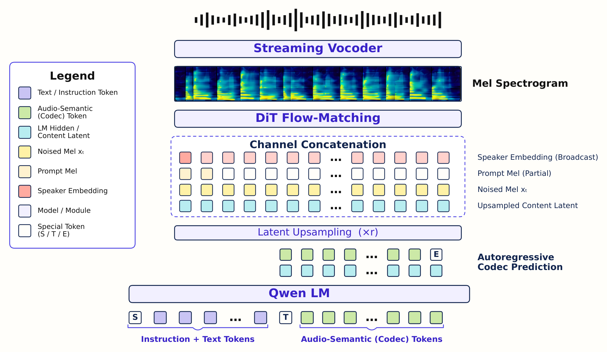

*Figure 3 · [Source](https://arxiv.org/abs/2607.23938)*

### Qwen3-TTS

Qwen3-TTS combines a dual-track speech language model with tokenizers designed for compact streaming audio. The released 12Hz line separates Base voice cloning, CustomVoice preset-speaker control and VoiceDesign creation from descriptions. These variants support different conditioning interfaces, allowing applications to choose between reproducing a reference voice and directing a new voice through text.

[Paper](https://arxiv.org/abs/2601.15621) · [GitHub](https://github.com/QwenLM/Qwen3-TTS) · [Details](models/token-lm.md#qwen3-tts)

*Figure 3 · [Source](https://arxiv.org/abs/2601.15621)*

### RADKA-CSS

RADKA-CSS retrieves dialogue examples related to the current conversation in both meaning and delivery. A graph-based aggregation mechanism combines their style information with current context, conditioning expressive conversational speech synthesis.

[Paper](https://arxiv.org/abs/2501.06467) · [GitHub](https://github.com/Coder-jzq/RADKA-CSS) · [Project](https://coder-jzq.github.io/RADKA-CSS-Website/index.html#case-study) · [Details](models/token-lm.md#radka-css)

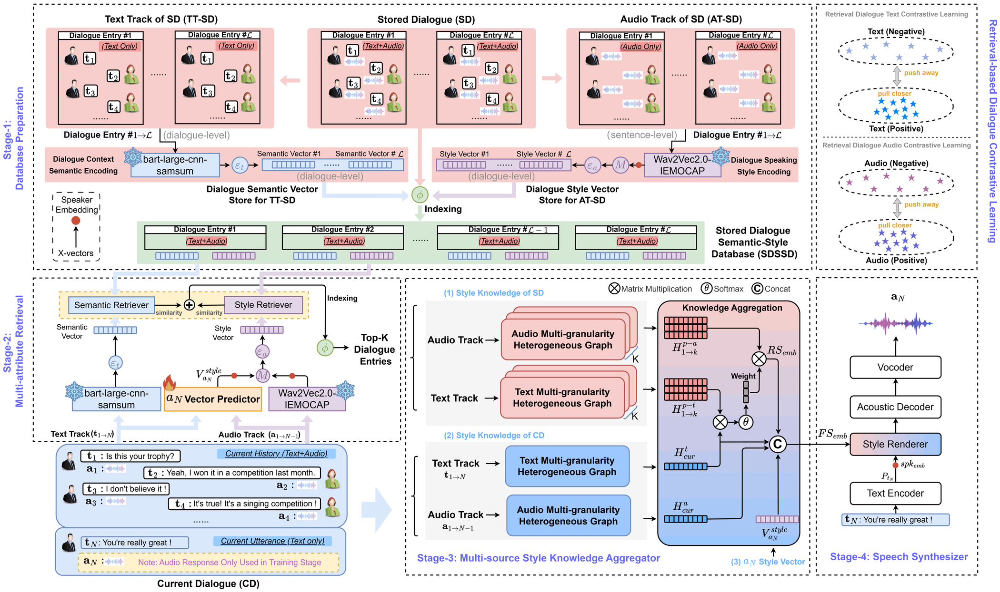

*Figure 2 · [Source](https://arxiv.org/abs/2501.06467)*

### RALL-E

Prosody-guided codec language modeling.

[Paper](https://arxiv.org/abs/2404.03204) · [Details](models/token-lm.md#rall-e)

*Figure 1 · [Source](https://arxiv.org/abs/2404.03204)*

### Raon-OpenTTS

Raon-OpenTTS is a family of reference-conditioned diffusion synthesizers trained on a large, documented English speech collection. The release pairs its models with data processing and evaluation resources, allowing robustness across varied acoustic conditions to be examined alongside clean-speech quality.

[Paper](https://arxiv.org/abs/2605.20830) · [GitHub](https://github.com/krafton-ai/RAON-OpenTTS) · [Details](models/diffusion.md#raon-opentts)

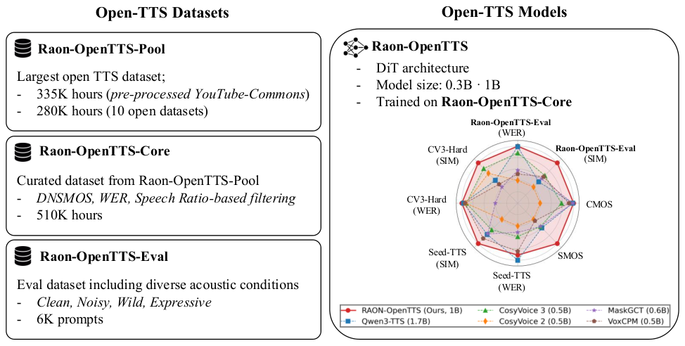

*Figure 1 · [Source](https://arxiv.org/abs/2605.20830)*

### RapFlow-TTS

RapFlow-TTS regularizes the acoustic velocity field so longer generation steps remain consistent. Time-interval scheduling and adversarial objectives improve the resulting few-step synthesizer, reducing the iterations needed to render reference-conditioned speech.

[Paper](https://arxiv.org/abs/2506.16741) · [GitHub](https://github.com/naver-ai/RapFlow-TTS) · [Details](models/diffusion.md#rapflow-tts)

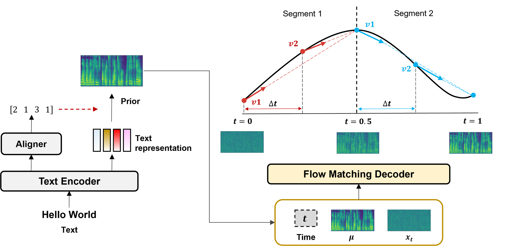

*Figure 1 · [Source](https://arxiv.org/abs/2506.16741)*

### ReGenVoice

ReGenVoice applies the ReGen representation-and-waveform modeling approach to text-to-speech. Multiple levels of generated conditioning help reconstruct detailed waveforms from compressed latents, linking efficient acoustic representation with reference-conditioned speech synthesis.

[Paper](https://arxiv.org/abs/2607.09134) · [Project](https://regenvoice.github.io/demo/) · GitHub: no author-linked repository found · [Details](models/diffusion.md#regenvoice)

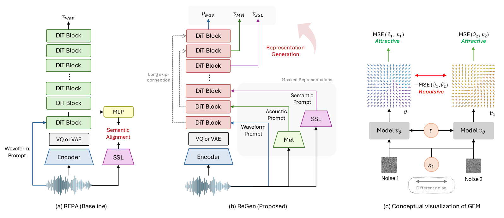

*Figure 1 · [Source](https://arxiv.org/abs/2607.09134)*

### ReStyle-TTS

ReStyle-TTS changes vocal attributes relative to a reference recording. Independent text and reference guidance, composable style adapters and timbre-consistency optimization allow continuous expressive edits while limiting changes to the speaker's identity.

[Paper](https://arxiv.org/abs/2601.03632) · GitHub: no author-linked repository found · [Details](models/diffusion.md#restyle-tts)

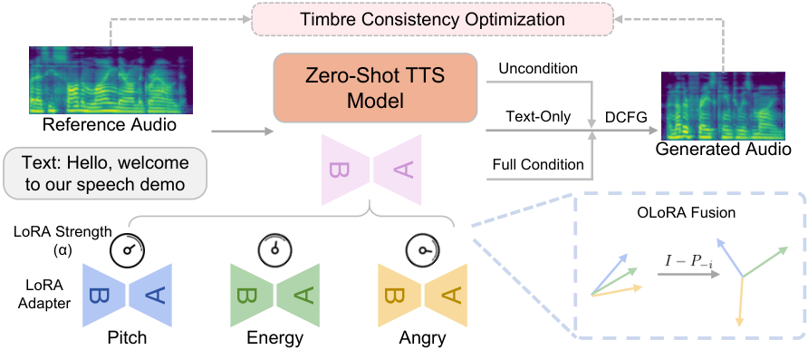

*Figure 1 · [Source](https://arxiv.org/abs/2601.03632)*

### RTFree-F5

RTFree-F5 replaces the transcript normally associated with an F5-TTS reference recording with projected speech features. A lightweight adapter reuses the pretrained generator, enabling transcript-free voice conditioning, including references whose pronunciation makes transcription unreliable.

[Paper](https://arxiv.org/abs/2606.20266) · GitHub: no author-linked repository found · [Details](models/diffusion.md#rtfree-f5)

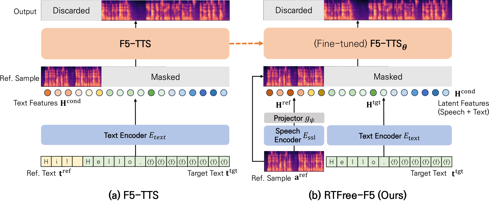

*Figure 1 · [Source](https://arxiv.org/abs/2606.20266)*

### RV-TTS

Revival with Voice learns voice identity from face images and delivery attributes from descriptions. Audio-only training data and stylized portrait augmentation broaden its input coverage, enabling controlled speech from real faces or artistic portraits.

[Paper](https://arxiv.org/abs/2505.18972) · GitHub: no author-linked repository found · [Details](models/diffusion.md#rv-tts)

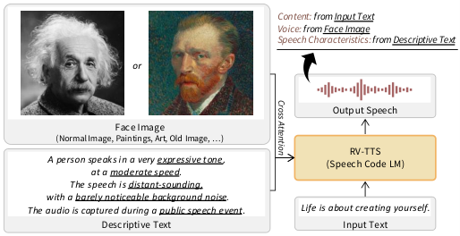

*Figure 1 · [Source](https://arxiv.org/abs/2505.18972)*

### RWKVTTS

RWKVTTS uses the recurrent RWKV-7 architecture for speech synthesis in place of a conventional Transformer backbone. Its token-generation path targets efficient streaming and reduced state-management cost while conditioning audio on the supplied text.

[Paper](https://arxiv.org/abs/2504.03289) · [GitHub](https://github.com/yynil/RWKVTTS) · [Details](models/token-lm.md#rwkvtts)

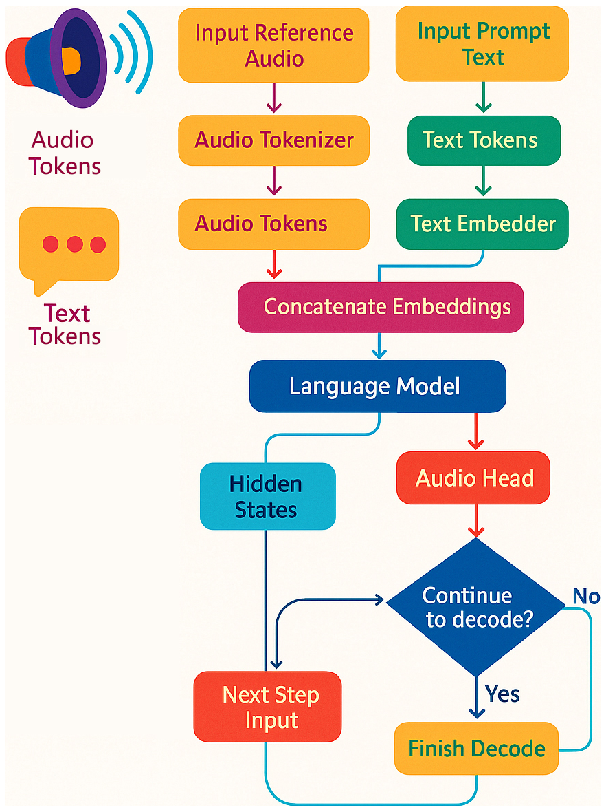

*Figure 2 · [Source](https://arxiv.org/abs/2504.03289)*

### S5-TTS

S5-TTS adapts T5-TTS for word-by-word synthesis using limited future text. Lookahead-aware masks, convolutional auxiliary attention and distillation let the model start speaking before the complete sentence is available while retaining voice conditioning and alignment.

[Paper](https://arxiv.org/abs/2606.21882) · GitHub: no author-linked repository found · [Details](models/token-lm.md#s5-tts)

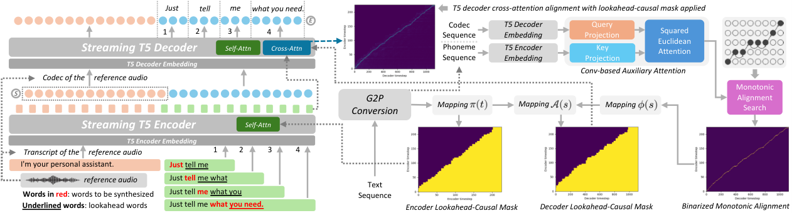

*Figure 1 · [Source](https://arxiv.org/abs/2606.21882)*

### Sarashina2.2-TTS

Sarashina2.2-TTS emphasizes reliable Japanese pronunciation, including characters with several possible readings. Its semantic language model and acoustic flow decoder use reference speech for voice conditioning, with balanced multilingual training to reduce dependence on the reference language.

[Paper](https://arxiv.org/abs/2606.25369) · [GitHub](https://github.com/sbintuitions/sarashina2.2-tts) · [Details](models/token-lm.md#sarashina2-2-tts)

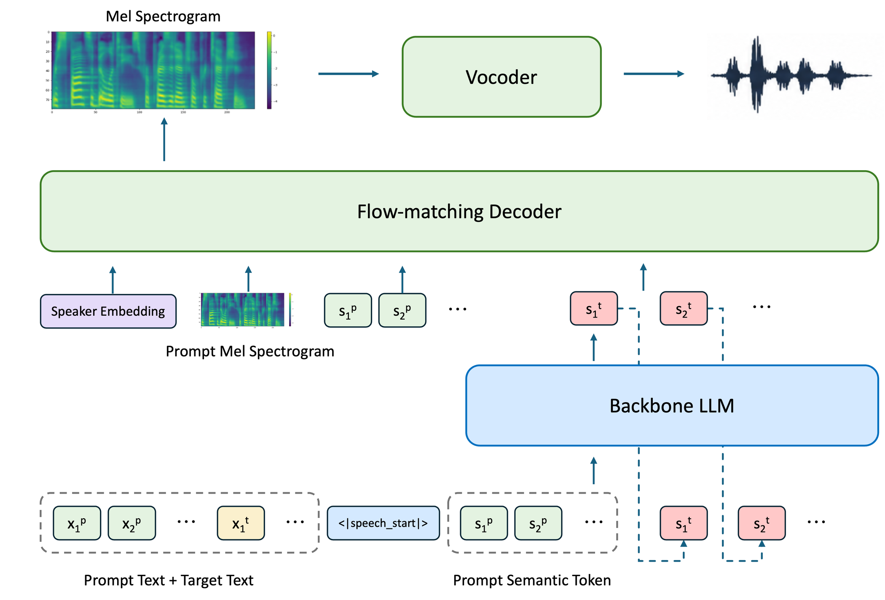

*Figure 1 · [Source](https://arxiv.org/abs/2606.25369)*

### SASLM

SASLM derives expressive intent from its own evolving semantic states through an information bottleneck. Acoustic feedback aligns generated speech with that intent, reducing the need for externally supplied emotion labels in context-sensitive speech rendering.

[Paper](https://arxiv.org/abs/2604.11424) · [GitHub](https://github.com/wangkevin02/SASLM) · [Project](https://wangkevin02.github.io/SASLM/) · [Details](models/continuous-lm.md#saslm)

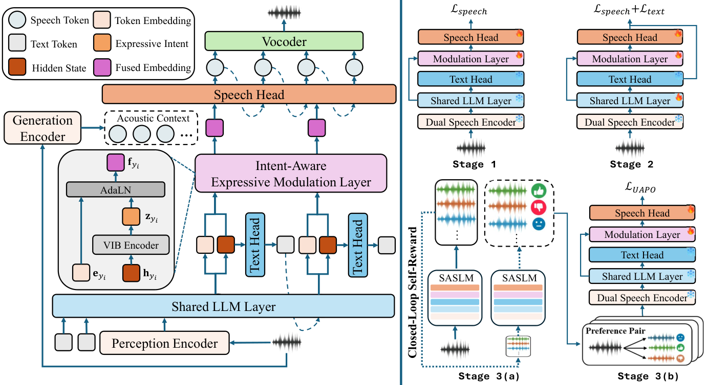

*Figure 3 · [Source](https://arxiv.org/abs/2604.11424)*

### Seed-TTS

Autoregressive speech foundation model.

[Paper](https://arxiv.org/abs/2406.02430) · [Details](models/token-lm.md#seed-tts)

*Figure 1 · [Source](https://arxiv.org/abs/2406.02430)*

### Self-distilled zero-shot TTS

This zero-shot synthesizer learns linguistic content and reference-speaker attributes through separate representations. Two-stage self-distillation creates aligned examples that strengthen their separation, targeting stable voice cloning with a small inference footprint.

[Paper](https://arxiv.org/abs/2501.08566) · GitHub: no author-linked repository found · [Details](models/compact.md#self-distilled-zero-shot-tts)

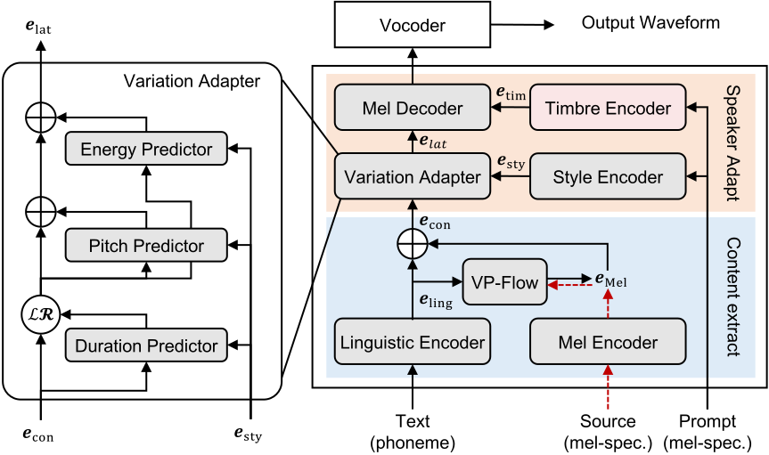

*Figure 1 · [Source](https://arxiv.org/abs/2501.08566)*

### SelfTTS

SelfTTS learns separate representations of a speaker's identity and emotional delivery using contrastive and adversarial objectives. It then improves synthesis through self-generated training examples, allowing emotion transfer to speakers originally recorded with neutral expression.

[Paper](https://arxiv.org/abs/2603.22252) · [GitHub](https://github.com/AI-Unicamp/SelfTTS) · [Project](https://ai-unicamp.github.io/publications/tts/selftts/) · [Details](models/flow-vae.md#selftts)

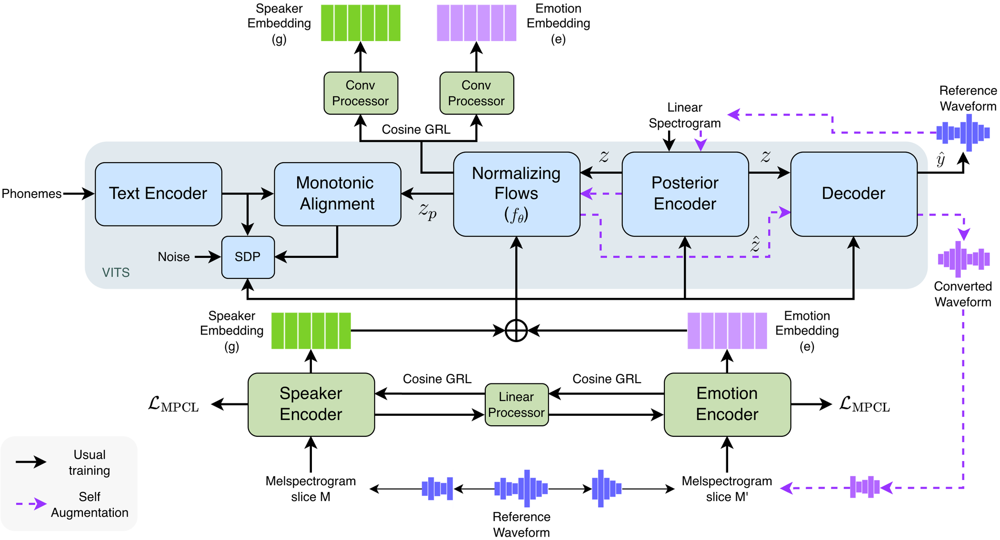

*Figure 1 · [Source](https://arxiv.org/abs/2603.22252)*

### SemaVoice

SemaVoice organizes its audio VAE latents using guidance from speech foundation-model representations. A continuous autoregressive backbone and patch-level diffusion head then synthesize reference-conditioned speech with greater emphasis on linguistic coherence.

[Paper](https://arxiv.org/abs/2605.16964) · GitHub: no author-linked repository found · [Details](models/continuous-lm.md#semavoice)

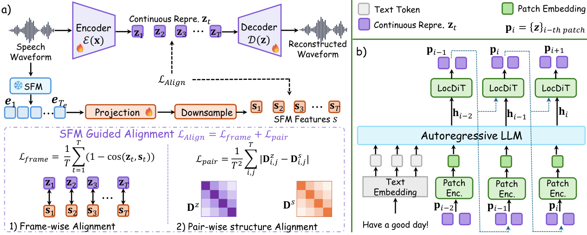

*Figure 1 · [Source](https://arxiv.org/abs/2605.16964)*

### SemBridge

SemBridge uses discrete semantic targets during training to organize both acoustic latents and language-model hidden states. The resulting continuous generator supports zero-shot speech synthesis with stronger content alignment, without needing to generate the auxiliary semantic tokens during inference.

[Paper](https://arxiv.org/abs/2608.07462) · [GitHub](https://github.com/ASLP-lab/SemBridge) · [Details](models/continuous-lm.md#sembridge)

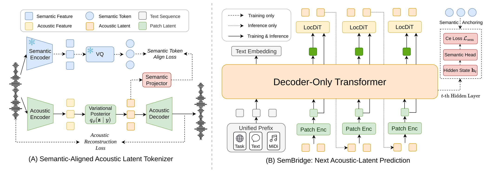

*Figure 1 · [Source](https://arxiv.org/abs/2608.07462)*

### Shallow Flow Matching TTS

Shallow Flow Matching adds a lightweight head that predicts an intermediate acoustic state for a flow-based synthesizer. Starting refinement closer to the target reduces the remaining generation path, allowing coarse-to-fine speech synthesis with less iterative work.

[Paper](https://arxiv.org/abs/2505.12226) · [GitHub](https://github.com/ydqmkkx/ShallowFlowMatching-TTS) · [Details](models/diffusion.md#shallow-flow-matching-tts)

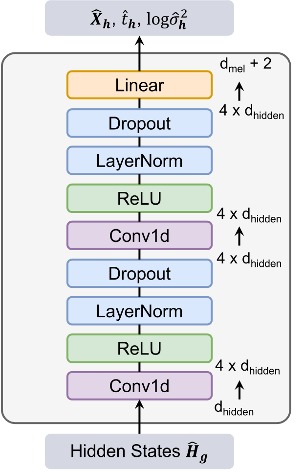

*Figure 2 · [Source](https://arxiv.org/abs/2505.12226)*

### SLED

SLED learns the conditional distribution of acoustic latents using an energy-distance objective rather than discrete token classification. Its autoregressive generator samples continuous speech representations, simplifying synthesis while retaining acoustic detail.

[Paper](https://arxiv.org/abs/2505.13181) · [GitHub](https://github.com/ictnlp/SLED-TTS) · [Details](models/continuous-lm.md#sled)

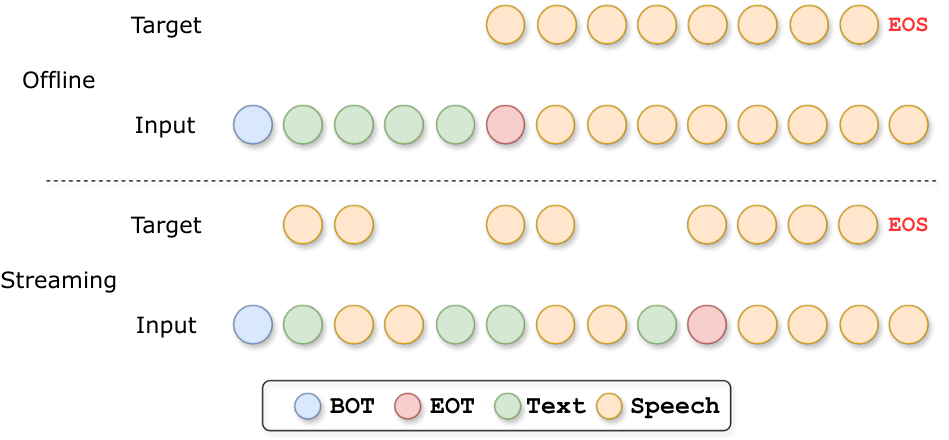

*Figure 2 · [Source](https://arxiv.org/abs/2505.13181)*

### SlimSpeech

SlimSpeech reduces the parameter count of a rectified-flow TTS model and transfers knowledge into a lightweight generator. It targets efficient reference-conditioned speech synthesis while retaining the acoustic quality of a larger teacher.

[Paper](https://arxiv.org/abs/2504.07776) · GitHub: no author-linked repository found · [Details](models/compact.md#slimspeech)

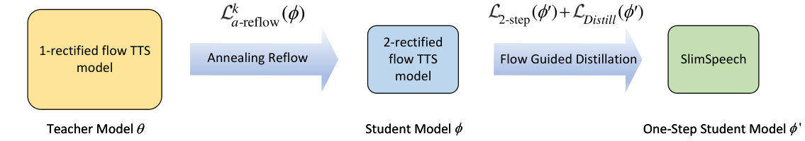

*Paper figure · [Source](https://arxiv.org/abs/2504.07776)*

### SMLLE

SMLLE uses a transducer to align incoming text with semantic speech tokens and duration information. A separate autoregressive stage generates acoustic frames, with controlled access to future text stabilizing incremental synthesis.

[Paper](https://arxiv.org/abs/2505.19669) · [Project](https://shy-98.github.io/SMLLE_demo_page/) · GitHub: no author-linked repository found · [Details](models/token-lm.md#smlle)

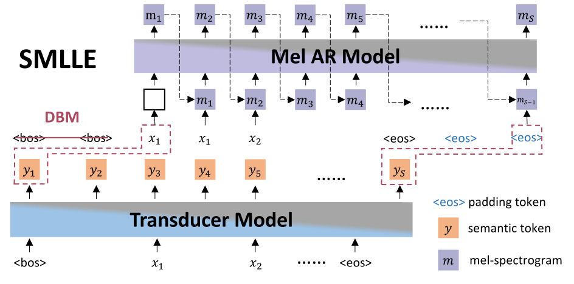

*Figure 1 · [Source](https://arxiv.org/abs/2505.19669)*

### SoulX-Podcast

SoulX-Podcast synthesizes conversational scripts with reference voices, dialect choices and nonverbal expression. Its long-form training targets consistent speaker identity and natural transitions across turns, while also supporting ordinary single-speaker TTS.

[Paper](https://arxiv.org/abs/2510.23541) · [GitHub](https://github.com/Soul-AILab/SoulX-Podcast) · [Project](https://soul-ailab.github.io/soulx-podcast/) · [Details](models/token-lm.md#soulx-podcast)

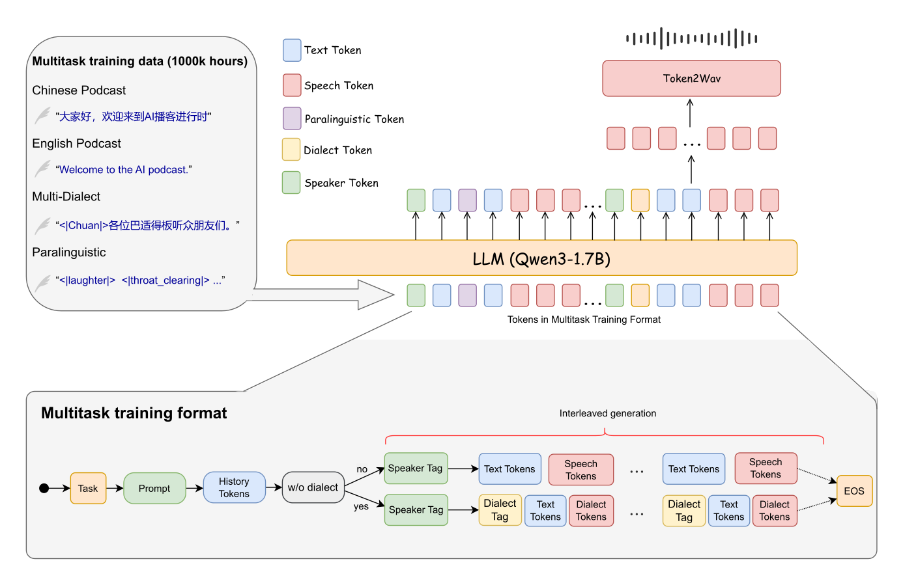

*Figure 3 · [Source](https://arxiv.org/abs/2510.23541)*

### Spark-TTS

Spark-TTS uses BiCodec to separate changing linguistic content from global speaker attributes, then predicts these tokens with a Qwen2.5 backbone. That separation supports both reference-based cloning and direct control of attributes such as speaking rate and pitch. It is useful for controllable speech generation where a reference recording alone is insufficient to specify the desired delivery.

[Paper](https://arxiv.org/abs/2503.01710) · [GitHub](https://github.com/SparkAudio/Spark-TTS) · [Details](models/token-lm.md#spark-tts)

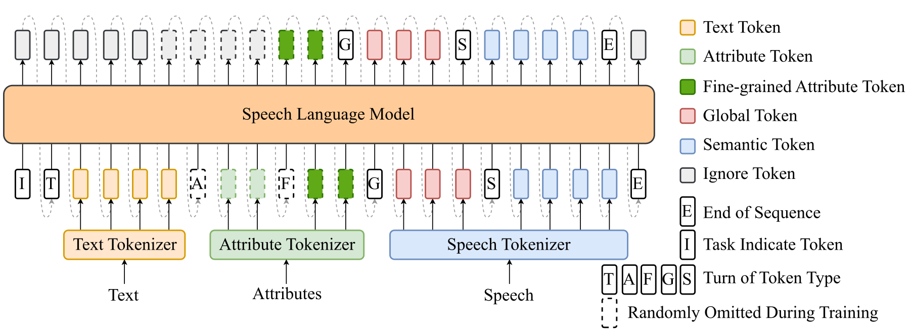

*Figure 3 · [Source](https://arxiv.org/abs/2503.01710)*

### SpeakStream

SpeakStream trains on text interleaved with corresponding speech and generates audio as new text becomes available. The synthesis module remains compatible with an upstream text-streaming language model, supporting responsive conversational playback.

[Paper](https://arxiv.org/abs/2505.19206) · [Project](https://apple.github.io/speakstream-demo) · GitHub: no author-linked repository found · [Details](models/continuous-lm.md#speakstream)

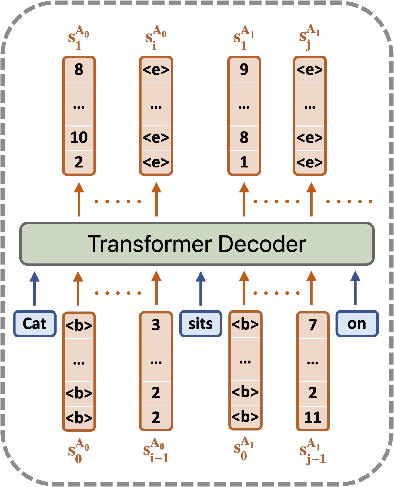

*Paper figure · [Source](https://arxiv.org/abs/2505.19206)*

### SPEAR-TTS

Text-to-semantic and semantic-to-acoustic LMs.

[Paper](https://arxiv.org/abs/2302.03540) · [Details](models/token-lm.md#spear-tts)

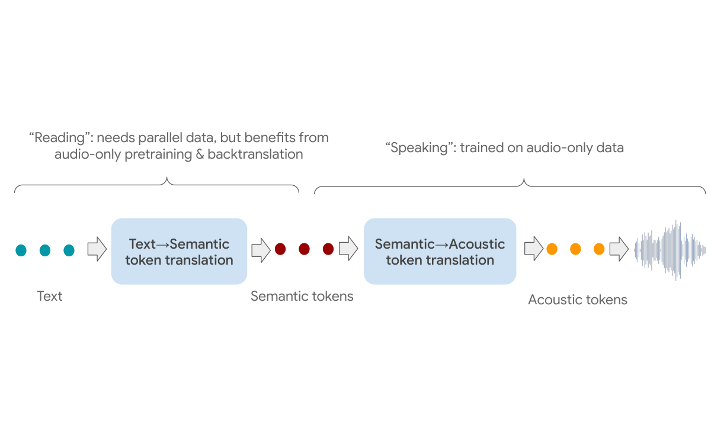

*Figure 1 · [Source](https://arxiv.org/abs/2302.03540)*

### SpeechAccentLLM

SpeechAccentLLM uses a content tokenizer trained with transcription alignment and jointly learns accent conversion and synthesis. A reconstruction refinement stage improves generated speech while separating accent-related changes from the target speaker's identity.

[Paper](https://arxiv.org/abs/2507.01348) · GitHub: no author-linked repository found · [Details](models/token-lm.md#speechaccentllm)

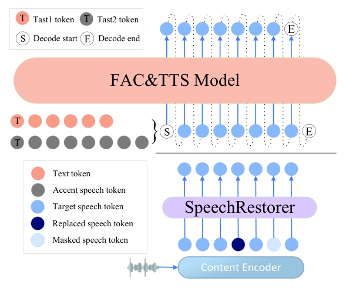

*Figure 3 · [Source](https://arxiv.org/abs/2507.01348)*

### SpeechEdit

SpeechEdit combines text, instruction tokens and reference audio in a shared codec-language-model sequence. Paired examples that differ in selected attributes teach localized changes while retaining other aspects of the reference voice and delivery.

[Paper](https://arxiv.org/abs/2601.12480) · [Project](https://speech-editing.github.io/speech-editing/) · GitHub: no author-linked repository found · [Details](models/token-lm.md#speechedit)

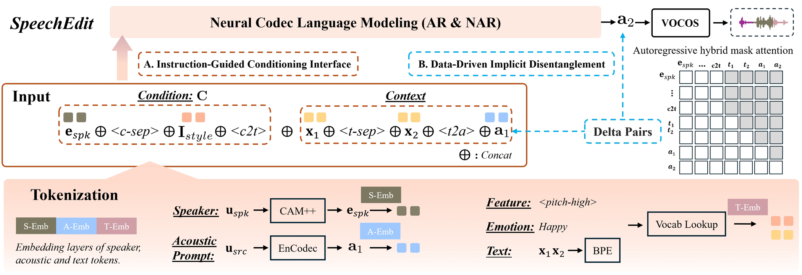

*Figure 1 · [Source](https://arxiv.org/abs/2601.12480)*

### SpeechT5

Shared encoder–decoder with modality interfaces.

[Paper](https://arxiv.org/abs/2110.07205) · [Details](models/autoregressive.md#speecht5)

*Figure 2 · [Source](https://arxiv.org/abs/2110.07205)*

### SpeechX

Prompted neural codec language model.

[Paper](https://arxiv.org/abs/2308.06873) · [Details](models/token-lm.md#speechx)

*Figure 1 · [Source](https://arxiv.org/abs/2308.06873)*

### SpeedySpeech

Residual convolutional acoustic model with duration expansion.

[Paper](https://arxiv.org/abs/2008.03802) · [Details](models/parallel.md#speedyspeech)

*Figure 3 · [Source](https://arxiv.org/abs/2008.03802)*

### Spotlight-TTS

Spotlight-TTS extracts expressive reference information primarily from voiced speech and adjusts the resulting style direction before acoustic generation. The method targets more faithful expression transfer; the catalog combines its related paper records under one model.

[Paper 1](https://arxiv.org/abs/2511.14824) · [Paper 2](https://arxiv.org/abs/2505.20868) · GitHub: no author-linked repository found · [Details](models/diffusion.md#spotlight-tts)

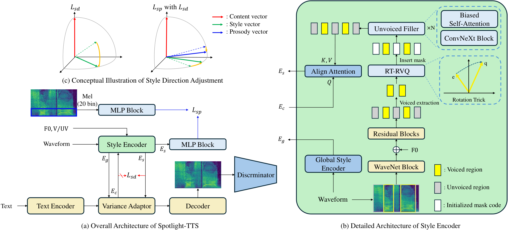

*Figure 1 · [Source](https://arxiv.org/abs/2505.20868)*

### StellarTTS

StellarTTS encodes phoneme timing sparsely and uses a lightweight masked Transformer to generate speech tokens in parallel. A semantic-aware codec supports waveform reconstruction, while explicit timing representations provide control over pronunciation, duration and prosody.

[Paper](https://arxiv.org/abs/2607.19859) · [Project](https://stellartts.github.io/) · GitHub: no author-linked repository found · [Details](models/compact.md#stellartts)

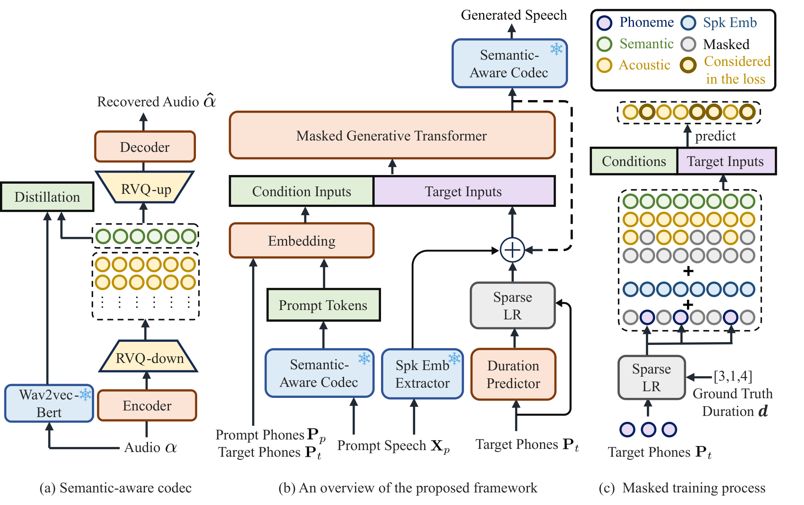

*Paper figure · [Source](https://arxiv.org/abs/2607.19859)*

### Step-Audio-EditX

Step-Audio-EditX supports reference-based synthesis and repeated edits to emotion, speaking style or nonverbal delivery. Training on deliberately contrasting synthetic examples teaches the model to follow expressive changes without a separate attribute-embedding module.

[Paper](https://arxiv.org/abs/2511.03601) · [GitHub](https://github.com/stepfun-ai/Step-Audio-EditX) · [Details](models/token-lm.md#step-audio-editx)

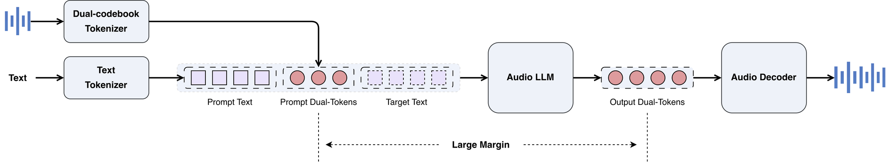

*Figure 2 · [Source](https://arxiv.org/abs/2511.03601)*

### Step-Audio-TTS

Step-Audio-TTS is the compact synthesis component produced through the broader Step-Audio speech-data and distillation pipeline. Text and voice conditioning drive speech-token generation, while the released workflow exposes delivery controls. The TTS checkpoint is used to render supplied content; reasoning, tool use and dialogue management belong to other components of the system.

[Paper](https://arxiv.org/abs/2502.11946) · [GitHub](https://github.com/stepfun-ai/Step-Audio) · [Details](models/token-lm.md#step-audio-tts)

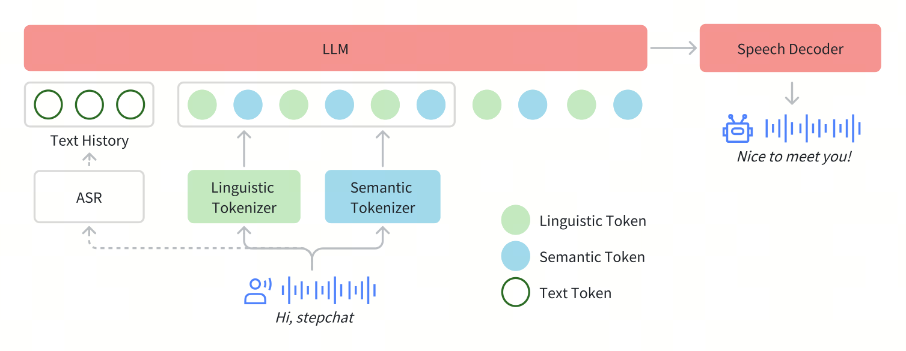

*Figure 2 · [Source](https://arxiv.org/abs/2502.11946)*

### StepAudio 2.5 TTS

The TTS mode of StepAudio 2.5 uses a shared speech-language foundation with synthesis-specific decoding and preference training. Rich contextual supervision and feedback target controllable expression; this card describes its speech-rendering path within the broader system.

[Paper](https://arxiv.org/abs/2605.23463) · GitHub: no author-linked repository found · [Details](models/token-lm.md#stepaudio-2-5-tts)

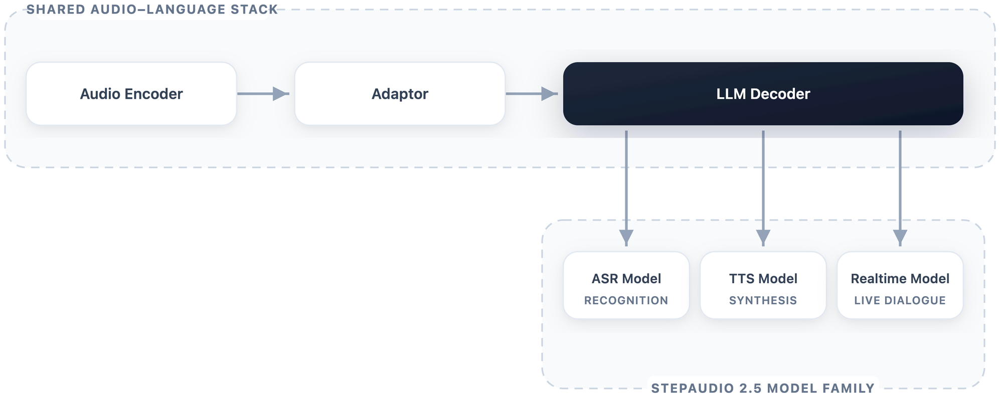

*Figure 1 · [Source](https://arxiv.org/abs/2605.23463)*

### Stochastic-alignment continuous TTS

This synthesizer predicts continuous speech latents using a Gaussian-mixture conditional distribution. A stochastic monotonic alignment mechanism keeps the acoustic sequence ordered against the text, offering an alternative to autoregressive discrete-codec modeling.

[Paper](https://arxiv.org/abs/2502.01084) · GitHub: no author-linked repository found · [Details](models/continuous-lm.md#stochastic-alignment-continuous-tts)

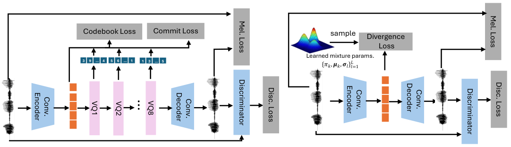

*Figure 1 · [Source](https://arxiv.org/abs/2502.01084)*

### StreamMel

StreamMel alternates text tokens with continuous acoustic frames in one streaming synthesis model. This organization lets incoming text guide speech immediately while retaining reference-voice information across the generated audio stream.

[Paper](https://arxiv.org/abs/2506.12570) · GitHub: no author-linked repository found · [Details](models/continuous-lm.md#streammel)

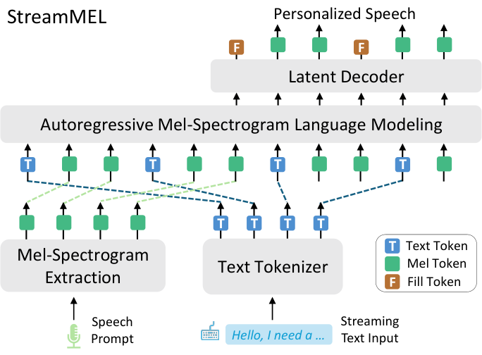

*Paper figure · [Source](https://arxiv.org/abs/2506.12570)*

### StyleTTS

Style-conditioned parallel synthesis with a transferable aligner.

[Paper](https://arxiv.org/abs/2205.15439) · [Details](models/parallel.md#styletts)

*Figure 1 · [Source](https://arxiv.org/abs/2205.15439)*

### StyleTTS 2

Style diffusion and adversarial training with speech-model discriminators.

[Paper](https://arxiv.org/abs/2306.07691) · [Details](models/diffusion.md#styletts-2)

*Figure 1, PDF p. 4 · [Source](https://arxiv.org/abs/2306.07691)*

### Supertonic

The SupertonicTTS research system compresses speech into continuous latents and predicts them from character-level text with flow matching. ConvNeXt blocks, temporal compression and a separate duration predictor keep synthesis compact. The later Supertonic ONNX release exposes preset voice-style assets; its packaged configurations should not be equated with the paper's 44M-parameter research model.

[Model card](https://huggingface.co/Supertone/supertonic) · [Paper](https://arxiv.org/abs/2503.23108) · [GitHub](https://github.com/supertone-inc/supertonic) · [Project](https://supertonictts.github.io/) · [Details](models/compact.md#supertonic)

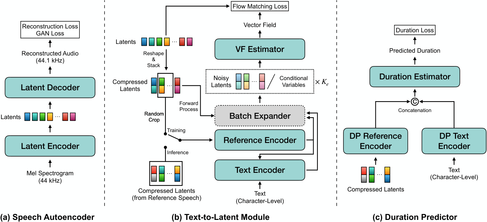

*Figure 1 · [Source](https://arxiv.org/abs/2503.23108)*

### Supertonic 2

Supertonic 2 extends the local ONNX synthesis line to five languages while retaining voice-style conditioning and a compact model. It provides a practical path to multilingual narration on devices that can run the supplied inference stack. Creating a new voice-style asset is a separate workflow from generating speech with an existing asset.

[Model card](https://huggingface.co/Supertone/supertonic-2) · [Details](models/compact.md#supertonic-2)

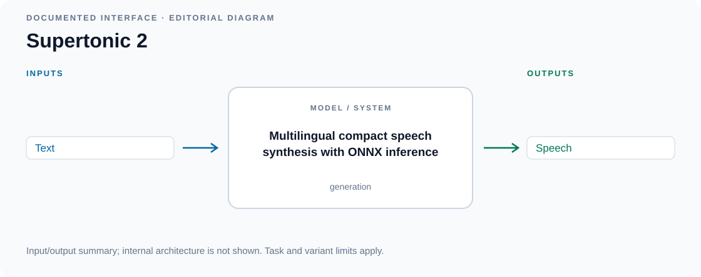

*Editorial input/output diagram · [Source](https://huggingface.co/Supertone/supertonic-2)*

### Supertonic 3

Supertonic 3 expands language coverage and adds expression tags while keeping local ONNX inference and preset voice styles. The release targets more reliable reading across short and long text, with controls for events such as breaths or laughter. Custom voice-style creation is offered through a separate service; downloaded styles can then condition local synthesis.

[Model card](https://huggingface.co/Supertone/supertonic-3) · [Details](models/compact.md#supertonic-3)

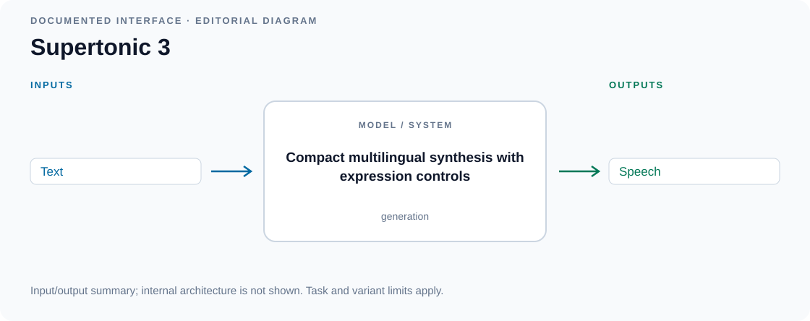

*Editorial input/output diagram · [Source](https://huggingface.co/Supertone/supertonic-3)*

### SwanVoice

SwanVoice generates monologues or dialogues with up to four speakers using raw text, voice references and speaker-turn conditions. Pause markers and optional pronunciation substitutions provide textual control, while staged dialogue training supports longer expressive speech.

[Paper](https://arxiv.org/abs/2605.30993) · [Project](https://swanaigc.github.io/#/swanvoice) · GitHub: no author-linked repository found · [Details](models/diffusion.md#swanvoice)

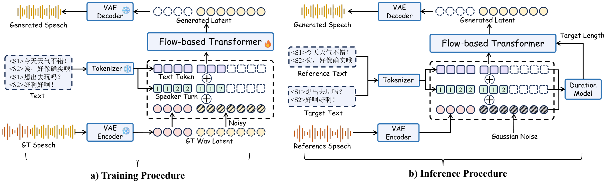

*Figure 2 · [Source](https://arxiv.org/abs/2605.30993)*

### SyncSpeech

SyncSpeech uses a temporal masking scheme to coordinate sequential speech structure with parallel token decoding. This hybrid organization targets faster first audio and higher throughput while retaining reference-conditioned synthesis quality.

[Paper](https://arxiv.org/abs/2502.11094) · [Project](https://SyncSpeech.github.io/) · GitHub: no author-linked repository found · [Details](models/token-lm.md#syncspeech)

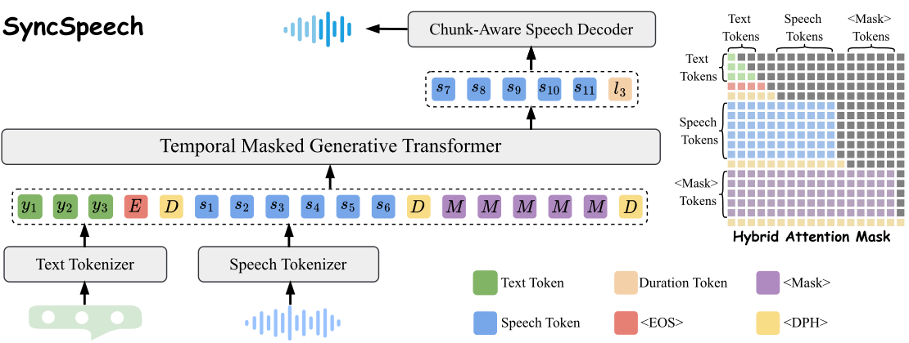

*Figure 1 · [Source](https://arxiv.org/abs/2502.11094)*

### Tacotron

Attention-based recurrent spectrogram synthesis.

[Paper](https://arxiv.org/abs/1703.10135) · [Details](models/autoregressive.md#tacotron)

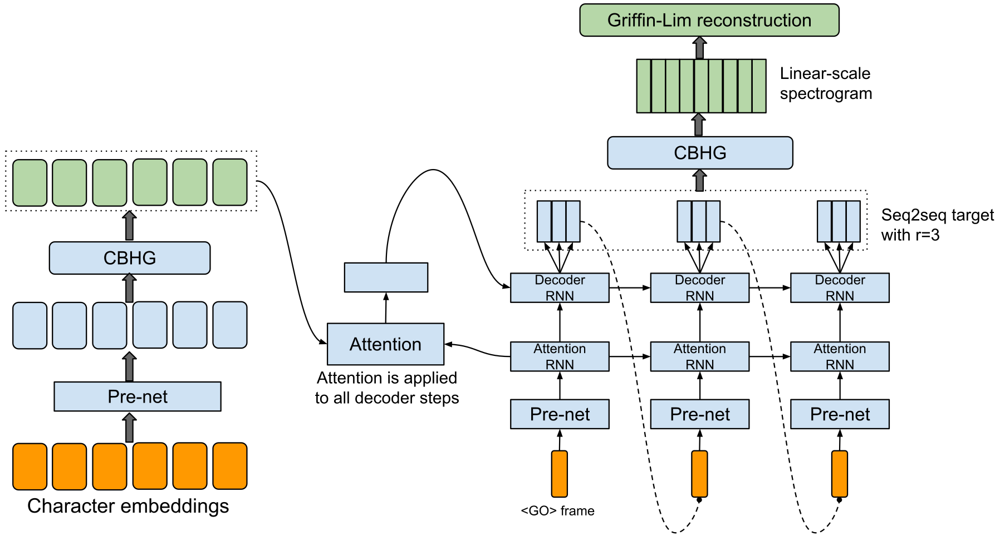

*Figure 1 · [Source](https://arxiv.org/abs/1703.10135)*

### Tacotron 2

Recurrent attention model and WaveNet vocoder.

[Paper](https://arxiv.org/abs/1712.05884) · [Details](models/autoregressive.md#tacotron-2)

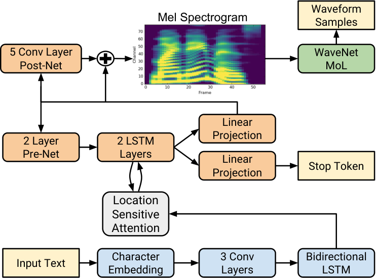

*Figure 1 · [Source](https://arxiv.org/abs/1712.05884)*

### TADA

TADA aligns text tokens one-to-one with continuous acoustic units. A language model with a flow-matching head predicts these synchronized representations, reducing the ambiguity of text-speech alignment during reference-conditioned synthesis.

[Paper](https://arxiv.org/abs/2602.23068) · [GitHub](https://github.com/HumeAI/tada) · [Details](models/continuous-lm.md#tada)

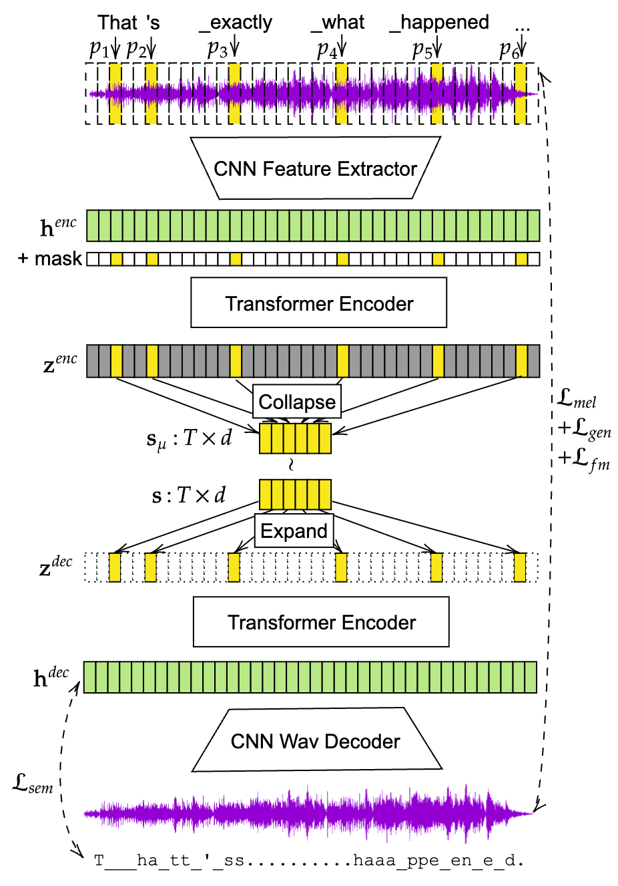

*Figure 2 · [Source](https://arxiv.org/abs/2602.23068)*

### TED-TTS

TED-TTS modifies conditioning and decoding in a pretrained zero-shot synthesizer to control different parts of an utterance. Segment-specific emotion masks and duration steering support local changes while coordinating transitions and the overall stopping point.

[Paper](https://arxiv.org/abs/2601.03170) · [GitHub](https://github.com/Simon-leong/TED-TTS) · [Details](models/token-lm.md#ted-tts)

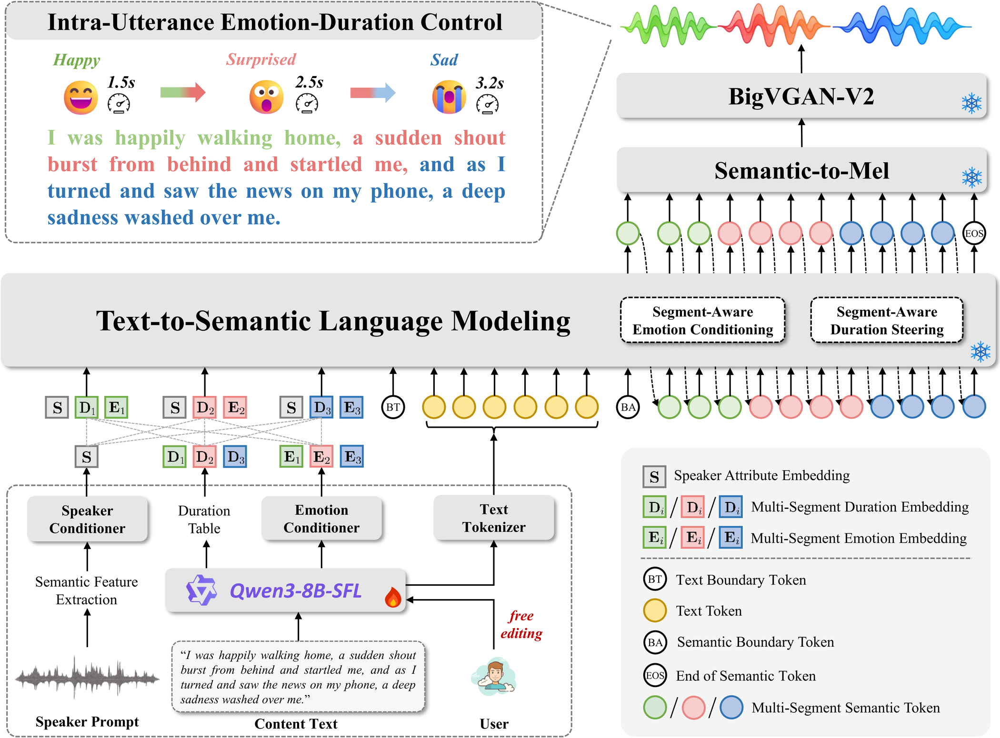

*Figure 1 · [Source](https://arxiv.org/abs/2601.03170)*

### Tibetan-TTS

Tibetan-TTS adapts a large speech generator through language-specific text representation, tokenizer changes and cross-language training. Its data preparation and quality enhancement target scarce Tibetan recordings and the differences between written forms and spoken pronunciation.

[Paper](https://arxiv.org/abs/2605.02496) · GitHub: no author-linked repository found · [Details](models/token-lm.md#tibetan-tts)

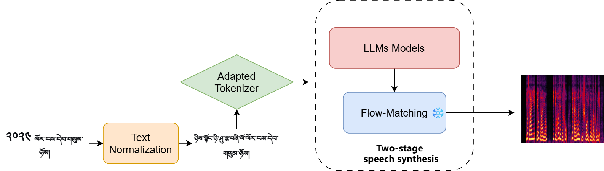

*Figure 2 · [Source](https://arxiv.org/abs/2605.02496)*

### TinyWave

TinyWave is a family of compact models trained for mixed text-speech continuation and speech generation from phonetic or expressive tokens. Distillation transfers capabilities into smaller backbones, supporting controllable audio rendering alongside broader speech-language tasks.

[Paper](https://arxiv.org/abs/2506.23670) · [GitHub](https://github.com/mohammadmahdinoori/TinyWave) · [Project](https://mohammadmahdinoori.github.io/tinywave-landing/) · [Details](models/token-lm.md#tinywave)

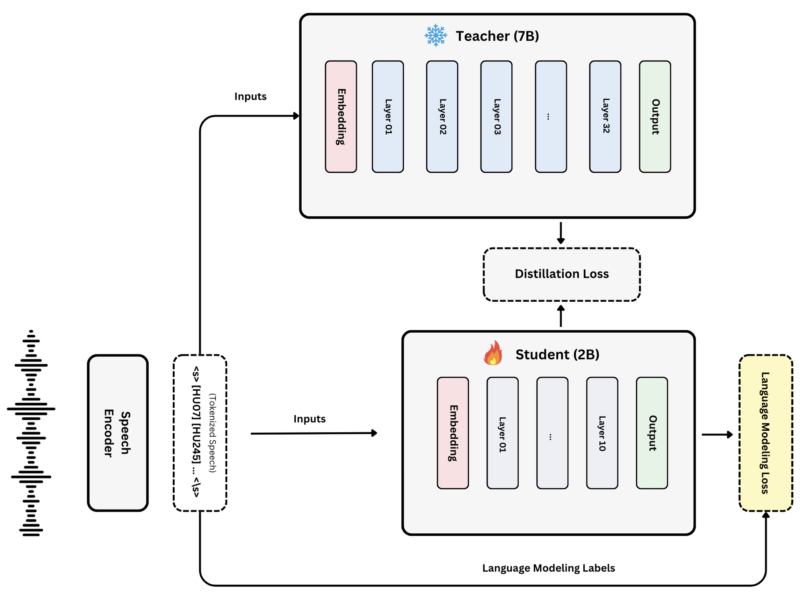

*Figure 1 · [Source](https://arxiv.org/abs/2506.23670)*

### TLDR (TTS)

TLDR groups consecutive speech tokens into learned patches and adapts a pretrained speech language model to predict the shorter sequence. A speaker-conditioned extractor reconstructs the detailed codec tokens, reducing sequential decoding and attention-cache use.

[Paper](https://arxiv.org/abs/2606.09019) · GitHub: no author-linked repository found · [Details](models/token-lm.md#tldr-tts)

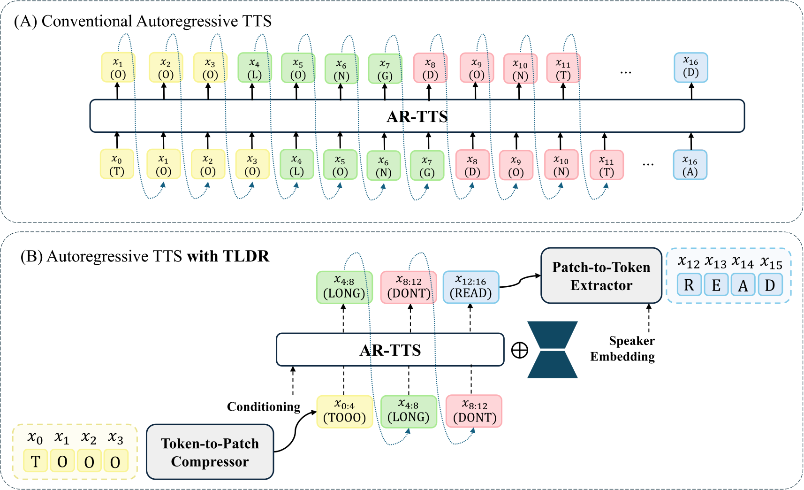

*Figure 1 · [Source](https://arxiv.org/abs/2606.09019)*

### TMD-TTS (formerly FMSD-TTS)

TMD-TTS combines dialect labels with a routing network that models differences among three Tibetan dialects. The framework synthesizes parallel dialectal recordings from text, supporting both multi-dialect TTS and downstream speech-conversion research. The earlier FMSD-TTS preprint was withdrawn in favor of the restructured TMD-TTS paper.

[Paper 1](https://arxiv.org/abs/2509.18060) · [Paper 2](https://arxiv.org/abs/2505.14351) · GitHub: no author-linked repository found · [Details](models/diffusion.md#tmd-tts)

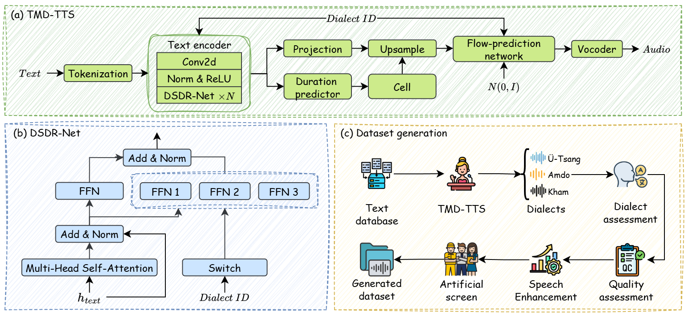

*Figure 1 · [Source](https://arxiv.org/abs/2509.18060)*

### TontaubeV1

TontaubeV1 assigns a large Transformer to semantic speech tokens and smaller Transformers to successive acoustic refinements. Character-level text, synchronized position markers and a causal waveform reconstruction path support long recordings and streaming voice cloning, primarily in English and German.

[Paper](https://arxiv.org/abs/2609.08703) · [GitHub](https://github.com/craitech/tontaube) · [Details](models/token-lm.md#tontaubev1)

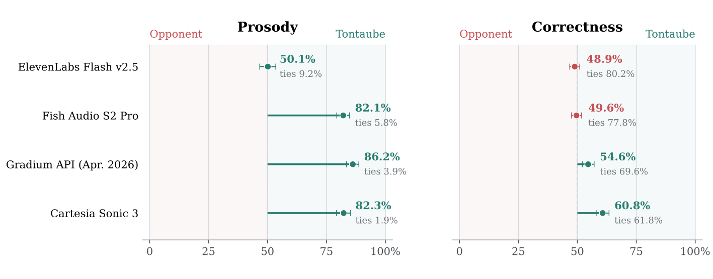

*Figure 2 · [Source](https://arxiv.org/abs/2609.08703)*

### Tortoise TTS

Autoregressive transformer and diffusion decoder.

[Paper](https://arxiv.org/abs/2305.07243) · [GitHub](https://github.com/neonbjb/tortoise-tts) · [Details](models/token-lm.md#tortoise-tts)

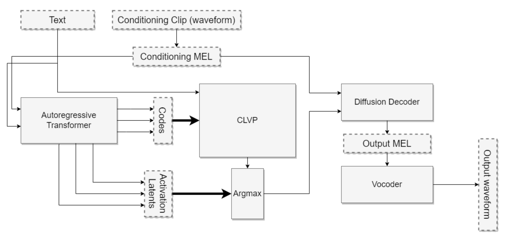

*Figure 1 · [Source](https://arxiv.org/abs/2305.07243)*

### Transformer TTS

Autoregressive Transformer and WaveNet vocoder.

[Paper](https://arxiv.org/abs/1809.08895) · [Details](models/autoregressive.md#transformer-tts)

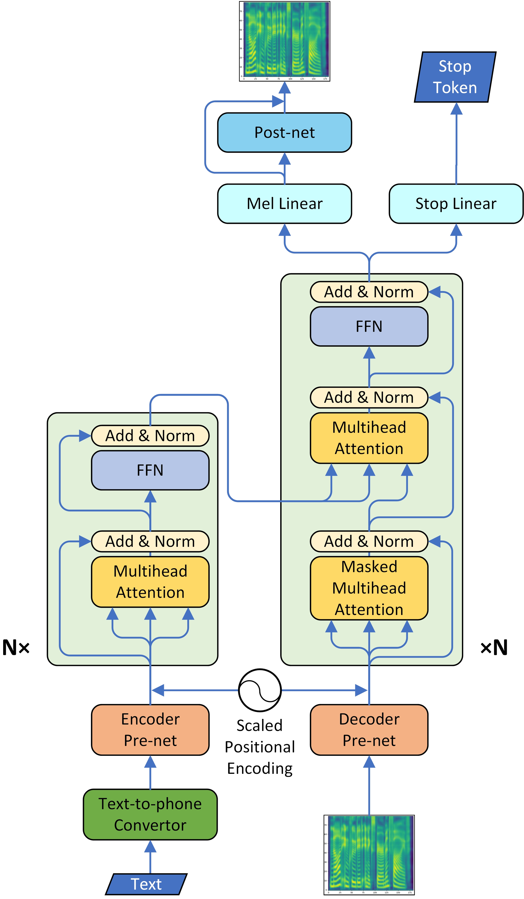

*Figure 3 · [Source](https://arxiv.org/abs/1809.08895)*

### TTS-CtrlNet

TTS-CtrlNet adds a trainable control branch to a pretrained TTS model while preserving its original generation backbone. Time-varying emotion signals guide local delivery, combining explicit expressive control with the base model's voice-cloning capability.

[Paper](https://arxiv.org/abs/2507.04349) · [Project](https://curryjung.github.io/ttsctrlnet_project_page) · GitHub: no author-linked repository found · [Details](models/diffusion.md#tts-ctrlnet)

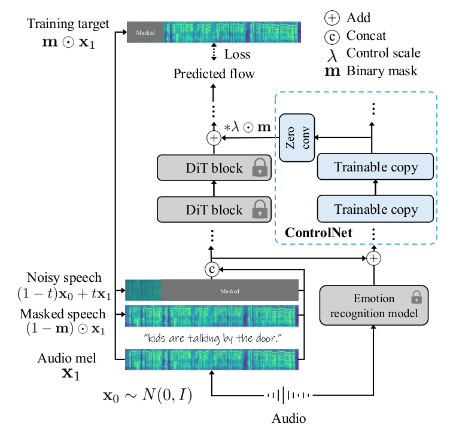

*Figure 1 · [Source](https://arxiv.org/abs/2507.04349)*

### TTS-Transducer

TTS-Transducer learns an ordered mapping from tokenized text to the first speech codebook with a neural transducer. Subsequent acoustic-code generation reconstructs the waveform, combining explicit monotonic alignment with reference-conditioned speech synthesis.

[Paper](https://arxiv.org/abs/2501.06320) · [Project](https://tts-transducer.github.io) · GitHub: no author-linked repository found · [Details](models/token-lm.md#tts-transducer)

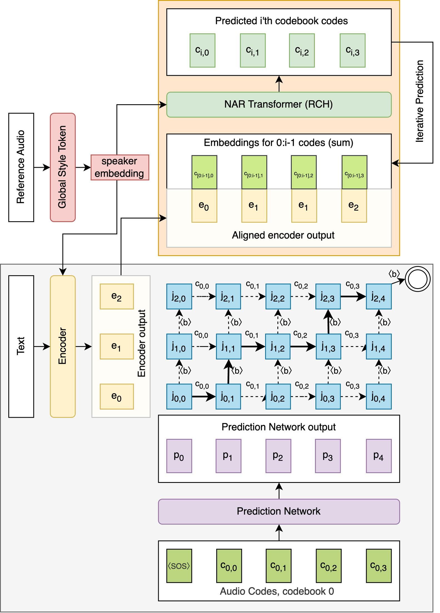

*Paper figure · [Source](https://arxiv.org/abs/2501.06320)*

### TTSYoruba

TTSYoruba converts tone-marked Yoruba text into speech by selecting and joining recorded diphones. Handwritten phonological rules resolve nasal forms and contextual tone contours, providing a language-specific synthesis system rather than a neural acoustic generator.

[Paper](https://arxiv.org/abs/2607.18317) · GitHub: no author-linked repository found · [Details](models/concatenative.md#ttsyoruba)

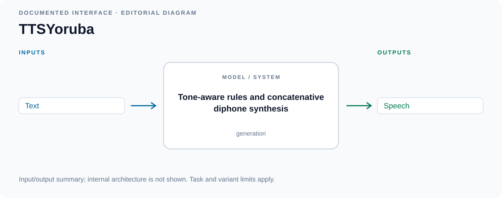

*Editorial input/output diagram · [Source](https://arxiv.org/abs/2607.18317)*

### UDDETTS

UDDETTS combines named emotion labels with continuous affect dimensions in one TTS model. A semi-supervised training scheme uses differently annotated speech collections, enabling more flexible emotion control than a fixed list of categories alone.

[Paper](https://arxiv.org/abs/2505.10599) · GitHub: no author-linked repository found · [Details](models/token-lm.md#uddetts)

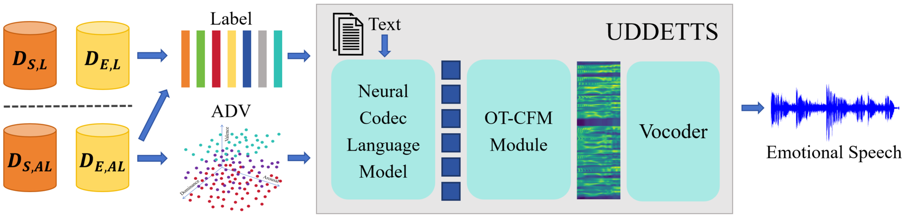

*Figure 1 · [Source](https://arxiv.org/abs/2505.10599)*

### UmbraTTS

UmbraTTS generates spoken text together with a background acoustic scene using reference audio as context. Its conditioning includes background-volume control, allowing the same speech to be rendered in coherent environments with different prominence.

[Paper](https://arxiv.org/abs/2506.09874) · [Project](https://aiola-lab.github.io/umbra-tts/) · GitHub: no author-linked repository found · [Details](models/diffusion.md#umbratts)

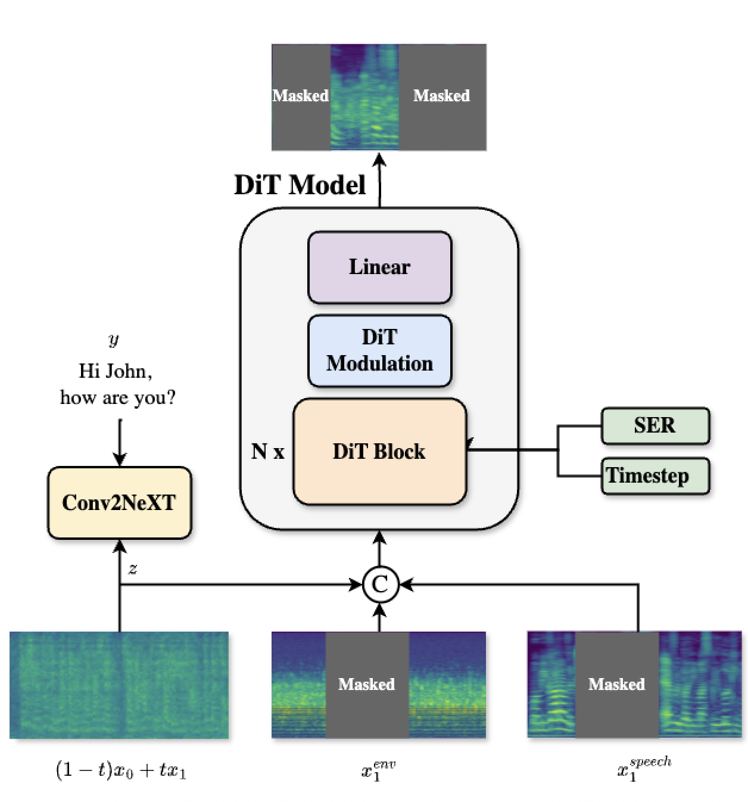

*Figure 1 · [Source](https://arxiv.org/abs/2506.09874)*

### UniFlow-Audio

UniFlow-Audio separates conditions that align to audio time from global descriptive information. Temporal fusion and cross-attention combine text, audio or visual cues in a shared generator that supports speech as well as broader audio tasks.

[Paper](https://arxiv.org/abs/2509.24391) · [GitHub](https://github.com/wsntxxn/UniFlow-Audio) · [Project](https://wsntxxn.github.io/uniflow_audio) · [Details](models/diffusion.md#uniflow-audio)

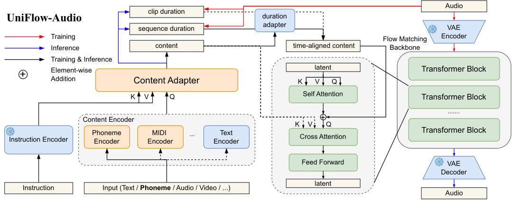

*Figure 2 · [Source](https://arxiv.org/abs/2509.24391)*

### UNISON

UNISON uses one diffusion backbone for speech generation, general audio generation and editing. Hidden states from multiple language-model layers guide the acoustic model, while task masks and optional source latents specify the requested generation or modification.

[Paper](https://arxiv.org/abs/2605.31530) · [GitHub](https://github.com/lizhaoqing/UNISON) · [Project](https://lizhaoqing.github.io/UNISON-demo/) · [Details](models/diffusion.md#unison)

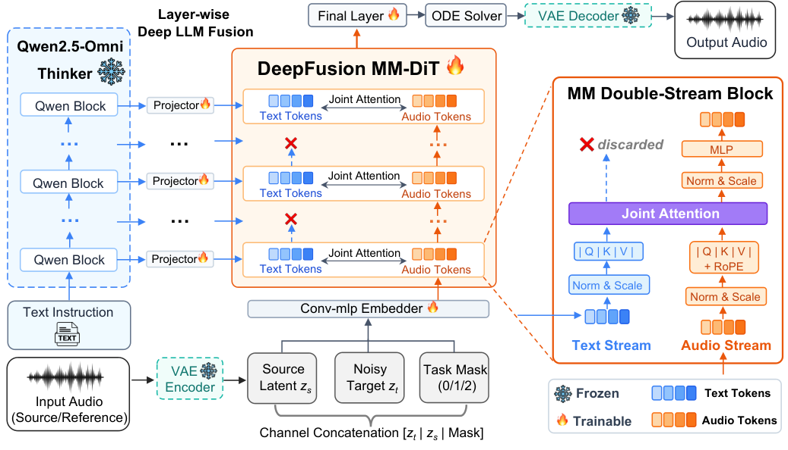

*Figure 2 · [Source](https://arxiv.org/abs/2605.31530)*

### UniSonate

UniSonate uses a shared diffusion model to generate speech, music and sound effects from textual instructions. Phonemes structure spoken or sung content, while learned tokens organize unstructured effects and provide a common timing interface.

[Paper](https://arxiv.org/abs/2604.22209) · [Project](https://qiangchunyu.github.io/UniSonate/) · GitHub: no author-linked repository found · [Details](models/diffusion.md#unisonate)

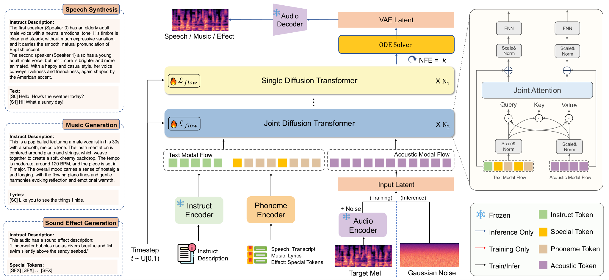

*Figure 2 · [Source](https://arxiv.org/abs/2604.22209)*

### UniSpeaker

UniSpeaker maps several kinds of voice descriptions into a common speaker space using a KV-Former-based aggregator. The shared representation conditions speech generation, allowing a portrait, description or recording to influence the synthesized voice.

[Paper](https://arxiv.org/abs/2501.06394) · [Project](https://UniSpeaker.github.io) · GitHub: no author-linked repository found · [Details](models/diffusion.md#unispeaker)

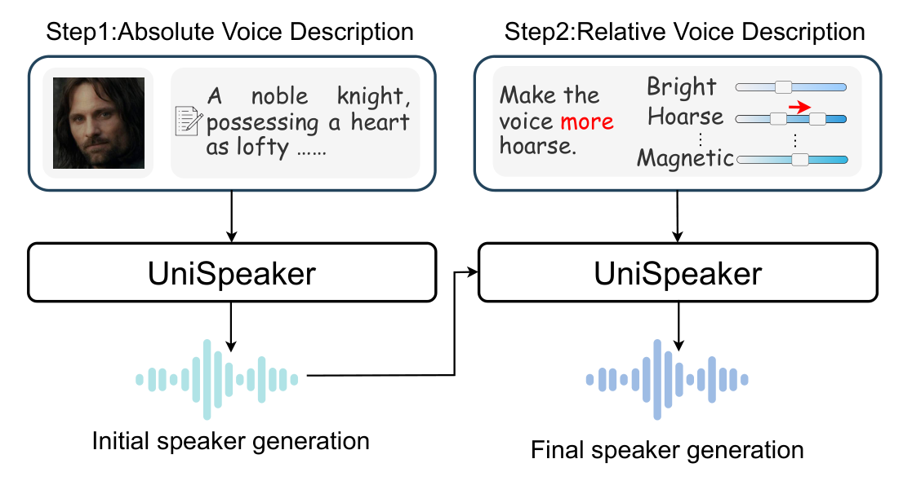

*Figure 1 · [Source](https://arxiv.org/abs/2501.06394)*

### UniTAF

UniTAF connects a text-to-speech model with a facial-animation model through internal representations. The joint architecture explores consistent emotional expression across generated audio and facial movement, focusing on the feasibility of feature sharing rather than claiming a production-quality avatar system. The authors withdrew the paper in March 2026 because some reported results require verification.

[Paper](https://arxiv.org/abs/2602.15651) · [GitHub](https://github.com/GoldenFishes/UniTAF) · [Details](models/token-lm.md#unitaf)

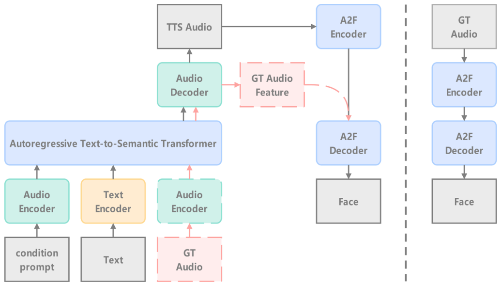

*Figure 2 (paper page 5) · [Source](https://arxiv.org/abs/2602.15651)*

### UniTalker

UniTalker predicts emotional context before generating speech and face-motion tokens. A facial codec and synchronized decoding coordinate expression, wording and duration, allowing a scripted conversational response to be rendered as both voice and facial animation.

[Paper](https://arxiv.org/abs/2508.04585) · [GitHub](https://github.com/AI-S2-Lab/UniTalker) · [Details](models/token-lm.md#unitalker)

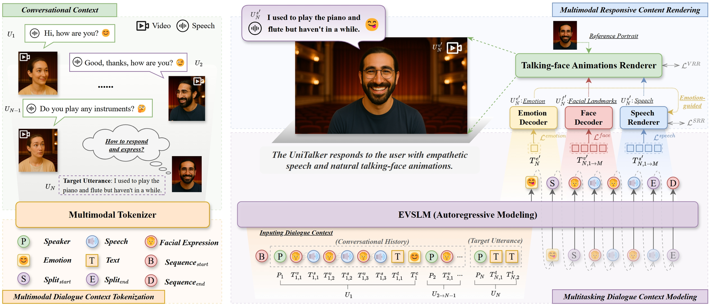

*Figure 2 · [Source](https://arxiv.org/abs/2508.04585)*

### UniTTS

UniTTS predicts the dense single-stream representation learned by DistilCodec from a multicodebook teacher. Keeping acoustic and semantic information together provides its language model with a unified target for reference-conditioned text-to-speech.

[Paper](https://arxiv.org/abs/2505.17426) · [GitHub](https://github.com/IDEA-Emdoor-Lab/UniTTS) · [Details](models/token-lm.md#unitts)

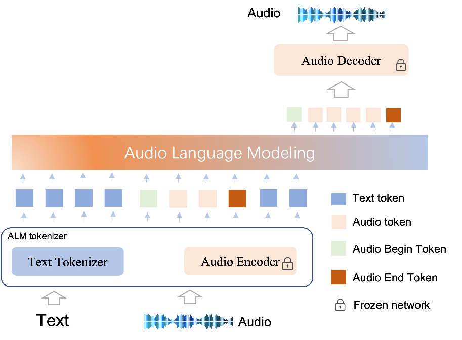

*Figure 1 · [Source](https://arxiv.org/abs/2505.17426)*

### UniVocal

UniVocal learns when text should be spoken or sung and can move between these modes within one sequence. Its language model predicts refined pitch and semantic tokens before acoustic reconstruction, with optional descriptions and voice references controlling the performance.

[Paper](https://arxiv.org/abs/2606.01677) · [GitHub](https://github.com/FunAudioLLM/FunResearch) · [Project](https://project-univocal-demo.github.io/demo/) · [Details](models/token-lm.md#univocal)

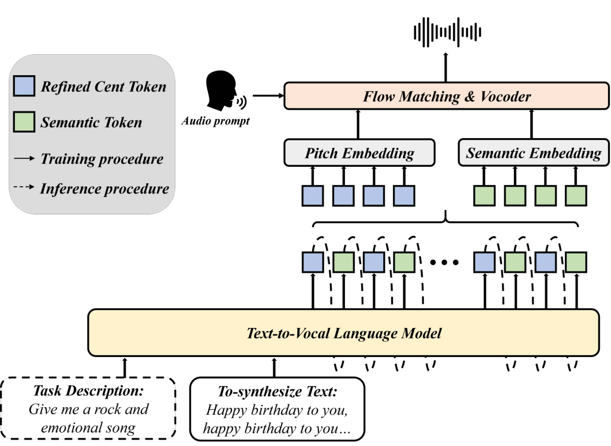

*Figure 2 · [Source](https://arxiv.org/abs/2606.01677)*

### UniVoice (ASR and TTS)

This UniVoice model shares an LLM framework between speech recognition and text-to-speech. Its synthesis path uses flow matching over continuous representations, providing zero-shot generation alongside an autoregressive recognition path.

[Paper](https://arxiv.org/abs/2510.04593) · [GitHub](https://github.com/gwh22/UniVoice) · [Details](models/diffusion.md#univoice-asr-and-tts)

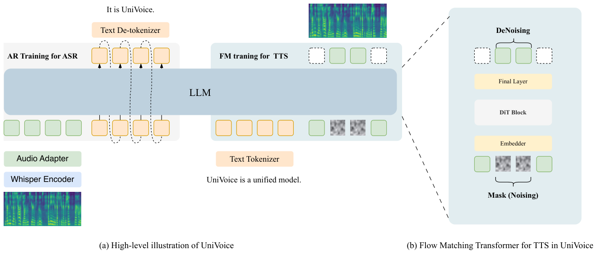

*Figure 1 · [Source](https://arxiv.org/abs/2510.04593)*

### UniVoice (speech and singing)

This UniVoice model separates linguistic content, melody and speaker characteristics before conditioning a shared diffusion Transformer. It supports speech and singing in one generator, with input encoders chosen for each type of condition.

[Paper](https://arxiv.org/abs/2606.05852) · GitHub: no author-linked repository found · [Details](models/diffusion.md#univoice-speech-and-singing)

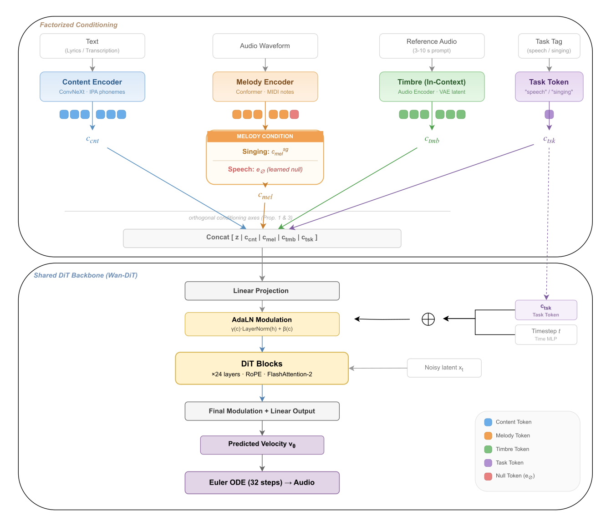

*Figure 2 · [Source](https://arxiv.org/abs/2606.05852)*

### UniWav (TTS)

UniWav jointly pretrains representations for recognition and speech generation. Its TTS adaptation uses the learned encoder-decoder foundation to render text, demonstrating a synthesis path alongside recognition and tokenization tasks.

[Paper](https://arxiv.org/abs/2503.00733) · [Project](https://alexander-h-liu.github.io/uniwav-demo.github.io/) · GitHub: no author-linked repository found · [Details](models/diffusion.md#uniwav-tts)

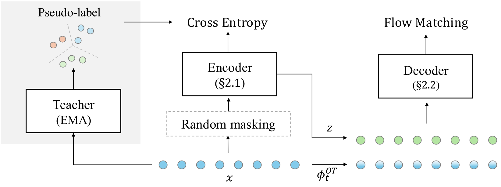

*Figure 1 · [Source](https://arxiv.org/abs/2503.00733)*

### USCF-conditioned TTS

USCF-TTS uses a low-rank transformation to suppress speaker timbre in its speech-content representation. A separate voice prompt conditions reconstruction, demonstrating how a simple invertible factorization can support speaker-controlled synthesis.

[Paper](https://arxiv.org/abs/2603.08977) · [GitHub](https://github.com/HSTEHSTEHSTE/uscf) · [Details](models/diffusion.md#uscf-conditioned-tts)

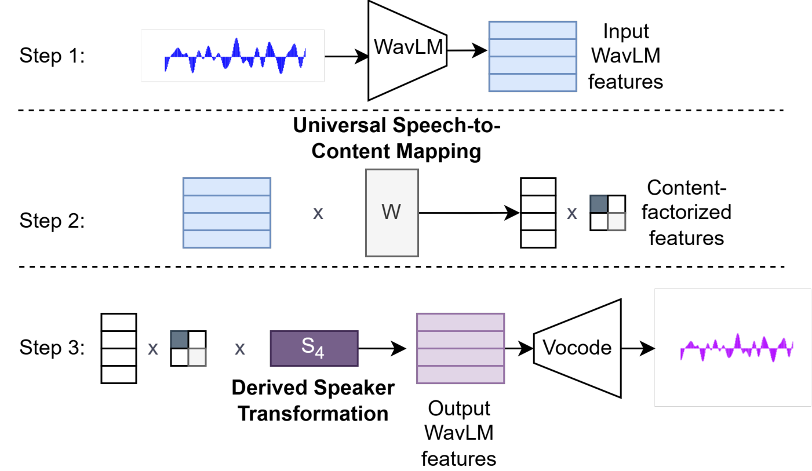

*Figure 1 · [Source](https://arxiv.org/abs/2603.08977)*

### V-CASS

V-CASS extracts paralinguistic cues from video with a vision-language model and passes them to an expressive speech generator. It renders supplied content in a style suited to the scene, supporting more informative audio descriptions of visual media.

[Paper](https://arxiv.org/abs/2506.16716) · GitHub: no author-linked repository found · [Details](models/token-lm.md#v-cass)

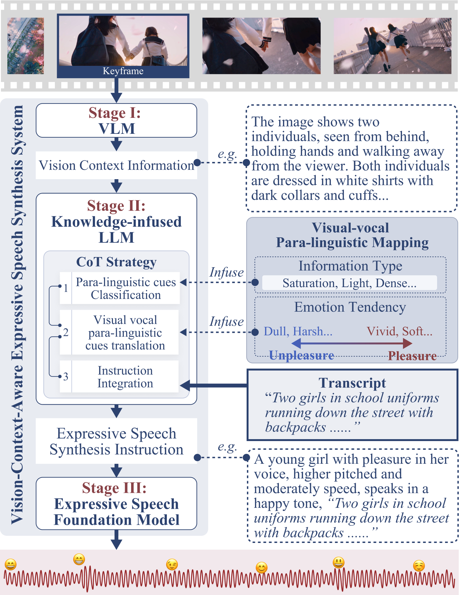

*Paper figure · [Source](https://arxiv.org/abs/2506.16716)*

### VALL-E

Autoregressive and non-AR codec LMs.

[Paper](https://arxiv.org/abs/2301.02111) · [Details](models/token-lm.md#vall-e)

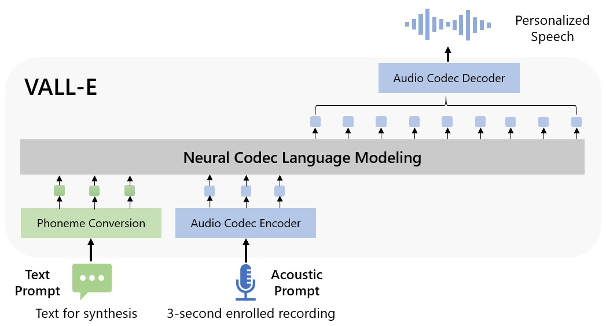

*Figure 1 · [Source](https://arxiv.org/abs/2301.02111)*

### VALL-E 2

Grouped codec modeling and repetition-aware sampling.

[Paper](https://arxiv.org/abs/2406.05370) · [Details](models/token-lm.md#vall-e-2)

*Figure 3 · [Source](https://arxiv.org/abs/2406.05370)*

### VALL-E X

Cross-lingual neural codec language model.

[Paper](https://arxiv.org/abs/2303.03926) · [Details](models/token-lm.md#vall-e-x)

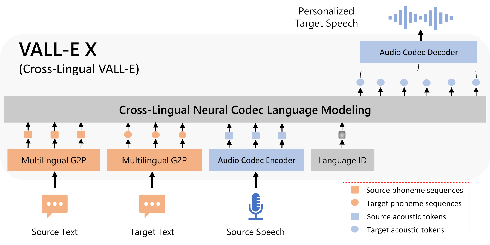

*Figure 1 · [Source](https://arxiv.org/abs/2303.03926)*

### VALL-T

Decoder-only generative transducer.

[Paper](https://arxiv.org/abs/2401.14321) · [Details](models/token-lm.md#vall-t)

*Figure 1 · [Source](https://arxiv.org/abs/2401.14321)*

### Vclip

Vclip learns an association between facial appearance and voice representations. Given a portrait, it retrieves and combines plausible speaker candidates for a downstream TTS model; the generated voice is an inferred match rather than a reconstruction of an unheard recording.

[Paper](https://arxiv.org/abs/2601.02753) · GitHub: no author-linked repository found · [Details](models/flow-vae.md#vclip)

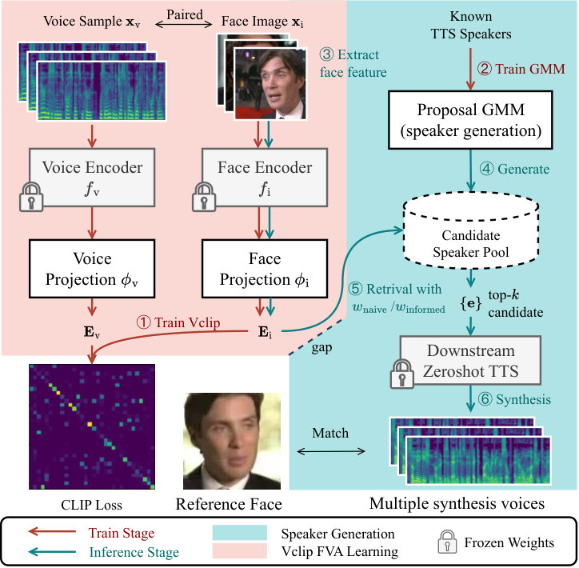

*Figure 1 · [Source](https://arxiv.org/abs/2601.02753)*

### Vevo

Vevo progressively separates linguistic content, delivery style and speaker identity from speech through self-supervised learning. Its generation path can use text or speech content, enabling zero-shot TTS with independent control over reference timbre and style.

[Paper](https://arxiv.org/abs/2502.07243) · [GitHub](https://github.com/open-mmlab/Amphion) · [Details](models/token-lm.md#vevo)

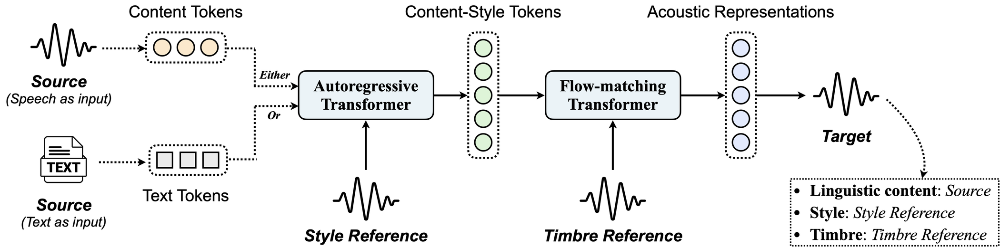

*Figure 1 · [Source](https://arxiv.org/abs/2502.07243)*

### VibeVoice

VibeVoice autoregressively generates continuous speech latents with a diffusion head, using compressed acoustic and semantic representations to extend context. It targets long, multi-speaker recordings in which voices and delivery should remain coherent across a script. The original research studies recordings lasting up to 90 minutes with four speakers; those limits do not describe every family variant.

[Paper](https://arxiv.org/abs/2508.19205) · [Details](models/continuous-lm.md#vibevoice)

*Figure 2 · [Source](https://arxiv.org/abs/2508.19205)*

### VibeVoice-Realtime

VibeVoice-Realtime interleaves incoming text chunks with diffusion-based acoustic generation so playback can begin while more text is arriving. The smaller 0.5B design keeps the acoustic tokenizer and removes the semantic tokenizer used by the longer-form model. It focuses on single-speaker streaming, with preset voice embeddings and experimental language coverage documented separately.

[GitHub](https://github.com/microsoft/VibeVoice) · [Docs](https://github.com/microsoft/VibeVoice/blob/main/docs/vibevoice-realtime-0.5b.md) · [Details](models/continuous-lm.md#vibevoice-realtime)

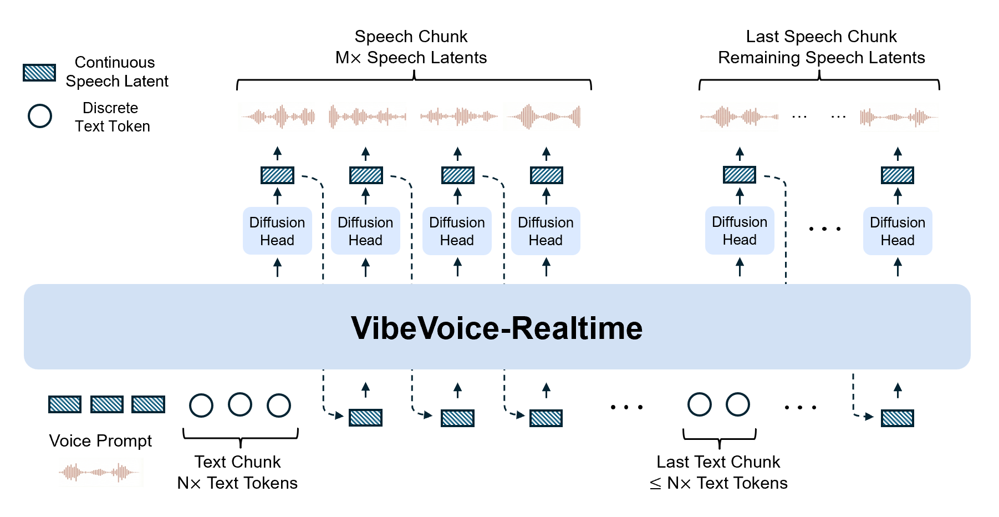

*Official architecture diagram · [Source](https://github.com/microsoft/VibeVoice)*

### VisualSpeech

VisualSpeech adds video-derived context to a text-to-speech model to reduce ambiguity in delivery. The visual representation guides prosodic choices so the same text can be rendered in a way that fits its scene.

[Paper](https://arxiv.org/abs/2501.19258) · [Project](https://ariameetgit.github.io/VISUALSPEECH-SAMPLES/) · GitHub: no author-linked repository found · [Details](models/parallel.md#visualspeech)

*Figure 1 · [Source](https://arxiv.org/abs/2501.19258)*

### VITS

Conditional VAE, normalizing flows and adversarial waveform decoding.

[Paper](https://arxiv.org/abs/2106.06103) · [Details](models/flow-vae.md#vits)

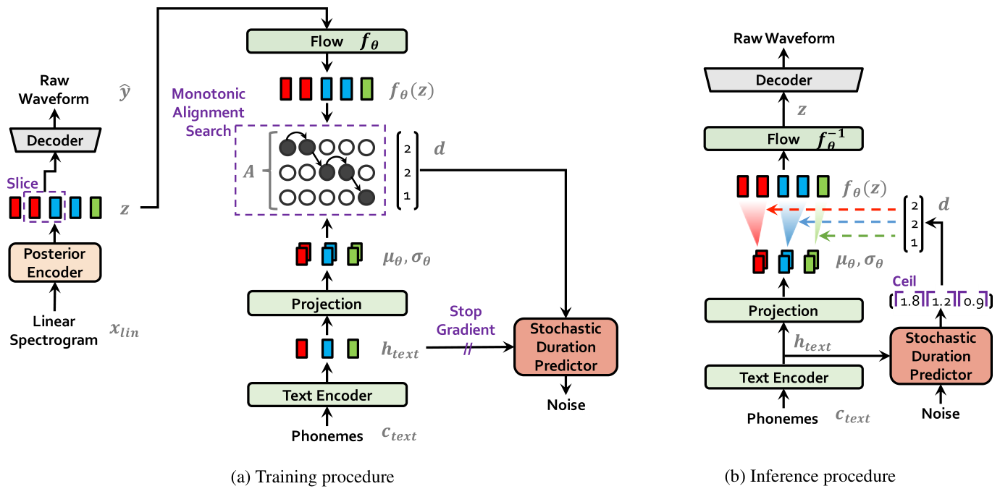

*Figure 1, PDF p. 3 · [Source](https://arxiv.org/abs/2106.06103)*

### VITS2

VITS with adversarial duration training and revised flows.

[Paper](https://arxiv.org/abs/2307.16430) · [Details](models/flow-vae.md#vits-2)

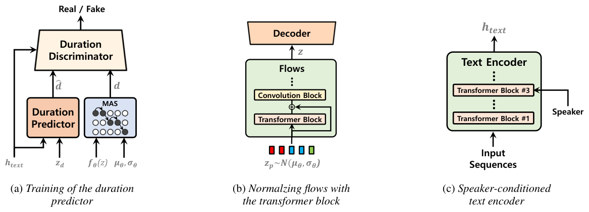

*Figure 1, PDF p. 2 · [Source](https://arxiv.org/abs/2307.16430)*

### VividVoice

VividVoice maps visual scene information to voice and environmental acoustic conditions using separate memory representations. Cross-modal supervision aligns those conditions with speech generation, allowing the synthesized voice and its surroundings to fit a supplied scene.

[Paper](https://arxiv.org/abs/2602.02591) · [Project](https://chengyuann.github.io/VividVoice/) · GitHub: no author-linked repository found · [Details](models/diffusion.md#vividvoice)

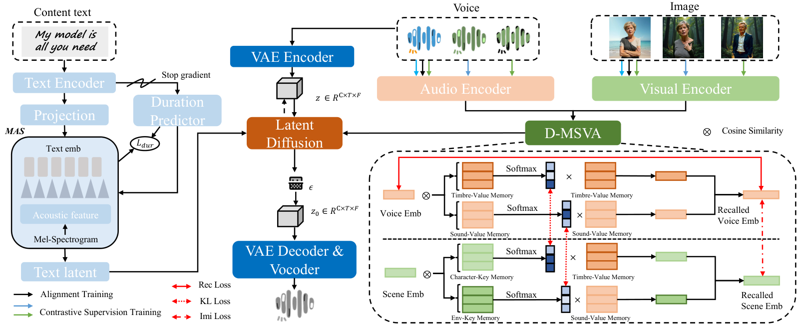

*Figure 2 · [Source](https://arxiv.org/abs/2602.02591)*

### VocalNet-M2

VocalNet-M2 directly predicts multiple codec streams from a speech-language backbone. Its talker combines multi-codebook representations and multi-token decoding to reduce latency, avoiding a separate flow-matching stage for acoustic reconstruction.

[Paper](https://arxiv.org/abs/2511.10232) · GitHub: no author-linked repository found · [Details](models/token-lm.md#vocalnet-m2)

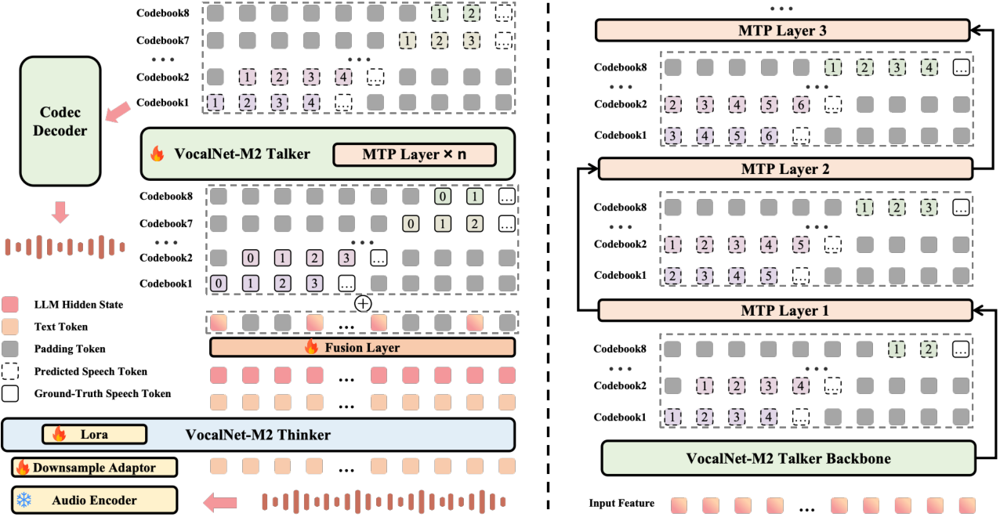

*Figure 1 · [Source](https://arxiv.org/abs/2511.10232)*

### Voicebox

Non-autoregressive flow matching for speech infilling.

[Paper](https://arxiv.org/abs/2306.15687) · [Details](models/diffusion.md#voicebox)

*Figure 2 · [Source](https://arxiv.org/abs/2306.15687)*

### VoiceChat-TTS

VoiceChat-TTS generates speech directly from an incoming language-model text stream. Control tokens allow interruptions and silence, and generation can resume without discarding the attention cache, making the synthesizer suitable for interactive agent playback.

[Paper](https://arxiv.org/abs/2608.13831) · GitHub: no author-linked repository found · [Details](models/continuous-lm.md#voicechat-tts)

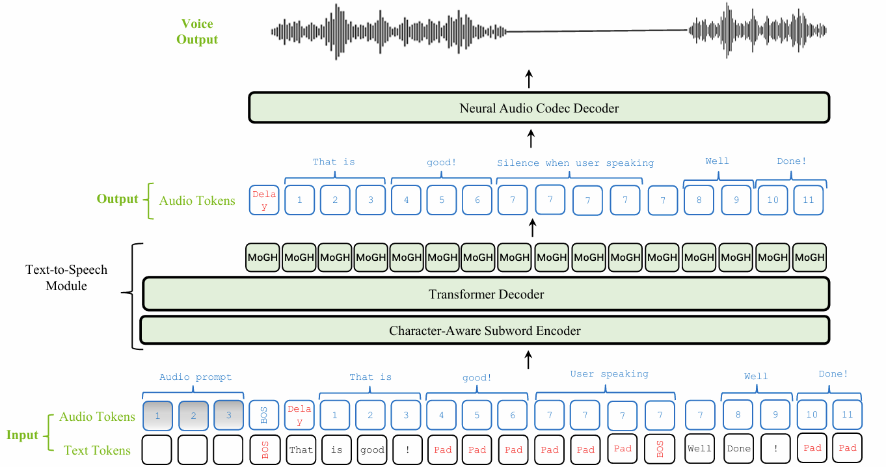

*Figure 1 · [Source](https://arxiv.org/abs/2608.13831)*

### VoiceCraft

Token-infilling codec language model.

[Paper](https://arxiv.org/abs/2403.16973) · [GitHub](https://github.com/jasonppy/VoiceCraft) · [Details](models/token-lm.md#voicecraft)

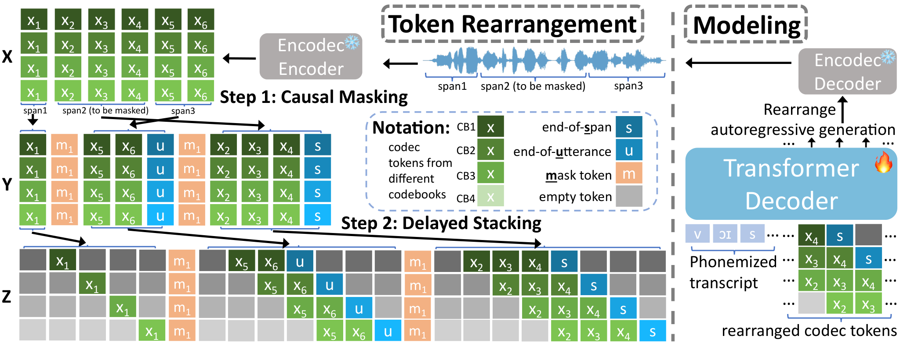

*Figure 2 · [Source](https://arxiv.org/abs/2403.16973)*

### VoiceCraft-Dub

VoiceCraft-Dub extends text-conditioned codec synthesis with facial information from video. The added visual conditions coordinate speech timing and expression with the visible speaker while preserving the voice and natural prosody.

[Paper](https://arxiv.org/abs/2504.02386) · [GitHub](https://github.com/kaist-ami/voicecraft-dub) · [Details](models/token-lm.md#voicecraft-dub)

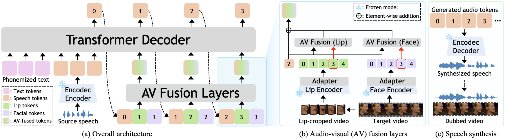

*Figure 2 · [Source](https://arxiv.org/abs/2504.02386)*

### VoiceDesigner

VoiceDesigner conditions speech generation on descriptions of a desired voice and supports modifying an existing voice. A shared diffusion model learns these tasks from natural and augmented voice examples, including voices with unusual or fictional characteristics.

[Paper](https://arxiv.org/abs/2608.13613) · [Project](https://voicedesigner-demo.github.io/) · GitHub: no author-linked repository found · [Details](models/diffusion.md#voicedesigner)

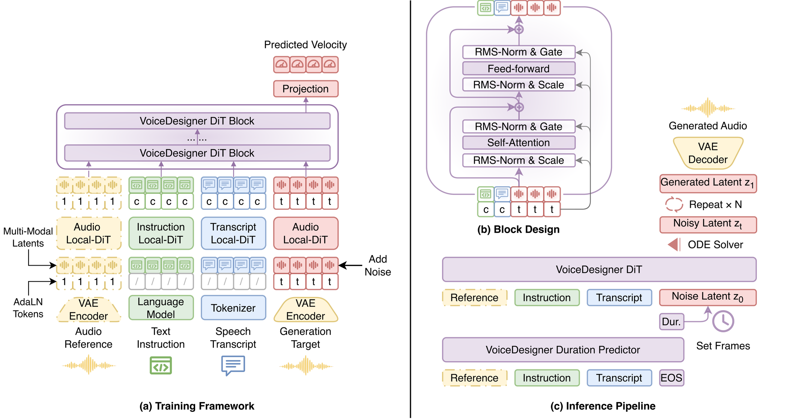

*Paper figure · [Source](https://arxiv.org/abs/2608.13613)*

### VoiceSculptor

VoiceSculptor first creates a voice matching a natural-language description, then renders an audio prompt for a cloning model. This two-part pipeline supports designing a new timbre and consistently using it to synthesize further text.

[Paper](https://arxiv.org/abs/2601.10629) · [GitHub](https://github.com/ASLP-lab/VoiceSculptor) · [Project](https://hujingbin1.github.io/VoiceSculptor-Demo) · [Details](models/token-lm.md#voicesculptor)

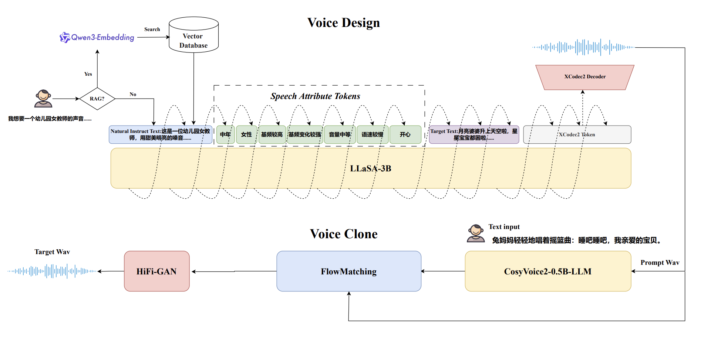

*Figure 1 · [Source](https://arxiv.org/abs/2601.10629)*

### VoxCPM

VoxCPM divides synthesis into semantic/prosodic planning and residual acoustic modeling, then uses a local diffusion decoder to produce continuous speech latents. These components are trained together without an external discrete speech tokenizer. Reference conditioning supports voice cloning, while text context helps determine the rhythm and expressive shape of the generated utterance.

[Paper](https://arxiv.org/abs/2509.24650) · [GitHub](https://github.com/OpenBMB/VoxCPM) · [Project](https://openbmb.github.io/VoxCPM-demopage/) · [Details](models/continuous-lm.md#voxcpm)

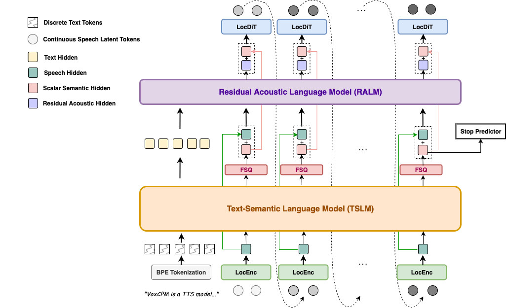

*Figure 1 · [Source](https://arxiv.org/abs/2509.24650)*

### VoxCPM2

VoxCPM2 expands the same hierarchical approach to multilingual synthesis, voice design and style-controlled cloning within one backbone. An asymmetric AudioVAE encodes lower-rate audio and reconstructs higher-rate output, while a unified input sequence expresses the different generation tasks. It serves applications that need both reference-based voices and description-driven control from one model family.

[Paper](https://arxiv.org/abs/2606.06928) · [GitHub](https://github.com/OpenBMB/VoxCPM) · [Project](https://openbmb.github.io/voxcpm2-demopage/) · [Details](models/continuous-lm.md#voxcpm2)

*Figure 1 · [Source](https://arxiv.org/abs/2606.06928)*

### Voxtral TTS

Voxtral TTS conditions multilingual speech on a short voice recording. Its hybrid decoder predicts semantic tokens sequentially and acoustic information through flow matching, supporting expressive reference cloning across languages.

[Paper](https://arxiv.org/abs/2603.25551) · GitHub: no author-linked repository found · [Details](models/token-lm.md#voxtral-tts)

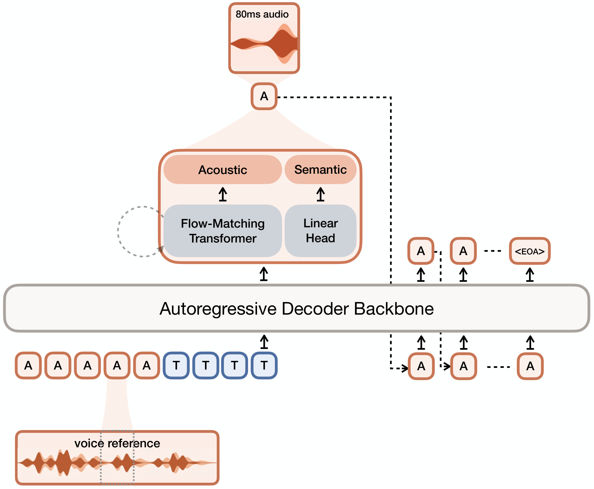

*Figure 2 · [Source](https://arxiv.org/abs/2603.25551)*

### VoXtream

VoXtream begins synthesis from the first available words using a streaming phoneme encoder. A temporal model predicts semantic and duration information, while a depth Transformer generates codec detail, enabling low-delay reference voice cloning.

[Paper](https://arxiv.org/abs/2509.15969) · [GitHub](https://github.com/herimor/voxtream) · [Project](https://herimor.github.io/voxtream) · [Details](models/token-lm.md#voxtream)

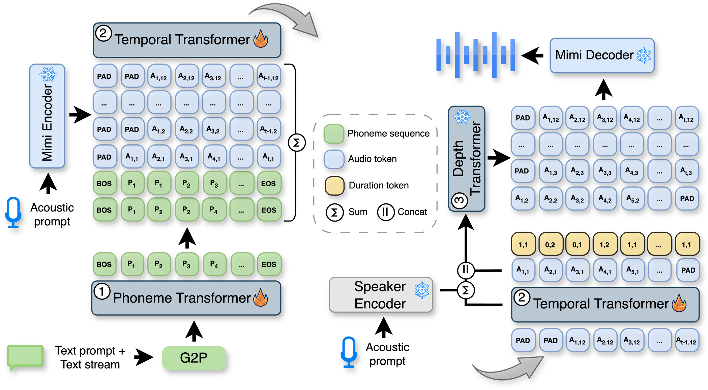

*Figure 1 · [Source](https://arxiv.org/abs/2509.15969)*

### VoXtream2

VoXtream2 consumes text incrementally while allowing the speaking rate to change during the utterance. Guidance over conditioning signals and a distribution-matching mechanism for duration states support reference cloning with responsive, locally adjustable pacing.

[Paper](https://arxiv.org/abs/2603.13518) · [GitHub](https://github.com/herimor/voxtream) · [Project](https://herimor.github.io/voxtream2/) · [Details](models/token-lm.md#voxtream2)

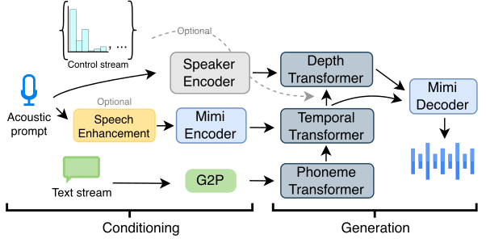

*Figure 1 · [Source](https://arxiv.org/abs/2603.13518)*

### VSpeechLM

VSpeechLM aligns video timing with a text transcript before generating speech tokens. Its phoneme expansion and acoustic decoders support intelligible speech whose timing matches the visible speaker, targeting visual TTS and dubbing.

[Paper](https://arxiv.org/abs/2511.22229) · GitHub: no author-linked repository found · [Details](models/token-lm.md#vspeechlm)

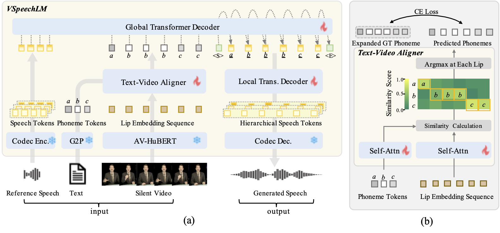

*Figure 2 · [Source](https://arxiv.org/abs/2511.22229)*

### Wave-Tacotron

Autoregressive waveform blocks with a normalizing-flow decoder.

[Paper](https://arxiv.org/abs/2011.03568) · [Details](models/autoregressive.md#wave-tacotron)

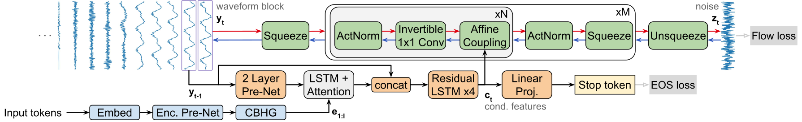

*Figure 1 · [Source](https://arxiv.org/abs/2011.03568)*

### WavTTS

WavTTS operates directly on raw waveform patches instead of mel-spectrograms or codec tokens. Multiscale spectral supervision guides acoustic quality during training, supporting reference-based speech generation within a direct text-to-waveform architecture.

[Paper](https://arxiv.org/abs/2606.03455) · [GitHub](https://github.com/cwx-worst-one/WavTTS) · [Details](models/diffusion.md#wavtts)

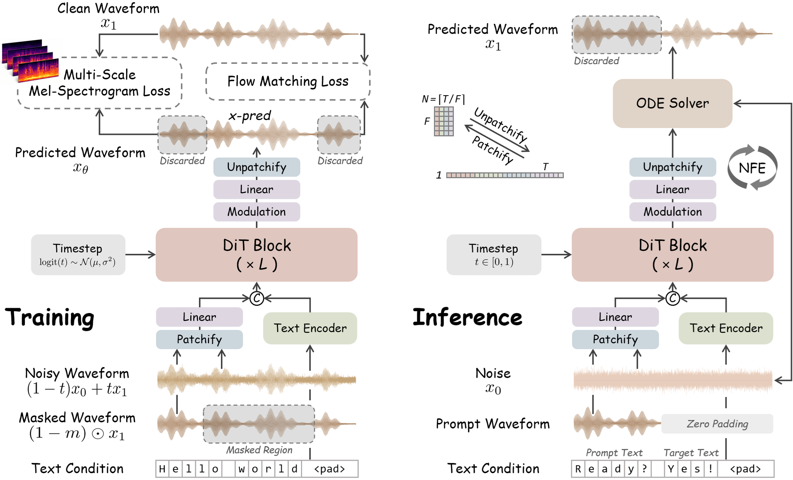

*Figure 2 · [Source](https://arxiv.org/abs/2606.03455)*

### WenetSpeech-Wu TTS

The WenetSpeech-Wu release includes TTS models trained on a curated Wu Chinese speech collection. Its synthesis paths cover ordinary and instruction-conditioned generation, alongside separate recognition and translation resources described in the same paper.

[Paper](https://arxiv.org/abs/2601.11027) · [GitHub](https://github.com/ASLP-lab/WenetSpeech-Wu-Repo) · [Details](models/token-lm.md#wenetspeech-wu-tts)

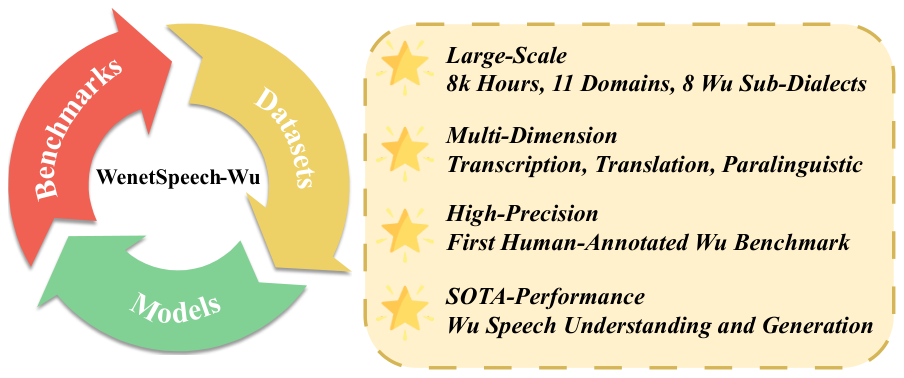

*Figure 1 · [Source](https://arxiv.org/abs/2601.11027)*

### WeSCon

WeSCon creates training examples with local changes in emotion and speaking speed from a pretrained zero-shot TTS model. Transition smoothing and dynamic rate control help the adapted synthesizer deliver different parts of one sentence with distinct expression.

[Paper](https://arxiv.org/abs/2509.24629) · [Project](https://wangtianrui.github.io/wescon/) · GitHub: no author-linked repository found · [Details](models/token-lm.md#wescon)

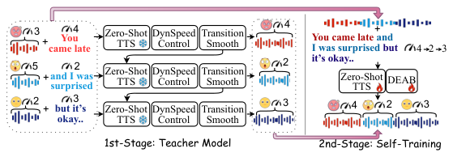

*Figure 2 · [Source](https://arxiv.org/abs/2509.24629)*

### WhisperSpeech

Text-to-semantic and semantic-to-acoustic token models.

[GitHub](https://github.com/WhisperSpeech/WhisperSpeech) · [Details](models/token-lm.md#whisperspeech)

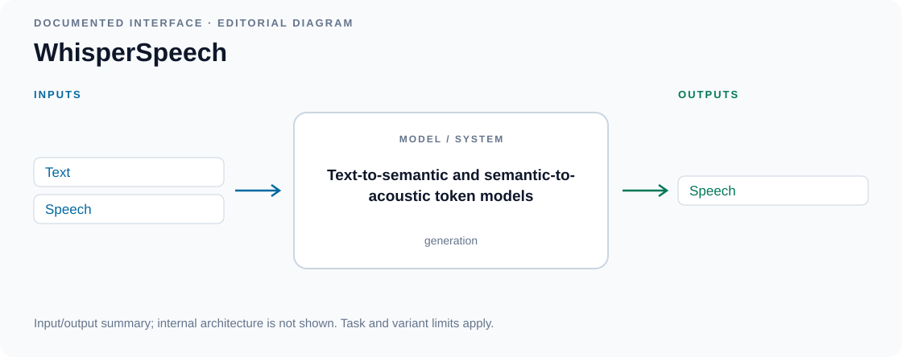

*Editorial input/output diagram · [Source](https://github.com/WhisperSpeech/WhisperSpeech)*

### WordVoice

WordVoice associates controllable acoustic attributes with individual words before rendering their speech. Users can accept the language model's predicted delivery or override selected local attributes, enabling detailed expressive adjustments within a single utterance.

[Paper](https://arxiv.org/abs/2607.06461) · [GitHub](https://github.com/XXH333/WordVoice-main) · [Project](https://xxh333.github.io/wordvoice-demo/) · [Details](models/token-lm.md#wordvoice)

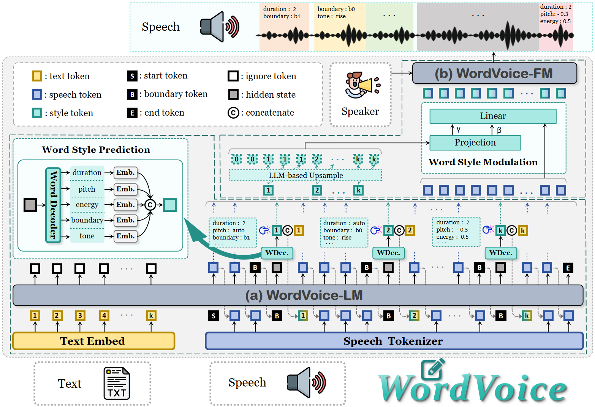

*Figure 3 · [Source](https://arxiv.org/abs/2607.06461)*

### X-Voice

X-Voice extends a flow-matching synthesizer with language information at both textual and acoustic-generation stages. Speaker-consistent training references and independently scheduled guidance support transcript-free cross-language cloning across thirty languages.

[Paper](https://arxiv.org/abs/2605.05611) · [GitHub](https://github.com/sunnyxrxrx/X-Voice) · [Details](models/diffusion.md#x-voice)

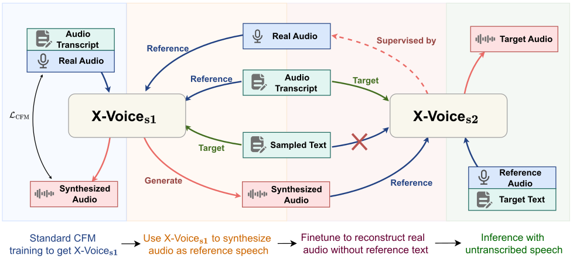

*Figure 1 · [Source](https://arxiv.org/abs/2605.05611)*

### X2Streaming-TTS

X2Streaming-TTS consumes text as it arrives and retains speech-generation state across successive segments. A frontend delays ambiguous text until its pronunciation can be decided, while the talker and waveform decoder produce incremental audio with bounded context.

[Paper](https://arxiv.org/abs/2608.18661) · [GitHub](https://github.com/X-Square-Robot/X2Streaming-TTS) · [Details](models/token-lm.md#x2streaming-tts)

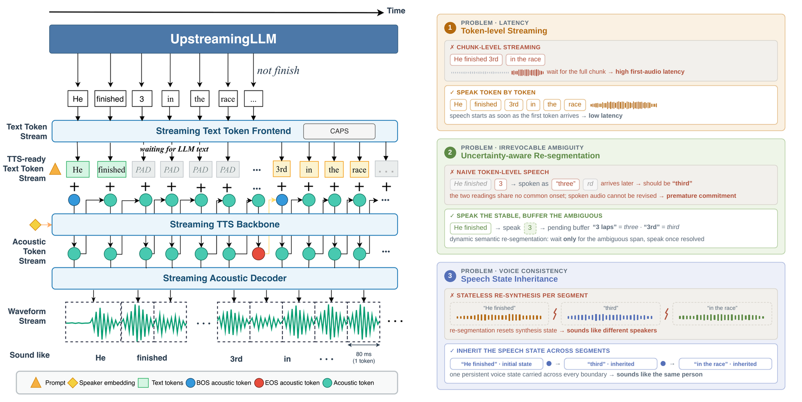

*Figure 1 · [Source](https://arxiv.org/abs/2608.18661)*

### XEmoRAG

XEmoRAG retrieves speech examples to guide emotion transfer from Chinese to Thai without parallel emotional recordings. Its language-model TTS path exposes intensity control while balancing the reference speaker's timbre with target-language pronunciation.

[Paper](https://arxiv.org/abs/2508.07302) · GitHub: no author-linked repository found · [Details](models/token-lm.md#xemorag)

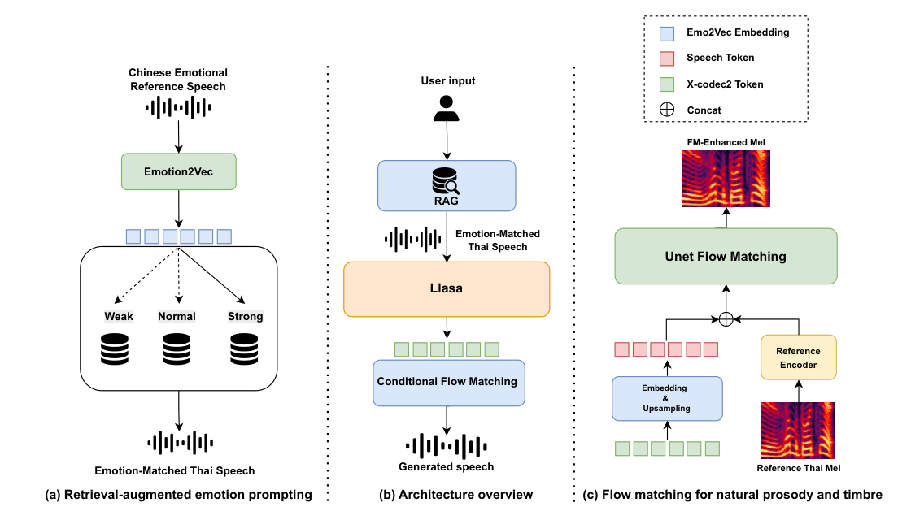

*Paper figure · [Source](https://arxiv.org/abs/2508.07302)*

### XTTS

Autoregressive acoustic codes and decoder.

[Paper](https://arxiv.org/abs/2406.04904) · [Details](models/token-lm.md#xtts)

*Figure 1 · [Source](https://arxiv.org/abs/2406.04904)*

### YourTTS

Multilingual VITS with speaker-reference conditioning.

[Paper](https://arxiv.org/abs/2112.02418) · [Details](models/flow-vae.md#yourtts)

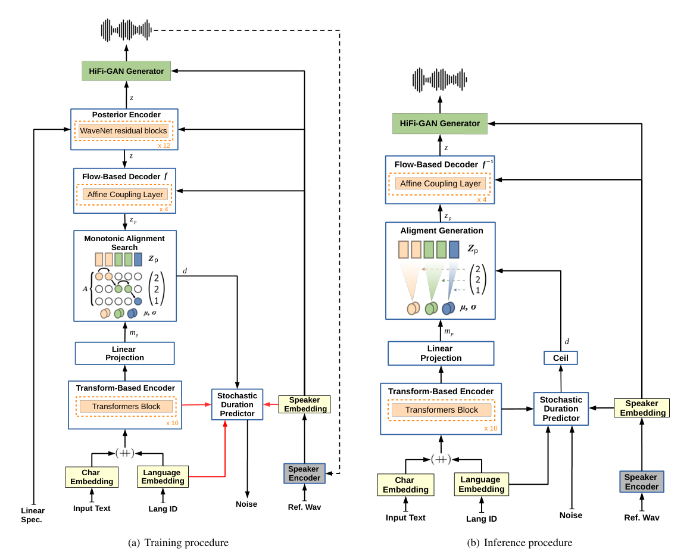

*Figure 1, PDF p. 3 · [Source](https://arxiv.org/abs/2112.02418)*

### ZipVoice

ZipVoice uses efficient flow-matching acoustic modeling to synthesize speech from text and a voice reference. Its compact architecture and accelerated variants target faster inference while preserving multilingual pronunciation and reference-speaker characteristics.

[Paper](https://arxiv.org/abs/2506.13053) · [GitHub](https://github.com/k2-fsa/ZipVoice) · [Details](models/diffusion.md#zipvoice)

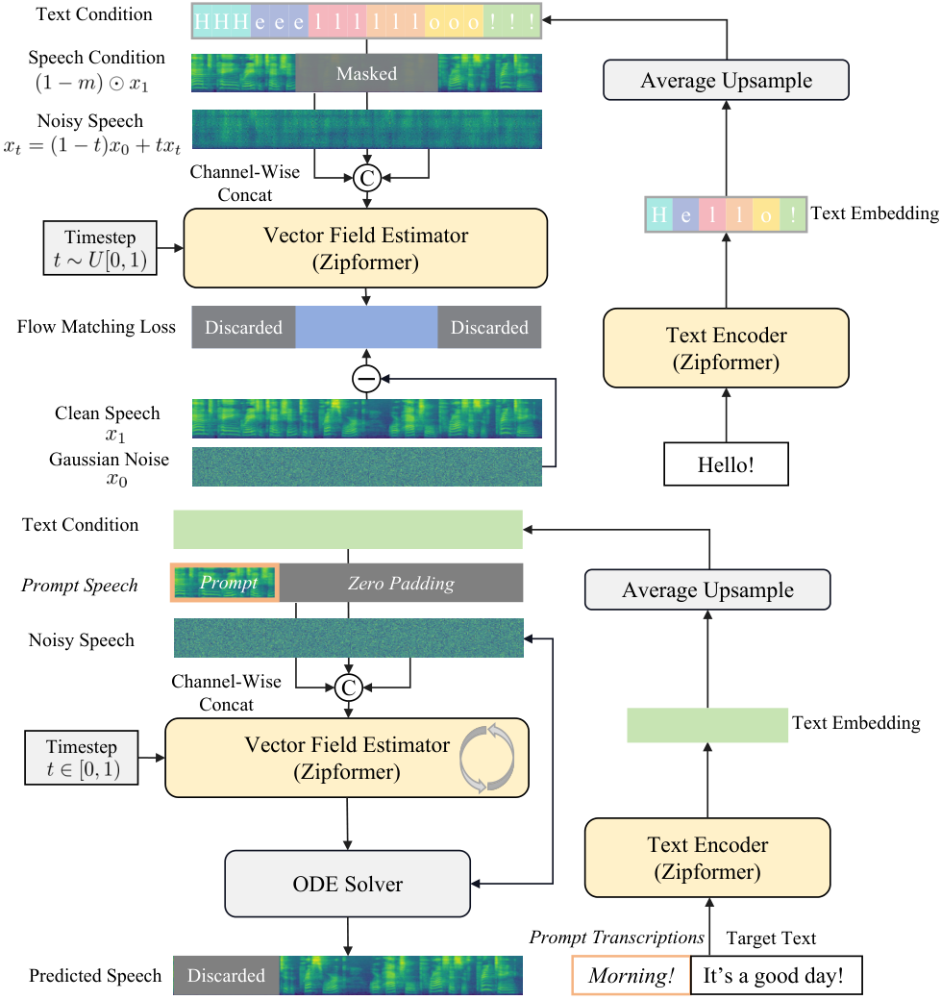

*Paper figure · [Source](https://arxiv.org/abs/2506.13053)*

### ZipVoice-Dialog

ZipVoice-Dialog extends flow-based synthesis to scripted conversations between reference speakers. Curriculum training stabilizes text alignment, and speaker-turn embeddings control who speaks when; dedicated variants also generate separate stereo dialogue channels.

[Paper](https://arxiv.org/abs/2507.09318) · [GitHub](https://github.com/k2-fsa/ZipVoice) · [Details](models/diffusion.md#zipvoice-dialog)

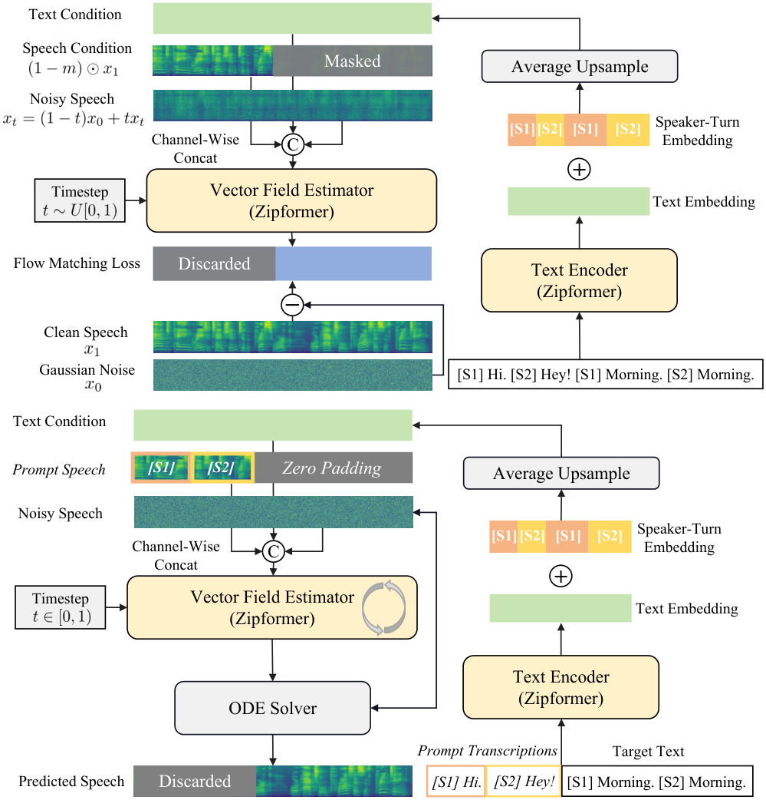

*Figure 1 · [Source](https://arxiv.org/abs/2507.09318)*

### Zonos

Zonos phonemizes text and predicts DAC codec tokens with either a Transformer or a hybrid backbone. Speaker embeddings and audio prefixes condition the voice, alongside explicit controls for rate, pitch variation and emotion. Its v0.1 variants provide alternative architectures for expressive multilingual synthesis and reference-based cloning.

[GitHub](https://github.com/Zyphra/Zonos) · [Details](models/token-lm.md#zonos)

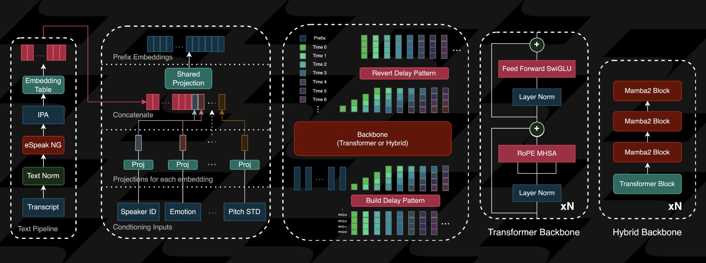

*Official architecture diagram · [Source](https://github.com/Zyphra/Zonos)*

---

[JSON catalog](data/models.json) · [Apache 2.0](LICENSE) · [Third-party figure notice](assets/architectures/FIGURE_NOTICE.md)
