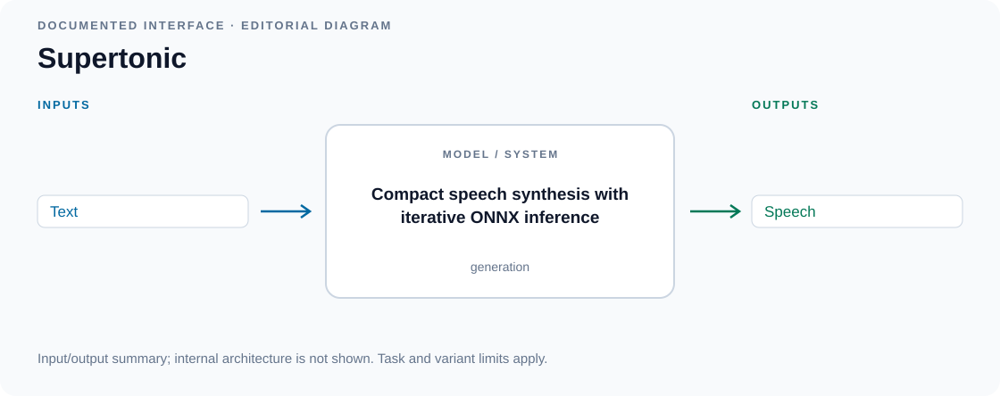

# Compact and on-device TTS

<!-- Generated by scripts/catalog.py from data/models.json and data/figures.json. Edit the JSON, then regenerate. -->

[← All models](../README.md#models)

**5 models · Reviewed 2026-09-13**

Primary-source figures and labeled input/output diagrams. [Figure credits](../assets/architectures/CREDITS.md).

Model index and modality key

**Inputs and outputs:** T = text, S = speech, A = other audio. Speech input usually means an optional voice or prosody reference. For acoustic models, output includes the accompanying waveform synthesizer. See the [methodology](../docs/methodology.md#modalities-and-interaction).

Dates refer to papers or announcements, not necessarily model releases.

| Model | Source date | Input → output | Interaction |
| --- | --- | --- | --- |
| [KittenTTS](#kitten-tts) | — | T → S | generation |
| [Kokoro](#kokoro) | — | T → S | generation |
| [Supertonic](#supertonic) | — | T → S | generation |
| [Supertonic 2](#supertonic-2) | — | T → S | generation |
| [Supertonic 3](#supertonic-3) | — | T → S | generation |

## Architectures

### KittenTTS

Compact neural speech synthesis with ONNX inference.

[Repository](https://github.com/KittenML/KittenTTS)

*Input/output diagram · [Source](https://github.com/KittenML/KittenTTS)*

Details

**Input → output:** T → S · **Interaction:** generation

The official release provides CPU-oriented models and preset voices. Its README does not fully disclose the internal acoustic architecture.

Editorial summary of documented inputs and outputs; internal architecture is not shown.

**Variants:** Mini 0.8; Micro 0.8; Nano 0.8; Nano 0.8 int8.

### Kokoro

StyleTTS 2-derived decoder with iSTFTNet.

[Model card](https://huggingface.co/hexgrad/Kokoro-82M)

*Input/output diagram · [Source](https://huggingface.co/hexgrad/Kokoro-82M)*

Details

**Input → output:** T → S · **Interaction:** generation

The released 82M model omits style diffusion and a reference encoder; preset voice representations condition synthesis.

Editorial summary of documented inputs and outputs; internal architecture is not shown.

**Variants:** Kokoro-82M.

### Supertonic

Compact speech synthesis with iterative ONNX inference.

[Model card](https://huggingface.co/Supertone/supertonic)

*Input/output diagram · [Source](https://huggingface.co/Supertone/supertonic)*

Details

**Input → output:** T → S · **Interaction:** generation

The first open-weight release provides English preset-voice synthesis on local devices. Internal architecture is only partially described in the model card.

Editorial summary of documented inputs and outputs; internal architecture is not shown.

### Supertonic 2

Multilingual compact speech synthesis with ONNX inference.

[Model card](https://huggingface.co/Supertone/supertonic-2)

*Input/output diagram · [Source](https://huggingface.co/Supertone/supertonic-2)*

Details

**Input → output:** T → S · **Interaction:** generation

Extends the local preset-voice release to English, Korean, Spanish, Portuguese and French. Voice-style assets condition synthesis.

Editorial summary of documented inputs and outputs; internal architecture is not shown.

### Supertonic 3

Compact multilingual synthesis with expression controls.

[Model card](https://huggingface.co/Supertone/supertonic-3)

*Input/output diagram · [Source](https://huggingface.co/Supertone/supertonic-3)*

Details

**Input → output:** T → S · **Interaction:** generation

The open-weight package includes preset voices and expression tags across 31 languages. Creating custom voice-style assets is a separate service workflow.

Editorial summary of documented inputs and outputs; internal architecture is not shown.

