# Diffusion and flow matching

<!-- Generated by scripts/catalog.py from data/models.json and data/figures.json. Edit the JSON, then regenerate. -->

[← All models](../README.md#models)

**12 models · Reviewed 2026-09-13**

Primary-source figures and labeled input/output diagrams. [Figure credits](../assets/architectures/CREDITS.md).

Model index and modality key

**Inputs and outputs:** T = text, S = speech, A = other audio. Speech input usually means an optional voice or prosody reference. For acoustic models, output includes the accompanying waveform synthesizer. See the [methodology](../docs/methodology.md#modalities-and-interaction).

Dates refer to papers or announcements, not necessarily model releases.

| Model | Source date | Input → output | Interaction |
| --- | --- | --- | --- |
| [Diff-TTS](#diff-tts) | 2021-04-03 | T → S | generation |
| [DiTTo-TTS](#ditto-tts) | 2024-06-17 | T, S → S | generation |
| [E2 TTS](#e2-tts) | 2024-06-26 | T, S → S | generation |
| [F5-TTS](#f5-tts) | 2024-10-09 | T, S → S | generation |
| [Grad-TTS](#grad-tts) | 2021-05-13 | T → S | generation |
| [Matcha-TTS](#matcha-tts) | 2023-09-06 | T → S | generation |
| [MegaTTS 3](#mega-tts-3) | 2025-02-26 | T, S → S | generation |
| [NaturalSpeech 2](#naturalspeech-2) | 2023-04-18 | T, S → S | generation |
| [NaturalSpeech 3](#naturalspeech-3) | 2024-03-05 | T, S → S | generation |
| [PromptTTS 2](#prompttts-2) | 2023-09-05 | T → S | generation |
| [StyleTTS 2](#styletts-2) | 2023-06-13 | T, S → S | generation |
| [Voicebox](#voicebox) | 2023-06-23 | T, S → S | generation |

## Architectures

### Diff-TTS

Text-conditioned denoising diffusion acoustic model.

[Paper](https://arxiv.org/abs/2104.01409)

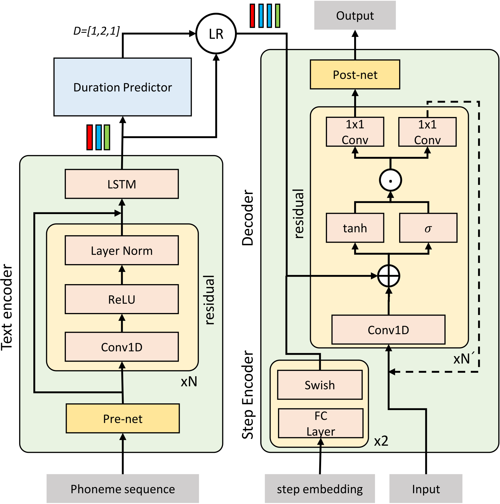

*Figure 3 · [Source](https://arxiv.org/abs/2104.01409)*

Details

**Input → output:** T → S · **Interaction:** generation

Uses a non-autoregressive diffusion process to generate mel spectrograms and accelerated sampling before vocoding.

### DiTTo-TTS

Latent diffusion Transformer with speech-length prediction.

[Paper](https://arxiv.org/abs/2406.11427)

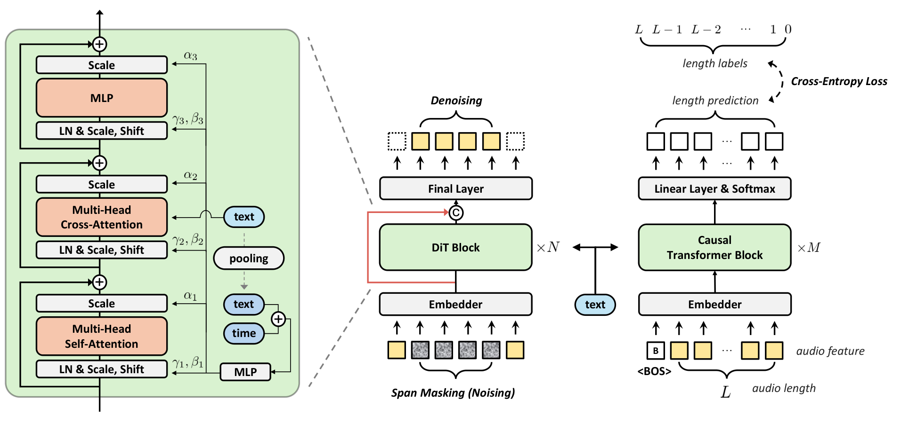

*Figure 1 · [Source](https://arxiv.org/abs/2406.11427)*

Details

**Input → output:** T, S → S · **Interaction:** generation

Uses text conditioning and a total-length predictor instead of phoneme-level durations for zero-shot speech synthesis.

### E2 TTS

Flow matching with filler-token text conditioning.

[Paper](https://arxiv.org/abs/2406.18009)

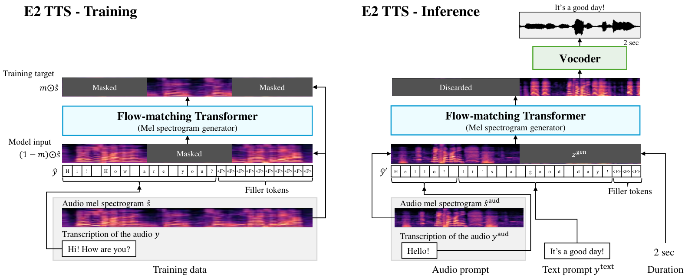

*Figure 1 · [Source](https://arxiv.org/abs/2406.18009)*

Details

**Input → output:** T, S → S · **Interaction:** generation

Learns speech infilling without a phoneme aligner or explicit duration predictor. The paper describes alternate input representations.

**Variants:** E2 TTS X1; E2 TTS X2.

### F5-TTS

Flow-matching Transformer with ConvNeXt text refinement.

[Paper](https://arxiv.org/abs/2410.06885)

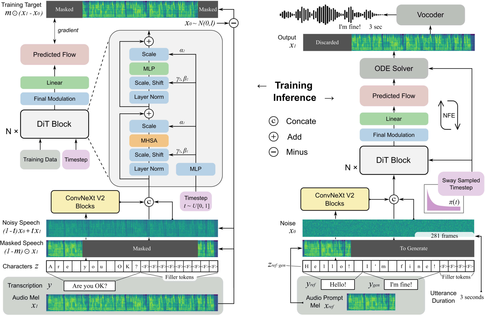

*Figure 1 · [Source](https://arxiv.org/abs/2410.06885)*

Details

**Input → output:** T, S → S · **Interaction:** generation

Pads character sequences to speech length and learns text-guided audio infilling; Sway Sampling adjusts inference steps.

### Grad-TTS

Score-based diffusion decoder and monotonic alignment search.

[Paper](https://arxiv.org/abs/2105.06337)

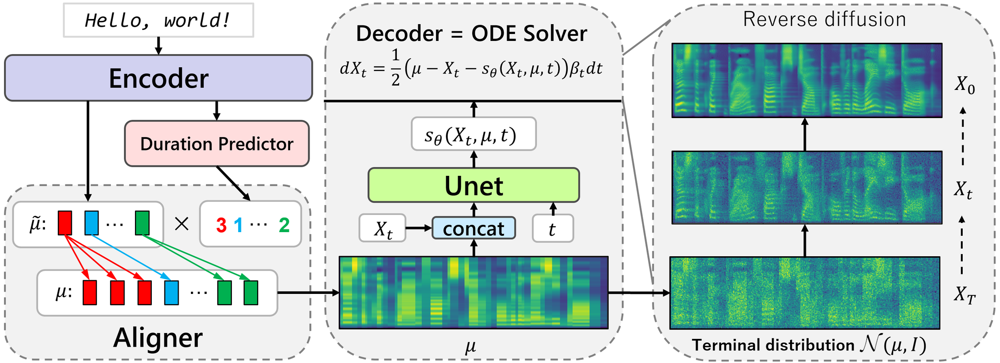

*Figure 2 · [Source](https://arxiv.org/abs/2105.06337)*

Details

**Input → output:** T → S · **Interaction:** generation

Transforms text-conditioned noise into a mel spectrogram; the number of diffusion steps controls the inference tradeoff.

### Matcha-TTS

Conditional flow matching with an encoder-decoder acoustic model.

[Paper](https://arxiv.org/abs/2309.03199)

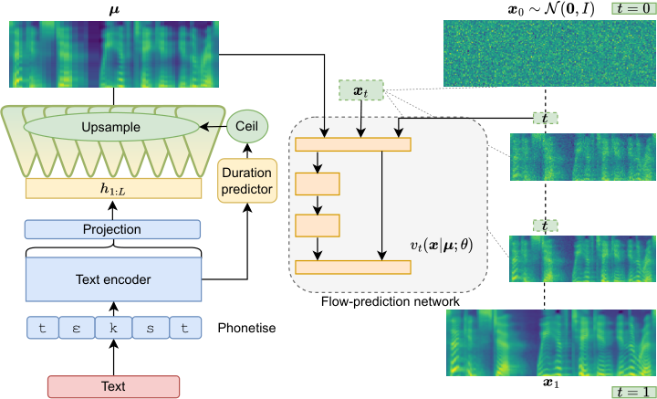

*Figure 1 · [Source](https://arxiv.org/abs/2309.03199)*

Details

**Input → output:** T → S · **Interaction:** generation

An ODE decoder generates mel spectrograms from aligned text representations, followed by a neural vocoder.

### MegaTTS 3

Sparse-alignment latent diffusion Transformer.

[Paper](https://arxiv.org/abs/2502.18924)

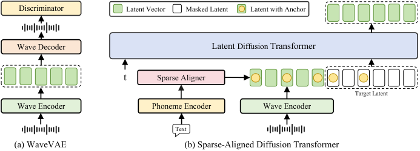

*Figure 1 · [Source](https://arxiv.org/abs/2502.18924)*

Details

**Input → output:** T, S → S · **Interaction:** generation

Sparse boundaries guide text-speech alignment; piecewise rectified flow accelerates synthesis and guidance controls accent strength.

### NaturalSpeech 2

Latent diffusion over neural-codec representations.

[Paper](https://arxiv.org/abs/2304.09116)

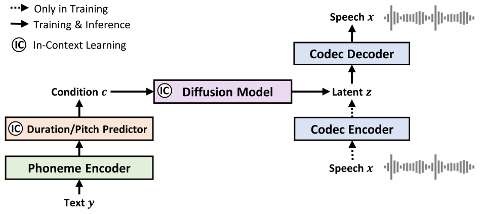

*Figure 1 · [Source](https://arxiv.org/abs/2304.09116)*

Details

**Input → output:** T, S → S · **Interaction:** generation

Speech prompts condition duration, pitch and latent generation for zero-shot synthesis. Singing is an additional task in the paper.

### NaturalSpeech 3

Factorized speech codec and attribute-wise diffusion.

[Paper](https://arxiv.org/abs/2403.03100)

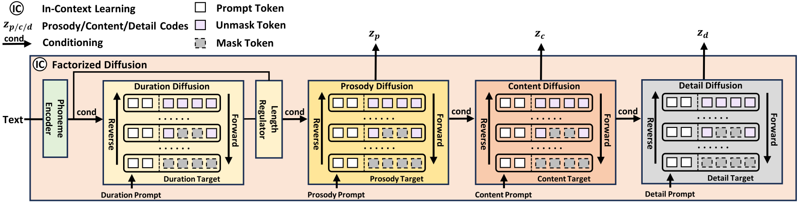

*Figure 3 · [Source](https://arxiv.org/abs/2403.03100)*

Details

**Input → output:** T, S → S · **Interaction:** generation

Separates content, prosody, timbre and acoustic detail, then generates the corresponding speech representations with diffusion models.

### PromptTTS 2

Prompt-conditioned TTS with a diffusion variation network.

[Paper](https://arxiv.org/abs/2309.02285)

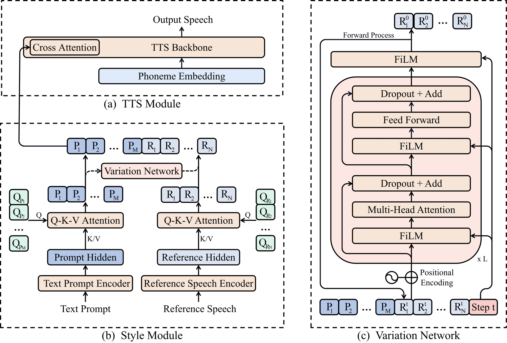

*Figure 1 · [Source](https://arxiv.org/abs/2309.02285)*

Details

**Input → output:** T → S · **Interaction:** generation

Samples voice variability not captured by the text description. Reference speech is used in training; the prompt-generation LLM is a separate data-construction component.

### StyleTTS 2

Style diffusion and adversarial training with speech-model discriminators.

[Paper](https://arxiv.org/abs/2306.07691)

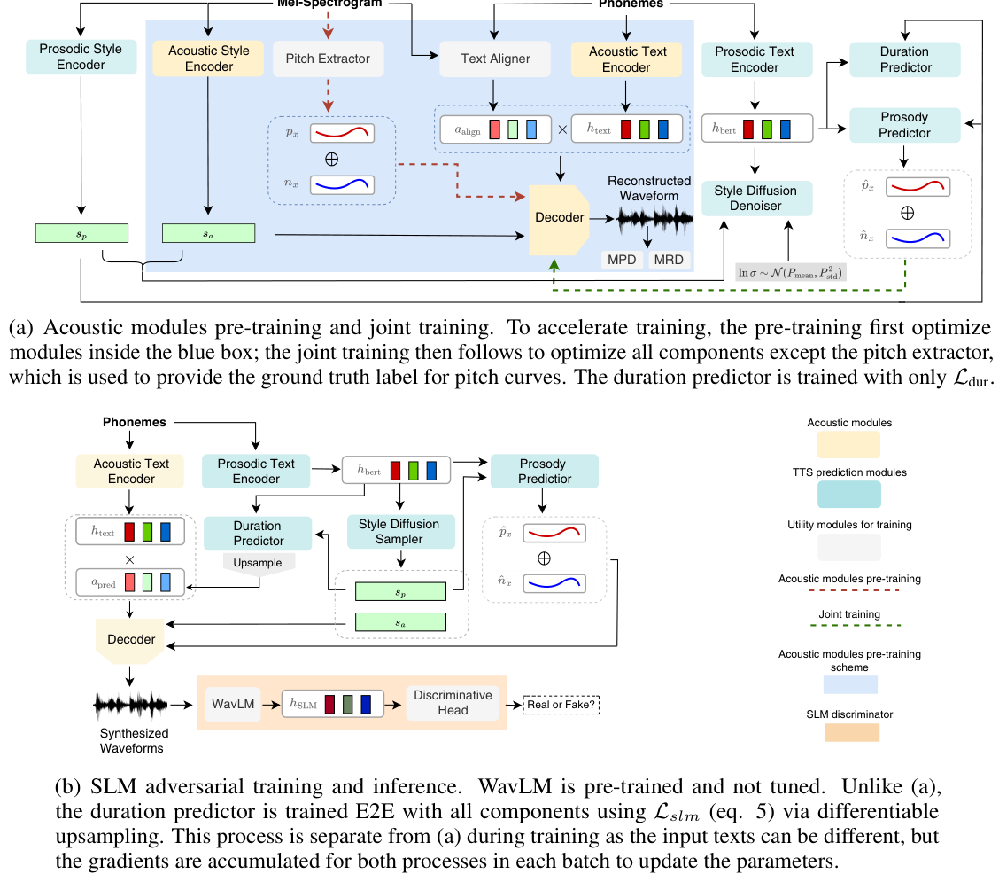

*Figure 1, PDF p. 4 · [Source](https://arxiv.org/abs/2306.07691)*

Details

**Input → output:** T, S → S · **Interaction:** generation

Samples style conditioned on text; multi-speaker synthesis can additionally use a voice reference. The speech model acts as a discriminator during training.

### Voicebox

Non-autoregressive flow matching for speech infilling.

[Paper](https://arxiv.org/abs/2306.15687)

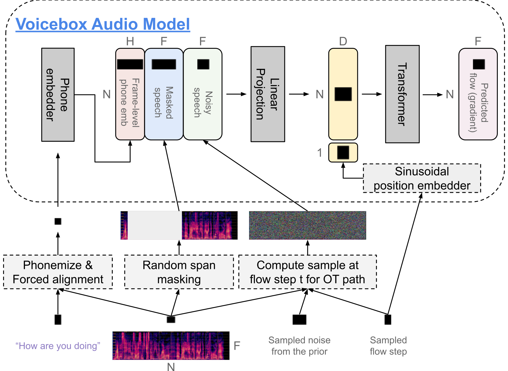

*Figure 2 · [Source](https://arxiv.org/abs/2306.15687)*

Details

**Input → output:** T, S → S · **Interaction:** generation

Uses text and surrounding audio for zero-shot synthesis. Editing, denoising and style transfer are other applications of the model.

