# Parallel acoustic models

<!-- Generated by scripts/catalog.py from data/models.json and data/figures.json. Edit the JSON, then regenerate. -->

[← All models](../README.md#models)

**25 models · Reviewed 2026-09-13**

Primary-source figures and labeled input/output diagrams. [Figure credits](../assets/architectures/CREDITS.md).

Model index and modality key

**Inputs and outputs:** T = text, S = speech, A = other audio, I = image, V = video. Speech input usually means an optional voice or prosody reference. For acoustic models, output includes the accompanying waveform synthesizer. See the [methodology](../docs/methodology.md#modalities-and-interaction).

Dates refer to papers or announcements, not necessarily model releases.

| Model | Source date | Input → output | Interaction |
| --- | --- | --- | --- |
| [AMNet](#amnet) | 2025-04-12 | T → S | generation |
| [Causal-prosody FastSpeech 2](#causal-prosody-fastspeech-2) | 2026-03-12 | T → S | generation |
| [Clip-TTS](#clip-tts) | 2025-02-26 | T → S | generation |
| [DelightfulTTS](#delightfultts) | 2021-10-25 | T → S | generation |
| [DiEmo-TTS](#diemo-tts) | 2025-05-26 | T, S → S | generation |
| [EME-TTS](#eme-tts) | 2025-07-16 | T → S | generation |
| [Emotion-timbre disentangled TTS](#emotion-timbre-disentangled-tts) | 2025-10-02 | T, S → S | generation |
| [EmotiVoice](#emotivoice) | — | T → S | generation |
| [FastPitch](#fastpitch) | 2020-06-11 | T → S | generation |
| [FastSpeech](#fastspeech) | 2019-05-22 | T → S | generation |
| [FastSpeech 2](#fastspeech-2) | 2020-06-08 | T → S | generation |
| [GSA-TTS](#gsa-tts) | 2025-05-26 | T, S → S | generation |
| [JETS](#jets) | 2022-03-31 | T → S | generation |
| [Joint non-autoregressive STT-TTS](#joint-non-autoregressive-stt-tts) | 2025-01-15 | T → S | generation |
| [LanStyleTTS](#lanstyletts) | 2025-04-11 | T, S → S | generation |
| [LightSpeech](#lightspeech) | 2021-02-08 | T → S | generation |
| [Parallel Tacotron](#parallel-tacotron) | 2020-10-22 | T → S | generation |
| [Parallel Tacotron 2](#parallel-tacotron-2) | 2021-03-26 | T → S | generation |
| [ParaStyleTTS](#parastyletts) | 2025-10-21 | T → S | generation |
| [Phoneme-tone adaptive Thai TTS](#phoneme-tone-adaptive-thai-tts) | 2025-04-10 | T, S → S | generation |
| [PROEMO](#proemo) | 2025-01-10 | T → S | generation |
| [PromptTTS](#prompttts) | 2022-11-22 | T → S | generation |
| [SpeedySpeech](#speedyspeech) | 2020-08-09 | T → S | generation |
| [StyleTTS](#styletts) | 2022-05-30 | T, S → S | generation |
| [VisualSpeech](#visualspeech) | 2025-01-31 | T, V → S | generation |

## Architectures

### AMNet

FastSpeech 2 with phrase annotations and local convolution.

AMNet adds phrase-structure information and local convolutional modeling to a parallel Mandarin acoustic model. These changes help capture contextual pauses, emphasis and intonation before the accompanying vocoder reconstructs the waveform.

[Paper](https://arxiv.org/abs/2504.09225) · GitHub: no author-linked repository found

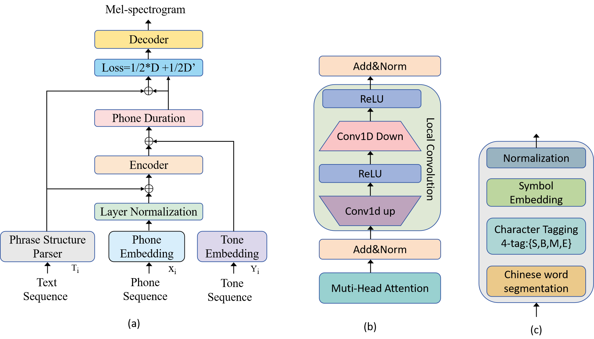

*Paper figure · [Source](https://arxiv.org/abs/2504.09225)*

Details

**Input → output:** T → S · **Interaction:** generation

The first-submission date refers to the linked research paper. Reference and control options depend on the synthesis setting described there.

### Causal-prosody FastSpeech 2

Emotion-conditioned variance adaptation with counterfactual prosody training.

This FastSpeech 2 extension explicitly models emotion alongside duration, pitch and energy. Counterfactual training separates emotional changes from linguistic content, allowing users to modify prosody while preserving the intended words.

[Paper](https://arxiv.org/abs/2603.11683) · GitHub: no author-linked repository found

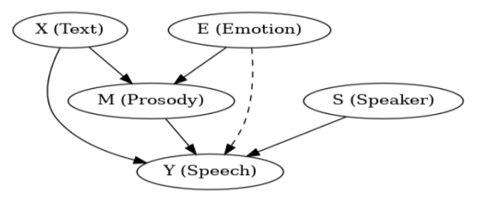

*Figure 1 (paper page 3) · [Source](https://arxiv.org/abs/2603.11683)*

Details

**Input → output:** T → S · **Interaction:** generation

The first-submission date refers to the linked research paper. Reference and control options depend on the synthesis setting described there.

### Clip-TTS

Contrastively aligned text and mel features in a Transformer acoustic model.

Clip-TTS trains its textual representation against corresponding mel-spectrogram information through a contrastive objective. The acoustic Transformer uses the resulting context-aware features to improve prosodic interpretation during speech generation.

[Paper](https://arxiv.org/abs/2502.18889) · GitHub: no author-linked repository found

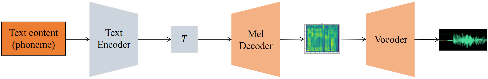

*Figure 3 · [Source](https://arxiv.org/abs/2502.18889)*

Details

**Input → output:** T → S · **Interaction:** generation

The first-submission date refers to the linked research paper. Reference and control options depend on the synthesis setting described there.

### DelightfulTTS

Conformer acoustic model with explicit and implicit prosody.

[Paper](https://arxiv.org/abs/2110.12612)

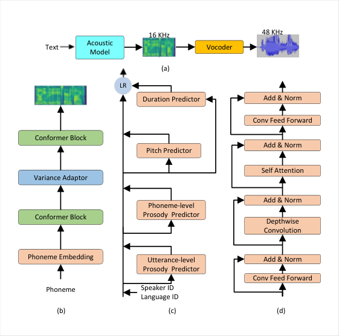

*Figure 1 · [Source](https://arxiv.org/abs/2110.12612)*

Details

**Input → output:** T → S · **Interaction:** generation

Predicts acoustic features and variation factors, then uses HiFiNet to synthesize higher-sample-rate audio.

### DiEmo-TTS

Self-supervised emotion distillation with disentangled voice conditioning.

DiEmo-TTS distills emotion information from speech while suppressing unrelated speaker characteristics. Cluster-based sampling and representation perturbation improve cross-speaker emotion transfer, including situations where extensive emotion labels are unavailable.

[Paper](https://arxiv.org/abs/2505.19687) · [GitHub](https://github.com/Choddeok/DiEmo-TTS)

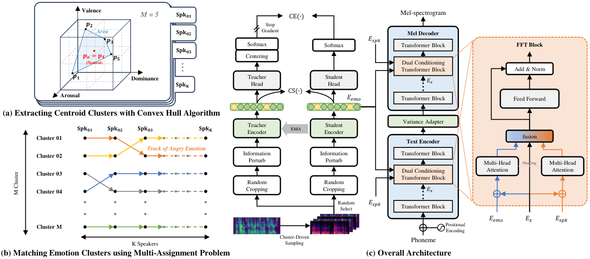

*Figure 1 · [Source](https://arxiv.org/abs/2505.19687)*

Details

**Input → output:** T, S → S · **Interaction:** generation

The first-submission date refers to the linked research paper. Reference and control options depend on the synthesis setting described there.

### EME-TTS

Emotion-aware emphasis modeling with weakly supervised controls.

EME-TTS jointly models emotional delivery and local emphasis instead of treating them as independent effects. Automatically derived emphasis labels and variance-related features help users stress selected material while retaining a recognizable target emotion.

[Paper](https://arxiv.org/abs/2507.12015) · GitHub: no author-linked repository found

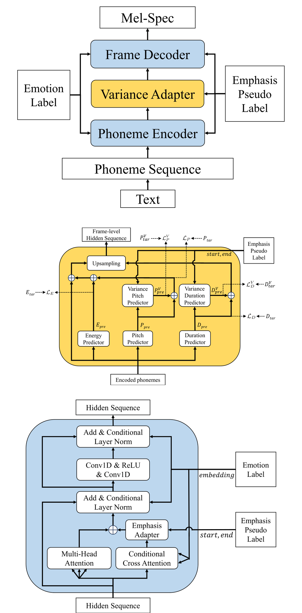

*Figure 1 · [Source](https://arxiv.org/abs/2507.12015)*

Details

**Input → output:** T → S · **Interaction:** generation

The first-submission date refers to the linked research paper. Reference and control options depend on the synthesis setting described there.

### Emotion-timbre disentangled TTS

Phoneme-level emotion prediction with mutual-information disentanglement.

This emotional synthesizer learns separate reference encoders for timbre and emotion. A mutual-information objective reduces their overlap, while phoneme-level emotion prediction carries changing expression into the generated acoustic sequence.

[Paper](https://arxiv.org/abs/2510.01722) · [GitHub](https://github.com/BaleYang/emotion-timbre-disentangled-tts-code) · [Project](https://baleyang.github.io/emotion-timbre-disentangled-tts/)

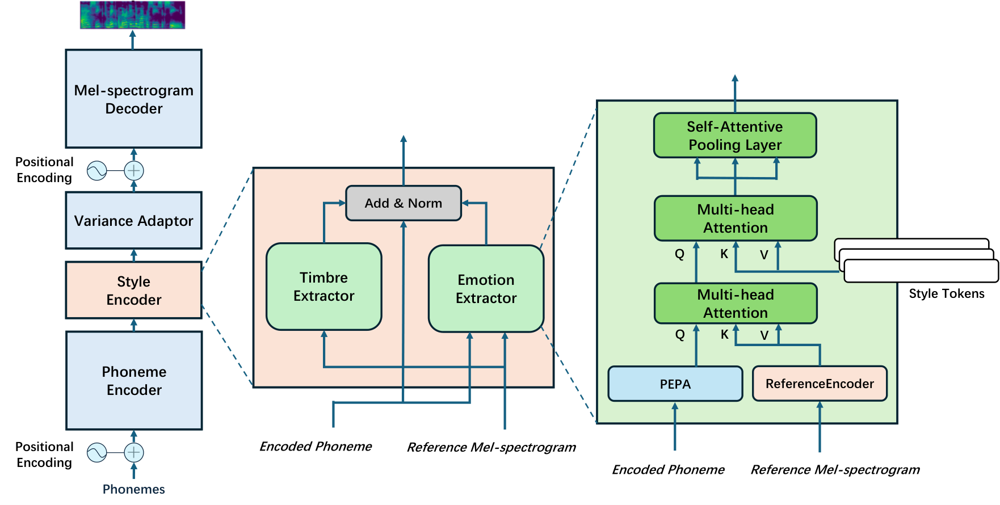

*Figure 1 · [Source](https://arxiv.org/abs/2510.01722)*

Details

**Input → output:** T, S → S · **Interaction:** generation

The first-submission date refers to the linked research paper. Reference and control options depend on the synthesis setting described there.

### EmotiVoice

PromptTTS-derived style and content conditioning.

[GitHub](https://github.com/netease-youdao/EmotiVoice)

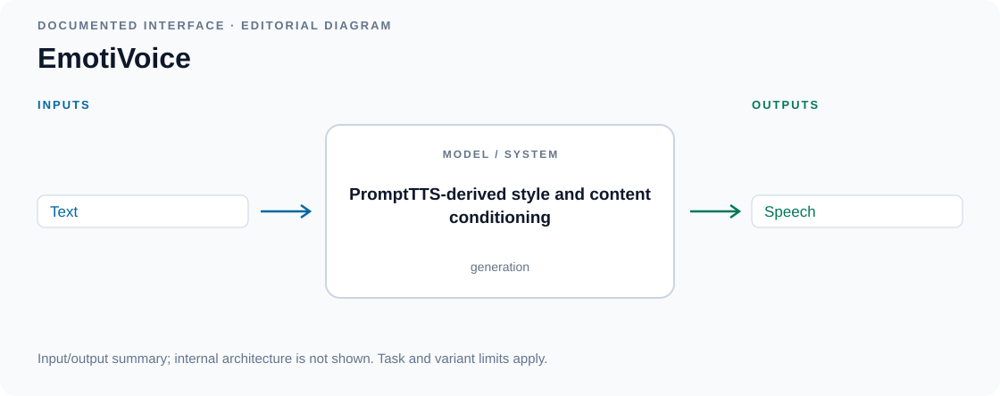

*Input/output diagram · [Source](https://github.com/netease-youdao/EmotiVoice)*

Details

**Input → output:** T → S · **Interaction:** generation

Released English and Chinese synthesizers accept text prompts describing emotion and delivery. Voice adaptation is a separate training workflow.

Editorial summary of documented inputs and outputs; internal architecture is not shown.

### FastPitch

Parallel Transformer with explicit pitch prediction.

[Paper](https://arxiv.org/abs/2006.06873)

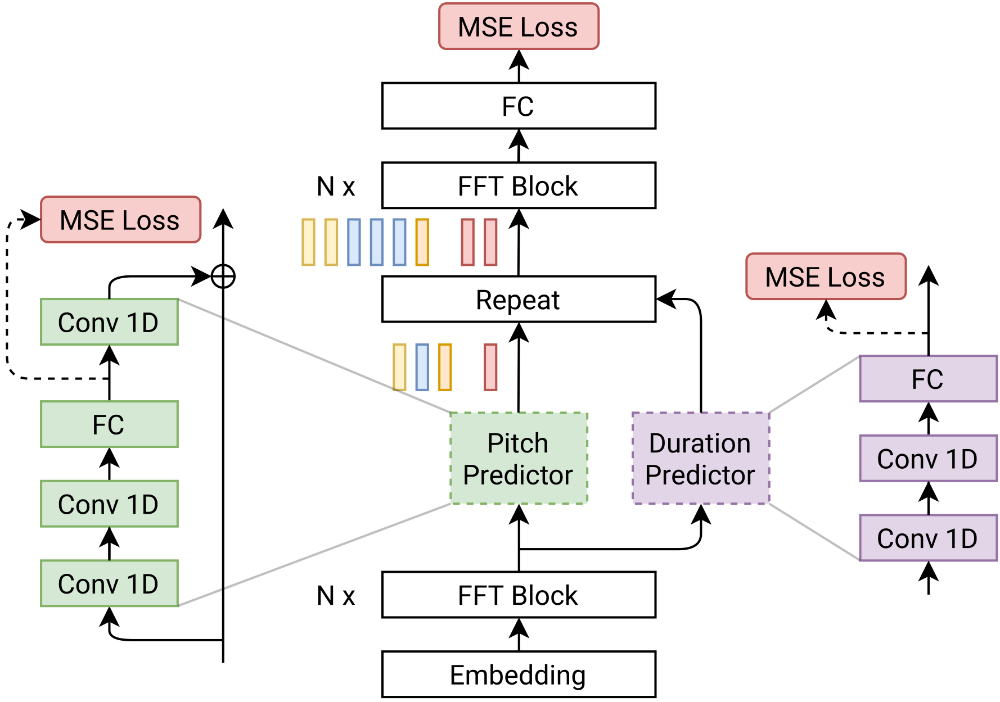

*Figure 1 · [Source](https://arxiv.org/abs/2006.06873)*

Details

**Input → output:** T → S · **Interaction:** generation

Predicts token durations and pitch before mel-spectrogram generation; pitch predictions can be edited to control delivery.

### FastSpeech

Feed-forward Transformer and duration-based length regulator.

[Paper](https://arxiv.org/abs/1905.09263)

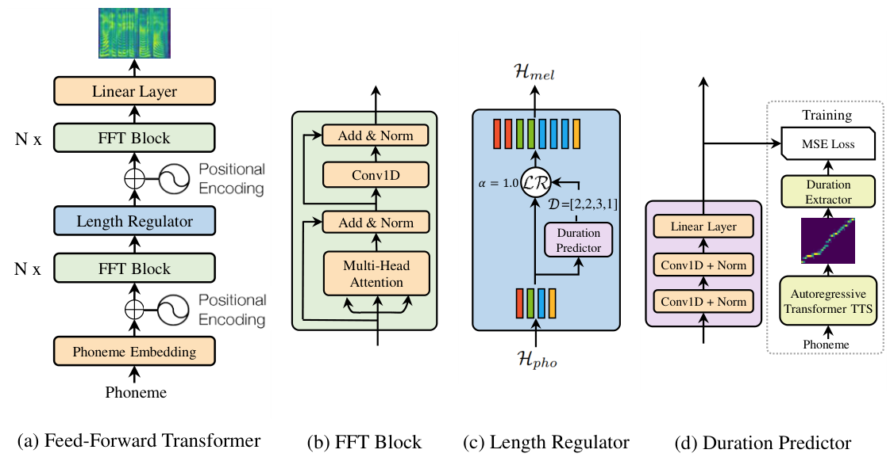

*Figure 1, PDF p. 4 · [Source](https://arxiv.org/abs/1905.09263)*

Details

**Input → output:** T → S · **Interaction:** generation

Generates mel frames in parallel using durations learned from an autoregressive teacher, followed by a vocoder.

### FastSpeech 2

Parallel Transformer with duration, pitch and energy prediction.

[Paper](https://arxiv.org/abs/2006.04558)

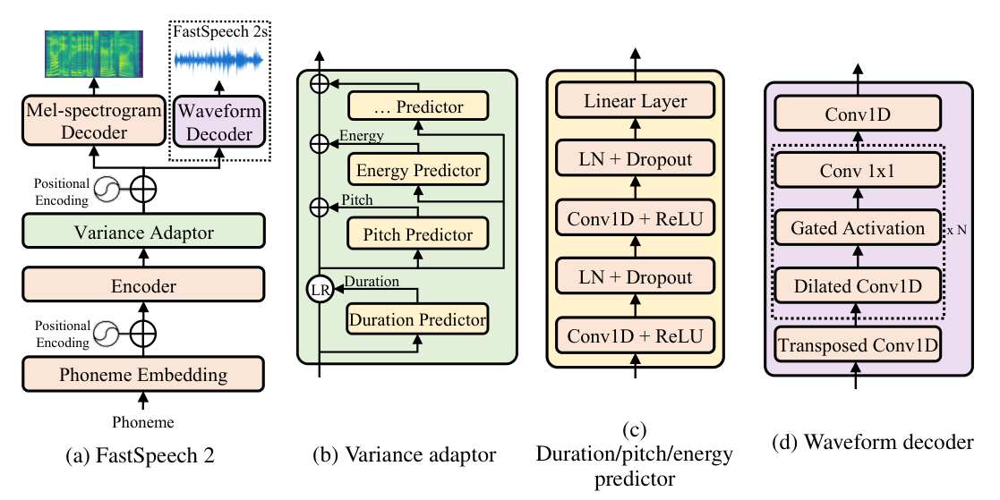

*Figure 1, PDF p. 3 · [Source](https://arxiv.org/abs/2006.04558)*

Details

**Input → output:** T → S · **Interaction:** generation

Learns from ground-truth speech without teacher distillation. FastSpeech 2s adds a parallel waveform decoder.

**Variants:** FastSpeech 2s.

### GSA-TTS

Hierarchical gradual style encoding from reference speech.

GSA-TTS extracts local style information at successive levels and combines it through attention into a global reference condition. This richer style representation guides the acoustic model when synthesizing an unseen speaker's voice.

[Paper](https://arxiv.org/abs/2505.19384) · GitHub: no author-linked repository found

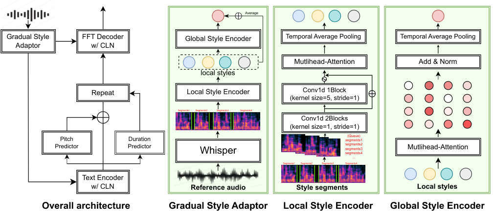

*Figure 1 · [Source](https://arxiv.org/abs/2505.19384)*

Details

**Input → output:** T, S → S · **Interaction:** generation

The first-submission date refers to the linked research paper. Reference and control options depend on the synthesis setting described there.

### JETS

Joint FastSpeech 2 and HiFi-GAN with learned alignment.

[Paper](https://arxiv.org/abs/2203.16852)

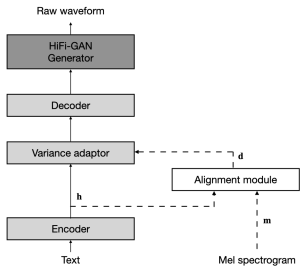

*Figure 1, PDF p. 2 · [Source](https://arxiv.org/abs/2203.16852)*

Details

**Input → output:** T → S · **Interaction:** generation

Trains the acoustic model and waveform generator together, avoiding a separately supplied text-speech alignment.

### Joint non-autoregressive STT-TTS

Shared multimodal encoder-decoder with iterative output refinement.

This model handles text and speech within one non-autoregressive architecture. Its TTS path predicts acoustic output from text, and feeding partial predictions back into the model improves generation through iterative refinement while also supporting recognition training.

[Paper](https://arxiv.org/abs/2501.09104) · GitHub: no author-linked repository found

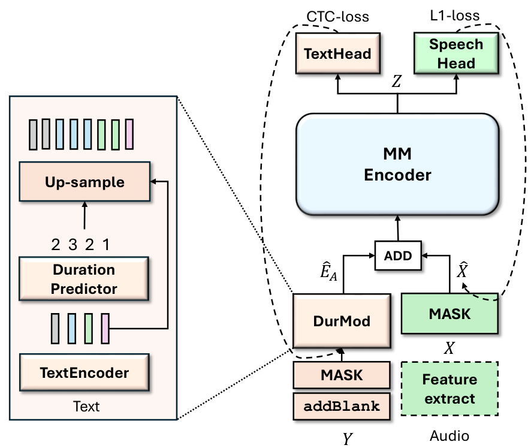

*Paper figure · [Source](https://arxiv.org/abs/2501.09104)*

Details

**Input → output:** T → S · **Interaction:** generation

The first-submission date refers to the linked research paper. Reference and control options depend on the synthesis setting described there.

### LanStyleTTS

Shared multilingual phonemes with language-aware style adaptation.

LanStyleTTS standardizes phonetic inputs and introduces local style conditioning across languages. The framework can augment several parallel acoustic backbones, allowing one multilingual model to vary delivery at phoneme level.

[Paper](https://arxiv.org/abs/2504.08274) · GitHub: no author-linked repository found

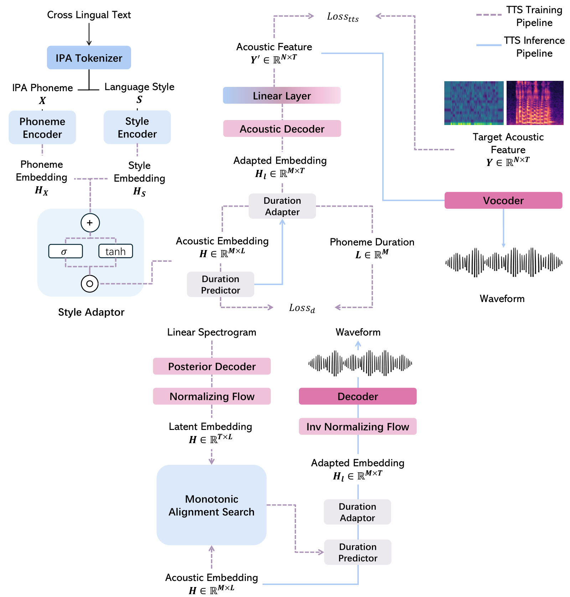

*Paper figure · [Source](https://arxiv.org/abs/2504.08274)*

Details

**Input → output:** T, S → S · **Interaction:** generation

The first-submission date refers to the linked research paper. Reference and control options depend on the synthesis setting described there.

### LightSpeech

FastSpeech-derived architecture found by neural architecture search.

[Paper](https://arxiv.org/abs/2102.04040)

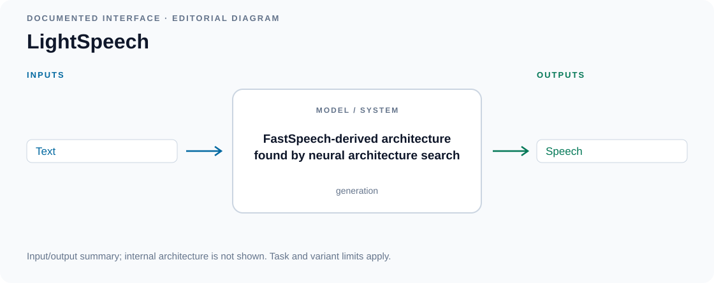

*Input/output diagram · [Source](https://arxiv.org/abs/2102.04040)*

Details

**Input → output:** T → S · **Interaction:** generation

Searches lightweight convolutional and attention components for compact acoustic modeling. This entry covers the Luo et al. model.

Editorial summary of documented inputs and outputs; internal architecture is not shown.

### Parallel Tacotron

Parallel acoustic model with a variational residual encoder.

[Paper](https://arxiv.org/abs/2010.11439)

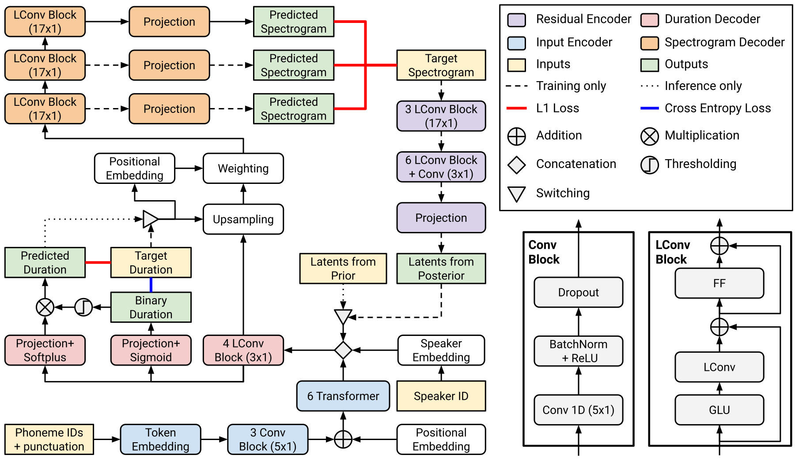

*Figure 1 · [Source](https://arxiv.org/abs/2010.11439)*

Details

**Input → output:** T → S · **Interaction:** generation

Uses lightweight convolutions and residual variation modeling to generate mel spectrograms, followed by a neural vocoder.

### Parallel Tacotron 2

Parallel synthesis with differentiable duration modeling.

[Paper](https://arxiv.org/abs/2103.14574)

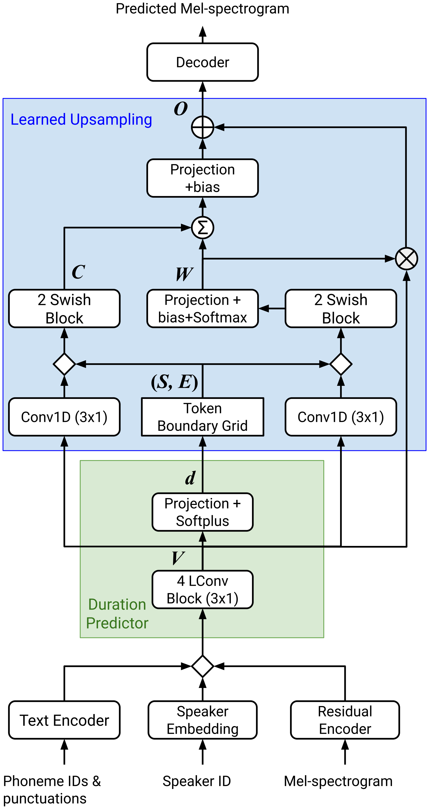

*Figure 1 · [Source](https://arxiv.org/abs/2103.14574)*

Details

**Input → output:** T → S · **Interaction:** generation

Learns alignment and token durations through differentiable upsampling and a Soft-DTW reconstruction objective.

### ParaStyleTTS

Two-level adaptation separating prosodic and paralinguistic style.

ParaStyleTTS converts textual style prompts into separate controls for prosody and broader paralinguistic characteristics. The lightweight adaptation design targets expressive speech from descriptions while making the roles of the two conditioning levels explicit.

[Paper](https://arxiv.org/abs/2510.18308) · [GitHub](https://github.com/haoweilou/ParaStyleTTS) · [Project](https://parastyletts.github.io/ParaStyleTTS_Demo/)

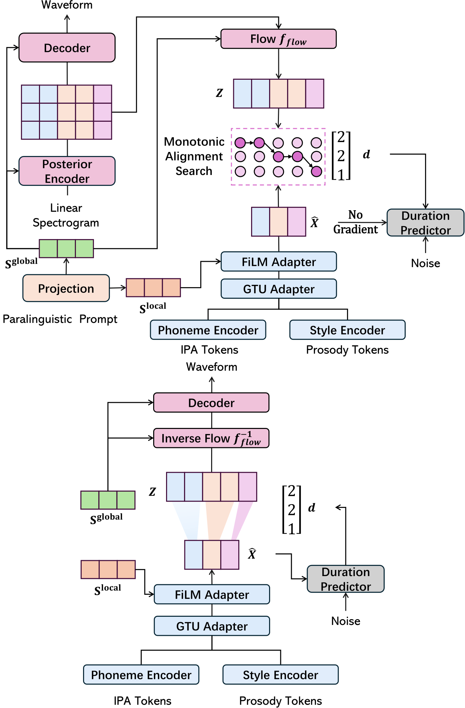

*Figure 1 · [Source](https://arxiv.org/abs/2510.18308)*

Details

**Input → output:** T → S · **Interaction:** generation

The first-submission date refers to the linked research paper. Reference and control options depend on the synthesis setting described there.

### Phoneme-tone adaptive Thai TTS

Phoneme-tone BERT with duration, pitch and energy predictors.

This Thai speech synthesizer encodes phonemes and tones with a language-specific BERT model, then predicts duration, pitch and energy for a GAN-trained waveform decoder. A reference-derived style vector supports voice cloning. Multilingual pretraining of acoustic feature extractors and Thai adaptation address limited language-specific data.

[Paper](https://arxiv.org/abs/2504.07858) · GitHub: no author-linked repository found

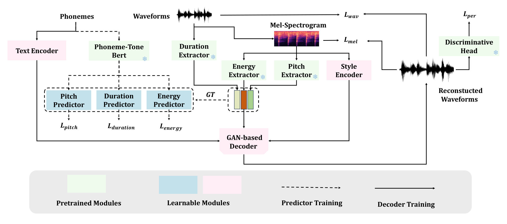

*Figure 2 · [Source](https://arxiv.org/abs/2504.07858)*

Details

**Input → output:** T, S → S · **Interaction:** generation

The first-submission date refers to the linked research paper. Reference and control options depend on the synthesis setting described there.

### PROEMO

Prompt-conditioned multi-speaker emotion and intensity modeling.

PROEMO combines emotional prompts with an explicit intensity control in a multi-speaker synthesizer. The conditioning adjusts delivery strength and prosodic variation, allowing the same spoken text to be rendered with different emotional performances.

[Paper](https://arxiv.org/abs/2501.06276) · GitHub: no author-linked repository found

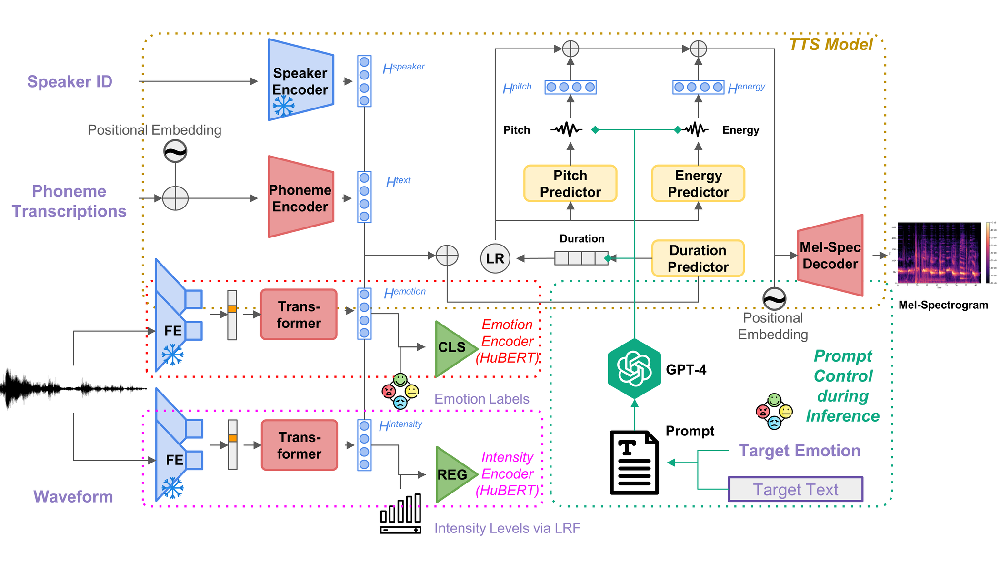

*Figure 1 · [Source](https://arxiv.org/abs/2501.06276)*

Details

**Input → output:** T → S · **Interaction:** generation

The first-submission date refers to the linked research paper. Reference and control options depend on the synthesis setting described there.

### PromptTTS

Style and content text encoders with a speech decoder.

[Paper](https://arxiv.org/abs/2211.12171)

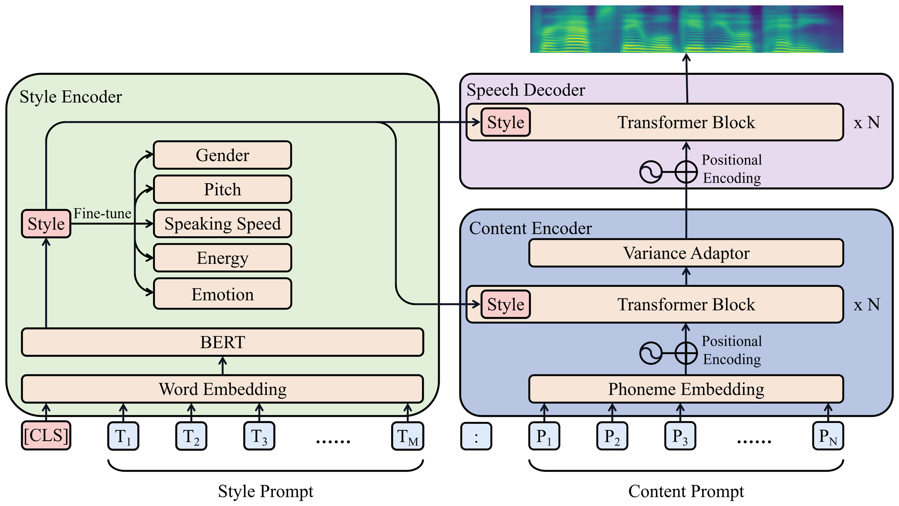

*Figure 1 · [Source](https://arxiv.org/abs/2211.12171)*

Details

**Input → output:** T → S · **Interaction:** generation

Accepts a spoken script plus a natural-language description of the desired voice and delivery.

### SpeedySpeech

Residual convolutional acoustic model with duration expansion.

[Paper](https://arxiv.org/abs/2008.03802)

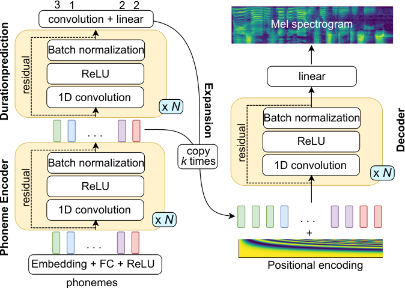

*Figure 3 · [Source](https://arxiv.org/abs/2008.03802)*

Details

**Input → output:** T → S · **Interaction:** generation

A teacher provides durations for the parallel student; a MelGAN vocoder converts predicted spectrograms to audio.

### StyleTTS

Style-conditioned parallel synthesis with a transferable aligner.

[Paper](https://arxiv.org/abs/2205.15439)

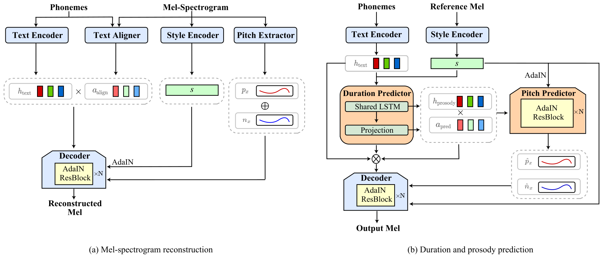

*Figure 1 · [Source](https://arxiv.org/abs/2205.15439)*

Details

**Input → output:** T, S → S · **Interaction:** generation

Extracts speaking style from reference speech and predicts duration, pitch and energy for acoustic generation.

### VisualSpeech

Visual-textual context conditioning for prosodic synthesis.

VisualSpeech adds video-derived context to a text-to-speech model to reduce ambiguity in delivery. The visual representation guides prosodic choices so the same text can be rendered in a way that fits its scene.

[Paper](https://arxiv.org/abs/2501.19258) · [Project](https://ariameetgit.github.io/VISUALSPEECH-SAMPLES/) · GitHub: no author-linked repository found

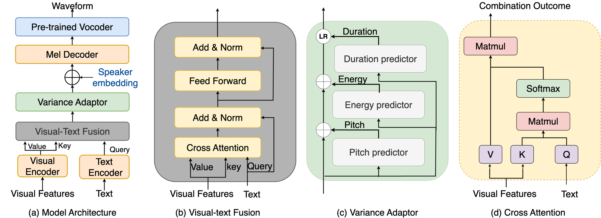

*Figure 1 · [Source](https://arxiv.org/abs/2501.19258)*

Details

**Input → output:** T, V → S · **Interaction:** generation

The first-submission date refers to the linked research paper. Reference and control options depend on the synthesis setting described there.

