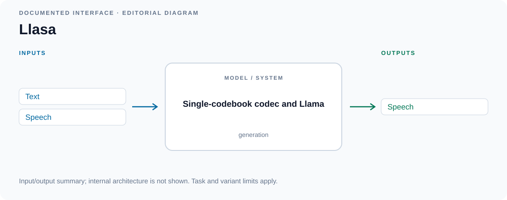

# Speech-token language models

<!-- Generated by scripts/catalog.py from data/models.json and data/figures.json. Edit the JSON, then regenerate. -->

[← All models](../README.md#models)

**60 models · Reviewed 2026-09-13**

Primary-source figures and labeled input/output diagrams. [Figure credits](../assets/architectures/CREDITS.md).

Model index and modality key

**Inputs and outputs:** T = text, S = speech, A = other audio. Speech input usually means an optional voice or prosody reference. For acoustic models, output includes the accompanying waveform synthesizer. See the [methodology](../docs/methodology.md#modalities-and-interaction).

Dates refer to papers or announcements, not necessarily model releases.

| Model | Source date | Input → output | Interaction |
| --- | --- | --- | --- |
| [Bark](#bark) | — | T → S, A | generation |
| [BASE TTS](#base-tts) | 2024-02-12 | T, S → S | streaming |
| [Chatterbox](#chatterbox) | — | T, S → S | generation |
| [ChatTTS](#chattts) | — | T → S | generation |
| [CLaM-TTS](#clam-tts) | 2024-04-03 | T, S → S | generation |
| [CosyVoice](#cosyvoice) | 2024-07-07 | T, S → S | generation |
| [CosyVoice 2](#cosyvoice-2) | 2024-12-13 | T, S → S | streaming |
| [CosyVoice 3](#cosyvoice-3) | 2025-05-23 | T, S → S | streaming |
| [CSM](#csm) | — | T, S → S | generation |
| [Dia](#dia) | — | T, S → S | generation |
| [Dia2](#dia2) | — | T, S → S | streaming |
| [ELLA-V](#ella-v) | 2024-01-14 | T, S → S | generation |
| [FireRedTTS](#fireredtts) | 2024-09-05 | T, S → S | generation |
| [FireRedTTS-2](#fireredtts-2) | 2025-09-02 | T, S → S | streaming |
| [Fish Audio S1 / OpenAudio S1](#openaudio-s1) | — | T, S → S | generation |
| [Fish Audio S2](#fish-audio-s2) | 2026-03-09 | T, S → S | generation |
| [Fish Speech](#fish-speech) | 2024-11-02 | T, S → S | generation |
| [GLM-TTS](#glm-tts) | 2025-12-16 | T, S → S | generation |
| [GPT-SoVITS](#gpt-sovits) | — | T, S → S | generation |
| [Higgs Audio v2](#higgs-audio-v2) | — | T, S → S | generation |
| [Higgs Audio v2.5](#higgs-audio-v2-5) | — | T, S → S | streaming |
| [Higgs Audio v3 TTS](#higgs-audio-v3-tts) | — | T, S → S | streaming |
| [IndexTTS](#indextts) | 2025-02-08 | T, S → S | generation |
| [IndexTTS 2.5](#indextts-2-5) | 2026-01-07 | T, S → S | generation |
| [IndexTTS2](#indextts2) | 2025-06-23 | T, S → S | generation |
| [Kyutai TTS (DSM)](#kyutai-tts-dsm) | 2025-09-10 | T, S → S | streaming |
| [Llasa](#llasa) | 2025-02-06 | T, S → S | generation |
| [Llasa+](#llasa-plus) | 2025-08-08 | T, S → S | streaming |
| [MaskGCT](#maskgct) | 2024-09-01 | T, S → S | generation |
| [Mega-TTS](#mega-tts) | 2023-06-06 | T, S → S | generation |
| [Mega-TTS 2](#mega-tts-2) | 2023-07-14 | T, S → S | generation |
| [MiniMax-Speech](#minimax-speech) | 2025-05-12 | T, S → S | generation |
| [MOSS-TTS](#moss-tts) | 2026-03-18 | T, S → S | generation |
| [MOSS-TTS-Nano](#moss-tts-nano) | — | T, S → S | streaming |
| [MOSS-TTS-Realtime](#moss-tts-realtime) | — | T, S → S | streaming |
| [MOSS-TTSD](#moss-ttsd) | 2026-03-20 | T, S → S | generation |
| [MOSS-VoiceGenerator](#moss-voicegenerator) | 2026-03-30 | T → S | generation |
| [NeuTTS Air](#neutts-air) | — | T, S → S | streaming |
| [NeuTTS Nano](#neutts-nano) | — | T, S → S | streaming |
| [NeuTTS-2E](#neutts-2e) | — | T → S | streaming |
| [OmniVoice](#omnivoice) | 2026-04-01 | T, S → S | generation |
| [Orpheus TTS](#orpheus-tts) | — | T, S → S | generation |
| [OuteTTS](#outetts) | — | T, S → S | generation |
| [Parler-TTS](#parler-tts) | — | T → S | generation |
| [Qwen3-TTS](#qwen3-tts) | 2026-01-22 | T, S → S | streaming |
| [RALL-E](#rall-e) | 2024-04-04 | T, S → S | generation |
| [Seed-TTS](#seed-tts) | 2024-06-04 | T, S → S | generation |
| [Spark-TTS](#spark-tts) | 2025-03-03 | T, S → S | generation |
| [SPEAR-TTS](#spear-tts) | 2023-02-07 | T, S → S | generation |
| [SpeechX](#speechx) | 2023-08-14 | T, S → S | generation |
| [Step-Audio-TTS](#step-audio-tts) | 2025-02-17 | T, S → S | generation |
| [Tortoise TTS](#tortoise-tts) | 2023-05-12 | T, S → S | generation |
| [VALL-E](#vall-e) | 2023-01-05 | T, S → S | generation |
| [VALL-E 2](#vall-e-2) | 2024-06-08 | T, S → S | generation |
| [VALL-E X](#vall-e-x) | 2023-03-07 | T, S → S | generation |
| [VALL-T](#vall-t) | 2024-01-25 | T, S → S | generation |
| [VoiceCraft](#voicecraft) | 2024-03-25 | T, S → S | generation |
| [WhisperSpeech](#whisperspeech) | — | T, S → S | generation |
| [XTTS](#xtts) | 2024-06-07 | T, S → S | streaming |
| [Zonos](#zonos) | — | T, S → S | generation |

## Architectures

### Bark

Hierarchical autoregressive audio tokens.

[Repository](https://github.com/suno-ai/bark)

*Input/output diagram · [Source](https://github.com/suno-ai/bark)*

Details

**Input → output:** T → S, A · **Interaction:** generation

Text-conditioned speech, nonverbal sounds and some music generation.

Editorial summary of documented inputs and outputs; internal architecture is not shown.

**Variants:** Bark; Bark Small.

### BASE TTS

Autoregressive speechcodes and convolutional decoder.

[Paper](https://arxiv.org/abs/2402.08093)

*Figure 1 · [Source](https://arxiv.org/abs/2402.08093)*

Details

**Input → output:** T, S → S · **Interaction:** streaming

Models discrete speech codes with an incremental waveform decoder.

### Chatterbox

Speech-token LM and acoustic decoder.

[Repository](https://github.com/resemble-ai/chatterbox)

*Input/output diagram · [Source](https://github.com/resemble-ai/chatterbox)*

Details

**Input → output:** T, S → S · **Interaction:** generation

Family of reference-conditioned speech synthesizers; capabilities vary by release.

Editorial summary of documented inputs and outputs; internal architecture is not shown.

**Variants:** Original; Multilingual V2; Multilingual V3; Turbo; Nano; Single Language Pack.

### ChatTTS

Autoregressive speech-token generation.

[Repository](https://github.com/2noise/ChatTTS)

*Input/output diagram · [Source](https://github.com/2noise/ChatTTS)*

Details

**Input → output:** T → S · **Interaction:** generation

Synthesizes conversational delivery from supplied text; does not itself answer a user's questions.

Editorial summary of documented inputs and outputs; internal architecture is not shown.

### CLaM-TTS

Probabilistic residual quantization and multi-token LM.

[Paper](https://arxiv.org/abs/2404.02781)

*Figure 1 · [Source](https://arxiv.org/abs/2404.02781)*

Details

**Input → output:** T, S → S · **Interaction:** generation

Predicts multiple codec tokens jointly to reduce generation cost.

### CosyVoice

Supervised semantic tokens and flow decoder.

[Paper](https://arxiv.org/abs/2407.05407)

*Figure 1 · [Source](https://arxiv.org/abs/2407.05407)*

Details

**Input → output:** T, S → S · **Interaction:** generation

Text-conditioned multilingual synthesis and voice conditioning.

**Variants:** 300M; SFT; Instruct.

### CosyVoice 2

Text/speech LM and chunk-aware flow matching.

[Paper](https://arxiv.org/abs/2412.10117)

*Figure 1 · [Source](https://arxiv.org/abs/2412.10117)*

Details

**Input → output:** T, S → S · **Interaction:** streaming

Supports streaming text input and audio output.

**Variants:** 0.5B.

### CosyVoice 3

Scaled speech LM and post-training.

[Paper](https://arxiv.org/abs/2505.17589)

*Figure 2 · [Source](https://arxiv.org/abs/2505.17589)*

Details

**Input → output:** T, S → S · **Interaction:** streaming

Extends coverage and control of the CosyVoice streaming synthesis line.

**Variants:** Fun-CosyVoice3-0.5B.

### CSM

Llama backbone and Mimi-code decoder.

[Repository](https://github.com/sesameailabs/csm)

*Input/output diagram · [Source](https://github.com/sesameailabs/csm)*

Details

**Input → output:** T, S → S · **Interaction:** generation

Conversational Speech Model renders speech from text and audio context; the public checkpoint is not a complete voice assistant.

Editorial summary of documented inputs and outputs; internal architecture is not shown.

**Variants:** CSM-1B.

### Dia

Dialogue-conditioned codec generation.

[Repository](https://github.com/nari-labs/dia)

*Input/output diagram · [Source](https://github.com/nari-labs/dia)*

Details

**Input → output:** T, S → S · **Interaction:** generation

Renders a speaker-tagged script into multi-speaker speech with optional audio context.

Editorial summary of documented inputs and outputs; internal architecture is not shown.

**Variants:** 1.6B.

### Dia2

Streaming dialogue TTS.

[Repository](https://github.com/nari-labs/dia2)

*Input/output diagram · [Source](https://github.com/nari-labs/dia2)*

Details

**Input → output:** T, S → S · **Interaction:** streaming

Starts synthesis from partial text and supports audio prefix conditioning.

Editorial summary of documented inputs and outputs; internal architecture is not shown.

**Variants:** 1B; 2B.

### ELLA-V

Alignment-guided token reordering.

[Paper](https://arxiv.org/abs/2401.07333)

*Figure 1 · [Source](https://arxiv.org/abs/2401.07333)*

Details

**Input → output:** T, S → S · **Interaction:** generation

Interleaves phonemes and acoustic codes to stabilize autoregressive synthesis.

### FireRedTTS

Text-to-semantic LM and speech decoder.

[Paper](https://arxiv.org/abs/2409.03283)

*Figure 3 · [Source](https://arxiv.org/abs/2409.03283)*

Details

**Input → output:** T, S → S · **Interaction:** generation

Foundation TTS system for expressive and reference-conditioned speech.

### FireRedTTS-2

Low-rate streaming codec and dialogue LM.

[Paper](https://arxiv.org/abs/2509.02020)

*Figure 1 · [Source](https://arxiv.org/abs/2509.02020)*

Details

**Input → output:** T, S → S · **Interaction:** streaming

Generates context-aware multi-speaker speech from dialogue text.

### Fish Audio S1 / OpenAudio S1

Dual-autoregressive speech language model.

[Model card](https://huggingface.co/fishaudio/s1-mini)

*Input/output diagram · [Source](https://huggingface.co/fishaudio/s1-mini)*

Details

**Input → output:** T, S → S · **Interaction:** generation

Expressive TTS family also known as OpenAudio S1; the model card distinguishes the full S1 model and distilled S1-mini.

Editorial summary of documented inputs and outputs; internal architecture is not shown.

**Variants:** S1; S1-mini.

### Fish Audio S2

Dual-autoregressive speech modeling.

[Paper](https://arxiv.org/abs/2603.08823) · [Repository](https://github.com/fishaudio/fish-speech)

*Figure 2 · [Source](https://arxiv.org/abs/2603.08823)*

Details

**Input → output:** T, S → S · **Interaction:** generation

Instruction-controlled multi-speaker, multi-turn speech synthesis.

**Variants:** S2; S2-Pro.

### Fish Speech

Dual-autoregressive slow/fast transformers.

[Paper](https://arxiv.org/abs/2411.01156) · [Repository](https://github.com/fishaudio/fish-speech)

*Figure 2 · [Source](https://arxiv.org/abs/2411.01156)*

Details

**Input → output:** T, S → S · **Interaction:** generation

Separates semantic sequence modeling from grouped acoustic-token prediction.

**Variants:** Fish Speech release family.

### GLM-TTS

Autoregressive token model and diffusion decoder.

[Paper](https://arxiv.org/abs/2512.14291) · [Repository](https://github.com/zai-org/GLM-TTS)

*Figure 1 · [Source](https://arxiv.org/abs/2512.14291)*

Details

**Input → output:** T, S → S · **Interaction:** generation

Post-training improves controllable pronunciation, speaker similarity and prosody.

### GPT-SoVITS

Text-to-semantic GPT and speech decoder.

[Repository](https://github.com/RVC-Boss/GPT-SoVITS)

*Input/output diagram · [Source](https://github.com/RVC-Boss/GPT-SoVITS)*

Details

**Input → output:** T, S → S · **Interaction:** generation

Few-shot and zero-shot synthesis using reference audio; the WebUI's separate ASR tools are not part of its language model.

Editorial summary of documented inputs and outputs; internal architecture is not shown.

**Variants:** v1; v2; v3; v4; v2 Pro; v2 ProPlus.

### Higgs Audio v2

Text/audio language model with audio heads.

[Model card](https://huggingface.co/bosonai/higgs-audio-v2-generation-3B-base)

*Official architecture diagram · [Source](https://huggingface.co/bosonai/higgs-audio-v2-generation-3B-base)*

Details

**Input → output:** T, S → S · **Interaction:** generation

Text and acoustic context condition expressive speech generation.

**Variants:** 3B Base.

### Higgs Audio v2.5

Higgs speech-generation family.

[Announcement](https://www.boson.ai/blog/higgs-audio-v2.5)

*Input/output diagram · [Source](https://www.boson.ai/blog/higgs-audio-v2.5)*

Details

**Input → output:** T, S → S · **Interaction:** streaming

Successor synthesis release in the Higgs Audio line.

Editorial summary of documented inputs and outputs; internal architecture is not shown.

**Variants:** v2.5.

### Higgs Audio v3 TTS

Higgs speech-generation family; internals partly disclosed.

[Model card](https://huggingface.co/bosonai/higgs-tts-3-4b)

*Official architecture diagram · [Source](https://huggingface.co/bosonai/higgs-tts-3-4b)*

Details

**Input → output:** T, S → S · **Interaction:** streaming

Standalone successor with voice conditioning and text-controlled delivery.

**Variants:** 4B; higgs-tts-3-4b.

### IndexTTS

Autoregressive acoustic generation.

[Paper](https://arxiv.org/abs/2502.05512)

*Figure 1 · [Source](https://arxiv.org/abs/2502.05512)*

Details

**Input → output:** T, S → S · **Interaction:** generation

Extends the XTTS/Tortoise approach with improved pronunciation control.

**Variants:** IndexTTS; IndexTTS-1.5.

### IndexTTS 2.5

Text-to-semantic LM and non-AR acoustic decoder.

[Paper](https://arxiv.org/abs/2601.03888)

*Figure 1 · [Source](https://arxiv.org/abs/2601.03888)*

Details

**Input → output:** T, S → S · **Interaction:** generation

Extends IndexTTS2 with multilingual coverage and efficiency improvements.

**Variants:** 2.5.

### IndexTTS2

Duration-controlled autoregressive synthesis.

[Paper](https://arxiv.org/abs/2506.21619)

*Figure 1 · [Source](https://arxiv.org/abs/2506.21619)*

Details

**Input → output:** T, S → S · **Interaction:** generation

Separates emotion and timbre control and adds explicit duration conditioning.

**Variants:** 2.

### Kyutai TTS (DSM)

Delayed Streams Modeling.

[Paper](https://arxiv.org/abs/2509.08753) · [Repository](https://github.com/kyutai-labs/delayed-streams-modeling)

*Figure 1 · [Source](https://arxiv.org/abs/2509.08753)*

Details

**Input → output:** T, S → S · **Interaction:** streaming

Aligns text and audio streams with controlled delays for incremental synthesis.

**Variants:** Kyutai TTS.

### Llasa

Single-codebook codec and Llama.

[Paper](https://arxiv.org/abs/2502.04128)

*Input/output diagram · [Source](https://arxiv.org/abs/2502.04128)*

Details

**Input → output:** T, S → S · **Interaction:** generation

Uses a single Transformer for language-model-based speech synthesis.

Editorial summary of documented inputs and outputs; internal architecture is not shown.

**Variants:** 1B; 3B; 8B.

### Llasa+

Llasa with multi-token prediction.

[Paper](https://arxiv.org/abs/2508.06262)

*Figure 1 · [Source](https://arxiv.org/abs/2508.06262)*

Details

**Input → output:** T, S → S · **Interaction:** streaming

Adds acceleration modules and streaming synthesis to the Llasa backbone.

### MaskGCT

Masked generative codec transformers.

[Paper](https://arxiv.org/abs/2409.00750)

*Figure 1 · [Source](https://arxiv.org/abs/2409.00750)*

Details

**Input → output:** T, S → S · **Interaction:** generation

Non-autoregressive token language modeling without explicit text-speech alignment.

### Mega-TTS

Disentangled speech factors and prosody LM.

[Paper](https://arxiv.org/abs/2306.03509)

*Figure 1 · [Source](https://arxiv.org/abs/2306.03509)*

Details

**Input → output:** T, S → S · **Interaction:** generation

Uses separate inductive biases for content, timbre, prosody and waveform generation.

### Mega-TTS 2

Prosody language model and multi-sentence prompting.

[Paper](https://arxiv.org/abs/2307.07218)

*Figure 1 · [Source](https://arxiv.org/abs/2307.07218)*

Details

**Input → output:** T, S → S · **Interaction:** generation

Improves prompt utilization and transfer of speaking style.

### MiniMax-Speech

Autoregressive Transformer and Flow-VAE.

[Paper](https://arxiv.org/abs/2505.07916)

*Figure 1 · [Source](https://arxiv.org/abs/2505.07916)*

Details

**Input → output:** T, S → S · **Interaction:** generation

Learnable speaker conditioning supports expressive multilingual TTS.

**Variants:** Research model family.

### MOSS-TTS

Delay-pattern LM and local Transformer alternatives.

[Paper](https://arxiv.org/abs/2603.18090) · [Repository](https://github.com/OpenMOSS/MOSS-TTS)

*Figure 2, PDF p. 8 · [Source](https://arxiv.org/abs/2603.18090)*

Details

**Input → output:** T, S → S · **Interaction:** generation

Family includes structurally distinct generators over MOSS audio tokens.

**Variants:** Delay 8B v1/v1.5; Local Transformer 1.7B/4B v1.5.

### MOSS-TTS-Nano

Compact speech language model.

[Repository](https://github.com/OpenMOSS/MOSS-TTS)

*Official architecture diagram · [Source](https://github.com/OpenMOSS/MOSS-TTS)*

Details

**Input → output:** T, S → S · **Interaction:** streaming

Lightweight member of the MOSS-TTS family.

**Variants:** MOSS-TTS-Nano.

### MOSS-TTS-Realtime

Streaming autoregressive speech generator.

[Repository](https://github.com/OpenMOSS/MOSS-TTS)

*Input/output diagram · [Source](https://github.com/OpenMOSS/MOSS-TTS)*

Details

**Input → output:** T, S → S · **Interaction:** streaming

The real-time TTS specialization of the MOSS speech-generation family.

Editorial summary of documented inputs and outputs; internal architecture is not shown.

**Variants:** MOSS-TTS-Realtime.

### MOSS-TTSD

Long-context dialogue speech LM.

[Paper](https://arxiv.org/abs/2603.19739)

*Figure 2, PDF p. 4 · [Source](https://arxiv.org/abs/2603.19739)*

Details

**Input → output:** T, S → S · **Interaction:** generation

Turns speaker-tagged scripts into multi-party spoken dialogue.

### MOSS-VoiceGenerator

Instruction-conditioned voice generation.

[Paper](https://arxiv.org/abs/2603.28086)

*Figure 1 · [Source](https://arxiv.org/abs/2603.28086)*

Details

**Input → output:** T → S · **Interaction:** generation

Creates speaking voices from natural-language descriptions.

### NeuTTS Air

Compact language-model backbone and single-codebook NeuCodec.

[Repository](https://github.com/neuphonic/neutts)

*Input/output diagram · [Source](https://github.com/neuphonic/neutts)*

Details

**Input → output:** T, S → S · **Interaction:** streaming

Phoneme-conditioned voice cloning with quantized local inference; streaming is documented for the GGUF backend.

Editorial summary of documented inputs and outputs; internal architecture is not shown.

**Variants:** PyTorch; Q4 GGUF; Q8 GGUF.

### NeuTTS Nano

Smaller speech language model with NeuCodec decoding.

[Repository](https://github.com/neuphonic/neutts)

*Input/output diagram · [Source](https://github.com/neuphonic/neutts)*

Details

**Input → output:** T, S → S · **Interaction:** streaming

A smaller phoneme-input family; language-specific checkpoints share an architecture. Streaming is documented for GGUF inference.

Editorial summary of documented inputs and outputs; internal architecture is not shown.

**Variants:** English; German; French; Spanish; Q4 / Q8 GGUF.

### NeuTTS-2E

Text-input speech language model with emotion control.

[Repository](https://github.com/neuphonic/neutts)

*Input/output diagram · [Source](https://github.com/neuphonic/neutts)*

Details

**Input → output:** T → S · **Interaction:** streaming

Uses fixed speaker presets and emotion controls. The official release documents streaming through GGUF inference.

Editorial summary of documented inputs and outputs; internal architecture is not shown.

**Variants:** PyTorch; Q4 GGUF; Q8 GGUF.

### OmniVoice

Discrete diffusion language model.

[Paper](https://arxiv.org/abs/2604.00688) · [Repository](https://github.com/k2-fsa/OmniVoice)

*Figure 1 · [Source](https://arxiv.org/abs/2604.00688)*

Details

**Input → output:** T, S → S · **Interaction:** generation

Omnilingual TTS over multiple acoustic codebooks; its name does not imply vision input.

### Orpheus TTS

Llama-based codec language model.

[Repository](https://github.com/canopyai/Orpheus-TTS)

*Input/output diagram · [Source](https://github.com/canopyai/Orpheus-TTS)*

Details

**Input → output:** T, S → S · **Interaction:** generation

Expressive synthesis with textual emotion cues and voice conditioning.

Editorial summary of documented inputs and outputs; internal architecture is not shown.

**Variants:** 3B English; multilingual preview.

### OuteTTS

Decoder-only speech-token LM.

[Repository](https://github.com/edwko/OuteTTS)

*Input/output diagram · [Source](https://github.com/edwko/OuteTTS)*

Details

**Input → output:** T, S → S · **Interaction:** generation

TTS models usable through standard LLM inference backends.

Editorial summary of documented inputs and outputs; internal architecture is not shown.

**Variants:** 0.1; 0.2; 0.3; 1.0.

### Parler-TTS

Description-conditioned codec language model.

[Repository](https://github.com/huggingface/parler-tts) · [Paper](https://arxiv.org/abs/2402.01912)

*Figure 1 · [Source](https://arxiv.org/abs/2402.01912)*

Details

**Input → output:** T → S · **Interaction:** generation

Uses text descriptions of the speaker and delivery to guide synthesis.

**Variants:** Mini; Large; Mini Expresso.

### Qwen3-TTS

Dual-track speech language model.

[Paper](https://arxiv.org/abs/2601.15621) · [Repository](https://github.com/QwenLM/Qwen3-TTS)

*Figure 3 · [Source](https://arxiv.org/abs/2601.15621)*

Details

**Input → output:** T, S → S · **Interaction:** streaming

Family offers voice cloning, preset voices and description-driven voice creation; input conditioning depends on variant.

**Variants:** 0.6B; 1.7B; Base; CustomVoice; VoiceDesign; 12Hz/25Hz tokenizers.

### RALL-E

Prosody-guided codec language modeling.

[Paper](https://arxiv.org/abs/2404.03204)

*Figure 1 · [Source](https://arxiv.org/abs/2404.03204)*

Details

**Input → output:** T, S → S · **Interaction:** generation

Predicts pitch and duration as intermediate conditions for speech synthesis.

### Seed-TTS

Autoregressive speech foundation model.

[Paper](https://arxiv.org/abs/2406.02430)

*Figure 1 · [Source](https://arxiv.org/abs/2406.02430)*

Details

**Input → output:** T, S → S · **Interaction:** generation

Research family with controllable synthesis and speaker prompting.

**Variants:** Autoregressive Seed-TTS.

### Spark-TTS

Qwen2.5 and single-stream BiCodec.

[Paper](https://arxiv.org/abs/2503.01710) · [Repository](https://github.com/SparkAudio/Spark-TTS)

*Figure 3 · [Source](https://arxiv.org/abs/2503.01710)*

Details

**Input → output:** T, S → S · **Interaction:** generation

Separates semantic tokens from global speaker tokens for controllable synthesis.

**Variants:** 0.5B.

### SPEAR-TTS

Text-to-semantic and semantic-to-acoustic LMs.

[Paper](https://arxiv.org/abs/2302.03540)

*Figure 1 · [Source](https://arxiv.org/abs/2302.03540)*

Details

**Input → output:** T, S → S · **Interaction:** generation

Separates reading and speaking to reduce paired-data requirements.

### SpeechX

Prompted neural codec language model.

[Paper](https://arxiv.org/abs/2308.06873)

*Figure 1 · [Source](https://arxiv.org/abs/2308.06873)*

Details

**Input → output:** T, S → S · **Interaction:** generation

This card covers the text-to-speech path. The broader codec language model also supports speech editing, enhancement and other transformations.

### Step-Audio-TTS

Speech-token language model.

[Paper](https://arxiv.org/abs/2502.11946)

*Figure 2 · [Source](https://arxiv.org/abs/2502.11946)*

Details

**Input → output:** T, S → S · **Interaction:** generation

Dedicated synthesizer distributed with Step-Audio; separate from Step-Audio-Chat.

**Variants:** 3B.

### Tortoise TTS

Autoregressive transformer and diffusion decoder.

[Paper](https://arxiv.org/abs/2305.07243) · [Repository](https://github.com/neonbjb/tortoise-tts)

*Figure 1 · [Source](https://arxiv.org/abs/2305.07243)*

Details

**Input → output:** T, S → S · **Interaction:** generation

Reference-conditioned synthesis from a scaled generative speech pipeline.

### VALL-E

Autoregressive and non-AR codec LMs.

[Paper](https://arxiv.org/abs/2301.02111)

*Figure 1 · [Source](https://arxiv.org/abs/2301.02111)*

Details

**Input → output:** T, S → S · **Interaction:** generation

Treats synthesis as conditional prediction of neural codec tokens.

### VALL-E 2

Grouped codec modeling and repetition-aware sampling.

[Paper](https://arxiv.org/abs/2406.05370)

*Figure 3 · [Source](https://arxiv.org/abs/2406.05370)*

Details

**Input → output:** T, S → S · **Interaction:** generation

Improves robustness of zero-shot speech synthesis.

### VALL-E X

Cross-lingual neural codec language model.

[Paper](https://arxiv.org/abs/2303.03926)

*Figure 1 · [Source](https://arxiv.org/abs/2303.03926)*

Details

**Input → output:** T, S → S · **Interaction:** generation

Uses reference speech and target text for cross-lingual synthesis and translation.

### VALL-T

Decoder-only generative transducer.

[Paper](https://arxiv.org/abs/2401.14321)

*Figure 1 · [Source](https://arxiv.org/abs/2401.14321)*

Details

**Input → output:** T, S → S · **Interaction:** generation

Adds monotonic generation constraints to prompt-based speech synthesis.

### VoiceCraft

Token-infilling codec language model.

[Paper](https://arxiv.org/abs/2403.16973) · [Repository](https://github.com/jasonppy/VoiceCraft)

*Figure 2 · [Source](https://arxiv.org/abs/2403.16973)*

Details

**Input → output:** T, S → S · **Interaction:** generation

Supports both speech editing and reference-conditioned TTS.

**Variants:** 330M; 830M.

### WhisperSpeech

Text-to-semantic and semantic-to-acoustic token models.

[Repository](https://github.com/WhisperSpeech/WhisperSpeech)

*Input/output diagram · [Source](https://github.com/WhisperSpeech/WhisperSpeech)*

Details

**Input → output:** T, S → S · **Interaction:** generation

Builds semantic units from Whisper and predicts acoustic tokens for waveform decoding. Voice references condition synthesis; this is separate from Whisper ASR.

Editorial summary of documented inputs and outputs; internal architecture is not shown.

### XTTS

Autoregressive acoustic codes and decoder.

[Paper](https://arxiv.org/abs/2406.04904)

*Figure 1 · [Source](https://arxiv.org/abs/2406.04904)*

Details

**Input → output:** T, S → S · **Interaction:** streaming

Multilingual reference-conditioned TTS derived from Tortoise.

**Variants:** XTTS; XTTS-v2.

### Zonos

Transformer or hybrid backbone with codec prediction.

[Repository](https://github.com/Zyphra/Zonos)

*Official architecture diagram · [Source](https://github.com/Zyphra/Zonos)*

Details

**Input → output:** T, S → S · **Interaction:** generation

Speech synthesis conditioned on text, speaker references and delivery attributes.

**Variants:** v0.1 Transformer; v0.1 Hybrid.

